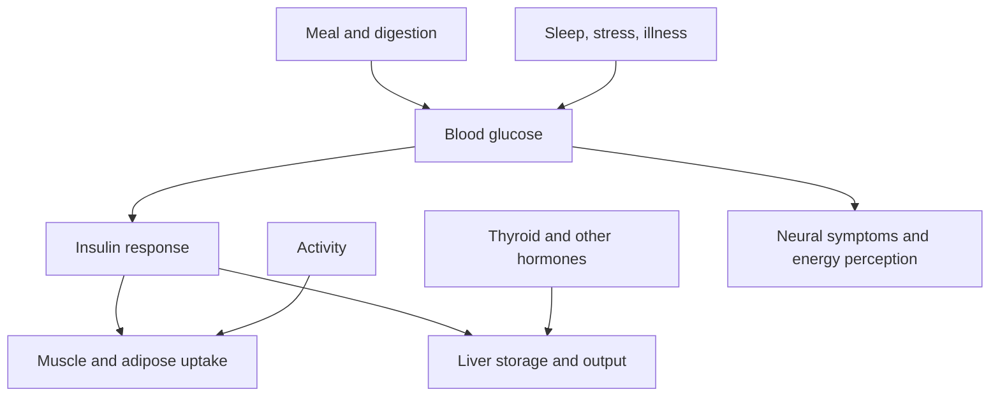

# Blood glucose and hormone map

## Linked nodes

- [[02 Pathways/Insulin and glucose regulation|Insulin and glucose regulation]]
- [[06 Patterns/Dysglycemia|Dysglycemia]]
- [[05 Conditions/Type 2 diabetes|Type 2 diabetes]]
- [[05 Conditions/PCOS|PCOS]]
- [[04 Symptoms/Fatigue|Fatigue]]
- [[04 Symptoms/Brain fog|Brain fog]]

> [!evidence] Measurement boundary
> Subjective energy shifts can be real without identifying glucose as the cause. Diagnostic interpretation uses validated measurements under defined conditions.
