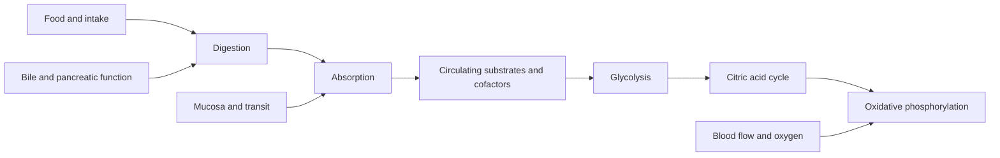

# Digestion to cellular energy

## Trace the chain

[[01 Systems/Digestive system|Digestion]] → [[02 Pathways/Nutrient digestion and absorption|absorption]] → [[02 Pathways/Glycolysis|glycolysis]] → [[02 Pathways/Citric acid cycle|citric acid cycle]] → [[02 Pathways/Oxidative phosphorylation|oxidative phosphorylation]]

## Friction

A long plausible chain is easy to overread. If fatigue follows a meal, for example, the map does not prove malabsorption or mitochondrial disease. The timeline, severity, objective findings, alternative explanations, and medication context remain necessary.
