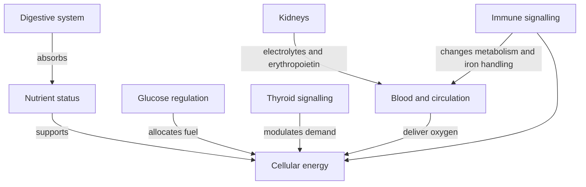

# Whole-body orientation

## Enter through a node

- [[01 Systems/Digestive system|Digestive system]]
- [[06 Patterns/Nutrient depletion or excess|Nutrient status]]
- [[06 Patterns/Impaired cellular energy production|Cellular energy]]
- [[02 Pathways/Insulin and glucose regulation|Glucose regulation]]
- [[02 Pathways/Thyroid hormone synthesis and signalling|Thyroid signalling]]
- [[06 Patterns/Reduced oxygen delivery|Oxygen delivery]]
- [[06 Patterns/Inflammatory burden|Immune signalling]]

> [!evidence] Map status
> The arrows show established broad physiological relationships. They do not establish which relationship explains a symptom in one person.
