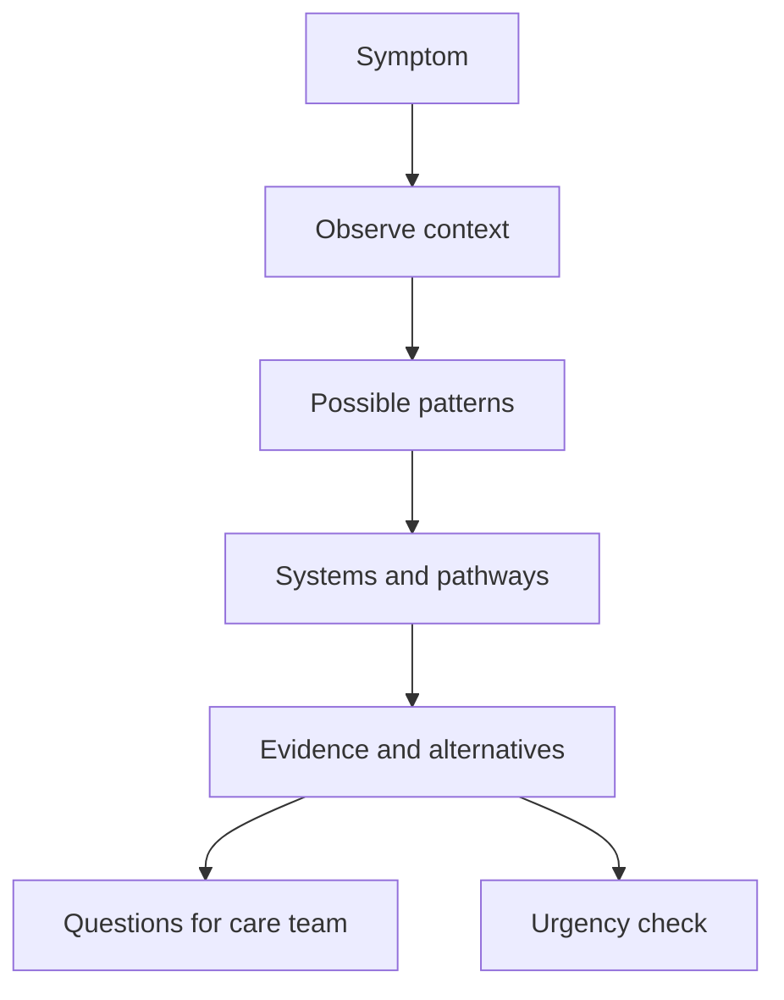

# Human Biology Living Map

> [!safety] Orientation, not diagnosis
> This vault is a learning and clinical-conversation aid. It does not identify the cause of a symptom, replace an examination, or recommend treatment. A connection means “worth considering in context,” not “proven cause in this person.” See [[00 Navigation/Clinical safety and red flags|Clinical safety and red flags]].

## Enter the map

- Open [[Atlas.canvas|Atlas Canvas]] for the spatial overview.
- Open [[00 Navigation/Atlas Home|Atlas Home]] for linked indexes.
- Start from [[04 Symptoms/Fatigue|Fatigue]], [[04 Symptoms/Constipation|Constipation]], [[04 Symptoms/Diarrhea|Diarrhea]], [[04 Symptoms/Brain fog|Brain fog]], or another symptom.
- Move from symptom → pattern → system or pathway → nutrient or condition.
- Record observations in [[10 Logs/Symptom observation log|Symptom observation log]].
- Convert questions into a clinician-ready list with [[10 Logs/Questions for a clinician|Questions for a clinician]].

## Core principle

A symptom is a signal with many possible explanations. Trace connections in more than one direction. Ask what else would need to be true, what evidence would distinguish alternatives, what medications or life-stage factors change the picture, and whether the timeline fits.

## Current release

This is a populated foundation, not a claim to contain all human biology. Version 0.1 includes 12 body systems, 11 pathways, 10 nutrients, 10 symptoms, 9 conditions, 8 cross-system patterns, 5 herbs, 5 visual maps, and reusable templates. Expand it one sourced note at a time.
