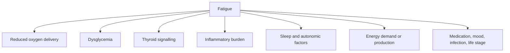

# Fatigue differential map

## Competing paths

- [[06 Patterns/Reduced oxygen delivery|Reduced oxygen delivery]]
- [[06 Patterns/Dysglycemia|Dysglycemia]]
- [[06 Patterns/Thyroid hormone signalling strain|Thyroid signalling strain]]
- [[06 Patterns/Inflammatory burden|Inflammatory burden]]
- [[06 Patterns/Autonomic dysregulation|Autonomic dysregulation]]
- [[06 Patterns/Impaired cellular energy production|Impaired cellular energy production]]

> [!safety] Do not anchor
> Fatigue is highly nonspecific. A biochemical explanation should remain one branch among medication effects, sleep disorders, acute and chronic illness, mood-related conditions, pain, substance use, life-stage factors, and workload.

## Vault links

- [[START HERE|Start here]]
- [[README|README]]
- [[00 Navigation/Atlas Home|Atlas Home]]
