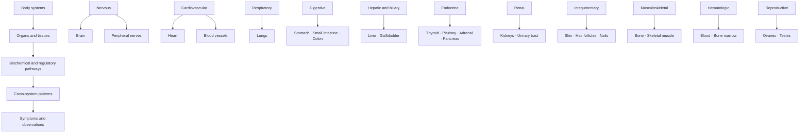

# Organ systems layer

> [!evidence] Map boundary
> The organ layer adds location. It does not replace mechanism, evidence, red-flag screening, or clinical interpretation.

## Vault links

- [[START HERE|Start here]]
- [[README|README]]
- [[00 Navigation/Atlas Home|Atlas Home]]
