# System depth matrix

Use this map when a symptom is too nonspecific to localize. Start from the symptom, compare at least two systems, then ask what evidence would distinguish them.

```mermaid
flowchart TD
    symptom[Symptom or observation] --> compare[Compare competing systems]
    compare --> digestive[Digestive: movement · absorption · barrier]
    compare --> endocrine[Endocrine: thyroid · glucose · adrenal · reproductive]
    compare --> nervous[Nervous: central · peripheral · autonomic · sleep]
    compare --> cardio[Cardiovascular: rhythm · pressure · perfusion]
    compare --> resp[Respiratory: ventilation · gas exchange]
    compare --> blood[Hematologic: cells · oxygen · clotting]
    compare --> renal[Renal: filtration · electrolytes · fluid]
    compare --> immune[Immune: defense · inflammation · tolerance]
    compare --> muscle[Musculoskeletal: force · bone · connective tissue]
    compare --> skin[Integumentary: barrier · sensation · repair]
    compare --> repro[Reproductive: gonadal · pituitary · life-stage]
    compare --> liver[Hepatic/biliary: metabolism · bile · proteins]

    digestive --> evidence[Discriminating evidence]
    endocrine --> evidence
    nervous --> evidence
    cardio --> evidence
    resp --> evidence
    blood --> evidence
    renal --> evidence
    immune --> evidence
    muscle --> evidence
    skin --> evidence
    repro --> evidence
    liver --> evidence
```

> [!evidence] Matrix boundary
> A system label is a hypothesis space. It becomes useful only when timing, red flags, exam findings, tests, exposures, medication context, and alternatives are compared.

## Vault links

- [[START HERE|Start here]]
- [[README|README]]
- [[00 Navigation/Atlas Home|Atlas Home]]
