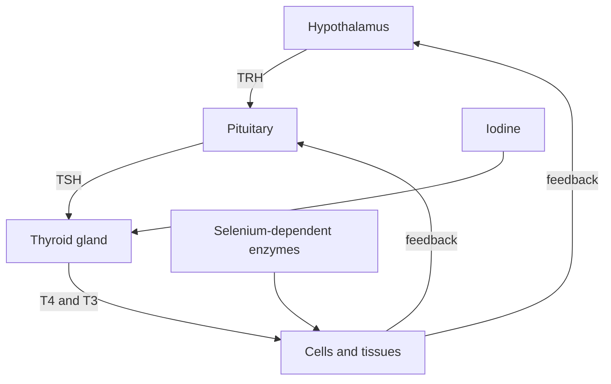

# Thyroid network

## Linked nodes

- [[02 Pathways/Thyroid hormone synthesis and signalling|Thyroid hormone synthesis and signalling]]
- [[03 Nutrients/Iodine|Iodine]]
- [[03 Nutrients/Selenium|Selenium]]
- [[05 Conditions/Hypothyroidism|Hypothyroidism]]
- [[04 Symptoms/Cold intolerance|Cold intolerance]]
- [[04 Symptoms/Constipation|Constipation]]
- [[04 Symptoms/Hair loss|Hair loss]]

> [!safety] More is not restoration
> Iodine and selenium are required for thyroid physiology, but unsupervised supplementation can be ineffective or harmful when status is already adequate or when thyroid disease is present.

## Vault links

- [[START HERE|Start here]]
- [[README|README]]
- [[00 Navigation/Atlas Home|Atlas Home]]
