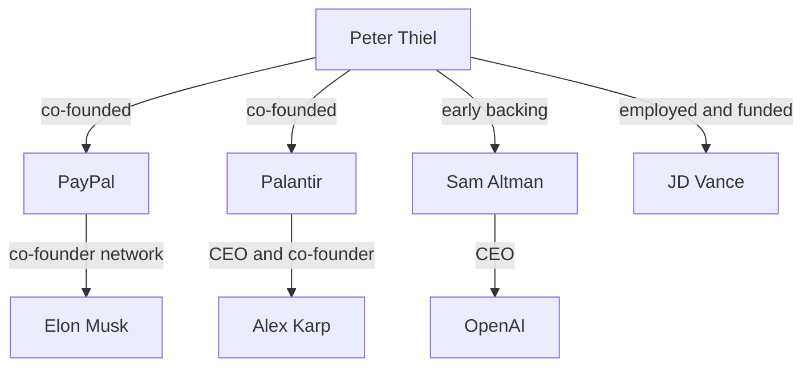

# AI power network

These edges show documented relationship types. They do not, by themselves, prove shared intent or central control. Start with [[12 Power/PayPal network|PayPal network]].

## Vault links

- [[START HERE|Start here]]
- [[README|README]]
- [[00 Navigation/Human Web Home|Human Web Home]]
