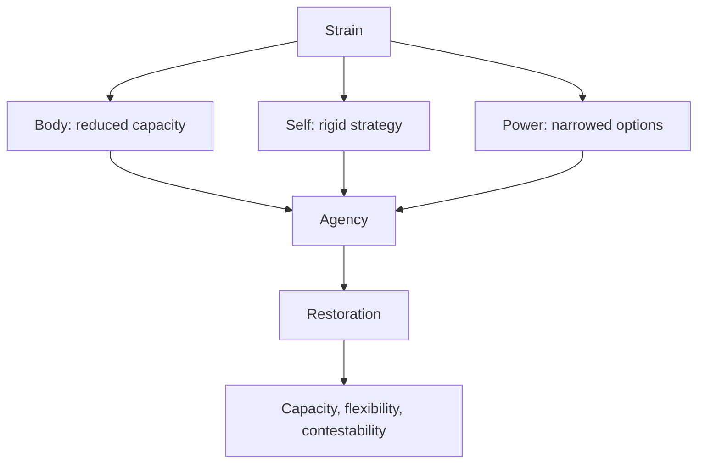

# Agency under strain

“Under strain” is a question-generating frame. It should not erase conflict, responsibility, disease, exploitation, or the need for emergency action.

## Vault links

- [[START HERE|Start here]]
- [[README|README]]
- [[00 Navigation/Human Web Home|Human Web Home]]
