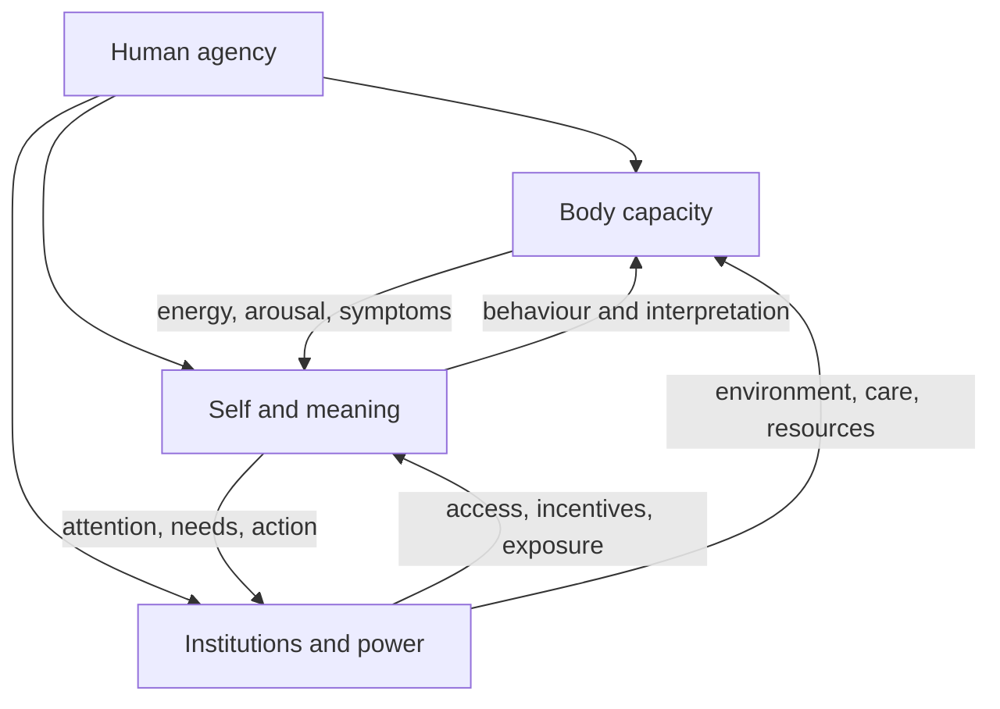

# Body, Self, Power

The arrows describe interaction, not equivalence. Enter through [[13 Bridges/Human agency|Human agency]].

## Vault links

- [[START HERE|Start here]]
- [[README|README]]
- [[00 Navigation/Human Web Home|Human Web Home]]
