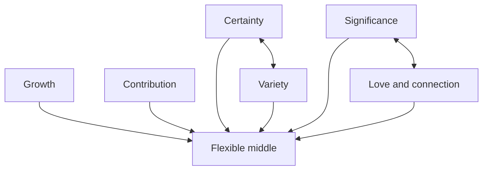

# Six needs as tensions

This diagram renders the transcript’s internal model. It does not establish a universal psychological law. See [[11 Self/Coaching model and evidence|Coaching model and evidence]].

## Vault links

- [[START HERE|Start here]]
- [[README|README]]
- [[00 Navigation/Human Web Home|Human Web Home]]
