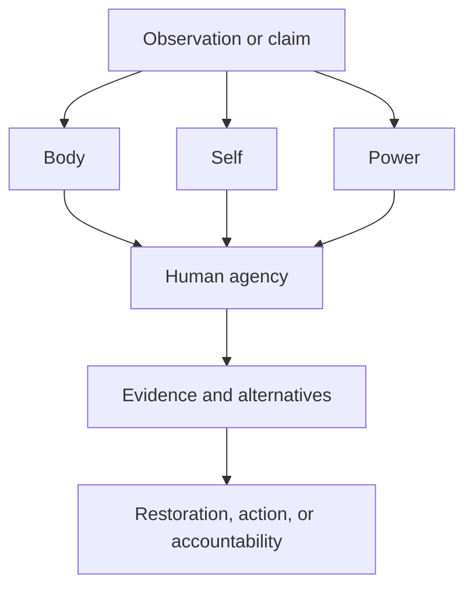

# THE HUMAN WEB

## Body · Self · Power

> [!safety] Orientation, not diagnosis
> This vault is a learning and clinical-conversation aid. It does not identify the cause of a symptom, replace an examination, or recommend treatment. A connection means “worth considering in context,” not “proven cause in this person.” See [[00 Navigation/Clinical safety and red flags|Clinical safety and red flags]].

## Enter the whole map

- Open [[The Human Web.canvas|The Human Web Canvas]] for the three-scale overview.
- Open [[00 Navigation/Human Web Home|Human Web Home]] for the complete index.
- Open [[Atlas.canvas|Biology Atlas Canvas]] for the clinical-physiology layer.
- Open [[00 Navigation/Atlas Home|Biology Atlas Home]] for the original body map.
- Start from [[04 Symptoms/Fatigue|Fatigue]], [[04 Symptoms/Constipation|Constipation]], [[04 Symptoms/Diarrhea|Diarrhea]], [[04 Symptoms/Brain fog|Brain fog]], or another symptom.
- Move from symptom → pattern → system or pathway → nutrient or condition.
- Record observations in [[10 Logs/Symptom observation log|Symptom observation log]].
- Convert questions into a clinician-ready list with [[10 Logs/Questions for a clinician|Questions for a clinician]].

## The shared question

A symptom, a recurring behaviour, and a political crisis are not interchangeable. They can still be studied with the same systems discipline:

> What system is under strain? What pattern is being expressed? Who or what benefits from the pattern? What capacity needs to be restored?

Trace connections in more than one direction. Ask what else would need to be true, what evidence would distinguish alternatives, where power sits, and whether the timeline fits.

## Current release

This is a usable first release, not a claim to explain all biology, psychology, or political economy. The **Body** layer contains the clinical-physiology atlas with active notes for systems, organs and tissues, pathways, nutrients, symptoms, conditions, patterns, and herbs. The **Self** layer maps Tony Robbins’s six-needs model as a coaching framework rather than an established scientific taxonomy. The **Power** layer separates documented AI networks and infrastructure from rhetoric, inference, and unsupported allegations. The **Bridge** layer shows where the three scales illuminate one another without collapsing into one another.

The vault is finished at the level of a navigable release: every active Body node has a source path, every symptom has an urgency boundary, every herb has an interaction-first warning, and every cross-scale bridge preserves its evidence status. Future work should add new nodes only through [[00 Navigation/Expansion workflow|Expansion workflow]].

## Vault links

- [[README|README]]
- [[00 Navigation/Human Web Home|Human Web Home]]
- [[00 Navigation/Atlas Home|Atlas Home]]
