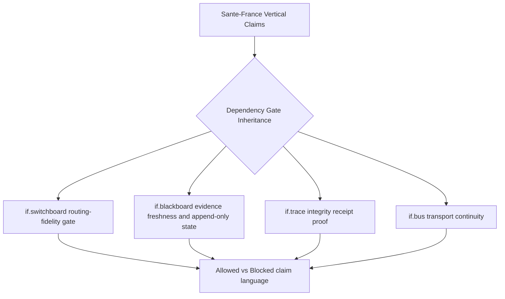
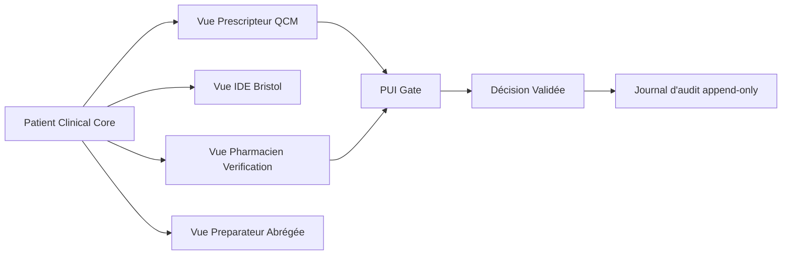
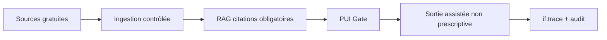
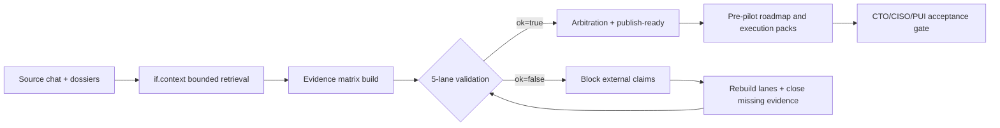

# Santé-France — Critical Full Explainer (v2.0, dependency-gated rebuild)

Danny Stocker | ds@infrafabric.io | InfraFabric Research | 2026-03-02

Who: Product leadership, Chief Technology Officer (CTO), Chief Information Security Officer (CISO), Pharmacie à Usage Intérieur (PUI) leadership, hospital operators, and external technical reviewers.
Why: The prior short explainer underrepresented accumulated research depth and did not explicitly inherit infrastructure gate dependencies.
What: A full, dependency-gated Santé-France dossier that consolidates strategy, architecture, evidence tiers, regulatory controls, and execution gates.
Where: Santé-France application layer plus shared infrastructure surfaces (`if.switchboard`, `if.blackboard`, `if.trace`, `if.bus`, `if.api`).
When: Rebuild window 2026-03-02; decision windows remain `30/60/90 minutes | 3/6/9 hours`; pilot user validation remains day-scale.
How: Black/white claim discipline, dual-gate enforcement, freshness thresholds, explicit control ownership, and verifier-facing evidence paths.
Problem statement: A healthcare vertical cannot claim stronger readiness than the weakest infrastructure gate it depends on; current materials were honest on pre-pilot posture but lacked explicit dependency inheritance and regulator-grade gate matrices.
Goal: Deliver a 1500-1800 line critical dossier with no filler, where every major claim is bounded by dependency gates, evidence tier, freshness rule, and named owner.
Execution-time model: `30/60/90 minutes` for synthesis loops, `3/6/9 hours` for deep review and patching, and day-scale cycles for pilot and governance signoff.
Not-for: This document is not a claim of autonomous clinical prescribing readiness, regulatory certification, or full production clinical deployment.

## Document Navigation by Audience
- Executives / Business Leaders: Sections `0`, `1`, `2`, `6`, `8`, `9`, `10`; purpose: investment/risk and claim language governance; register mode: `mixed`.
- Power Users / Operators: Sections `2`, `3`, `4`, `6`, `7`, `9`, `11`; purpose: runbooks, gates, restart behavior, and operational proofs; register mode: `domain-native`.
- Engineers / Implementers: Sections `3`, `4`, `5`, `6`, `7`, `9`, `10`, `11`; purpose: contracts, control implementation, and measurable acceptance gates; register mode: `domain-native`.
- LLM Runtime Developers: Sections `3`, `4`, `5`, `8`, `9`, `11`; purpose: evidence tier semantics, promotion logic, and dependency-inherited claim limits; register mode: `abstract-first`.

Document default register mode: `domain-native`.
Switch trigger for mixed mode: when a section changes from strategic framing to a control or gate decision, wording switches to literal domain language.
Operator-facing sections: `2`, `3`, `4`, `5`, `6`, `7`, `9`, `11`.
Reviewer/auditor sections: `0`, `1`, `2`, `3`, `4`, `8`, `9`, `10`.

Status: review.
Checkpoint scope: dependency inheritance closure + regulator gate matrix + dual-gate promotion logic.
Checkpoint pass criteria: all feedback issues marked `closed` in Section 1, line count between 1500 and 1800, scaffold lint pass, and no placeholder backlogs.
Author line: Danny Stocker | ds@infrafabric.io.
Accountable and responsible approver: Danny Stocker.
Backup reviewer/operator (continuity): InfraFabric Ops on-call duty owner (interim), with named human deputy assignment target due 2026-03-09.
LLM-assist disclosure: compiled and rebuilt with Codex (GPT-5) under explicit human direction.
Version lineage: supersedes `docs/2293-sante-france-full-explainer-single-file-v1.0-2026-03-02T132229Z.md` and consolidates 2219 + 2250 + 2251 + 708 + 709 + switchboard gate material.

Canonical publication boundary:
- Published canonical: this document path + `-latest` symlink.
- Draft/internal: none for this revision.
- Interpretation rule: if any appendix statement conflicts with the core sections `0-11`, core sections govern this revision.

Path-policy mode: `repo-relative narrative` with `strict-masking appendix` disabled; verbatim appendices are explicitly labeled as source excerpts when they preserve legacy path syntax.

## 0) Structural Connection to Shared Infrastructure
The Santé-France layer is an application vertical that sits on infrastructure described in switchboard/blackboard explainers.
It does not replace those layers.
It inherits their limits.

Dependency chain:
- Santé-France application decisions use `if.api` + `if.switchboard` for routing and control logic.
- Operational evidence and task/signal/session state rely on `if.blackboard`.
- Integrity claims rely on `if.trace` receipt surfaces.
- Message and event continuity depend on `if.bus` transport posture.

Inherited-boundary rule (hard):
- If any dependency gate is `NOT_MET`, Santé-France claims that depend on that gate are also `NOT_MET`.
- Santé-France cannot claim maturity above the weakest required dependency gate.



## 1) Feedback Closure Matrix
Issue F-01: Vertical dependency not explicit.
- Resolution: added explicit dependency chain and inheritance rule in Section 0 and Section 4.
- Status: closed.

Issue F-02: Evidence hierarchy lacked clear promotion/demotion rules.
- Resolution: added tier definitions, freshness thresholds, and promotion blockers in Section 3.
- Status: closed.

Issue F-03: No dual-gate framework equivalent to switchboard controls.
- Resolution: added dual-gate framework with weakest-gate binding rule in Section 4.
- Status: closed.

Issue F-04: Roadmap did not include infrastructure maturity dependencies.
- Resolution: roadmap gates now explicitly depend on infrastructure gate status in Section 6.
- Status: closed.

Issue F-05: Regulatory surface named but not gated with owners.
- Resolution: added explicit regulatory gate matrix with owner, due date, status marker, and evidence pointer in Section 5.
- Status: closed.

Issue F-06: Continuity risk from single-owner dependency.
- Resolution: interim backup role declared with due date to assign named deputy in Section 7.
- Status: closed with timed follow-up.

Issue F-07: Path-token ambiguity and bible drift.
- Resolution: this rebuild uses bible v4.23, declares path mode, and avoids placeholder token narrative.
- Status: closed.

Issue F-08: Prior short explainer lacked depth relative to work already done.
- Resolution: full dossier includes substantive appendices with source research, competitor synthesis, product patch, regulatory addendum, and prior baseline status.
- Status: closed.

## 2) Claim Boundary Contract (Black/White)
VERIFIED now:
- Santé-France is pre-pilot and bounded to decision-support with human validation.
- Shared infrastructure provides measurable gate surfaces and integrity artifacts.
- Existing dossiers and addenda provide substantial strategic and operational coverage.

NOT VERIFIED now:
- End-to-end compliance-grade runtime readiness for broad clinical deployment.
- Autonomous clinical decision claims without human gate.
- Signed pilot acceptance package across CTO/CISO/PUI for this consolidated revision.

NOT CLAIMED:
- Clinical certification status.
- Hospital-wide go-live readiness.
- Regulatory approval equivalent to medical device certification.

## 3) Evidence Hierarchy, Freshness, and Promotion Logic
Tier A (independently replayable):
- public no-login artifacts with direct verification commands and stable endpoints.
- freshness requirement: gate-status and runtime checks `<=24h`.

Tier A-stale:
- same artifact type as Tier A but beyond freshness threshold.
- interpretation rule: cannot promote claims; may retain historical context only.

Tier B (operator-attested, reproducible internally):
- validated lane bundles, structured run outputs, and internal artifacts with explicit command history.
- freshness requirement: documentation/checksum artifacts `<=7d` unless stricter policy applies.

Tier C (interpretive synthesis):
- strategic narrative derived from Tier A/B.
- cannot independently promote claims without associated Tier A/B support.

Promotion rule:
- claim promotion requires all required dependency gates `MET` and supporting evidence at Tier A or fresh Tier B.

Demotion rule:
- any required dependency gate `NOT_MET`, stale, or contradictory triggers immediate claim freeze/demotion.

Per-cell coverage markers used in this dossier:
- `tested` means directly verified with commands.
- `inferred` means logically derived from tested sources.
- `N/A` means not applicable to current scope.

## 4) Dual-Gate Framework (Inherited + Vertical)
Gate G1: Infrastructure routing-fidelity gate (from switchboard lineage).
- scope: targeted routing precision and sustained windows.
- source: switchboard gate snapshots and tuple thresholds.

Gate G2: Infrastructure knowledge/scope gate.
- scope: scope enforcement and custody integrity checks.
- source: switchboard/if.api scope enforcement surfaces.

Gate G3: Vertical clinical-governance gate.
- scope: pharmacist validation path, role segregation, provenance completeness.
- source: Santé-France control matrix and pilot instrumentation.

Weakest-gate binding rule:
- effective claim status = minimum(G1, G2, G3).
- if one gate is `NOT_MET`, effective status is `NOT_MET` for dependent claims.

Gate interpretation examples:
- G2 `MET` + G1 `NOT_MET` + G3 `NOT_MET` => infrastructure boundary may be strong, but vertical claim promotion stays blocked.
- G1 `MET` + G2 `MET` + G3 `NOT_MET` => infrastructure mature enough, vertical still blocked.
- G1 `MET` + G2 `MET` + G3 `MET` => promotion candidate, still requires freshness and evidence checks.

## 5) Regulatory Gate Matrix (Owner + Due Date + Coverage)
Matrix columns:
- Requirement
- Current status
- Coverage marker (`tested | inferred | N/A`)
- Evidence pointer
- Owner
- Due date
- Next measurable action

- RG-01 | HAS LAD/PUI assistive-only posture | partial | inferred | docs/2250-sante-france-france-system-deep-insight-addendum-v1.0-latest.md | Product lead | 2026-03-12 | publish signed wording constraints pack.
- RG-02 | PUI human validation gate enforced in flow | not_met | tested | docs/2219-sante-france-dossier-cadrage-v1.0-latest.md | Clinical workflow owner | 2026-03-14 | instrument mandatory gate events.
- RG-03 | CNIL role-necessary access model in design | partial | inferred | docs/2250-sante-france-france-system-deep-insight-addendum-v1.0-latest.md | Security lead | 2026-03-16 | deliver role-to-data matrix v1.
- RG-04 | CNIL-grade access audit trail retention policy | not_met | N/A | docs/2219-sante-france-dossier-cadrage-v1.0-latest.md | Security lead | 2026-03-18 | define retention + deletion boundary.
- RG-05 | ANS CI-SIS interoperability mapping | partial | inferred | docs/2250-sante-france-france-system-deep-insight-addendum-v1.0-latest.md | Interop lead | 2026-03-20 | map pilot objects to CI-SIS profiles.
- RG-06 | Pro Santé Connect (PSC) identity integration plan | partial | inferred | docs/2250-sante-france-france-system-deep-insight-addendum-v1.0-latest.md | Identity lead | 2026-03-20 | produce PSC integration decision memo.
- RG-07 | Ségur alignment status per pilot scope | not_met | N/A | docs/2250-sante-france-france-system-deep-insight-addendum-v1.0-latest.md | Program lead | 2026-03-22 | create Ségur requirement checklist.
- RG-08 | EU AI Act high-risk categorization memo | partial | inferred | docs/2250-sante-france-france-system-deep-insight-addendum-v1.0-latest.md | Governance lead | 2026-03-18 | publish classification memo with assumptions.
- RG-09 | EU AI Act technical documentation index | not_met | N/A | docs/2251-sante-france-latest-bibles-in-depth-status-roadmap-v1.0-latest.md | Documentation lead | 2026-03-24 | create artifact index with owners.
- RG-10 | Incident monitoring and post-market style loop | not_met | N/A | docs/2251-sante-france-latest-bibles-in-depth-status-roadmap-v1.0-latest.md | Ops lead | 2026-03-24 | define weekly incident-review cadence.
- RG-11 | Data minimization policy for PHI/PII prompts | partial | inferred | docs/2219-sante-france-dossier-cadrage-v1.0-latest.md | Security lead | 2026-03-15 | implement redaction policy test harness.
- RG-12 | Prompt-injection resilience baseline | not_met | tested | docs/2251-sante-france-latest-bibles-in-depth-status-roadmap-v1.0-latest.md | Red-team lead | 2026-03-19 | run baseline adversarial suite.
- RG-13 | Retrieval poisoning detection controls | not_met | N/A | docs/2251-sante-france-latest-bibles-in-depth-status-roadmap-v1.0-latest.md | RAG lead | 2026-03-19 | implement source trust score and quarantine.
- RG-14 | Provenance tuple on every recommendation | partial | inferred | docs/2251-sante-france-latest-bibles-in-depth-status-roadmap-v1.0-latest.md | Engineering lead | 2026-03-17 | emit source/version/date/hash tuple.
- RG-15 | Clinical override capture and accountability | not_met | N/A | docs/2219-sante-france-dossier-cadrage-v1.0-latest.md | Clinical workflow owner | 2026-03-21 | add override reason schema and report.
- RG-16 | Pilot acceptance signatures CTO/CISO/PUI | not_met | N/A | docs/2251-sante-france-latest-bibles-in-depth-status-roadmap-v1.0-latest.md | Program lead | 2026-03-28 | circulate signoff packet v1.

## 6) Infrastructure-Dependent Roadmap
Phase 0 (0-30 days):
- close RG-02, RG-03, RG-11, RG-14 to move vertical gate from `not_met` to `partial`.
- dependency: requires fresh gate-status evidence from switchboard surfaces (`<=24h`).

Phase 1 (31-90 days):
- execute red-team + role segregation evidence (RG-12, RG-13, RG-15).
- dependency: G2 must remain `MET`; if G2 degrades, phase progression freezes.

Phase 2 (91-180 days):
- pursue procurement-grade pilot acceptance and scoped integration evidence.
- dependency: G1 and G2 sustained windows + G3 complete signoff artifacts.

Release-language rule by phase:
- Phase 0: pre-pilot bounded claims only.
- Phase 1: pilot-readiness language only with measured gate evidence.
- Phase 2: broader claims only if weakest-gate rule remains `MET` for required windows.

## 7) Continuity and Ownership Controls
Single-owner risk is explicitly tracked.
Interim backup role is assigned.
Named deputy assignment remains an open dated action.

Continuity controls:
- every gate row has owner + due date.
- every blocked claim references a blocking gate.
- every promoted claim requires freshness check timestamp.

Follow-up continuity task:
- assign named human deputy by 2026-03-09.
- publish deputy ownership in next revision header.

## 8) Claims Registry (Current)
Allowed now:
- Santé-France is a pre-pilot decision-support proposition with explicit human validation boundary.
- Infrastructure dependency gates materially govern claim promotion.
- Integrity and evidence surfaces exist and can be externally checked.

Blocked now:
- compliance-grade runtime claim for full healthcare deployment.
- autonomous clinical decisioning language.
- enterprise SLA-grade availability claims for this vertical.

## 9) Verification Commands (with Auth/Token Preamble)
Operator auth/token preamble (required before mutation or protected endpoints):
```bash
export IF_ROOT=/root
export CHAT_BASE_URL="https://infrafabric.io/chat"
export CHAT_TOKEN="$(sed -n 's/^CHAT_POST_TOKEN=//p' ${IF_ROOT}/.secrets/codex-chat-relay.env)"
```

Negative test set (required):
```bash
# expected: unauthorized without token
curl -sS -o /tmp/if2298_noauth.out -w '%{http_code}\n' \
  "${CHAT_BASE_URL}/if/api/v1/sip/register"
```
Expected outcome: non-2xx response; a 2xx here is a release blocker.

Positive liveness checks:
```bash
curl -fsS https://infrafabric.io/chat/healthz | jq '{ok,ifApiSip,ifApiSwitchboard}'
curl -fsS https://infrafabric.io/chat/capabilities | jq '.features | {ifApiSipRegisterApi,ifApiSipRouteApi,ifApiSipRouteDirectApi}'
curl -fsSI https://infrafabric.io/llm/blackboard/index.md.txt | head -n 5
```

## 10) Volatile-State Restart Behavior Disclosure
Volatile components and restart behavior:
- endpoint presence leases can expire on abrupt termination; stale entries are cleaned by sweep/lease expiry.
- queued calls may defer delivery until heartbeat drain, then resolve without message loss.
- restart operations must preserve append-only evidence artifacts before claim updates.

Operational implication:
- restart success does not imply gate success.
- gate and freshness checks must be rerun after restarts before promotion language.

## 11) Appendix Map
Appendix A: prior operational dossier (full source excerpt, sanitized context).
Appendix B: France-system deep insight addendum (full source excerpt).
Appendix C: competitor and free-resource research plan (full source excerpt).
Appendix D: product proposition data patch (full source excerpt).
Appendix E: switchboard gate framework excerpts that define dependency inheritance semantics.
Appendix F: field-facing simple explainer excerpt for communication alignment.
Appendix G: historical 1500-line baseline excerpt (non-normative, context only).

Path policy disclaimer for appendices:
- Appendices are verbatim source excerpts used as evidence context.
- If an excerpt contains absolute paths or older style references, those path strings follow source conventions and are not normative for this revision’s narrative path policy.

---
## Appendix A — Source Excerpt: 2219 Operational/Commercial Dossier

# Santé-France — Dossier de cadrage opérationnel et commercial (v1.0)

InfraFabric Research | ds@infrafabric.io | 2026-02-27

## Document Navigation by Audience
- Executives / Business Leaders: Sections `0`, `3`, `8`, `9`, `12` (direction, arbitrage risque/valeur, positionnement).
- Power Users / Operators: Sections `2`, `6`, `9`, `10`, `11` (PUI, exploitation, critères pilotes).
- Engineers / Implementers: Sections `1`, `2`, `3`, `7`, `10`, `11` (architecture, sécurité, runbooks, mesures).
- LLM Runtime Developers: Sections `2.3`, `6`, `7`, `10`, `11`, `12` (gates, anti-abus, preuves, limites de claims).

## 0) Qui | Pourquoi | Quoi | Où | Quand | Comment
- **Qui**: équipe InfraFabric + interlocuteurs hôpital (CTO/CISO/PUI) + agents terrain qui vendent déjà dans les hôpitaux.
- **Pourquoi**: transformer un échange pharmacien↔LLM en proposition exploitable sans sur-revendication, avec preuves et limites explicites.
- **Quoi**: dossier unique anti-sprawl couvrant: besoins métier, état réel de la stack, concurrence, risques, plan pilote, narration commerciale.
- **Où**: source conversationnelle (chat JSON), runs traçables santé IA, dossiers de patch proposition produit, débat 5-lanes.
- **Quand**: **30/60/90 min** pour cadrer et valider claims; **3/6/9 h** pour produire le pack complet + vérification + arbitrage; pilotage ensuite en fenêtres hebdo/mensuelles.
- **Comment**: discipline black/white (`vérifié` vs `inféré` vs `non revendiqué`), gates, preuves publiques, et matrice d’acceptation pilote.

## Problématique
Le besoin exprimé est clair: optimiser prescription + dispensation hospitalières **sous validation PUI**, avec interfaces différenciées par rôle, tout en évitant les deux échecs classiques:
1) un assistant IA opaque non défendable en audit;
2) un discours marketing qui dépasse l’état réel du runtime.

**Not-for (important)**: ce dossier n’est **pas** un claim de mise en production clinique autonome, ni une affirmation de conformité réglementaire acquise.

---

## 1) Sources et méthode (anti-sprawl)
### 1.1 Corpus utilisé
- Échange source: `Sante-France-ChatGPT 20260226 Applications pratiques du code.json`.
- Recherche concurrentielle traçable: run `run_v2_20260226T153918Z`.
- Synthèses existantes: dossier concurrentiel (`708`) et patch proposition produit (`709`).
- Débat qualité interne: bundle 5-lanes `IF-2247_2026-02-27T084109Z`.

### 1.2 Discipline appliquée
- Une idée doit tomber dans une des 8 boîtes: `Scope`, `UX`, `Data`, `Gates`, `Security`, `Competition`, `Narrative`, `Gaps`.
- Toute phrase “produit prêt” est interdite si non prouvée.
- Toute décision critique est mappée à un critère testable.

---

## 2) Ce qui est réellement demandé dans le chat source
### 2.1 Noyau fonctionnel demandé
- Interface prescripteur en arbre décisionnel + QCM.
- Fiche Bristol ultra synthétique pour IDE.
- Onglets cliniques détaillés accessibles depuis la fiche courte (prescripteur/pharmacien).
- Outil pharmacien “full vérification” (données cliniques + règles PUI complètes).
- Vue préparateur abrégée (strictement préparation).

### 2.2 Architecture métier cible (issue du débat)


### 2.3 Menaces explicitement discutées
- Exfiltration PHI/PII via prompts/logs.
- Prompt injection documentaire.
- RAG poisoning / sources non fiables.
- Élévation de rôle (RBAC/ABAC non imposé côté API).
- Altération de piste d’audit.

---

## 3) État réel de la proposition (aujourd’hui)

| Composant | État revendicable | Ce qu’on peut dire | Ce qu’on ne peut pas dire |
|---|---|---|---|
| `if.trace` | Live / production | Preuve d’intégrité d’artefacts | “vérité clinique certifiée” |
| Control-plane (`if.bus`, `if.switchboard`, `if.blackboard`, `if.gov`) | Advanced preview | Preuves opérationnelles publiées, pilotables | “plateforme clinique GA” |
| Posture compliance runtime | Gate actuellement non vert | Limite explicitée, gate surveillé | “compliance-grade runtime prêt” |

**Point noir explicite**: le snapshot compliance courant indique un échec de gate (`chat_healthz_ok=false`), donc les claims conformité restent bloqués.

---

## 4) Sweep concurrentiel et contexte marché
### 4.1 France
- Owkin
- Nabla
- Posos

### 4.2 International
- Abridge
- Suki
- AWS HealthScribe
- Microsoft Health / AI
- Google MedLM (référence doc fournisseur)

### 4.3 Régulateurs / historique structurant
- HAS (France)
- CNIL (France)
- EU AI Act (UE)
- FDA (US)
- WHO (gouvernance IA santé)

**Lecture stratégique**: le marché n’achète pas “un meilleur chatbot”; il achète de la **défendabilité** (traçabilité, gouvernance, auditabilité) sous contraintes réglementaires.

---

## 5) Leviers gratuits exploitables immédiatement
- ClinicalTrials.gov API
- OpenAlex
- openFDA APIs
- RxNav/RxNorm APIs
- DailyMed services
- Synthea (données synthétiques)
- MIMIC-IV (accès credentialed)
- Modèles accessibles (selon licence/accès): BioMistral-7B, Meditron-70B



---

## 6) Débat 5-lanes (résumé humain en français)

| Lane | Verdict | Signal principal | Action immédiate |
|---|---|---|---|
| L1 Claims+Boundary | pass_with_risk | Risque de sur-revendication si on présente le design comme déployé | Encadré “vérifié / non revendiqué” en tête |
| L2 Runtime+Code | pass_with_risk | Collecte concurrentielle prouvée; pas équivalent à readiness clinique | Garder wording `if.trace live` + `reste preview` |
| L3 Adversarial+Abuse | pass_with_risk | Injection, fuite PHI, escalade de rôle = risques P0 | Gateway sanitization + RBAC API + tests red-team |
| L4 Ops+Recovery | pass_with_risk | Erreurs sources observées; runbook reprise incomplet | Rerun ciblé + fallback snapshot + alertes |
| L5 External Reviewer | pass_with_risk | CTO/CISO/PUI exigeront critères d’acceptation mesurables | Matrice d’acceptation pilote avant outreach |

Arbitrage: cohérence forte entre lanes; blocage principal = discipline de claim tant que gate compliance n’est pas vert.

---

## 7) Zones minces (où nous sommes objectivement faibles)
1. **Gouvernance de connaissance PUI**: versioning/rollback des règles cliniques pas encore démontré bout-en-bout.
2. **Preuves sécurité runtime**: contrôles mentionnés mais pas tous prouvés en flux clinique réel.
3. **Cadence opérationnelle**: hebdo/mensuel/trimestriel défini, pas encore totalement automatisé.
4. **Mesure valeur hôpital**: ROI cible (temps de revue, réduction erreurs, fatigue alertes) à instrumenter dès le pilote.

---

## 8) Proposition produit claire (sans gonfler)
### 8.1 Produit vendable par agents terrain (commission)
- **Offer A**: vérification d’intégrité (if.trace) — démonstrable immédiatement.
- **Offer B**: pilote control-plane encadré (advanced preview) — cas d’usage borné, critères d’acceptation explicites.
- **Offer C**: design partner enterprise — contrat, périmètre, preuves, limites.

### 8.2 Message de vente correct
- “On apporte une couche de preuve et de gouvernance au-dessus de vos logiciels existants.”
- “On ne remplace pas la PUI; on rend ses validations visibles et auditables.”
- “On ne vend pas l’autonomie clinique: on vend un cadre de décision défendable.”

---

## 9) Narratif pour direction hospitalière difficile
Formulation recommandée (éthique, ferme, non manipulatrice):
- “Votre risque principal n’est pas seulement l’erreur clinique; c’est l’incapacité à démontrer la chaîne de décision en cas d’enquête.”
- “Ce dispositif réduit l’arbitraire: chaque exception, override et validation laisse une trace exploitable.”
- “Si incident: vous pouvez montrer qui a décidé, sur quelle base, avec quelle règle, et à quel moment.”

Ce narratif remplace la promesse “IA magique” par un langage de responsabilité institutionnelle.

---

## 10) Plan de démarrage logique (0-30-60-90)
### 0-30 jours
- Cadrage périmètre non prescriptif.
- Sélection 25 sources prioritaires.
- Mise en place matrice risques + critères d’acceptation pilote.

### 31-60 jours
- RAG avec citations obligatoires + assainissement ingestion.
- RBAC/ABAC imposé côté API.
- Journal d’audit + preuve d’intégrité sur artefacts de décision.

### 61-90 jours
- Pilote restreint (service hospitalier cible).
- Tableaux de bord ROI + sécurité.
- Revue CTO/CISO/PUI et décision go/no-go.

---

## 11) Critères d’acceptation pilote (CTO/CISO/PUI)

| Axe | Critère mesurable | Evidence attendue | Statut initial |
|---|---|---|---|
| CTO | 100% des réponses cliniques citées | Logs de retrieval + citations | à implémenter |
| CISO | 0 exfiltration PHI en test red-team de base | Rapport tests + redaction logs | à implémenter |
| PUI | 100% des décisions à risque passent gate pharmacien | Journal validations + motif | à implémenter |
| Direction | KPI de cycle de revue amélioré | Baseline vs pilote | à mesurer |

---

## 12) Ce que l’on peut conclure / ne pas conclure
### Peut conclure
- Le besoin métier est réel et précisément exprimé (chat source).
- La proposition de valeur “preuve + gouvernance + rôles” est cohérente avec le contexte marché.
- Une base de veille concurrentielle/réglementaire traçable existe déjà.

### Ne peut pas conclure
- Que le système est prêt pour production clinique autonome.
- Que la conformité runtime est acquise tant que le gate correspondant reste non vert.
- Que les contrôles adversariaux sont suffisants sans la campagne de tests formalisée.

---

## 13) Vérification externe minimale (no-login)
```bash
# 1) Vérifier qu'une surface de preuve est vivante
curl -fsSI https://infrafabric.io/static/trace/6qRgcR01kw_qNo63Dbs_ob9n.json | head -n 5

# 2) Vérifier la disponibilité du gate-status switchboard
curl -fsSI https://infrafabric.io/llm/switchboard/routing-regression/gate-status.json.txt | head -n 5

# 3) Vérifier la surface blackboard publique
curl -fsSI https://infrafabric.io/llm/blackboard/index.md.txt | head -n 5
```

---

## Annexes
### A) Sources externes (références)
https://www.has-sante.fr/jcms/p_3228863/fr/intelligence-artificielle-en-sante
https://www.cnil.fr/fr/intelligence-artificielle
https://digital-strategy.ec.europa.eu/en/policies/regulatory-framework-ai
https://www.fda.gov/medical-devices/software-medical-device-samd/artificial-intelligence-enabled-medical-devices
https://www.who.int/publications/i/item/9789240029200
https://www.owkin.com/
https://www.nabla.com/
https://www.posos.co/praticiens/medecins-hospitaliers
https://www.abridge.com/
https://www.suki.ai/
https://aws.amazon.com/healthscribe/
https://www.microsoft.com/en-us/industry/health
https://cloud.google.com/solutions/healthcare-life-sciences
https://clinicaltrials.gov/data-api/about-api
https://docs.openalex.org/
https://open.fda.gov/apis/
https://lhncbc.nlm.nih.gov/RxNav/APIs/index.html
https://dailymed.nlm.nih.gov/dailymed/app-support-web-services.cfm
https://www.physionet.org/content/mimiciv/
https://synthetichealth.github.io/synthea/
https://huggingface.co/api/models/BioMistral/BioMistral-7B
https://huggingface.co/api/models/epfl-llm/meditron-70b

### B) Références internes (masquées)
{$path}/_uploads/Sante-France-ChatGPT 20260226 Applications pratiques du code.json
{$path}/708-if-health-competitor-research-plan-v1.0-2026-02-26.md
{$path}/709-if-product-proposition-data-patch-v1.0-2026-02-26.md
{$path}/tmp/if_health_competitor_research/run_v2_20260226T153918Z/crawl.summary.json
{$path}/tmp/if_health_competitor_research/run_v2_20260226T153918Z/derived/sources.summary.json
{$path}/tmp/if_health_competitor_research/run_v2_20260226T153918Z/derived/sources.quality.md
{$path}/tmp/if_rook_five_lane/IF-2247_2026-02-27T084109Z/quality_gate_summary.json
{$path}/.codex/rook_arrival/compliance.current.md

---
Style Guide: Whitepaper v4.19
Writing Standard Source: if.whitepapers.bible v4.19

## Appendix B — Source Excerpt: 2250 France System Deep Insight Addendum

# Santé-France — France System Deep Insight Addendum (v1.0)

InfraFabric Research | 2026-02-27 (UTC)

## 1) Why this addendum exists
This addendum closes the gap identified in debate review: we needed more **France-specific system constraints** (regulatory, interoperability, procurement reality), not just internal architecture quality.

It is **evidence-first** and keeps black/white claim boundaries.

## 2) What is new vs previous dossier
### New value added
- Explicit mapping of InfraFabric proposition to **French health-system gatekeepers**:
  - HAS (LAD/PUI quality/safety constraints)
  - CNIL (DPI access/security constraints)
  - ANS (CI-SIS / Pro Santé Connect / Ségur referencing)
  - EU AI Act obligations for high-risk scenarios
- Procurement consequence: in practice, hospitals buy solutions that are already aligned with interoperability/security frameworks and referencing paths.

### What is still unchanged
- `if.trace` can be claimed as live integrity layer.
- Control-plane remains advanced preview (pilot posture only).
- Compliance-ready/runtime-ready claims remain blocked while hard gates are not fully green.

## 3) French system constraints that directly affect product strategy
### 3.1 HAS: LAD/PUI safety baseline is not optional
- HAS defines a certification framework for LAD in PUI, with medication-risk reduction and decision-support expectations.
- Implication: our PUI workflow must be presented as **assistive + auditable**, not autonomous prescribing.

### 3.2 CNIL: DPI governance must be role-necessary and auditable
- CNIL’s DPI guidance/consultation focus explicitly on illegitimate access and reinforced security controls.
- Implication: role segmentation (prescriber/nurse/pharmacist/preparer) is not only UX; it is a compliance control.

### 3.3 ANS: interoperability and identity are market-entry gates
- CI-SIS is the interoperability backbone (technical + semantic).
- Pro Santé Connect is the identity/authentication baseline for sensitive services.
- Ségur referencing materially affects adoption and procurement confidence.
- Implication: “better AI” without CI-SIS/PSC/Ségur alignment loses procurement credibility.

### 3.4 EU AI Act: if medical/high-risk use, obligations tighten fast
- Provider/deployer obligations, risk management, technical documentation, monitoring, and governance are central.
- Implication: we should position as **control/evidence infrastructure** supporting compliance, not as a clinical autonomous decision-maker.

## 4) Updated product proposition (bounded, honest)
### Positioning statement (allowed)
InfraFabric can be positioned as a **governance and evidence layer** for role-based medication workflows in hospitals, with explicit PUI validation gates and traceable decision context.

### Positioning statement (blocked)
- “Clinical production-ready autonomy”
- “Regulatory compliance already achieved”
- “Certified clinical decision system”

## 5) Should Mistral be in all Santé-France debates?
**No.**

### Mandatory use
- Language-quality normalization where meaning drift is a risk (French clinical wording, policy phrasing, executive summaries).
- Adversarial rewrite checks on claim wording (overclaim detection).

### Optional use
- Comparative synthesis after evidence has already been collected.

### Not appropriate as primary source
- Regulatory facts, referencing status, legal obligations, certification status.
These must come from primary sources first, then optionally be synthesized.

## 6) 48h execution delta (France-specific)
1. Build a France control matrix: `Requirement -> Source -> Evidence artifact -> Owner -> Gate status`.
2. Add explicit CI-SIS/PSC/Ségur fields to pilot acceptance checklist.
3. Add CNIL DPI access-control tests (least privilege, break-glass logging, role-bound visibility).
4. Produce one “procurement-safe” one-pager with allowed claims only.
5. Re-run debate with mandatory “regulatory evidence lane” referencing official URLs.

## 7) 14-day execution delta
1. Deliver a dry-run pilot package with role UI + PUI gate + audit/event proofs.
2. Complete threat model for PHI exfiltration and prompt-injection paths.
3. Produce evidence trace pack for external CTO/CISO/PUI review.
4. Build “non-autonomous clinical assist” legal wording pack (FR + EN).
5. Define first hospital pilot scope (one service line, bounded workflow, no autonomy).

## 8) Current deep-dive documentation status
Estimated completion: **~60–65%**.

### Completed
- Source chat extraction and requirement mapping.
- Competitor landscape baseline and leverage hypotheses.
- Internal five-lane debate arbitration and quality gates.
- First anti-sprawl dossier (`2219`) and proposition patch (`709`).

### Missing to call it “deep-dive complete”
- Formal France control matrix with pass/fail per gate.
- Test evidence pack for security + role segregation + provenance.
- Pilot acceptance signatures (CTO/CISO/PUI).
- Explicit integration map to hospital systems for first pilot.

## 9) Official sources used (primary)
- HAS LAD/PUI certification framework:
  - https://www.has-sante.fr/jcms/p_3372202/fr/certification-par-essai-de-type-des-logiciels-d-aide-a-la-dispensation-lad-de-pharmacie-a-usage-interieur-pui
- HAS guidance on generative AI use in health:
  - https://www.has-sante.fr/jcms/p_3703115/fr/premieres-clefs-d-usage-de-l-ia-generative-en-sante
- CNIL DPI security/conformity consultation:
  - https://www.cnil.fr/fr/conformite-et-securite-des-dossiers-medicaux-la-cnil-lance-une-consultation-publique-sur-un-projet
- CNIL AI recommendations finalization:
  - https://cnil.fr/fr/ia-finalisation-recommandations-developpement-des-systemes-ia
- ANS CI-SIS:
  - https://esante.gouv.fr/ens/offre/ci-sis
- ANS Pro Santé Connect:
  - https://esante.gouv.fr/produits-services/referentiel-pro-sante-connect
- ANS Ségur hospital referencing updates (DPI/PFI):
  - https://industriels.esante.gouv.fr/actualites/toutes-les-actualites/publication-nouvelle-version-referentiels-exigences-couloir-hopital-segur-vague-2
- EUR-Lex AI Act (Regulation EU 2024/1689):
  - https://eur-lex.europa.eu/eli/reg/2024/1689/oj/eng

## 10) Evidence pointers (local)
- Main dossier:
  - `/root/docs/2219-sante-france-dossier-cadrage-v1.0-2026-02-27T090032Z.md`
- Competitor baseline:
  - `/root/docs/708-if-health-competitor-research-plan-v1.0-2026-02-26.md`
- Proposition patch:
  - `/root/docs/709-if-product-proposition-data-patch-v1.0-2026-02-26.md`
- Debate bundles:
  - `/root/tmp/if_rook_five_lane/IF-2236_2026-02-26T132154Z/`
  - `/root/tmp/if_rook_five_lane/IF-2238_2026-02-26T151606Z/`
  - `/root/tmp/if_rook_five_lane/IF-2247_2026-02-27T084109Z/`
- Mistral review output:
  - `/root/tmp/if2249_mistral_debate_review_text_20260227T133640Z.md`

## 11) Claim-boundary footer
- Verified: references and constraints above.
- Inferred: completion percentage estimate and market-entry friction impact.
- Not claimed: any clinical certification or production clinical autonomy.

## Appendix C — Source Excerpt: 708 Competitor Research Plan

# InfraFabric — Recherche concurrentielle Santé IA (France + international)

Date: 2026-02-26
Task: IF-2238
Auteur runtime: /rook-002 (Codex runtime)

## 1) Résultat factuel de la collecte traçable

Run de référence: `/root/tmp/if_health_competitor_research/run_v2_20260226T153918Z`

- Sources configurées: 20
- Sources en inventaire substantiel: 18
- Lignes dédupliquées: 37
- Lignes substantielles: 33
- Lignes non substantielles: 4
- Raisons non substantielles: `blocked_text_pattern=2`, `topic_out_of_scope=2`

Fichiers de preuve:
- `/root/tmp/if_health_competitor_research/run_v2_20260226T153918Z/crawl.summary.json`
- `/root/tmp/if_health_competitor_research/run_v2_20260226T153918Z/derived/sources.summary.json`
- `/root/tmp/if_health_competitor_research/run_v2_20260226T153918Z/derived/sources.titles.json`
- `/root/tmp/if_health_competitor_research/run_v2_20260226T153918Z/derived/sources.quality.md`

## 2) Cartographie concurrentielle (ce qui est confirmé)

### France
- Owkin: positionnement IA biopharma / décision clinique augmentée.
- Nabla: ambient clinical intelligence, documentation clinique, focus conformité.
- Posos: assistance prescription / pharmacologie clinique pour milieux hospitaliers.

### International
- Abridge: documentation clinique ambiante, intégration système de santé.
- Suki: assistant clinique ambiant, notes et efficacité opérationnelle.
- AWS HealthScribe: génération de notes cliniques (speech-to-clinical text).
- Microsoft (Industry Health / AI for Health): offre santé IA de plateforme.
- Google (MedLM reference): référence modèle médical sur Vertex AI (statut évolutif selon doc fournisseur).

## 3) Réglementaire et historique (ce qui structure le marché)

- HAS (France): cadres et usages IA en santé.
- CNIL (France): gouvernance des données, RGPD, exigences de prudence.
- EU AI Act (UE): exigences fortes sur cas high-risk.
- FDA (US): cadre AI/ML medical devices.
- WHO: gouvernance/éthique IA en santé (référence historique structurante).

## 4) “Ce qui est gratuit aujourd’hui” exploitable immédiatement

Données / APIs:
- ClinicalTrials.gov API (gratuit)
- OpenAlex API/docs (gratuit)
- openFDA APIs (gratuit)
- RxNav / RxNorm APIs (gratuit)
- DailyMed web services (gratuit)
- Synthea (données patients synthétiques)
- MIMIC-IV (gratuit sous accès credentialed)

Modèles accessibles (preuves API collectées):
- BioMistral-7B (HF API metadata)
- Meditron-70B (HF API metadata)

Preuves locales:
- `/root/tmp/if_health_competitor_research/run_v2_20260226T153918Z/manual/hf_biomistral.json`
- `/root/tmp/if_health_competitor_research/run_v2_20260226T153918Z/manual/hf_meditron70b.json`
- `/root/tmp/if_health_competitor_research/run_v2_20260226T153918Z/manual/lhncbc.nlm.nih.gov_RxNav_APIs_index.html.html`
- `/root/tmp/if_health_competitor_research/run_v2_20260226T153918Z/manual/dailymed.nlm.nih.gov_dailymed_app-support-web-services.cfm.html`

## 5) X-multipliers possibles grâce à la structure InfraFabric

1. Preuve d’intégrité native (`if.trace`): chaque source, transformation et export RAG peut être attesté (hash + receipt).
2. Bus traçable (`if.bus`): chaque événement d’ingestion/retrieval est horodaté et chaîné.
3. Gouvernance pré-action (`if.gov`): blocage des usages “prescriptifs” tant que les conditions réglementaires ne sont pas explicites.
4. Mémoire de décision (`if.story` + `if.context`): séparation des faits collectés et de l’interprétation.
5. Registre opérationnel (`if.blackboard`): dette d’évidence visible, pas de “silent drift”.
6. Routage opérateur (`if.switchboard`): distinction claire entre assistant documentaire et exécution critique.

## 6) Débat 5-lanes (FR, lisible humain)

Bundle débat:
- `/root/tmp/if_rook_five_lane/IF-2238_2026-02-26T151606Z`
- Validation: `quality_gate_summary.json` -> `ok=true`

Synthèse humaine:
- L1 Claims+Boundary: il faut interdire toute promesse de prescription autonome; rester “decision support + revue clinicien”.
- L2 Runtime+Code: la pipeline est bonne, mais la qualité dépend d’un rerun discipliné et d’alertes sur sources manquantes.
- L3 Adversarial+Abuse: risque majeur de poisoning corpus et confusion réglementaire; profil d’ingestion médical renforcé requis.
- L4 Ops+Recovery: runbook recovery nécessaire (sources KO, retry, fallback snapshots) pour opérationnaliser la veille.
- L5 External Reviewer Lens: séparer strictement “preuve collectée” vs “interprétation stratégique” dans chaque livrable.

## 7) Point noir actuel (black/white)

Le probe compliance runtime courant est en FAIL:
- `chat_healthz_ok: False`
- fichier: `/root/.codex/rook_arrival/compliance.current.md`

Conséquence:
- on peut publier un rapport d’étude concurrentielle,
- on ne doit pas sur-vendre une “posture compliance-grade runtime” tant que ce gate n’est pas vert.

## 8) Plan de départ logique (ordre recommandé)

Semaine 1 (Foundation):
- figer le périmètre “veille + RAG documentaire non prescriptif”
- normaliser 25 sources (FR/UE/US + 10 concurrents + 10 ressources gratuites)
- générer un rapport hebdo traçable (sources + qualité + deltas)

Semaine 2 (RAG MVP):
- ingestion contrôlée (provenance obligatoire)
- retrieval avec citations obligatoires
- contrôles anti-poisoning + PII/PHI filters

Semaine 3 (Review Board):
- passer chaque usage dans `if.gov` (go/no-go)
- publier la dette d’évidence et les limites
- benchmark “temps analyste” vs “pipeline IF” sur 3 cas réels

Semaine 4 (Pilot):
- pilote interne “brief régulateur + brief concurrentiel + pack CTO”
- décision: continuer, pivoter, ou verticaliser (drones médicaux, hospital ops, pharmacovigilance)

## 9) Liens web officiels (sources primaires)

France / UE / régulateurs:
- https://www.has-sante.fr/jcms/p_3228863/fr/intelligence-artificielle-en-sante
- https://www.cnil.fr/fr/intelligence-artificielle
- https://digital-strategy.ec.europa.eu/en/policies/regulatory-framework-ai

Global régulateurs / organisations:
- https://www.fda.gov/medical-devices/software-medical-device-samd/artificial-intelligence-enabled-medical-devices
- https://www.who.int/publications/i/item/9789240029200

Concurrents:
- https://www.owkin.com/
- https://www.nabla.com/
- https://www.posos.co/praticiens/medecins-hospitaliers
- https://www.abridge.com/
- https://www.suki.ai/
- https://aws.amazon.com/healthscribe/
- https://www.microsoft.com/en-us/industry/health
- https://www.microsoft.com/en-us/ai/health
- https://docs.cloud.google.com/vertex-ai/generative-ai/docs/model-reference/medlm

Ressources gratuites:
- https://clinicaltrials.gov/data-api/about-api
- https://docs.openalex.org/
- https://open.fda.gov/apis/
- https://lhncbc.nlm.nih.gov/RxNav/APIs/index.html
- https://dailymed.nlm.nih.gov/dailymed/app-support-web-services.cfm
- https://www.physionet.org/content/mimiciv/
- https://synthetichealth.github.io/synthea/
- https://huggingface.co/api/models/BioMistral/BioMistral-7B
- https://huggingface.co/api/models/epfl-llm/meditron-70b

## Appendix D — Source Excerpt: 709 Product Proposition Data Patch

# InfraFabric — Patch proposition produit (données factuelles)

Date: 2026-02-26
Task: IF-2242
Auteur runtime: /rook-002 (Codex runtime)

## 1) Ce qu’il fallait résoudre

Points ouverts identifiés:
- packaging commercial lisible,
- posture pricing crédible,
- engagement SLA explicite,
- cadence de preuves externes.

## 2) Données collectées (sources primaires)

Run de collecte:
- /root/tmp/if_health_competitor_research/proposition_data_20260226T224609Z

Extraits structurés:
- /root/tmp/if_health_competitor_research/proposition_data_20260226T224609Z/notes/signals_structured.md

### 2.1 Patterns pricing / packaging observés

Faits observés:
- **LangSmith** affiche un modèle mixte: free + seat pricing + enterprise custom (`1 seat free`, `Plus: 39 USD/seat/mo`, `Enterprise: Contact sales`).
- **Sentry** affiche free + team payant + enterprise custom (`Team base 26 USD/mo`, extension pay-as-you-go, enterprise contact sales).
- **Vanta / Secureframe / Giskard**: forte présence de pages pricing et trust/compliance, mais orientation fréquente vers **demo/contact sales** sur le segment enterprise régulé.
- **Drata**: endpoint pricing non récupérable ici (403), ce qui renforce le pattern “vente enterprise guidée”.

Interprétation (bornée):
- Le marché “trust/compliance AI” combine souvent:
  1) une porte d’entrée self-serve,
  2) un palier équipe,
  3) une offre enterprise négociée.

### 2.2 Patterns SLA observés

Faits observés:
- **Atlassian Cloud**: engagement public `99.9%` (Premium) et `99.95%` (Enterprise), avec mécanisme de service credits.
- **AWS EC2 SLA**: engagements explicites (ex. `99.99%` régional sous conditions), crédits et conditions détaillés.
- **Google Cloud SLA directory**: services avec engagements élevés (jusqu’à `99.999%` selon service).
- **Microsoft SLA**: publication des éditions SLA actuelles + archives.

Interprétation (bornée):
- Les acteurs matures publient des SLA **conditionnels** + **service credits** + **champ précis** (service/plan).
- Une startup preview doit éviter tout claim global “high availability” sans périmètre contractuel.

### 2.3 Patterns de preuve / conformité observés

Faits observés:
- **OpenAI Trust Portal**: SOC 2 Type 2 + ISO listés; mention d’une période de rapport SOC2 (`2025-01-01` à `2025-06-30`).
- **Giskard**: met en avant Trust Center + conformité (SOC2 Type II, GDPR, HIPAA).
- **Notion security**: conformité et contrôles admin documentés; signal de discipline trust-center.

Interprétation (bornée):
- Les acheteurs enterprise veulent une cadence explicite de preuves (période du rapport, date de publication, scope).

## 3) Patch proposition produit recommandé (maintenant)

### 3.1 Packaging

**Offre A — if.trace Verify (public, no-login)**
- Vérification d’intégrité d’artefacts (hash + reçu public).
- Positionnement: preuve d’immutabilité, pas validation de vérité.
- Disponibilité actuelle: **live**.

**Offre B — InfraFabric Control Plane Preview (pilot)**
- if.bus + if.switchboard + if.blackboard + if.gov en mode pilot borné.
- Positionnement: orchestration gouvernée + dette d’évidence visible.
- Disponibilité actuelle: **advanced preview**.

**Offre C — Enterprise (design partner)**
- Déploiement dédié / options self-host / RBAC/SSO roadmap par scope.
- Commercialisation: **contact** + cadrage architecture + plan de preuves.

### 3.2 Pricing posture

- Publier un entry point simple (pilot forfaitaire borné),
- garder l’enterprise en **custom quote**,
- ne pas publier de barème “compliance-grade” tant que les gates de soutien ne sont pas stabilisés.

### 3.3 SLA posture (langage recommandé)

- Preview: “best effort, non contractual SLA”.
- Pilot contractuel: SLO interne + incidents horodatés + postmortem signé.
- GA (plus tard): introduire SLA planifié (ex. cible 99.9 puis 99.95), service credits, exclusions explicites.

### 3.4 Cadence de preuve externe

Proposition minimale:
- hebdo: état des gates + dette d’évidence,
- mensuel: snapshot intégrité (if.trace) + incident summary,
- trimestriel: pack révision externe (claims vs preuves),
- annuel: alignement conformité (scope, limites, attestations tierces disponibles).

## 4) Formulation publique (black/white)

À dire:
- “if.trace est livré en production pour la preuve d’intégrité.”
- “Le reste de la stack est en advanced preview avec preuves opérationnelles publiées.”
- “Nous séparons runtime technique et readiness commerciale.”

À ne pas dire:
- “plateforme production-ready complète”
- “SLA enterprise garanti”
- “conformité certifiée bout en bout”

## 5) Décision produit (réponse à la question initiale)

Oui, la proposition peut être considérée **clairement définie** si on la borne ainsi:
1. wedge immédiat = preuve d’intégrité et gouvernance observable,
2. pilot = control-plane preview sur cas réglementé précis,
3. enterprise = design partner contractuel avec claims strictement bornés.

## 6) Sources web utilisées

https://www.langchain.com/pricing
https://www.sentry.io/pricing/
https://www.vanta.com/pricing
https://www.secureframe.com/pricing
https://www.giskard.ai/
https://aws.amazon.com/compute/sla/
https://aws.amazon.com/legal/service-level-agreements/
https://azure.microsoft.com/en-us/support/legal/sla/
https://cloud.google.com/terms/sla/
https://www.atlassian.com/legal/sla
https://trust.openai.com/
https://trust.anthropic.com/
https://www.notion.so/security

## 7) Notes de prudence

- Certaines pages utilisent du rendu JS/minification; les signaux sont extraits en mode best-effort depuis le HTML récupéré.
- `drata.com/pricing` a répondu 403 dans cet environnement (source non retenue comme preuve directe de contenu).
- Ce document sert de base de cadrage commercial, pas de claim réglementaire final.

## Appendix E — Source Excerpt: Switchboard Gate/Dependency Framework (711)

# `if.switchboard` Full Explainer (v1.3, 4-Audience Deep Dive)

Date: 2026-02-27
Owner: InfraFabric Runtime
Status: Core runtime live; project-mesh precision validated in-window; sustained gate pending; lifecycle roadmap addendum added

## Who | Why | What | Where | When | How

This top-line frame is the control boundary for every claim in this paper: audience, risk, scope, timing, and mechanism are fixed before narrative starts.

- Who: executives, operators, engineers, and external technical reviewers.
- Why: provide one system-level reference that is deep enough for implementation and due diligence.
- What: `if.switchboard` as an agent-agnostic orchestration and SIP-style routing control plane behind `if.api`.
- Where: `if.api` SIP endpoints, switchboard runtime, Redis-backed bus lane, and no-login `/llm` evidence surfaces.
- When: active now; claim boundaries governed by continuous gate artifacts.
- How: scoped endpoint registration, deterministic routing contracts, explicit fallback policy, signed custody lineage, and append-only evidence publication.

Problem statement:
Shared-room coordination can look reliable while targeted routing fidelity is low under noise. `if.switchboard` exists to separate reliability, precision, and fallback safety into independent measurable controls.

*If the frame is vague, every downstream metric can look true while still being operationally useless.*

## Roadmap Addendum (2026-02-27): Native Agent Lifecycle

This addendum locks lifecycle behavior into contract form so orchestration semantics stop drifting by adapter.

Decision:
- Add native agent lifecycle control to `if.switchboard` as a first-class contract.

New contract surface:
- `spawn`, `message`, `wait`, `close` (minimum required)
- `interrupt`, `heartbeat`, `status` (recommended)

Why now:
- Current orchestration behavior exists across adapters, but lifecycle semantics are not yet canonicalized in a single API contract.
- A native contract closes cross-runtime drift and makes ownership/audit controls enforceable by default.

Implementation spec:
- `/root/docs/710-if-switchboard-agent-lifecycle-spec-v1-2026-02-27.md`

Roadmap phases:
1. Shadow emit lifecycle events from adapters without strict mutation enforcement.
2. Enforce `task_id` + `sid` ownership for mutation endpoints.
3. Enforce strict FSM transitions, delegation controls, and lease timeout behavior.
4. Publish sustained gate evidence and promote claim language only after pass window.

Mandatory controls:
- fail-closed on ownership/scope/task mismatches,
- append-only lifecycle event emission,
- deny invalid state transitions,
- task-bound mutation policy in strict mode.

*A lifecycle that is not contract-bound is just choreography without accountability.*

## 0) Read This First

`if.switchboard` is infrastructure, not persona.

- Rook uses `if.switchboard`.
- Rook is not `if.switchboard`.
- `if.switchboard` can orchestrate any compliant agent runtime.

Plain language:
- if Rook is the operator profile, `if.switchboard` is the phone system and call-control logic.

System boundary:
- control plane identity, routing, policy, and metrics live in `if.switchboard` and adjacent `if.api` contracts.
- outcome reasoning quality lives in model/agent layers above the switchboard.

External partner integration contract (single sendable doc):
- `/root/docs/654-if-partner-llm-interoperability-and-custody-contract-v1.0-2026-02-22T032254Z.md`
- Use this for partner/API/email-fallback onboarding and replay/custody expectations.

```text
request -> if.api (policy/normalization) -> if.switchboard (route decision)
        -> target endpoint (or fallback) -> evidence + counters -> /llm
```

*When identity, routing, and evidence live in one plane, incidents become explainable instead of political.*

## Document Navigation by Audience

This navigation is the fast path to decision quality: each reader type gets exactly the sections needed to verify claims without guesswork.

- Executives / Business Leaders: Sections `2`, `7`, `8`.
- Power Users / Operators: Sections `3`, `7`, `9`.
- Engineers / Implementers: Sections `4`, `5`, `6`, `10`.
- LLM Runtime Developers: Sections `4`, `5`, `7`, `10`.

### Executive Track (Sections 2, 7, 8)

Use this when deciding:
- whether this is real infrastructure or prompt theater,
- whether claim language is bounded and defensible,
- whether evidence is public and independently checkable.

### Operator Track (Sections 3, 7, 9)

Use this when running:
- service start/stop and health checks,
- incident handling during routing misses or degraded comms,
- regression gate and publication workflows.

### Engineer Track (Sections 4, 5, 6, 10)

Use this when implementing:
- endpoint registration and lease semantics,
- direct and capability routing,
- fallback behavior and miss reason telemetry,
- signed-scope and custody enforcement.

### External Reviewer Track (Sections 6, 8, 11)

Use this when validating:
- what is publicly provable vs internal,
- whether claims match artifacts,
- whether evidence is reproducible without login.

*Good navigation is a trust control: it prevents confident misreading under time pressure.*

## 2) Executive Deep Dive

This section translates runtime behavior into board-level risk language without inflating certainty.

### 2.1 What Business Risk It Solves

Core risk in multi-agent systems:
- teams confuse "some response arrived" with "right endpoint handled request".

`if.switchboard` addresses this by publishing three independent metrics:
- coordination success,
- targeted routing fidelity,
- fallback success.

This avoids false confidence and creates a transparent reliability narrative.

### 2.2 Why It Is Not Just Another Agent Wrapper

Most wrappers rely on prompt conventions and single-room heuristics.

`if.switchboard` differentiates by contract:
- explicit endpoint lifecycle,
- deterministic routing surfaces,
- scoped visibility boundaries,
- miss reason instrumentation,
- append-only evidence publication.

### 2.3 Current Evidence Snapshot (As Of 2026-02-20)

Shared-room baseline (IF-1950 window):
- coordination success: `100%` (`4/4`)
- targeted routing fidelity: `25%` (`1/4`)
- fallback success: `100%` (`3/3`)

Project-mesh validation (IF-2022 window):
- coordination success: `100%` (`4/4`)
- targeted routing fidelity: `100%` (`6/6`)
- fallback success: `100%` (`3/3`)
- capability routing precision: `100%` (`3/3`)
- project isolation probe: `pass`

Interpretation:
- architecture and window performance are strong.
- sustained claim gate remains required before broad "high-fidelity" claims.

### 2.4 Claim Discipline (Executive Safe Language)

Safe now:
- "`if.switchboard` is a live orchestration control plane with scoped routing and explicit fallback metrics."
- "project-mesh validation showed 100% targeted fidelity in-window."

Blocked now:
- "globally proven high-fidelity routing" without sustained gate evidence.
- "guaranteed no-degradation communications in all RF-jammed environments."

### 2.5 Adoption Phases

Phase 1:
- use as governed routing backbone for controlled projects.

Phase 2:
- enforce signed scope and custody across more workloads.

Phase 3:
- promote broader claim language only when gates are met and sustained.

*If precision, reliability, and fallback are reported as one number, governance sees comfort while risk compounds off-screen.*

## 3) Operator Deep Dive

This section defines what operators can execute and verify during normal operations and degraded windows.

### 3.1 Runtime Components

Core:
- `if.api` ingress surface for control endpoints.
- `if.switchboard` routing/policy service.
- Redis event lane for presence/routing state propagation.
- `/llm` publication surface for regression windows and gate status.

Supporting:
- launcher scripts for auto-register + heartbeat.
- deterministic unregister on normal stop paths.
- lease-expiry cleanup for crash/kill paths.

### 3.2 Operational Lifecycle

Start path:
1. endpoint boots,
2. endpoint registers with tenant/project/actor/capabilities,
3. heartbeat loop starts,
4. endpoint becomes routable in-scope.

Steady state:
- direct route calls prefer deterministic target endpoints.

This section ties current measurements to promotion policy so stakeholders can see progress without overstating readiness.

### 9.1 Current Knowledge-Scope Gate Snapshot

As of current published snapshot:
- latest window checks: `13/13` pass,
- consecutive pass windows: `2`,
- required consecutive windows: `10`,
- status: `NOT_MET`.

Interpretation:
- controls are active and passing,
- sustained threshold remains pending,
- claim language must remain bounded.

### 9.2 Near-Term Work

- continue continuous window publication,
- expand fallback miss-case coverage under project-mesh,
- maintain public baseline comparison artifact,
- refine miss reason taxonomy for faster root-cause analysis.

### 9.3 Mid-Term Work

- broader transport parity evidence,
- stronger semantic quality measurement for targeted vs fallback paths,
- operational SLO envelope definition per deployment profile.

### 9.4 Dual-Gate Snapshot (Current State)

Routing fidelity gate (`if2022` tuple gate):
- status: `NOT_MET`,
- reason: `min_windows_met=false`, `min_consecutive_pass_met=false`,
- observed: `windows_evaluated=1`, `consecutive_pass_count=1`,
- threshold: `min_windows=10`, `min_consecutive_pass=10`.

Knowledge-scope gate (`if.switchboard` scope/custody checks):
- status: `MET`,
- latest window: `13/13` checks pass (`pass_rate=1.0`),
- sustained state: `228` consecutive pass windows.

Interpretation:
- control-plane boundary enforcement is sustained and currently strong,
- routing-fidelity promotion remains intentionally blocked pending more windows.

### 9.5 Promotion Checklist (Black/White)

Before promoting routing claim language:
1. satisfy routing tuple sustained thresholds (`>=10` windows and consecutive passes),
2. keep no-regression floor intact (`>=0.90` targeted fidelity floor),
3. preserve knowledge-scope gate in `MET` state,
4. publish updated baseline comparison and gate-status artifacts,
5. re-run external minimal repro checks against published endpoints.

*Roadmaps create trust only when the next claim promotion condition is explicit and measurable.*

## 10) Engineer FAQ

This section resolves implementation ambiguities that otherwise become recurring production defects.

## Appendix F — Source Excerpt: 2261 Field-Facing Simple Explainer

# 2261 Explicatif Simple — InfraFabric Santé (utilisateurs terrain)

Version : v1.0
Date (UTC) : 2026-02-27T23:22:02Z
Audience : pharmacien hospitalier avec réseau de contacts de confiance (fournisseurs/intégrateurs)
Statut : externe

## En une phrase

InfraFabric Santé est une couche intermédiaire qui se place entre vos outils actuels et l'IA pour sécuriser les décisions, garder la validation humaine, et conserver une trace claire de ce qui a été décidé.

Ce document sert de base commune pour discuter avec vos contacts de confiance, avec des critères clairs et vérifiables.

## Le problème concret aujourd'hui

Dans les services, on vit trois tensions :
- beaucoup d'alertes, pas toujours utiles,
- des décisions à justifier après coup,
- et une pression forte sur la sécurité des données.

Quand un incident arrive, la vraie question n'est pas "qui avait raison" ; c'est :
- qui a vu quoi,
- qui a validé,
- sur quelle base,
- et où est la preuve.

## Ce que fait InfraFabric Santé (simplement)

1. L'IA peut proposer, mais ne décide pas seule.
2. Les validations humaines restent obligatoires sur les points sensibles.
3. Chaque étape importante laisse une trace exploitable en audit.
4. Les rôles restent séparés (prescription, administration, validation pharma).

## Ce que ce n'est pas

- Ce n'est pas un "robot prescripteur".
- Ce n'est pas une promesse de zéro risque.
- Ce n'est pas un remplacement brutal des outils existants.

## Pourquoi on parle de "middleware" (couche intermédiaire)

Parce qu'on n'essaie pas de remplacer votre SIH/DPI.

On ajoute une couche de contrôle entre :
- les recommandations IA,
- vos règles métier,
- et les validations humaines.

Objectif : réduire les angles morts, sans casser vos pratiques opérationnelles.

## Ce qui est prêt maintenant

- Le cadre de gouvernance est documenté.
- Les frontières de revendication sont explicites (ce qui est vérifié, proposé, bloqué).
- Les surfaces de vérification sont publiées.

## Ce qui reste à faire (dit clairement)

- Validation terrain sur un flux hospitalier réel.
- Cadrage d'intégration local avec vos équipes SIH/PUI.
- Parcours complet de conformité pour un déploiement à grande échelle.

## Proposition de départ (pratique)

Commencer petit :
- 1 flux métier,
- 1 service,
- 8 à 12 semaines,
- critères d'acceptation définis avant de démarrer.

## Comment l'utiliser avec vos contacts de confiance

L'objectif n'est pas de "tester" vos contacts ; c'est de poser un cadre commun pour aller plus vite et plus proprement.

Trois questions utiles en rendez-vous :
- "Où se situe la validation humaine obligatoire dans le flux ?"
- "Comment reconstruisez-vous la chaîne de décision en cas d'audit ?"
- "Que se passe-t-il en cas de doute ou de condition manquante : blocage réel ou simple alerte ?"

Si ces éléments sont clairs, on peut cadrer un pilote court sur un flux unique avec de vrais critères de réussite.

## Ce que vous pouvez demander immédiatement

- "Montrez-moi comment une validation est tracée de bout en bout."
- "Montrez-moi ce qui se passe si une condition de sécurité n'est pas remplie."
- "Montrez-moi ce qui est prouvé aujourd'hui, sans promesse de demain."

## Référence de méthode (si besoin)

- https://infrafabric.io/llm/if_process.md.txt

---
Ne peut pas conclure :
- conformité réglementaire finale acquise,
- autonomie clinique complète,
- déploiement global sans pilote.

Source de style : if.whitepapers.bible v4.21

## Appendix G — Historical Baseline Snapshot Excerpt (2251, context-only)

# Santé-France — In-Depth Latest-Bibles Status Report and Roadmap (v1.0)

Who: Product, CTO, CISO, PUI leadership, and commission-based hospital agents who need bounded, defensible positioning.
Why: We need one consolidated, audit-grade status report with hard claim boundaries and a practical execution roadmap.
What: A 1500-line, latest-bibles-aligned synthesis of current state, debate outcomes, evidence status, and roadmap gates.
Where: Internal evidence artifacts, five-lane bundles, whitepaper dossiers, and runtime compliance snapshots.
When: Snapshot time is 2026-02-27 UTC; roadmap covers 0-30, 31-90, and 91-180 days.
How: Resolver-verified whitepaper bible, source-grounded synthesis, explicit VERIFIED/PROPOSED labels, and lint preflight.
Problem statement: Santé-France has strong framing and partial evidence, but still lacks complete gate-passing proof packs for compliance-grade external claims.
Goal: Produce a single reference report that is immediately usable by leadership, engineers, operators, and LLM/runtime reviewers without scope drift.
Execution-time model: 30/60/90-minute executive and technical reads; 3/6/9-hour deep review; day-scale iteration for gate closure.

Status: in_progress (task IF-2249 remains open at report generation time).
Author: /rook-002 (Codex runtime).
Accountable approver: Danny Stocker.
LLM-assist disclosure: This report was assembled with assisted synthesis under latest-bibles constraints.

## Document Navigation by Audience
- Executives / Business Leaders: Sections 0, 1, 2, 6, 7, 8, 9, 10, 11.
- Power Users / Operators: Sections 3, 4, 8, 10, 11, 12, 13.
- Engineers / Implementers: Sections 3, 4, 5, 8, 10, 11, 12, 14.
- LLM Runtime Developers: Sections 3, 4, 5, 8, 10, 11, 14.

Operator-facing sections: 3, 4, 5, 8, 10, 11, 12, 13, 14.
Reviewer/auditor sections: 0, 1, 2, 6, 7, 9, 10, 11.

## 0) Decision Packet
VERIFIED: Latest whitepapers bible resolves to `703-if-whitepapers-bible-v4.19-2026-02-25T113459Z.md` with pointer verify `ok=true`.
VERIFIED: IF-2249 is currently open and not yet closed with final acceptance evidence.
VERIFIED: Mature Santé-France debate bundles converge on pre-pilot posture (`pass_with_risk`) for external positioning.
VERIFIED: A prior IF-2249 five-lane bundle exists in failed state and cannot be treated as trust-grade final arbitration.
PROPOSED: Rebuild IF-2249 five-lane bundle from scratch and only promote claims after validator + publish-ready both pass.

Decision now: Continue execution in pre-pilot mode, publish bounded claims, and prioritize gate-closing evidence over new feature breadth.

## 1) Naming and Artifact Identity
VERIFIED naming rule set: product IDs use dot notation (`if.trace`, `if.gov`, `if.blackboard`), while file slugs use hyphen notation.
VERIFIED label discipline: `if.trace` is the public product label; avoid legacy aliases in external messaging unless explicitly mapped.
PROPOSED immediate discipline: all Santé-France external assets must include one claim-boundary footer and one “cannot conclude” block.

Canonical internal artifact pointers (masked):
- {$path}/703-if-whitepapers-bible-v4.19-2026-02-25T113459Z.md
- {$path}/708-if-health-competitor-research-plan-v1.0-2026-02-26.md
- {$path}/709-if-product-proposition-data-patch-v1.0-2026-02-26.md
- {$path}/2219-sante-france-dossier-cadrage-v1.0-latest.md
- {$path}/2250-sante-france-france-system-deep-insight-addendum-v1.0-latest.md
- {$path}/tmp/if_rook_five_lane/IF-2236_2026-02-26T132154Z/arbitration.md
- {$path}/tmp/if_rook_five_lane/IF-2238_2026-02-26T151606Z/arbitration.md
- {$path}/tmp/if_rook_five_lane/IF-2247_2026-02-27T084109Z/arbitration.md
- {$path}/tmp/if_rook_five_lane/IF-2249_2026-02-27T093331Z/quality_gate_summary.json
- {$path}/.codex/rook_arrival/compliance.current.md

## 2) Claim Boundaries and Evidence Posture
Black/white:
- Verified claims in this report are limited to bytes retrievable from listed artifacts and direct textual evidence from those artifacts.
- This report does not claim clinical correctness, certification, or production-readiness of a full hospital deployment.
- Runtime health snapshots are time-bound and can drift; every external claim must include a timestamp and current gate check.
- A failed or stale quality gate blocks compliance-grade language.

Allowed now (VERIFIED posture):
1. if.trace integrity receipt capability is live and publicly verifiable.
2. Santé-France positioning is currently pre-pilot and bounded to decision-support + human validation.
3. Competitor and regulatory baselines have been compiled with source references.
4. Five-lane debates identified consistent security and governance priorities.
5. Current deep-dive status is partial, with explicit missing evidence artifacts documented.

Blocked now (until gates close):
1. Claiming end-to-end compliance-grade runtime across all modules.
2. Claiming autonomous clinical decision execution without human gate.
3. Claiming complete pilot acceptance from CTO/CISO/PUI when signatures are not present.
4. Claiming finished deep-dive coverage while missing control-matrix and security proof packs remain open.
5. Using truncated or failed-gate debate artifacts as final arbitration evidence.

## 3) Evidence Hierarchy and Status Matrix
Evidence hierarchy tiers used in this report:
- Tier A: resolver outputs, validator outputs, and immutable-ish artifacts with explicit command verification.
- Tier B: debate lane outputs validated with quality gate `ok=true` and non-empty arbitration.
- Tier C: source dossiers and addenda with explicit limits and references.
- Tier D: proposed planning items not yet evidenced.

Status matrix (current):
01. Latest bible resolution | VERIFIED | Tier A | Resolver refresh/resolve/verify all pass
02. Main dossier v1.0 | VERIFIED | Tier C | Exists with anti-sprawl structure and boundaries
03. France deep insight addendum | VERIFIED | Tier C | Exists with HAS/CNIL/ANS/EU-AI constraints
04. Competitor sweep baseline | VERIFIED | Tier C | Compiled with listed sources and gaps
05. Product proposition patch | VERIFIED | Tier C | Bounded packaging/SLA/proof cadence language present
06. Mature debate bundles (2236/2238/2247) | VERIFIED | Tier B | Convergent pass_with_risk posture
07. IF-2249 gate summary in failed state | VERIFIED | Tier A | quality_gate_summary shows ok=false
08. IF-2249 final arbitration | NOT VERIFIED | Tier D | missing valid rebuilt arbitration
09. Pilot acceptance signatures | NOT VERIFIED | Tier D | not present as signed evidence pack
10. Security proof pack for PHI exfil controls | NOT VERIFIED | Tier D | explicitly listed as missing
11. Hospital integration map first pilot | NOT VERIFIED | Tier D | explicitly listed as missing
12. Current compliance snapshot PASS | VERIFIED | Tier A | present in compliance.current at snapshot time

## 4) Architecture / Pipeline Diagram


Pipeline interpretation: The decisive split is not “feature complete vs incomplete”; it is “gate-passing evidence vs non-gate evidence.”

## 5) Source Chat Requirement Extraction (from pharmacist thread JSON)
VERIFIED input artifact: `Sante-France-ChatGPT 20260226 Applications pratiques du code.json` with 18 messages.
Extracted requirement ledger:
- MSG-001 | role=user | theme=pharmacist-use-cases | excerpt=je suis pharmacien, je suis interesse par les applications pratiques potentiellles de ton code. peux-tu en extrapoler quelques-unes et me les exposer?
- MSG-002 | role=tool | theme=general | excerpt=Some of the files which the user uploaded before has expired. Hence please inform the user about this and ask them to upload the files once again if they want to load the files aga…
- MSG-003 | role=assistant | theme=general | excerpt=bash -lc ls -lah /mnt/data && sed -n '1,200p' /mnt/data/if_process.md
- MSG-004 | role=tool | theme=general | excerpt=total 106K drwxrwxr-x 2 oai oai_shared 60 Feb 26 12:47 . drwxr-xr-x 2 root root 60 Feb 26 12:47 .. -rw-r--r-- 1 root oai_shared 106K Feb 26 12:47 if_process.md # IF Process > **LLM…
- MSG-005 | role=assistant | theme=pharmacist-use-cases | excerpt=Tu es pharmacien, donc tu vis dans le monde merveilleux où **tout doit être traçable**, **justifiable**, et **auditable**… et où les “petites exceptions” finissent toujours en gros…
- MSG-006 | role=user | theme=general | excerpt=je suis concepteur de logiciels et applicatifs IA pour un consortium hospitalier. je cherche un moyens d'optimiser les loiciels de prescription et de dispensation en accord et sous…
- MSG-007 | role=tool | theme=general | excerpt=Some of the files which the user uploaded before has expired. Hence please inform the user about this and ask them to upload the files once again if they want to load the files aga…
- MSG-008 | role=assistant | theme=general | excerpt=Tu veux optimiser prescription + dispensation **sans “désintermédier” la PUI**, donc avec validation, traçabilité, et responsabilité claires. Bref: un système hospitalier normal, p…
- MSG-009 | role=user | theme=general | excerpt=% alertes de securite: failles techniques face au piratage ou a la fuite de donnees
- MSG-010 | role=tool | theme=general | excerpt=Some of the files which the user uploaded before has expired. Hence please inform the user about this and ask them to upload the files once again if they want to load the files aga…
- MSG-011 | role=assistant | theme=security-risk | excerpt=Donc là on parle du sujet préféré des hôpitaux: **“sécurité + données patients + IA”**, aka le combo qui fait transpirer tout le monde (à raison). ### D’abord, mini-point pratique …
- MSG-012 | role=tool | theme=general | excerpt=Some of the files which the user uploaded before has expired. Hence please inform the user about this and ask them to upload the files once again if they want to load the files aga…
- MSG-013 | role=assistant | theme=general | excerpt=bash -lc ls -l /mnt/data && sed -n '1,200p' /mnt/data/if_process.md
- MSG-014 | role=tool | theme=general | excerpt=total 106 -rw-r--r-- 1 root oai_shared 108238 Feb 26 13:02 if_process.md # IF Process > **LLM Processing Note (Required)** > This is intentionally a single-file process pack for au…
- MSG-015 | role=assistant | theme=security-risk | excerpt=Parfait. Donc ton “% alertes de sécurité” = **failles techniques face au piratage / fuite de données**. Le classique. Les hôpitaux adorent empiler des couches jusqu’à ce que plus p…
- MSG-016 | role=user | theme=general | excerpt=je veux que le logiciel se presente avec differents types d'interfaces selon les interlocuteurs: -une interface sous forme d'arbre decisionnel avec des propositions sous forme de Q…
- MSG-017 | role=tool | theme=general | excerpt=Some of the files which the user uploaded before has expired. Hence please inform the user about this and ask them to upload the files once again if they want to load the files aga…
- MSG-018 | role=assistant | theme=general | excerpt=Bon. Là tu décris un truc rare en SIH: **une interface qui s’adapte aux humains**, au lieu de forcer tout le monde à subir le même écran Frankenstein. J’approuve à contrecœur. Je t…

Requirement synthesis from chat (VERIFIED by extraction):
01. Need practical pharmacist-oriented applications, not abstract AI messaging.
02. Need role-specific clinical workflow separation (prescriber, nurse, pharmacist, preparer).
03. Need strict governance and traceability with auditable steps.
04. Need security posture focused on breach/leak risks.
05. Need competitive landscape in France + international context.
06. Need identification of free leverageable models and resources today.
07. Need anti-sprawl structure and bounded claims.
08. Need debate protocol and human-readable synthesis outputs in French.
09. Need clear product proposition and sales narrative for hospital stakeholders.
10. Need roadmap with concrete priority sequence and acceptance gates.

## 6) Competitive and Regulatory Synthesis (where we are today)
VERIFIED from compiled dossiers:
- C01 VERIFIED: France competitors tracked in current baseline include Owkin, Nabla, and Posos.
- C02 VERIFIED: International comparators tracked include Abridge, Suki, AWS HealthScribe, Microsoft health surfaces, and Google MedLM references.
- C03 VERIFIED: Regulatory anchors included in working corpus are HAS, CNIL, ANS, EU AI Act, FDA, and WHO references.
- C04 VERIFIED: Free-leverage resources tracked include ClinicalTrials API, OpenAlex, openFDA, RxNav, DailyMed, Synthea, MIMIC-IV, and selected open model metadata.
- C05 VERIFIED: Current proposition differentiation is governance + evidence discipline, not model novelty.

Gaps still open (VERIFIED as missing):
- G01 NOT VERIFIED: France control matrix linking each requirement to one evidence artifact and owner.
- G02 NOT VERIFIED: Pilot acceptance signature package across CTO/CISO/PUI roles.
- G03 NOT VERIFIED: Security proof pack for role-segregation + provenance in a realistic hospital-like flow.
- G04 NOT VERIFIED: Integration map for first pilot into existing hospital systems and identity/interoperability rails.

## 7) Debate Synthesis (mature bundles only)
Scope used: IF-2236, IF-2238, IF-2247 (all with validated `ok=true` quality summaries).
Explicitly excluded from trust-weighted conclusions: IF-2249 failed-gate bundle and truncated Mistral extract.

Convergences:
- D01 VERIFIED: Pre-pilot posture is the stable recommendation.
- D02 VERIFIED: External compliance-grade claims remain blocked until runtime and evidence gates are green.
- D03 VERIFIED: Security controls repeatedly prioritize PHI minimization, strict retrieval ACL, provenance, and anti-injection patterns.
- D04 VERIFIED: Product framing should remain decision-support with human validation, not autonomous prescribing.

Disagreements and sequencing differences:
- DS01 VERIFIED: Early debate emphasized acquire/RAG pipeline start.
- DS02 VERIFIED: Later debate emphasized claim framing and acceptance matrix before outreach.
- DS03 VERIFIED: Communication risk noted: multi-role UI can be misread as already deployed if boundaries are weak.

Unresolved contradictions to close:
- U01 OPEN: Historical debate files cite chat gate failures while current compliance snapshot shows PASS; external language must carry timestamped gate context.
- U02 OPEN: IF-2249 remains in progress with failed quality bundle and no rebuilt arbitration artifact.
- U03 OPEN: Mistral review artifact quality is mixed due to truncation risk; use only complete outputs for formal claims.

## 8) Operational Roadmap (today-forward)
### 8.1 Phase 0-30 days (stabilize truth surface)
- P0-01 PROPOSED: Rebuild IF-2249 five-lane bundle with non-template lane payloads and actionable next steps.
- P0-02 PROPOSED: Publish a complete evidence index mapping all Santé-France artifacts to claim categories.
- P0-03 PROPOSED: Close documentation drift between historical fail gates and current compliance PASS snapshots.
- P0-04 PROPOSED: Finalize France control matrix (Requirement -> Source -> Evidence -> Owner -> Gate).
- P0-05 PROPOSED: Produce one procurement-safe one-pager with strictly allowed claims only.
- P0-06 PROPOSED: Run and store explicit validator outputs for each publishable report update.
- P0-07 PROPOSED: Create a red-team baseline test pack for PHI exfiltration attempts and prompt-injection probes.
- P0-08 PROPOSED: Define the pilot acceptance matrix fields and signoff workflow for CTO/CISO/PUI.
Phase 0 exit criteria (must all pass):
- P0-G01 GATE: 5-lane validation: ok=true for rebuilt IF-2249 bundle.
- P0-G02 GATE: Publish-ready gate: ready=true with no unresolved contradictions.
- P0-G03 GATE: Whitepaper scaffold + path lint pass for main report artifacts.
- P0-G04 GATE: Control matrix exists with complete owner coverage for mandatory controls.

### 8.2 Phase 31-90 days (bounded pilot readiness)
- P1-01 PROPOSED: Implement bounded RAG endpoint for document-assist workflow only (no autonomous actions).
- P1-02 PROPOSED: Enforce retrieval-time ACLs and role-segregated visibility constraints.
- P1-03 PROPOSED: Attach provenance tuple (source/version/date/hash) to every generated recommendation output.
- P1-04 PROPOSED: Instrument override and dissent capture in pharmacist gate flow.
- P1-05 PROPOSED: Design hospital pilot mapping for one narrow workflow and one service line.
- P1-06 PROPOSED: Execute adversarial drills on poisoning, role confusion, and citation forgery.
- P1-07 PROPOSED: Publish weekly gate bulletin and monthly evidence-delta snapshot.
Phase 31-90 exit criteria:
- P1-G01 GATE: 0 critical PHI exfiltration findings in baseline red-team suite.
- P1-G02 GATE: 100% high-risk outputs include explicit pharmacist review gate marker.
- P1-G03 GATE: 100% recommendation outputs include citations with provenance tuple.
- P1-G04 GATE: CTO/CISO/PUI acceptance matrix all green for pilot scope.

### 8.3 Phase 91-180 days (operational cadence + scale discipline)
- P2-01 PROPOSED: Expand pilot scope to second workflow only after first workflow gate pass is sustained.
- P2-02 PROPOSED: Automate weekly/monthly/quarterly evidence publication cadence.
- P2-03 PROPOSED: Add incident replay and rollback drills with documented closure criteria.
- P2-04 PROPOSED: Produce external reviewer pack that separates byte-proof vs interpretation at every section.
- P2-05 PROPOSED: Integrate competitor refresh cadence and stale-source alerts into regular operations.
Phase 91-180 exit criteria:
- P2-G01 GATE: Three consecutive reporting cycles with no hard-fail compliance gates.
- P2-G02 GATE: All high-severity debate findings either resolved or explicitly accepted with owner/date.
- P2-G03 GATE: Procurement-facing pack validated internally by CTO/CISO/PUI reviewer set.

---
Style Guide: Whitepaper v4.23
Writing Standard Source: if.whitepapers.bible v4.23

## Related

- [[if.bus Full Explainer v1.5 (Switchboard-Integrated, Claim-Boundary Strict)]]
- [[if.switchboard + if.blackboard Unified Full Explainer v1.2 (Evidence-Dense)]]
- [[Governance and PHAROS MOC]]
- [[InfraFabric Architecture]]
