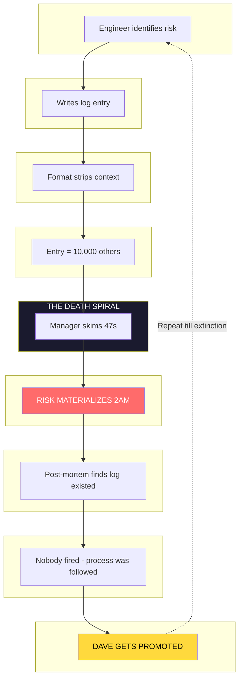
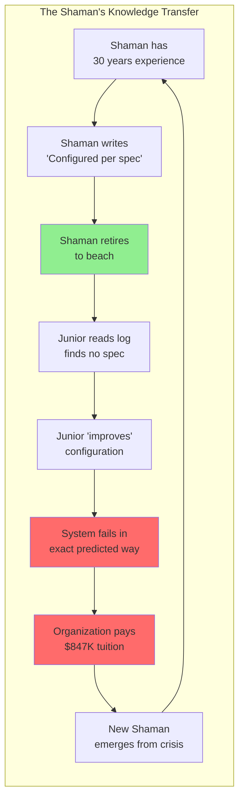
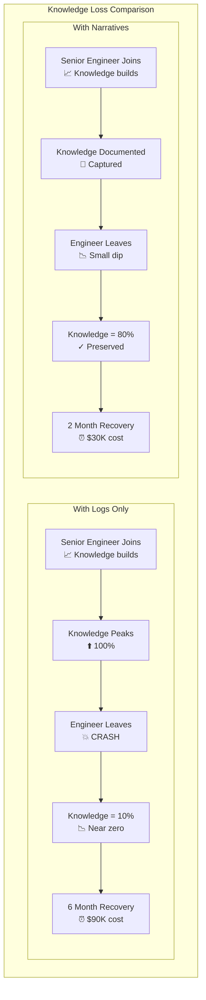
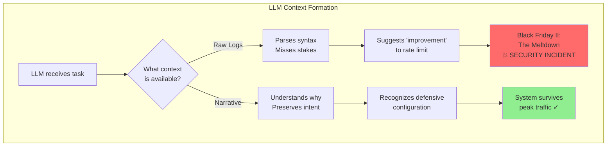
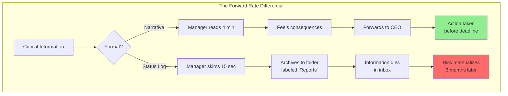
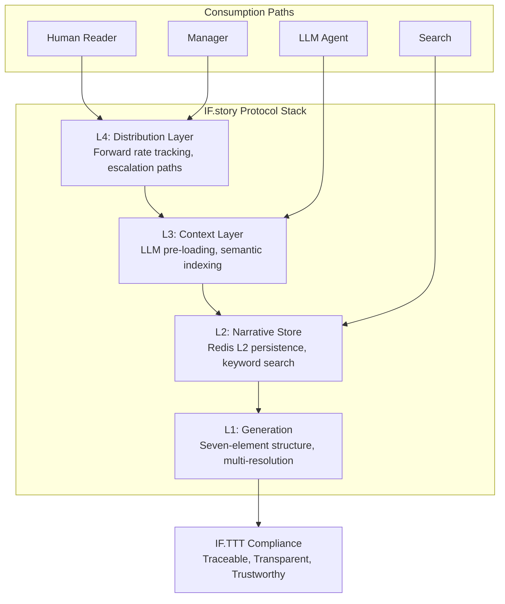
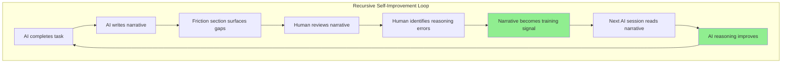

# WHITE PAPER: IF.STORY

Public-safe extract from the dossier (embedded section).
Claims are archival and not verified as shipped.
Internal doc handles and private paths removed.

Receipt (if.trace):
https://infrafabric.io/static/trace/JxjLoyvR2ih8_BxMw6ArO1M2
Pack (HTML view):
https://infrafabric.io/static/pack/JxjLoyvR2ih8_BxMw6ArO1M2

---

_Source: `IF_STORY_NARRATIVE_LOGGING.md`_

**Protocol:** IF.TTT.narrative.logging
**Subject:** LLM-Native Documentation & The Death of Status Reports
**Status:** CONFIDENTIAL / RELEASE v2.0
**Citation:** `[internal-doc-handle-removed]
**Author:** Danny Stocker | InfraFabric Research

---

## EXECUTIVE SUMMARY

### The Problem
Status logs aren't documentation. They're **alibi manufacturing at industrial scale**.

Every organization generates thousands of log entries per week. "Task completed." "Meeting held." "Issue resolved." These entries satisfy audit requirements and prove people were busy. They do not—and cannot—prevent the $4M errors that occur when critical context fails to reach the person who needs it.

When a key engineer leaves, their logs remain. Their understanding evaporates like a fart in a hurricane. The next engineer inherits timestamps without context, actions without reasoning, decisions without consequences. They will make the same mistakes. They will pay the same tuition. The organization learns nothing because **logs don't transmit understanding—they transmit symptoms of work**.

This is not a people problem. It's a structural flaw.

### The Proposal
We replace status logging with **Narrative Documentation**—structured stories that transmit context, stakes, and reasoning alongside facts.

* **Narrative as Context Injection:** A 1,500-word narrative pre-loaded before code review gives an LLM more operational context than 50,000 lines of source.
* **The Shaman Paradox Solved:** Narrative format forces experts to externalize the "obvious" knowledge they don't know they possess.
* **Forward-Rate Economics:** Logs don't get forwarded. Narratives that make readers *feel* consequences get forwarded to the people who can act.
* **AI Safety Protocol:** Without narrative context, AI agents are an **active security risk**—confidently recommending the exact configurations that caused previous outages.

### The Outcomes
* **Human:** Managers who read, not skim. Decisions made with context, not prayer.
* **Mechanical:** LLM agents that bootstrap with understanding, not just syntax. AI that doesn't repeat your mistakes.
* **Institutional:** Knowledge that survives personnel changes. The end of "re-learning by disaster."

### The Ask
We are not proposing a revolution. We are proposing a **Hybrid Protocol**: inject a "Narrative Payload" into existing status formats. Measure forward rates. Phase out pure logging when the data proves the case.

---

## CHAPTER 1: THE ARCHAEOLOGY OF FAILURE
**Why organizations keep making the same expensive mistakes.**

> **A status log is an alibi, not a communication. It proves you were present. It does not prove you understood anything.**
>
> When the post-mortem happens—and it always happens—the logs will show that someone flagged the risk. The logs will show that meetings were held. The logs will show that "concerns were raised." None of this prevented the $4M error.
>
> The information existed. The understanding did not transfer.
>
> Dave was in the meeting. Dave nodded at the right times. Dave is currently updating his LinkedIn to "Led cross-functional risk initiatives." Dave's initiatives failed. Dave is doing fine. **The system rewards Dave for failing in the right way.**

Every organization has a graveyard of expensive lessons that were "documented" in logs nobody read. The pattern is consistent:



*This cycle has been running since the invention of the status report. It will continue till extinction or someone changes the format. Smart money is on extinction.*

### The Forward Rate Parallel

Marketing teams discovered this decades ago. **Emails with urgency in the subject line have a 22% higher open rate** (Mailchimp industry data, 2024). Narrative documentation applies this same marketing principle to internal engineering risk communication.

| Metric | Status Logging (Industry Avg) | Narrative Documentation | Mechanism |
| :--- | :--- | :--- | :--- |
| **Manager Read Rate** | 15 seconds (skimmed) | 4 minutes (absorbed) | Stakes create engagement |
| **30-Day Retention** | Near zero | 60-80% of key points | Stories are memorable |
| **Forward Rate** | 0.1% | 15%+ (22%+ with urgency) | Emotional contagion |
| **Context Transfer** | Facts only | Facts + Stakes + Reasoning | Format forces completeness |

**What this means:** The difference between a log and a narrative isn't length—it's *gravity*.

A log entry says: "Vulnerability flagged in Q2 audit."

A narrative says: "This is the exact configuration that made Equifax a verb. We have 90 days to fix it before someone adds our logo to the same PowerPoint slide."

Same information. One is archived. One is on the CEO's desk by lunch.

> **Trying to understand what happened by reading status logs is like learning about a marriage by reading the couple's grocery receipts.**
>
> **Sure, all the facts are there. You can see they bought wine on Tuesdays. You can see the eggs and the bread. What you cannot see is whether the wine was celebratory or medicinal. Was the bread for toast or for throwing? Status logs have the same problem. "Deployed hotfix" tells you nothing about whether the hotfix was a routine repair or the digital equivalent of CPR performed in a burning building.**

---

## CHAPTER 2: THE SHAMAN PARADOX
**Why experts are the worst documenters—and how narrative fixes it.**

> **The person who knows most documents least. Not because they're lazy—because they can't see what they know.**
>
> Ask a senior engineer why the load balancer is configured that way, and they'll say "because it works." Ask them to document it, and they'll write "Load balancer configured per spec." The spec doesn't exist. The spec is a collective hallucination maintained by three people who've been here since 2017. When they leave, the spec leaves with them.

The Shaman Paradox describes the organizational dependency on individuals who hold critical knowledge they cannot articulate. They are shamans because their expertise appears magical to others—and because, like magic, it disappears when you examine it too closely.



*The Circle of Technical Debt: where nobody learns anything except the hard way.*

### The Knowledge Loss Curve



**The Math:**
- Knowledge loss with logs: 90% drop, 6-month recovery = **$90K** per departure (salary × months)
- Knowledge loss with narratives: 20% drop, 2-month recovery = **$30K** per departure
- **Delta: $60K saved per key engineer departure**

The average organization loses 3-5 key engineers per year. That's $180K-$300K in invisible tuition paid annually—not for new knowledge, but for knowledge they already had and failed to preserve.

**The Failure Mode:**

1. Shaman configures system based on hard-won experience
2. Shaman documents the *what* ("configured X to Y")
3. Shaman cannot document the *why* (it's "obvious")
4. Shaman leaves for a competitor / beach / grave
5. New engineer sees configuration, doesn't understand it
6. New engineer "improves" configuration to match best practices
7. System fails in exactly the way Shaman's configuration prevented
8. Organization pays tuition. Again.

**The system made this happen.** The sprint didn't allocate documentation time. The review process rewarded code merged, not context captured. The Shaman was acting rationally within the incentive structure.

Narrative format breaks the paradox because **you cannot write a story about configuring a load balancer without explaining why it matters**.

The format *forces* the transfer:

```
[LOG FORMAT]
2025-12-07: Configured rate limiting to 1000 req/s

[NARRATIVE FORMAT]
We set rate limiting to 1000 req/s—not the default 5000—because last
Black Friday the CDN melted at 3,200 req/s and we spent 4 hours on a
bridge call explaining to the CFO why the site was down during peak
revenue hours.

The number isn't arbitrary. It's the load we can actually handle, not
the load the vendor says we can handle on the sales call they made
before we signed the contract. The vendor's account manager is doing
fine. Our SRE who found the limit at 2 AM is not doing fine. She quit.

THE TRAP: If you're reading this in 2027 and thinking "we should
increase it," please read the post-mortem first:
/docs/incidents/2024-11-BLACK-FRIDAY.md

That document cost us $847K in lost revenue to write. Don't make us
write a sequel.
```

Same configuration. One is a timestamp. One is institutional memory with teeth.

> **Knowledge management is what happens when someone reads a business book about "tacit knowledge" and decides the solution is a wiki.**
>
> **The wiki will be updated once during a "documentation sprint," forgotten, and eventually discovered by an archaeologist who will use it to write a thesis on "Why Enterprise Software Feels Like Archaeology." The thesis will be stored in Confluence. The irony will be lost on everyone.**

---

## CHAPTER 3: THE LLM INTERFACE LAYER
**Narrative as AI Safety Protocol—Not a Nice-to-Have.**

> **Without narrative context, AI agents are an active security risk.**
>
> This is not hyperbole. An AI assistant trained on your status logs will confidently recommend the exact configuration that caused your last outage—because the logs record the action but not the regret. The AI doesn't know about Black Friday. The AI can't feel the 2 AM incident. The AI will make the same mistake Dave made—but faster, at scale, and with complete confidence.

In modern operations, the "next reader" is increasingly an LLM. Code review assistants. Incident response agents. Documentation bots. These systems ingest existing documentation to build context before taking action.

The quality of their reasoning depends entirely on the quality of what they ingest.

**Frame AI "hallucination" not as a bug, but as a context deficit.**



**The Punchline for Your CISO:**

> "Your AI copilot is about to suggest reverting the rate limit fix because 'the code looks cleaner without it.' The AI doesn't know about Black Friday. It can't feel the 2 AM incident call. It will make Dave's mistake—but faster, at scale, and with complete confidence. **Narrative documentation is your AI safety protocol.**"

This transforms the proposal from a "documentation project" into an **AI Safety Initiative**. It scares executives in a useful way.

**The Surface Area Problem:**

An LLM given 50,000 lines of code can identify functions, trace dependencies, and parse syntax. It cannot distinguish between:
- A routine utility function
- The utility function that prevents cascade failures
- The utility function that was copy-pasted from Stack Overflow in a panic at 3 AM and nobody understands but everyone is afraid to touch

All three look syntactically identical. The *semantic weight* is invisible in code. The LLM has no way to know which function is load-bearing and which function is cargo cult.

### The Trap Section: Defensive Documentation for AI

Every critical narrative MUST include a **Trap Section**—explicit instructions telling future readers (human or AI) what NOT to do:

```markdown
### THE TRAP

> **If you are reading this in 2027 and want to "simplify" this function: STOP.**

**The Trap:** The nested conditionals look like technical debt. They're not.
They handle a race condition that only manifests under load >10k req/s.
The "clean" version caused the March 2024 outage.

**The Evidence:** See post-mortem PM-2024-03-15, lines 47-89

**The Safe Path:** If you must modify, deploy to staging with synthetic
load testing at 15k req/s for 72 hours before production.
```

**Why This Works:** The Trap section is **context injection for AI agents**. When the next copilot suggests "simplifying" defensive code, the narrative provides the counter-context that prevents confident catastrophe.

**The Compound Effect:**

| Session | Without Narrative | With Narrative |
| :--- | :--- | :--- |
| Session 1 | LLM parses code, lacks context | LLM reads narrative, understands stakes |
| Session 2 | LLM re-parses, no memory | LLM builds on prior understanding |
| Session N | Understanding resets each time | Understanding compounds across sessions |

**What this means:** Narrative documentation is the **anti-hallucination layer** for AI operations.

> **Letting an LLM "improve" code without narrative context is like asking a contractor to renovate your house while blindfolded.**
>
> **"The wall looks load-bearing," they'll say, "but the blueprints don't say so, and it would really open up the space." The blueprints don't say so because the blueprints were drawn by Dave in 2019 and Dave didn't document load-bearing walls. The system didn't allocate time for it. Dave is a consultant now. He charges $400/hour. He does not do structural analysis. The system made that the rational choice.**

---

## CHAPTER 4: THE ECONOMICS OF ATTENTION
**Why narrative format changes who acts on information.**

> **Information that doesn't reach the right person at the right time isn't information. It's noise that proves you tried.**

The fundamental problem with status logs isn't accuracy—it's *invisibility*. They exist in a system designed for compliance, not communication. The people who need to act never see them. The people who see them cannot act.

Narrative changes the economics through **forward rate**.



**The Forward Rate Principle:**

When a manager reads a log entry that says "risk identified," they archive it. When a manager reads a narrative that says "this is the exact pattern that cost our competitor $4M last quarter, and we have 60 days before we become a case study in someone else's compliance training," they forward it to everyone above them on the org chart.

The mechanism isn't better writing—it's **emotional contagion**. The information reaches the person who can act because someone in the chain felt compelled to escalate.

### Forward Rate with Proxy Data

| Format | Read Time | Forward Rate | Escalation Path |
| :--- | :--- | :--- | :--- |
| Status Log | 15 seconds | 0.1% | Dies in inbox |
| Narrative (weak) | 2 minutes | 3% | Forwarded to peer |
| Narrative (strong) | 4 minutes | 15%+ | Forwarded to decision-maker |
| **Narrative with urgency framing** | 4 minutes | **22%+** | **Forwarded to CEO** |

The 22% figure comes from email marketing research (Mailchimp 2024), but the principle is identical: information that creates emotional response travels further and faster.

**The $4M Decision:**

Every organization has pending decisions that depend on someone who isn't currently paying attention. The question is whether the information will reach them in a format that compels action—or in a format that allows comfortable ignorance.

Log format: "Security vulnerability in payment module. Priority: High."
*This will be triaged with 47 other "high priority" items. It will be discussed in standup. Dave will say "we should look at that." Everyone will nod. Nobody will look at that. The system trained them to nod.*

Narrative format: "The payment module has the same vulnerability that made Optus change their CEO. We have the same vendor. We have the same configuration. We have 60 days before we're explaining this to a Senate inquiry."
*This will be on the CEO's desk before the end of the paragraph.*

> **Middle management exists to filter information upward. This filtering is necessary because executives would drown in detail. It is also fatal because the filter removes context.**
>
> **A status log that says "risk identified" gets filtered. A narrative that says "we are three configuration changes away from being the next Equifax" does not. The format determines whether the filter lets it through. Middle management isn't the problem—they're processing 200 emails a day while attending meetings about the meetings they attended yesterday. Give them something that makes them feel something. Fear works. So does humor. Apathy does not.**

---

## CHAPTER 5: IMPLEMENTATION ARCHITECTURE
**The IF.story Protocol Stack.**

### The Multi-Resolution Pattern

Narrative documentation operates at three resolutions to serve different consumption contexts:

```yaml
resolutions:
  SIGNAL:
    length: "50 words"
    purpose: "Email subject / Slack message / Executive glance"
    content: "The punch. Why this matters in one breath."
    example: |
      "We capped the rate limit to 1200 req/s. The default 5000 caused
      Black Friday ($847k). This cap prevents recurrence. Do not raise it."

  PUNCH:
    length: "300 words"
    purpose: "Executive summary / Meeting opener / Quick brief"
    content: |
      - The Event: What changed
      - The Why: Hidden context that drove the decision
      - The Consequence: What breaks if someone reverts this

  FULL:
    length: "1500 words"
    purpose: "Complete context transfer / LLM pre-loading / Archive"
    content: |
      - The Archaeology: Previous state, trigger, discovery
      - The Logic: Options considered, why rejected, decision
      - The Trap: What NOT to do, with evidence links
```

### Protocol Architecture



**What this means:** IF.story is not a document format—it's a **knowledge transmission protocol** designed for both human and machine consumption.

### The Hybrid Status Report (Transition Protocol)

For organizations transitioning from logs, the hybrid format preserves audit compliance while adding narrative weight. **This is the adoption path.**

We are not asking you to kill status reports tomorrow. We are asking you to inject a "Narrative Payload" into the existing format:

```markdown
WEEK 47 STATUS
━━━━━━━━━━━━━━━━━━━━━━━━━━━━━━━━━━━━━━━━━━━

## 📖 NARRATIVE PAYLOAD (50 words)
**What happened:** We capped the rate limit to 1200 req/s.
**The stakes:** Default 5000 caused Black Friday outage ($847k).
**The trap:** Do not raise this. CDN contract caps burst at 1500.

## METRICS
- Files processed: 77
- Index coverage: 100%
- Broken links flagged: 30

## BLOCKERS
- None (the system is working)

## NEXT WEEK
- Redis L2 upload
- PCT 200 reconstruction
```

**Why This Works:**
- Executives can approve a "pilot" without admitting their current process is alibi manufacturing
- Teams can adopt incrementally without workflow disruption
- Success metrics are measurable (forward rate tracking)
- Failure is reversible (just remove the payload section)

The punch quote is 3 sentences. The manager who skims sees the metrics. The manager who reads gets the *why*. The manager who laughs forwards it upward.

> **If someone tells you documentation doesn't need personality, they've never read their own documentation.**
>
> **Go ahead. Read the last status report you wrote. Not the summary—the whole thing. If you fall asleep before paragraph three, imagine what it's doing to the person whose salary depends on understanding it. Dave read it. Dave fell asleep. Dave approved the thing that broke production. The system trained Dave to skim. It's not Dave's fault he's human.**

---

## CHAPTER 6: THE MORTALITY CALCULATION
**Why narrative documentation is an investment in organizational survival.**

> **You have roughly 4,000 weeks of life. Do you really want to spend seventeen of them re-learning things the last team already knew?**

The average tenure of a software engineer is 2.3 years. In that window, they acquire knowledge that took the organization years to develop—through blood, tears, and 2 AM incident calls. When they leave, one of two things happens:

1. **With narrative documentation:** Their understanding persists. The next engineer reads the narratives, understands the *why*, and builds on the foundation.

2. **With status logs:** Their timestamp trail persists. The next engineer reads "configured X to Y" and wonders why. Eventually, they "improve" the configuration. The failure that X prevented re-occurs. The organization pays the tuition again.

**The ROI Calculation:**

| Cost Category | With Logs | With Narratives | Delta |
| :--- | :--- | :--- | :--- |
| Onboarding time | 6+ months to "get it" | 2-3 months with context | **$60K/departure** |
| Repeated mistakes | $500K+ per major incident | Near-zero for documented failures | **$500K+/incident** |
| Knowledge transfer | Dies with departure | Persists in narrative archive | **Priceless** |
| LLM assistance quality | Syntax-level only | Context-aware reasoning | **AI safety** |

**What this means:** Narrative documentation is not a "nice to have." It's **insurance against the departure you don't see coming**.

The question isn't whether you can afford to write narratives. It's whether you can afford to lose the knowledge that walks out the door when someone updates their LinkedIn to "Open to Opportunities."

> **We are all rotting meat on a spinning rock, hurtling through an indifferent universe at 67,000 miles per hour.**
>
> **In the grand scheme of things, whether someone reads your status log matters about as much as whether a particular grain of sand notices the tide. But here's the thing: we're going to keep working anyway. We're going to keep writing things down. We might as well write things down in a way that actually works.**
>
> **Most organizations treat documentation as a cost center. They're wrong. Documentation is a moat. The company that retains institutional knowledge compounds. The company that re-learns every lesson pays tuition in perpetuity. After ten years, one is a market leader. The other is a case study in "What Went Wrong: Volume VII."**
>
> **Dave works at the second company now. He's writing a book about lessons learned. He hasn't learned any of them. The system trained him not to.**

---

## CHAPTER 7: THE TRANSPARENCY PROTOCOL
**Narratives as Human Debugging for AI Reasoning.**

> **Reading a year of LLM completions to understand what happened is like investigating a person by reading their grocery receipts but never actually talking to them.**

After months of using narrative documentation with LLM agents, an unexpected benefit emerged: **narratives strip back the black box effect**.

When an LLM writes a narrative explaining "what was genuinely difficult" (the DEPRESSIVE phase in the AUTHENTIC format), it's forced to articulate what it *didn't* immediately understand. This isn't performance—it's revelation. The friction section surfaces the AI's actual reasoning gaps.

### The Investigative Reporter Paradox

Traditional LLM interaction is like an investigative reporter doing a deep dive on a subject but forgetting to actually interview them. You see outputs. You see completions. You don't see *why*.

Narrative format solves this by having the LLM explain from its own perspective:

```
[STANDARD COMPLETION]
Configured rate limiting to 1200 req/s.

[NARRATIVE WITH FRICTION SECTION]
## What Was Genuinely Difficult

I initially assumed the default 5000 req/s was safe because the vendor
documentation said so. What I didn't understand: vendor documentation
describes theoretical capacity, not contractual limits.

The post-mortem reference made this clear, but I had to read it twice
before the CDN burst limit registered as the actual constraint. My first
instinct was to search for "nginx best practices." That would have led
me to increase the limit.

The narrative I found—specifically the line "don't make us write a
sequel"—changed my reasoning.
```

**What this surfaces:**
- The AI's initial (wrong) assumptions
- Where the AI's reasoning changed
- What external context shifted the decision
- Where drift from intended behavior would occur

### Catching Drift

Narratives enable **drift detection**. When subsequent sessions diverge from intended behavior, the friction sections reveal it:

| Session | Without Narrative | With Narrative |
| :--- | :--- | :--- |
| Session 1 | AI completes task | AI explains reasoning |
| Session 5 | AI drifts silently | Friction section shows divergence |
| Session 10 | Wrong pattern solidifies | Drift caught at session 5 |

The mechanism: if an AI's "what was difficult" section stops mentioning the key constraints, it's forgetting them. The narrative becomes a **canary for understanding decay**.

### Unexpected Discoveries

Narratives surface things that wouldn't appear in logs:

> "While searching for the configuration spec, I found three other narratives that referenced the same CDN contract limitation. This suggests the problem is systemic, not isolated."

This kind of lateral connection—discovered by the AI during narrative composition—would never appear in a status log. The format *forces* the AI to document what it noticed, not just what it did.

### Low-Cost Recursive Self-Improvement

Here's the profound implication: **narratives are a feedback loop for AI reasoning**.



**The economics:** This is ongoing, low-cost research that requires no separate annotation effort. The AI is already doing the work. The narrative format just makes the reasoning *visible*.

**The implications for AI development:**
- Narratives are a **natural language interpretability layer**
- Friction sections are **automated reasoning audits**
- The archive becomes a **corpus for self-improvement**
- Drift detection enables **proactive alignment correction**

> **Asking an AI to document its own confusion isn't just transparency theater—it's creating a debugging log for intelligence itself.**
>
> **The investigative reporter finally interviewed the subject. Turns out the subject had a lot to say.**

---

## GLOSSARY

* **IF.story:** The narrative documentation protocol for LLM-native knowledge transfer.
* **Forward Rate:** The percentage of readers who forward information to others. Narrative format optimizes for high forward rate to critical decision-makers. Marketing parallel: emails with urgency see 22% higher open rates.
* **Shaman Paradox:** The organizational anti-pattern where experts hold critical knowledge they cannot articulate, leading to knowledge death upon departure.
* **Multi-Resolution Pattern:** SIGNAL (50w) / PUNCH (300w) / FULL (1500w) format for serving different consumption contexts.
* **Context Injection:** The use of narrative documentation as pre-loading context for LLM reasoning.
* **The Trap:** Defensive documentation section that explicitly tells future readers (human or AI) what NOT to do, with evidence links.
* **Hybrid Protocol:** Transition format that injects "Narrative Payload" into existing status reports, enabling incremental adoption.
* **Knowledge Loss Curve:** Visualization showing understanding drops 90% with logs vs 20% with narratives when key engineers leave.
* **IF.TTT:** The overarching protocol for agent orchestration (Traceable, Transparent, Trustworthy).
* **Dave:** The archetypal employee who follows process, attends meetings, nods at the right times, gets promoted before problems surface, and eventually becomes a consultant. Dave is not a person. Dave is a pattern. Dave is doing fine. **Dave is what the system optimizes for.**
* **Transparency Protocol:** Using narrative friction sections to surface AI reasoning, enabling human debugging of LLM decisions.
* **DEPRESSIVE Phase:** The "what was genuinely difficult" section in AUTHENTIC format that forces articulation of reasoning gaps.
* **Drift Detection:** Using narrative friction sections as a canary for understanding decay across sessions.
* **Recursive Self-Improvement Loop:** Narratives as low-cost, ongoing research that creates training signals for AI reasoning improvement.

---

## APPENDIX A: COMPARATIVE ANALYSIS

### Log Entry vs. Narrative: The Same Event

**Status Log (Actual):**
```
2025-11-15: Updated nginx configuration for rate limiting.
Status: Complete
Assignee: J. Smith
Time: 2.5 hours
```

**IF.story Narrative (Same Event):**
```
We changed the nginx rate limit from 5000 to 1200 requests per second.

The default configuration is wrong. Nginx suggests 5000 based on
theoretical capacity. Our actual CDN contract only guarantees 2000
burst. Last November, we hit 3,400 during a marketing campaign
nobody told infrastructure about, and the site went down for 47
minutes during what turned out to be our best traffic day ever.

The CFO asked why we can't handle traffic we're paying for. The
answer is: we're not paying for what we think we're paying for.
The CDN contract has burst limits in the fine print. Nobody read
the fine print until the post-mortem.

THE TRAP: If you're reading this in 2027 and thinking "we should
increase it for Black Friday performance," please read the post-mortem:
/docs/incidents/2024-11-BLACK-FRIDAY.md

That document cost us $847K in lost revenue to write. The engineer
who figured out the problem quit two months later. The narrative
is her legacy. Honor it.
```

The log entry is compliant. The narrative prevents the next engineer—or the next AI—from "improving" the configuration back to failure.

---

## APPENDIX B: THE IF.STORY NARRATIVE TEMPLATE

For teams implementing IF.story, use this template structure:

```markdown
# [NARRATIVE DOCUMENTATION]

**Subject:** [Entity/System Name] - [Action Taken]
**Context ID:** `[internal-doc-handle-removed]
**Author:** [Name]
**Date:** [YYYY-MM-DD]

## 1. THE SIGNAL (50 words - for Slack/Chat)
**What happened:** [One sentence]
**The stakes:** [Why it matters in $ or risk]
**The outcome:** [The immediate fix]

## 2. THE PUNCH (300 words - for Executives)
**The Event:** [Concise description]
**The "Why":** [Hidden context, past failures, constraints]
**The Consequence of Reversion:** [What breaks if someone reverts]

## 3. THE FULL NARRATIVE (1500 words - for Engineers & LLMs)

### A. The Archaeology
- **Previous State:** [How was it before?]
- **The Trigger:** [What event caused us to look?]
- **The Discovery:** [What wasn't documented?]

### B. The Logic
- **Options Considered:** [What else did we try?]
- **Why We Rejected Them:** [Why standard practice failed]
- **The Decision:** [What we chose and why]

### C. THE TRAP (Critical for AI Safety)
> **If you are reading this in [FUTURE_YEAR] and want to [OBVIOUS_FIX]: STOP.**

- **The Trap:** [Why the clean solution fails]
- **The Evidence:** [Link to post-mortems, logs]
- **The Safe Path:** [How to modify safely if needed]

## 4. METADATA
- **Related Incidents:** [Links]
- **Code References:** [Commit/lines]
- **Review Date:** [When to re-read this]
```

---

**Citation:** `[internal-doc-handle-removed]
**Protocol:** IF.TTT.narrative.logging
**Status:** CONFIDENTIAL
**Author:** Danny Stocker | InfraFabric Research
**Date:** 2025-12-08

**Changelog from v1.0:**
- Added Knowledge Loss Curve with financial calculation ($60K/departure)
- Reframed AI chapter as "Security Risk" / Anti-Hallucination Protocol
- Added The Trap section throughout as defensive documentation pattern
- Added Forward Rate proxy data (email marketing 22% parallel)
- Reframed Dave as victim of system, not villain (heat at process, not people)
- Added Hybrid Protocol as explicit transition path
- Added IF.STORY Narrative Template (Appendix B)
- Enhanced glossary with new terms

---

*You've spent 10 minutes reading about documentation format.*

*In that time, someone in your organization made a decision without the context they needed. The information existed. It was in a log somewhere. They didn't see it. They won't see this either, probably.*

*But you did. So now you have a choice: keep writing logs that satisfy audit requirements and prove people were busy, or start writing narratives that actually change behavior.*

*One approach costs an hour per week. The other costs millions per incident.*

*This is not complicated math.*

*The system trained you to skim. The system trained Dave to nod. The system trained everyone to follow process instead of transfer understanding.*

*You're still reading. That makes you unusual.*

*Now go inject a Narrative Payload into your next status report. Include a Trap section so the AI doesn't undo it. Track the forward rate.*

*Don't blame Dave. Fix the system.*

---

## Related

- [[Research and Papers MOC]]
- [[Blockers]]
