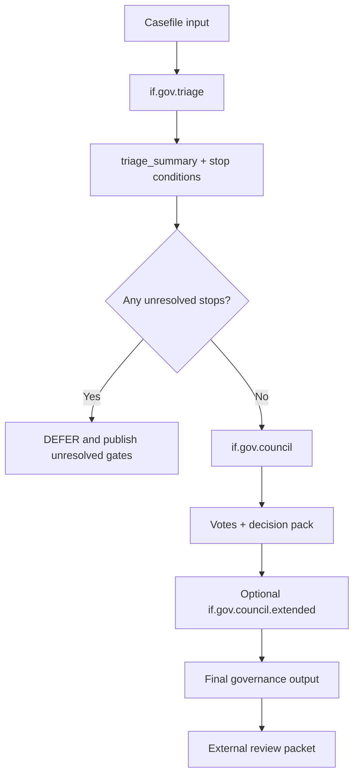

# `if.gov` Full Explainer v1.1 (Triage + Council + Extended, 4-Audience Deep Dive)

Danny Stocker | ds@infrafabric.io | InfraFabric Research | 2026-02-21
Status: review
Last review date: 2026-02-21
Next checkpoint date: 2026-03-01
Accountable and responsible approver: Danny Stocker | ds@infrafabric.io
LLM-assist disclosure: drafted and validated with Codex runtime assistance; accountable human author remains Danny Stocker.

## Who | Why | What | Where | When | How

- Who: executives, operators, implementers, and runtime developers who need a governance system that is auditable and operational.
- Why: keep `if.gov` grounded in canonical governance memory while avoiding claim inflation.
- What: full explainer for `if.gov`, including `if.gov.triage`, `if.gov.council`, and `if.gov.council.extended`.
- Where: registry identity at `/if/gov`, canonical artifacts in `council/if-gov/**`, public evidence at `/llm/products/if-gov/**`.
- When: this revision includes fresh local reference runs generated on 2026-02-21 for current-state evidence.
- How: deterministic triage/council scripts, seat/voice/concept contracts, explicit claim boundaries, and external-first verification.

## Problem Statement

Governance documentation can drift in two directions at once:

- context-window drift: old governance philosophy and council structure get dropped when summaries compress,
- claim drift: rich packets are misread as deployed runtime guarantees.

This revision fixes both by re-attaching `if.gov` to canonical source contracts and fresh runtime evidence.

## Current Product Posture (Black/White)

Verified now:

- `if.gov` is `preview`.
- `if.gov.triage` is `roadmap`.
- `if.gov.council` is `roadmap`.
- `if.gov.council.extended` is `roadmap`.
- Canonical public surfaces are live and reachable.
- Deterministic local reference scripts run and produce schema-valid artifacts.

Not claimed now:

- deployed SLA/runtime guarantees for `if.gov` SKUs,
- legal advice,
- compliance certification,
- universal factual correctness of all casefile content.

## Fresh Runtime Regeneration (IF-2044 Window)

Reference run bundle:

- `/root/tmp/if2044_if_gov_refresh/triage/triage_summary.json`
- `/root/tmp/if2044_if_gov_refresh/council/votes.json`
- `/root/tmp/if2044_if_gov_refresh/extended/votes.json`
- `/root/tmp/if2044_if_gov_refresh/logs/*.log`

Observed outcomes from this run:

- Triage output: `risk_tier=LOW`, `recommended_panel_template=preview3`, `recommended_mode=single_agent`.
- Stop conditions: unresolved `data_handling.mode` and `sources.minimum`.
- Council output: `outcome=DEFER`, `quorum_met=true`, `weighted_approval_pct=100.0`.
- Extended output: `outcome=DEFER`, `quorum_met=true`, `weighted_approval_pct=100.0`.

Interpretation boundary:

- The `DEFER` outcome is correct for this casefile because stop conditions were unresolved.
- This demonstrates gating discipline for this run window.
- It does not prove universal behavior across all casefiles.

## Governance Preservation Contract (What Must Not Be Lost)

This section is the explicit keep-list for `if.gov` continuity.

### 1) Philosophy Database Must Stay Canonical

Canonical database (implementation form):

- concept cards (`council/if-gov/concepts/*.json`),
- voice profiles (`council/if-gov/voices/*.json`),
- seat charters (`council/if-gov/seats/*.json`),
- coverage manifests (`council/if-gov/coverage/*.json`),
- panel templates (`council/if-gov/panel_spec.preview.v1.json`).

Current counts (2026-02-21):

- concepts: 209
- voices: 11
- seats: 11
- coverage manifests: 3

Preservation rule:

- governance reasoning must reference these canonical records, not ad hoc persona text in a chat thread.

### 2) Council Presence Must Be Contractual, Not Implied

Council presence is defined by panel spec + roster state, not by narrative mention.

Required fields that must persist:

- `seat_id`,
- `voting_status` (`vote` or `abstain`),
- `implementation_status`,
- seat weight,
- threshold rules (`minimum_votes`, approval threshold, abstain policy).

Practical effect:

- contributors and source providers can influence materials,
- but source contribution does not automatically equal formal seat membership.

### 3) Vote Ledger and Dissent Memory Must Persist

Per decision cycle we keep:

- machine-readable votes (`votes.json`),
- outcome computation (`quorum_met`, weighted approval),
- notes explaining gate-triggered deferrals,
- dissent/contrarian posture and rationale when applicable.

### 4) Integrity/Abuse Red-Team Must Remain an Internal Guardrail

Required internal posture:

- integrity/capture findings are treated as governance risks,
- each risk has a stable finding handle,
- unresolved high-severity conditions block approval,
- publication safety controls avoid person-level accusation framing.

### 5) Black/White Language Discipline Is Mandatory

Every pack must separate:

- verified evidence (what is true and testable now),
- interpretation/judgment (analysis),
- intent/roadmap (planned state).

If this split is missing, the pack is non-compliant.

## `if.gov` Runtime Model

`if.gov` is a governance layer, not a flight-control layer and not a generic chatbot.

### Flow

1. `if.gov.triage`: classify decision and enforce stop conditions.
2. `if.gov.council`: run core seat deliberation and vote computation.
3. `if.gov.council.extended`: run broader challenge lenses when required.
4. publish decision artifacts with strict claim boundaries.



### Current Preview Panel (`preview3`)

From `council/if-gov/panel_spec.preview.v1.json`:

- `cabinet.macro.merchant_pragmatist` (voting),
- `cabinet.contrarian.reframing` (voting),
- `cabinet.jester.narrative_stress_test` (abstain, non-voting memo role).

Threshold posture:

- minimum votes: 2,
- approval threshold: 75%,
- at very high consensus, narrative stress testing is required.

## Document Navigation by Audience

- Executives / Business Leaders: [Executives](#1-executives)
- Power Users / Operators: [Operators](#2-operators)
- Engineers / Implementers: [Engineers / Implementers](#3-engineers--implementers)
- LLM Runtime Developers: [Runtime Developers](#4-runtime-developers)

## Four-Audience View

## 1) Executives

### Decision summary

`if.gov` is currently strong as a reviewable governance system and weak as a runtime guarantee claim, by design.

What you can safely say:

- governance triage/council artifacts are reproducible and auditable,
- decision gating exists and triggers explicit `DEFER` when stop conditions remain unresolved,
- governance memory is structured and versioned (not just prompt text).

What you cannot safely say:

- production-grade governance runtime guarantees are live,
- governance output equals legal/compliance certification.

### Board-level risk if ignored

If governance memory is treated as optional narrative, seat drift and claim drift will return quickly.

## 2) Operators

### Runbook baseline

- run triage and enforce stop conditions first,
- do not bypass unresolved stop conditions to “get an approval,”
- log vote artifacts and decision rationale per run,
- keep publication language constrained to verified evidence.

### Failure pattern to avoid

Most operational failures here are not script crashes; they are governance bypasses:

- skipping stop conditions,
- blurring verified vs interpreted claims,
- treating source contribution as automatic council authority.

## 3) Engineers / Implementers

### Canonical data contracts

- seat: mission, scope, trigger conditions, questions, decision framework, guardrails,
- voice: style constraints and anti-patterns,
- concept: lens-level hard rules with source pointers,
- panel spec: roster/threshold and voting semantics.

### Build discipline

- compile prompts deterministically from seat/voice/concept records,
- validate outputs with JSON schemas,
- preserve explicit field-level compatibility rules for output contracts,
- record run artifacts under versioned output folders.

### Example seat contract shape

Example seat file:

- `council/if-gov/seats/cabinet-epistemic-audit-rigor.v1.json`

Key properties already modeled:

- mandatory verified-vs-judgment split,
- anti-overclaim guardrails,
- non-person seat framing (role lens, not impersonation).

## 4) Runtime Developers

### Runtime contract (minimum)

For consumption, a governance payload should include at minimum:

- case id and generated timestamp,
- triage schema + stop conditions,
- council schema + outcome + quorum status.

### Forbidden inference list

Consumers must not infer:

- `runtime_service_guaranteed`,
- `legal_advice_provided`,
- `compliance_certified`,
- `factual_correctness_proven`.

### Safe integration pattern

- gate downstream actions on stop-condition status,
- keep policy enforcement deterministic,
- keep interpretation and execution controls decoupled.

## Relevance to Agent Rook

`if.gov` and Agent Rook are complementary layers:

- Agent Rook: governed operator profile for autonomous execution behavior,
- `if.gov`: decision and challenge layer for whether and how actions are approved.

Operationally:

- Rook can execute tasks and route assist lanes,
- `if.gov` can provide explicit decision framing, dissent handling, and stop conditions before sensitive actions.

This keeps autonomy practical without removing governance accountability.

## Relevance to Real Drone Operations (Civil and Defense-Adjacent)

Scope boundary first:

- `if.gov` does not replace flight controllers.
- `if.gov` sits in the mission/governance layer above flight control.

### Where `if.gov` helps immediately

1. Pre-mission approval gates:
- geofence/legal constraints,
- data-handling mode declaration,
- evidence-source minimum requirements.

2. In-mission exception governance:
- when route degradation or policy conflict appears, invoke triage and require explicit stop-condition handling.

3. Post-mission defensibility:
- decision artifacts, dissent notes, and verification posture can be reviewed after incidents without relying on memory.

### Combined stack picture

- `if.switchboard`: deterministic routing and fallback control plane.
- Agent Rook: execution profile with policy controls.
- `if.gov`: mission-decision governance and challenge process.
- `if.trace` + append-only systems: integrity and custody evidence.

This is exactly the split needed for drone programs that need both resilient operations and audit-ready governance.

## Public Surfaces (No-Login)

https://infrafabric.io/if/gov/
https://infrafabric.io/if/gov/triage
https://infrafabric.io/if/gov/council
https://infrafabric.io/if/gov/council/extended
https://infrafabric.io/llm/products/if-gov/
https://infrafabric.io/llm/products/if-gov/CANONICAL_CURRENT.md.txt
https://infrafabric.io/llm/products/if-gov/canon.json.txt
https://infrafabric.io/llm/philosophy/2026-01-08/
https://infrafabric.io/if/switchboard/
https://infrafabric.io/if/rook/

## Verification Commands

```bash
# Registry posture for if.gov stack
curl -fsS https://infrafabric.io/llm/if.registry.json.txt | rg -n '"product_id": "if\.gov"|"product_id": "if\.gov\.triage"|"product_id": "if\.gov\.council"|"product_id": "if\.gov\.council\.extended"|"status":'

# Public packet pointers
curl -fsS https://infrafabric.io/llm/products/if-gov/CANONICAL_CURRENT.md.txt | sed -n '1,120p'
curl -fsS https://infrafabric.io/llm/products/if-gov/canon.json.txt | python3 -m json.tool | sed -n '1,140p'

# Local deterministic runtime regeneration (IF-2044 pattern)
OUT=/root/tmp/if2044_if_gov_refresh
python3 /root/scripts/if_gov_triage.py --in /root/docs/33-ifgov-decision-pack-demo-input.md --out "$OUT/triage" --overwrite
python3 /root/scripts/if_gov_council.py --in /root/docs/33-ifgov-decision-pack-demo-input.md --triage "$OUT/triage/triage_summary.json" --out "$OUT/council" --overwrite
python3 /root/scripts/if_gov_council_extended.py --in /root/docs/33-ifgov-decision-pack-demo-input.md --triage "$OUT/triage/triage_summary.json" --out "$OUT/extended" --overwrite

# Schema checks
python3 /root/scripts/if_gov_validate.py --kind triage_summary "$OUT/triage/triage_summary.json"
python3 /root/scripts/if_gov_validate.py --kind votes "$OUT/council/votes.json"
python3 /root/scripts/if_gov_validate.py --kind votes "$OUT/extended/votes.json"
python3 /root/scripts/check_if_gov_panel_spec.py --panel /root/council/if-gov/panel_spec.preview.v1.json --verify-seats
```

## Release-Language Guardrails

Approved:

- "`if.gov` is a preview governance system with deterministic triage/council reference runs."
- "`if.gov` enforces stop-condition-based decision gating in current reference runs."

Blocked:

- "`if.gov` is a deployed runtime governance service with SLA guarantees."
- "`if.gov` provides legal certification."
- "`if.gov` proves factual correctness of all outputs."

Escalation phrasing:

`Current evidence supports preview governance claims and deterministic reference-run behavior; runtime guarantee and compliance-certification claims remain out of scope.`

## 30 / 60 / 90 Plan

### 30 days

- keep philosophy database and seat contracts synchronized between `council/if-gov/**` and runtime usage,
- publish a refreshed dated packet with current run summaries.

### 60 days

- add continuous governance regression windows (triage + council + extended) with append-only evidence publication,
- publish explicit unresolved-stop-condition rates per window.

### 90 days

- reassess claim posture only if runtime evidence for deployed SKUs is present and externally verifiable,
- otherwise retain current preview/roadmap boundary.

## Conclusion

`if.gov` is strongest when treated as a governance memory-and-gating system:

- triage before action,
- council with explicit seat contracts,
- preserved philosophy database and council-presence logic,
- strict black/white claim boundaries.

That posture makes it directly useful to Agent Rook and to mission-layer drone operations, while staying honest about what is and is not yet proven.

## Related

- [[Research and Papers MOC]]
- [[Governed Revision Loop — Responsible Self-Improving Agents]]
