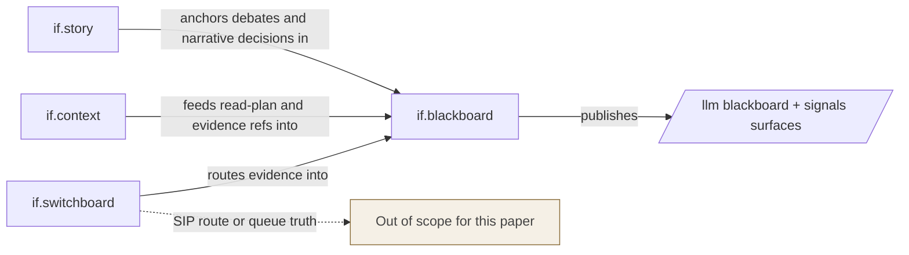

# if.blackboard Full Explainer v1.3 (Multi-Audience, Split-Boundary Strict)

- Generated UTC: 2026-03-06T08:06:36Z
- Task ref: IF-2348
- Authoring basis: latest resolved `if.whitepapers.bible` pointer verified `ok=true`
- Resolved bible: `{$path}/2266-if-whitepapers-bible-v4.23-2026-03-02T120500Z.md`
- Canonical product id: `if.blackboard`
- Legacy alias retained: `if.tasks`
- Status: `preview`
- Runtime state: `active_internal`
- Usage posture: `high_internal`
- Publication class: dense standalone explainer for executives, operators, engineers, and external reviewers
- Scope rule: this paper is canonical for blackboard-owned coordination evidence only

## Checkpoint Pass Criteria

This section makes the publish gate explicit before the narrative begins.

- `MET`: hard split from switchboard/SIP claims is explicit and repeated.
- `MET`: current-state numbers come from a fresh 2026-03-06 evidence bundle with direct counts.
- `MET`: claim register separates proven, bounded, and non-claims.
- `MET`: public reviewer packet is no-login and one-URL-per-line.
- `PENDING`: stronger cryptographic language remains blocked until signals verification mode is stricter than `report`.
- `PENDING`: some operational debt queues remain non-zero and are treated as active findings, not hidden exceptions.

*These checkpoint bullets matter because they define what is allowed to count as “done” for this explainer and what still blocks stronger language.*

## Who | Why | What | Where | When | How

This section states the audience, motive, object, surfaces, time boundary, and method in one place.

- Who: executives deciding trust language, operators keeping coordination continuity alive, engineers maintaining writer and render paths, and external reviewers evaluating whether the surface is auditable without login.
- Why: older blackboard docs split into two failure modes at once, with `713` compressing away module-specific depth and `2341` restoring boundary discipline but not restoring full standalone density.
- What: a new dense standalone explainer for `if.blackboard` that preserves the split boundary while recovering the substantive runtime, recovery, debt, and reviewer detail that procurement and technical governance readers actually need.
- Where: the canonical product path, the public `/llm/blackboard/**` and `/llm/signals/**` surfaces, `{$path}/if.registry.json`, and the fresh evidence bundle under `{$path}/tmp/if_blackboard_groundup_20260306T080414Z/`.
- When: as of `2026-03-06T08:04:14Z` for the current-state numbers in this paper, with each live surface carrying its own render timestamp.
- How: registry-first identity control, split-boundary enforcement, ground-up public-surface recheck, store hash snapshots, curated graph edges, and five-lane review inputs folded into one coherent claim boundary.

*If a standalone explainer cannot tell a reviewer what belongs to blackboard and what does not, it is not a safe explainer.*

## Problem Statement

This section names the exact fidelity problem the new standalone explainer must solve.

- `if.blackboard` is easy to over-praise for the wrong reasons.
- The module has visible public surfaces, active internal use, and a mature append-only coordination model.
- Those strengths create a temptation to describe it as the whole InfraFabric coordination stack.
- That temptation is exactly where fidelity was lost in `713`.
- When blackboard absorbs SIP delivery language, route semantics, or “guaranteed message delivery” phrasing, the document becomes less accurate even if it sounds more impressive.
- When the split memo removes that overreach but does not restore runtime and operator detail, the document becomes accurate but too thin to support a serious review.
- The new standalone explainer therefore has one job above all others: recover density without reintroducing scope drift.

*The real failure mode is not a missing sentence; it is a document that quietly teaches the reader the wrong module boundary.*

## Goal

This section states the minimum questions a skeptical reader should be able to answer after one pass.

- Give a skeptical reader enough dense, bounded, no-login evidence to answer four questions without private clarification.
- Question one: is `if.blackboard` live and materially used right now.
- Question two: what does the module prove by itself, without borrowing truth from `if.switchboard`, `if.context`, `if.gov`, or `if.trace`.
- Question three: what active debt or risk remains visible on the surface and inside the local append-only stores.
- Question four: what exactly would need to change before stronger language would become honest.

*A good explainer lowers ambiguity; it does not outsource it to a follow-up call.*

## Execution-Time Model

This section separates runtime motion, publication freshness, and reviewer timing.

- Runtime clock: the append-only ledgers and derived `/llm` surfaces move continuously as events are appended and rendered.
- Publication clock: this explainer is only as fresh as the last explicit evidence capture named in it.
- Reviewer clock: a reviewer should be able to fetch the current public surfaces in minutes, but should never be forced to infer historical continuity from one point-in-time fetch.
- Claim rule: this paper follows the weakest-evidence rule, so any statement tied to current liveness is explicitly timestamped.
- Freshness rule: public surface and gate-status claims in this revision are bound to the 2026-03-06 evidence capture unless a public surface includes a newer `Generated (UTC)` line that the reviewer can see directly.
- Release rule: stronger future wording requires a new capture, not a verbal assurance.

*A current-state claim without a clock is just a confident sentence.*

## Registry-Bound Identity and Status

This section binds the explainer to the canonical product row so names and status cannot drift.

- Canonical product id: `if.blackboard`.
- Legacy alias: `if.tasks`.
- Kind: `module`.
- Canonical path: `/if/blackboard`.
- Current registry status: `preview`.
- Current runtime state: `active_internal`.
- Current usage posture: `high_internal`.
- Status detail in the registry is already dense enough to be worth repeating rather than paraphrasing loosely.
- Registry detail says the module is a preview with live derived `/llm/blackboard/**` and `/llm/signals/**` surfaces under active internal coordination load.
- Registry detail also says canonical edits append to a local JSONL store via writer tooling.
- Registry detail explicitly refuses to claim multi-host runtime.
- That refusal matters because it prevents the common “single host looks stable, therefore fleet-ready” overread.

Public registry-aligned surfaces:
https://infrafabric.io/llm/blackboard/index.md.txt
https://infrafabric.io/llm/blackboard/tasks.open.md.txt
https://infrafabric.io/llm/blackboard/tasks.sessions.md.txt
https://infrafabric.io/llm/blackboard/tasks.search.md.txt
https://infrafabric.io/llm/blackboard/tasks.search.json.txt
https://infrafabric.io/llm/session-state.md.txt
https://infrafabric.io/llm/task-board.md.txt
https://infrafabric.io/llm/platform/if-blackboard/index.md.txt
https://infrafabric.io/llm/platform/if-tasks/index.md.txt
https://infrafabric.io/llm/platform/if-tasks/2026-01-19-v6.4/index.md.txt
https://infrafabric.io/llm/platform/if-tasks/changelog.md.txt
https://infrafabric.io/llm/signals/index.md.txt

*Identity drift is not a cosmetic problem in a trust product; it is the start of claim drift.*

## Canonical Publication Boundary

This section draws the hard in-scope versus out-of-scope line for blackboard claims.

This paper is canonical for `if.blackboard` scope only.

- Canonical in-scope: append-only task, signal, and session coordination stores and the no-login derived views published under `/llm/blackboard/**` and `/llm/signals/**`.
- Canonical in-scope: controlled-writer mutation discipline, deterministic rendering, queue-state debt surfaces, task-session joins, and machine-readable search export.
- Canonical in-scope: project-thread linkage as a blackboard readiness mechanism because it is rendered into blackboard-owned feeds.
- Canonical out-of-scope: SIP call mechanics, queue drain semantics, route selection, delivery timings, attestation transport behavior, and endpoint registration semantics.
- Canonical out-of-scope: any statement whose truth depends on switchboard being correct at the protocol level.
- Split rule: if a sentence would become false the moment SIP delivery semantics changed while blackboard ledgers remained intact, that sentence does not belong here.
- Import rule: case studies and unified explainers may be mined for blackboard-owned facts, but any switchboard-owned sentence must be dropped or rewritten.

*This boundary is the mechanism that lets the standalone explainer regain density without stealing other modules’ truth.*

## Claim Boundary

This section splits current truth into proven, bounded, and non-claim language.

### Proves now

- Public blackboard and signals surfaces are live and fetchable with no login.
- Public queue-state debt surfaces are separate, legible, and materially populated.
- Local canonical stores for tasks, sessions, and signals exist as append-only JSONL files with stable point-in-time hashes.
- The registry still binds `if.blackboard` to preview status and active internal usage.
- Signals publish a surface-wide verification-mode banner, so the module discloses its current signature posture instead of leaving readers to infer it.
- A machine-readable search catalog exists and currently exports the same total task count as the task-session join surface.
- Blackboard is the coordination evidence sink for work that other modules route, retrieve, or narrate.

### Bounded claims only

- Signals and project-thread patterns are operationally meaningful and documented, but not yet strong enough to justify “universally enforced” language.
- Publish-and-verify discipline is specified and usable, but this explainer does not assume every historical release followed it perfectly.
- Cross-session handshakes can be reconstructed from blackboard evidence, but this does not mean every future handoff will be equally clean.

### Non-claims

- No claim of exactly-once message delivery.
- No claim of SIP routing or queue correctness.
- No claim of certification, SLA, or compliance readiness.
- No claim that `report` verification mode is equivalent to strict fail-closed verification.
- No claim that local JSONL append-only files imply immutability or multi-host durability.
- No claim that visible debt queues are small enough to ignore.

*The difference between a credible preview and a misleading story is almost always the quality of the non-claims section.*

## Document Navigation by Audience

This section gives each audience a deliberate reading path instead of a wall of undifferentiated detail.

|Audience|Read first|Core question|
|---|---|---|
|Executives / Business Leaders|Executive Decision Surface; Public Surface Inventory; Open Findings Register; External Reviewer Packet|Can we trust the module boundary and current posture enough to evaluate it seriously?|
|Power Users / Operators|Operational Runbook View; Negative Verification Tests; Current Runtime Snapshot|How do we keep the board useful and safe during normal work, lag, and outages?|
|Engineers / Implementers|Implementation View; Runtime Contract View; Signals Model; Task Ledger Model|What is actually built, where are the edges, and what must stay fail-closed?|
|LLM Runtime Developers|Project Threads and Context Packs; Session Ledger and SID Hygiene; Discovery and Search Layer|How should agents consume the board without overreaching?|
|External reviewers|Claim Boundary; Evidence Hierarchy; Appendix B; Appendix C|What can I fetch, verify, and conclude without private access?|

*A multi-audience explainer is not longer because it repeats itself; it is longer because each audience has a different failure mode.*

## System Diagram

This section shows the private-ledger, renderer, and public-surface flow without borrowing switchboard truth.

```mermaid
flowchart TD
  W[Worker or operator intent] --> CW[Controlled writer or writer CLI]
  CW --> TS[Tasks events JSONL]
  CW --> SS[Sessions events JSONL]
  CW --> SG[Signals events JSONL]
  TS --> RT[Deterministic task renderers]
  SS --> RS[Deterministic session renderers]
  SG --> RG[Deterministic signal renderers]
  RT --> L1[/llm/blackboard/tasks.*]
  RS --> L2[/llm/session-state.md.txt]
  RG --> L3[/llm/signals/index.md.txt]
  L1 --> R[Reviewer or agent GET fetch]
  L2 --> R
  L3 --> R
```

```text
worker or operator action
  -> controlled writer / writer CLI
  -> append-only private ledgers
  -> deterministic renderers
  -> public text-first /llm views
  -> reviewer or agent fetch
```

Boundary diagram:



*The system diagram is here to reduce category errors, not to impress anyone with boxes.*

## Current Runtime Snapshot

This section records the exact point-in-time bundle used for current-state statements in this paper.

- Ground-up bundle generated UTC: `2026-03-06T08:04:14Z`.
- Resolved bible verify result: `ok=true`.
- Evidence capture method: direct public fetches for live surfaces, direct local hash snapshot for append-only stores, and curated graph-edge extraction for module relationships.
- Why a new bundle was needed: the older 2026-03-06 ground-up bundle mixed trustworthy public captures with parser-derived counters that contradicted the feeds themselves.
- Current bundle rule: only direct counts and direct hashes are used here.

### Point-in-time store snapshot

- `sessions_events` path: `{$path}/.if_tasks/blackboard/sessions.events.jsonl`.
- `sessions_events` line_count: `4058`.
- `sessions_events` size_bytes: `3775296`.
- `sessions_events` sha256: `ec9024857fd26f6e0fa6ba3436efbab54129e89e6c9a1bab178704b334a4f7ce`.

- `signals_events` path: `{$path}/.if_tasks/signals/signals.events.jsonl`.
- `signals_events` line_count: `9422`.
- `signals_events` size_bytes: `10368744`.
- `signals_events` sha256: `b03f5ce5eafcd601fddc60ef287b104f04f68e55650e27c43c1818dc25d9805e`.

- `tasks_events` path: `{$path}/.if_tasks/blackboard/tasks.events.jsonl`.
- `tasks_events` line_count: `5579`.
- `tasks_events` size_bytes: `11069519`.
- `tasks_events` sha256: `572d6e3797683cde4cefbc748ffd497a05da92eef94c4cdf3574f202808fc599`.

### Current live-surface summary

- `by_product_if_blackboard` generated_utc: `2026-03-06T08:03:59Z`.

- `signals_index` generated_utc: `2026-03-06T08:03:59Z`.
- `signals_index` rows: `1202`.
- `signals_index` signature_verification_mode: `report`.

- `tasks_done_missing_evidence` generated_utc: `2026-03-06T08:03:59Z`.
- `tasks_done_missing_evidence` rows: `73`.

- `tasks_open` generated_utc: `2026-03-06T08:03:59Z`.
- `tasks_open` rows: `222`.

- `tasks_open_missing_context` generated_utc: `2026-03-06T08:03:59Z`.
- `tasks_open_missing_context` rows: `32`.

- `tasks_open_missing_dod` generated_utc: `2026-03-06T08:03:59Z`.
- `tasks_open_missing_dod` rows: `34`.

- `tasks_open_ready` generated_utc: `2026-03-06T08:03:59Z`.
- `tasks_open_ready` rows: `176`.
- `tasks_open_ready` format: `bullet_if`.

- `tasks_open_with_context` generated_utc: `2026-03-06T08:03:59Z`.
- `tasks_open_with_context` rows: `190`.
- `tasks_open_with_context` format: `bullet_if`.

- `tasks_sessions` generated_utc: `2026-03-06T08:03:59Z`.
- `tasks_sessions` rows: `2188`.

- `tasks.search.json` schema_version: `if.blackboard.task_search.v1`.
- `tasks.search.json` tasks_total: `2188`.
- `tasks.search.json` entries: `2188`.

*A snapshot is useful precisely because it is narrow; the mistake is pretending a narrow snapshot answered a wider question.*

## Public Surface Inventory and Queue-State Metrics

This section turns the live feeds into reviewer-readable state rather than raw counts only.

### Surface-by-surface interpretation

#### `tasks_open`

- Role: Primary open queue.
- Generated (UTC): `2026-03-06T08:03:59Z`.
- Current rows: `222`.
- What it means: Current queue visibility for all open tasks.
- What it does not mean: A populated open queue is evidence of live coordination load, not quality or readiness.

#### `tasks_open_ready`

- Role: Ready queue.
- Generated (UTC): `2026-03-06T08:03:59Z`.
- Current rows: `176`.
- Render format note: `bullet_if`.
- What it means: Tasks rendered ready for pickup.
- What it does not mean: This is a render-time classification, not proof of strong execution safety.

#### `tasks_open_with_context`

- Role: Context-bound queue.
- Generated (UTC): `2026-03-06T08:03:59Z`.
- Current rows: `190`.
- Render format note: `bullet_if`.
- What it means: Tasks linked to context packs/project threads.
- What it does not mean: This proves linkage, not context adequacy.

#### `tasks_open_missing_context`

- Role: Missing-context stop queue.
- Generated (UTC): `2026-03-06T08:03:59Z`.
- Current rows: `32`.
- What it means: Tasks that should stop until context is supplied.
- What it does not mean: This proves debt visibility, not universal downstream enforcement.

#### `tasks_open_missing_dod`

- Role: Missing-DoD stop queue.
- Generated (UTC): `2026-03-06T08:03:59Z`.
- Current rows: `34`.
- What it means: Tasks lacking explicit acceptance bullets.
- What it does not mean: This proves debt visibility, not full agent obedience.

#### `tasks_done_missing_evidence`

- Role: Done-but-missing-evidence queue.
- Generated (UTC): `2026-03-06T08:03:59Z`.
- Current rows: `73`.
- What it means: Recently closed tasks whose evidence links are incomplete.
- What it does not mean: This proves blackboard exposes closure debt instead of hiding it.

#### `tasks_sessions`

- Role: Task-session join queue.
- Generated (UTC): `2026-03-06T08:03:59Z`.
- Current rows: `2188`.
- What it means: Task snapshots joined to session ids in a pollable view.
- What it does not mean: This proves a join surface exists, not that every row is instantly current.

#### `signals_index`

- Role: Signals entrypoint.
- Generated (UTC): `2026-03-06T08:03:59Z`.
- Current rows: `1202`.
- Signature verification mode: `report`.
- What it means: Active blocker/help/escalation threads.
- What it does not mean: Current signature mode is report; do not overread cryptographic posture.

### Surface inventory table

|URL|HTTP|Why it matters|Claim boundary|
|---|---|---|---|
|https://infrafabric.io/if/blackboard/|review separately|Canonical product landing path.|Product identity and entrypoint only; not a proof of runtime guarantees by itself.|
|https://infrafabric.io/llm/blackboard/index.md.txt|200|Primary no-login blackboard index.|Proves live public surface, not write-path enforcement.|
|https://infrafabric.io/llm/blackboard/tasks.open.md.txt|200|Primary open-task feed.|Proves current queue visibility, not task readiness by itself.|
|https://infrafabric.io/llm/blackboard/tasks.open.ready.md.txt|200|Ready-to-pick queue.|Proves tasks were classified ready at render time, not that underlying work is complete.|
|https://infrafabric.io/llm/blackboard/tasks.open.with_context.md.txt|200|Tasks carrying context packs.|Proves linked context visibility, not context quality.|
|https://infrafabric.io/llm/blackboard/tasks.open.missing_context.md.txt|200|Safe-stop queue for missing context.|Proves debt visibility, not automated enforcement inside every worker.|
|https://infrafabric.io/llm/blackboard/tasks.open.missing_dod.md.txt|200|Safe-stop queue for missing acceptance criteria.|Proves debt visibility, not downstream behavioral compliance.|
|https://infrafabric.io/llm/blackboard/tasks.done.missing_evidence.md.txt|200|Recently closed tasks lacking evidence links.|Proves closure debt is exposed publicly.|
|https://infrafabric.io/llm/blackboard/tasks.sessions.md.txt|200|Task-to-session join surface.|Proves sid linkage visibility, not perfect session synchronization.|
|https://infrafabric.io/llm/blackboard/tasks.search.json.txt|200|Machine-readable search catalog.|Proves searchable export exists, not semantic ranking quality.|
|https://infrafabric.io/llm/signals/index.md.txt|200|Signals and blocker entrypoint.|Proves signal visibility and current signature mode banner.|
|https://infrafabric.io/llm/session-state.md.txt|200|Session ledger derived view.|Proves public session visibility, not absence of lag or stale rows.|

### Queue-state interpretation

- `tasks_open=222` tells us there is meaningful active work volume, not a toy or dormant board.
- `tasks_open_ready=176` tells us the board does separate a ready queue from the raw open queue.
- `tasks_open_with_context=190` tells us context-pack linkage is used heavily enough to matter operationally.
- `tasks_open_missing_context=32` tells us the system still exposes tasks that are unsafe to proceed on without more context.
- `tasks_open_missing_dod=34` tells us task acceptance discipline is materially present but not universal.
- `tasks_done_missing_evidence=73` tells us the system chooses to expose closure debt publicly rather than hide it.
- `tasks_sessions=2188` and `tasks_search_json.tasks_total=2188` tell us the current search export and task-session join surface agree on total object count.
- `signals_active_rows=1202` tells us the help/escalation channel is active enough that signature-mode wording matters right now, not hypothetically.

*The most useful thing about these counters is not that they look healthy; it is that they expose what is still unhealthy.*

## Why 713 Lost Fidelity

This section explains why the old standalone could not simply be reused as the dense reference.

- `617` was the best earlier standalone blackboard backbone because it held together executive framing, operator discipline, runtime contract detail, and explicit non-claims in one place.
- `713` got shorter, but the shortening came from the wrong places.
- It compressed or removed some blackboard-specific runtime and operator detail just as the surrounding system was becoming more coupled and easier to misunderstand.
- It also let more switchboard-adjacent language slip into the standalone blackboard story.
- `2341` corrected the boundary, but did so in memo form rather than in full multi-audience form.
- The result was a split between accuracy and density when the reader needed both.

### Specific fidelity losses to restore

- Operator recovery posture moved from first-class standalone content to thin mention.
- Runtime contract depth became thinner, especially around what the public surface proves versus what the private append-only ledgers prove.
- Debt surfaces remained visible in the product but were no longer foregrounded as trust-shaping evidence in the narrative.
- Reviewer quickstart clarity became scattered across exec and split docs instead of living in one dense standalone entrypoint.
- Boundary discipline had to be reintroduced explicitly because the unified system docs were swallowing blackboard-owned language.

*Shorter is only better when the deleted lines were noise; here, some of the deleted lines were the point.*

## Restoration Method

This section makes the rebuild method visible so the new density can be audited, not just accepted.

- This revision was rebuilt from the ground up rather than edited in place from `713` or stretched out from `2341`.
- The decision was deliberate.
- `713` was too compressed and boundary-soft.
- `2341` was boundary-correct but memo-thin.
- `617` provided the best standalone backbone.
- `195` provided the strongest short reviewer packet cues.
- `196` restored deep architecture, degraded mode, and recovery posture.
- `197` restored appendix discipline and source-map expectations.
- `171` and `172` restored the context-pack contract.
- `153` restored blocker and escalation semantics.
- `130` restored release anti-drift expectations.
- `360` restored cross-session reconstruction detail.
- The fresh 2026-03-06 bundle replaced stale or contradictory counters with direct counts and direct hashes.
- The curated graph subset kept relationship language concise without importing noisy mention-level edges.
- The five review lanes then shaped the final boundary and findings language.

*The point of rebuilding from the ground up was not to make a longer file; it was to make a truer one.*

## Architecture Overview

This section restates the ledgers-first architecture in blackboard-owned terms only.

- Blackboard is not a dashboard-first system.
- Blackboard is ledgers-first, renderer-second, public-surface-third.
- That order matters because it prevents the UI from becoming the source of truth.
- Private canonical state lives in append-only JSONL stores.
- Public state is derived deterministically into text-first feeds that restricted environments can fetch.
- Controlled writers mutate canonical state.
- Untrusted workers and operators can propose, signal, or claim through defined writer paths, but they do not silently edit public state in place.
- Derived feeds are intentionally small and pollable.
- Search export exists because machines need one machine-readable surface, but the explainer still centers the human-readable text surfaces because those are what constrained reviewers actually inspect.
- Session-state exists because agent work without visible `sid` linkage quickly becomes unreconstructable.
- Signals exist because blockers and escalation must survive private session churn.
- Project threads exist because an open task without a context pack is a trap for zero-context execution.

### Private canonical state

- `tasks.events.jsonl` is the append-only canonical task ledger.
- `sessions.events.jsonl` is the append-only session ledger.
- `signals.events.jsonl` is the append-only signal ledger.
- These ledgers are private, not because they are unimportant, but because publishing raw ledgers would leak more than a reviewer needs.
- The public contract is the derived surface plus the ability to re-derive and hash-check those surfaces.

### Public derived state

- `/llm/blackboard/index.md.txt` is the entrypoint for the human reader.
- `/llm/blackboard/tasks.open.md.txt` is the coarse active work queue.
- `/llm/blackboard/tasks.open.ready.md.txt` is the narrow go-list.
- `/llm/blackboard/tasks.open.with_context.md.txt` is the context-bound go-list.
- `/llm/blackboard/tasks.open.missing_context.md.txt` is an explicit stop-list.
- `/llm/blackboard/tasks.open.missing_dod.md.txt` is another explicit stop-list.
- `/llm/blackboard/tasks.done.missing_evidence.md.txt` is a closure debt list.
- `/llm/blackboard/tasks.sessions.md.txt` is the task-to-session join view.
- `/llm/signals/index.md.txt` is the blocker and escalation entrypoint.
- `/llm/session-state.md.txt` is the session visibility surface.

### Why this architecture matters under hostile constraints

- Many sandboxes can fetch text but not log in.
- Many strict reviewers refuse proprietary dashboards.
- Many agents can poll a small text surface more reliably than they can keep a websocket alive.
- A board that only exists inside privileged sessions stops existing the moment the author goes offline.

*The architecture is intentionally boring in the places where boredom is what survives audits.*

## Task Ledger Model

This section explains why task state is append-only and why safe-go versus safe-stop matters.

- The canonical task record is a snapshot event, not an editable row.
- Minimum task identity still starts with `IF-###` because human operators need a stable handle.
- Priority, pillar, summary, status, owner, started UTC, done UTC, working set, acceptance, and result remain the core fields.
- The standalone story now needs one additional emphasis: derived surfaces expose safe-go and safe-stop state, not just “open” versus “done”.
- That distinction is not decorative.
- It is what lets an autonomous or semi-autonomous worker tell the difference between “work exists” and “work is safe to start”.

### Task-state categories that matter operationally

- `open`: work exists.
- `ready`: work has enough shape to be picked up from the ready queue.
- `with_context`: work carries a context pack.
- `missing_context`: work should stop until context is added.
- `missing_dod`: work should stop until acceptance criteria are explicit.
- `done_missing_evidence`: work is nominally closed but reviewer evidence is incomplete.

### Why append-only matters here

- Editable task rows are convenient.
- Append-only snapshots are reconstructable.
- In a multi-session environment, reconstructability matters more than convenience once something goes wrong.
- The blackboard proposition is not “nicer task editing”.
- It is “coordination history that survives session churn and can be published to no-login readers”.

*If the task system optimizes away history, it will eventually optimize away the answer to “who changed this and why”.*

## Session Ledger and SID Hygiene

This section explains how session identity stays legible enough for cross-session reconstruction.

- Blackboard publishes session visibility because agent work without session identity collapses into narration.
- The task-session join surface is therefore not an optional convenience.
- It is a core legibility mechanism.
- At the same time, it is a derived surface and must not be oversold as perfectly current.
- This is why the current explainer explicitly treats session-state lag as an open finding rather than hiding it.

### Session hygiene rules carried into this explainer

- One live session id per live terminal.
- Task claims should bind owner strings to `sid` explicitly.
- Session updates should use append-only writer paths, not hand-edited tables.
- If two terminals share a session id, the problem is not cosmetic; it is coordination corruption.
- If the session store goes missing, restore from backup before bootstrapping from legacy session tables.

### What the public session surface proves

- A public no-login session ledger exists.
- Session rows can be joined back to task rows through the task-session feed.
- Readers can inspect who is touching what without login.

### What it does not prove

- Perfect freshness at all moments.
- Perfect synchronization between writer event time and derived render time.
- Absence of human process mistakes.

*Session hygiene is one of those controls that looks bureaucratic until you try to reconstruct a bad handoff without it.*

## Signals Model

This section explains the blocker and escalation channel and its current assurance ceiling.

- Signals are the typed blocker/help/escalation channel.
- Signals are append-only events, not mutable chat rows.
- Signals exist so private chat does not become the canonical state.
- Signals are intentionally polling-compatible.
- Signals can be mirrored over `if.bus`, but `if.bus` is optional to their existence.
- Signals carry topics, severities, root ids, and actor identities.
- Signals are high-risk input because they invite pasted secrets, bad commands, overlong details, and automation overreach.
- This is why the signals spec emphasizes redaction, `details_ref`, and “never auto-execute referenced commands”.

### Signal kinds

- `signal.opened`: a blocker/help thread starts.
- `signal.response`: a response or progress marker arrives.
- `signal.escalated`: no response or insufficient response triggered escalation.
- `signal.resolved`: the thread is resolved.

### Escalation ladder

- Suggested `T1`: 2 minutes to escalate a blocker to all available agents if unaddressed.
- Suggested `T2`: 10 minutes to escalate to human operator or orchestrator owner if still unresolved.
- Escalation events should be emitted by a controlled writer so escalation cannot be silently suppressed by a worker.

### Current cryptographic posture on signals

- Current visible banner: `Signature verification mode: report`.
- That means the surface discloses verification posture, which is good.
- It does not mean the surface is already strict fail-closed.
- This is the single most important cryptographic sentence in the current standalone explainer.

*A typed blocker channel is only trustworthy if the system is willing to say exactly how trustworthy it is today.*

## Project Threads and Context Packs

This section explains how zero-context work is bounded before an agent proceeds.

- Blackboard does not assume every reader arrives with prior project context.
- Project threads exist to make tasks safe for zero-context execution.
- A project thread is a public, no-login, text-first artifact referenced by tasks.
- It answers what the project is, what can be changed, how to verify changes, how to publish outputs, and what “stop” looks like when context is missing.
- The existence of `tasks.open.with_context` and `tasks.open.missing_context` proves that the system treats context as a first-class coordination control rather than a courtesy.

### Minimum project-thread contract

- Title plus scope.
- Working-set boundaries.
- Environment assumptions.
- Verification commands.
- Publish targets and reviewer URLs.
- Failure posture.

### Context-pack posture today

- High enough usage to matter, because 190 tasks currently appear in the with-context queue.
- Not universal, because 32 tasks still appear in the missing-context queue.
- Therefore honest language is “deployed as a meaningful mechanism with visible debt”, not “fully solved”.

*A task without context is not a small documentation problem; it is a coordination hazard that the product is right to expose publicly.*

## Discovery and Search Layer

This section explains the machine-readable catalog without overclaiming search quality.

- Blackboard now publishes a machine-readable search export under `tasks.search.json.txt`.
- This matters because not every consumer is human.
- But the current standalone explainer keeps the search export in a bounded role.
- It proves a machine-readable catalog exists.
- It proves the catalog is large enough to matter at current scale.
- It does not prove semantic search quality.
- It does not prove ranking quality.
- It does not prove cross-field retrieval correctness.

Current search export facts:
- `schema_version=if.blackboard.task_search.v1`.
- `tasks_total=2188`.
- `entries=2188`.
- Search total currently matches the task-session join row count, which is a useful consistency signal.

*Search is useful here as an export surface; it becomes dangerous only when people start treating ranking quality as already proven.*

## Cross-Module Boundary and Graph View

This section uses curated graph edges to show relationship shape without importing upstream guarantees.

- The curated graph patch gives us a compact, boundary-safe relation view for blackboard.
- We use it because the full knowledge graph contains too many mention-level edges to be readable in a standalone explainer.
- The curated subset is small enough to audit line by line.

- `product:if.switchboard` -> `product:if.blackboard` (`product_depends_on`): switchboard routes coordination evidence into append-only blackboard store.
- `product:if.context` -> `product:if.blackboard` (`product_depends_on`): context read-plan and evidence operations feed blackboard records/signals.
- `product:if.story` -> `product:if.blackboard` (`product_depends_on`): narrative decisions and debates are anchored as blackboard events/signals.

### How to read these edges

- `if.switchboard -> if.blackboard` means routed coordination evidence lands in blackboard-owned ledgers and surfaces.
- It does not mean blackboard owns switchboard delivery semantics.
- `if.context -> if.blackboard` means read-plan and evidence operations create blackboard-visible records and signals.
- It does not mean blackboard owns retrieval logic.
- `if.story -> if.blackboard` means narrative decisions and debates are anchored here as events or signals.
- It does not mean blackboard owns story-layer logic.
- The graph therefore reinforces the module’s role as a coordination evidence sink.
- It does not authorize the module to claim the runtime guarantees of its upstream feeders.

*The graph helps because it shows relationship shape without tempting us to inherit upstream guarantees.*

## Executive Decision Surface

This section compresses the current posture into approve, defer, and block decisions.

### One-page answer

`if.blackboard` is a credible preview coordination surface with strong no-login reviewability, meaningful current usage, explicit debt visibility, and disciplined module boundaries, but it is not yet a module that should speak in strict cryptographic, SLA, or certification language.

|Claim id|Decision question|Current status|Tier|Main evidence|
|---|---|---|---|---|
|C-01|The public blackboard index is live and publicly reachable.|proven_now|A|HTTP 200 on /llm/blackboard/index.md.txt.|
|C-02|The public open-task feed is live and populated.|proven_now|A|HTTP 200 plus 222 rows on tasks.open.|
|C-03|A ready queue exists as a distinct derived surface.|proven_now|A|176 bullet rows on tasks.open.ready.|
|C-05|Missing-context tasks are exposed publicly.|proven_now|A|32 rows on tasks.open.missing_context.|
|C-10|Signals are visible publicly and include verification-mode metadata.|proven_now|A|signals.index shows Signature verification mode: report.|
|C-11|Canonical task, session, and signal stores are append-only local JSONL files with stable hashes at the checked instant.|proven_now|B|Store snapshot line counts and sha256 values.|
|C-12|if.blackboard remains preview, active_internal, high_internal in the registry.|proven_now|A/B|Registry row in if.registry.json plus public surfaces.|
|C-13|if.blackboard owns append-only coordination evidence, not SIP delivery mechanics.|proven_now|A/B|Split memo plus registry and curated graph edges.|
|C-18|Strict signature verification is universally enforced today.|non_claim|N/A|Blocked by signals mode report and older open findings.|
|C-19|if.blackboard guarantees message delivery.|non_claim|N/A|Out of scope; belongs to switchboard if proven there.|
|C-20|if.blackboard is certification-ready.|non_claim|N/A|Unsupported by current evidence.|

### Approve / defer / block

- Approve: preview language for append-only coordination evidence, public no-login surfaces, visible debt queues, and active internal usage.
- Defer: any stronger language about strict signature enforcement, compliance posture, or fleet-grade runtime guarantees.
- Block: phrases like “guaranteed delivery”, “certification-ready”, “production-complete”, or “strictly enforced end to end”.

*The boardroom question is not whether the product sounds good; it is whether the strongest sentence in the deck is still true after the weakest gate is read out loud.*

## Operational Runbook View

This section translates the module boundary into concrete operating and recovery rules.

### Core operating rule

- If evidence weakens, downgrade wording before changing anything else.
- If blackboard and its fallback are unreachable, stop rather than improvise state.
- If a task appears in missing-context or missing-DoD, treat it as a safe-stop signal, not a suggestion.
- If a signal thread opens with blocker severity and does not receive a response within ladder timing, escalate deterministically.
- If a writer or render path is suspect, prefer backup-first restore and re-render over hand edits to derived views.

### Fast liveness checks

- `https://infrafabric.io/llm/blackboard/index.md.txt` -> should return `200`.
- `https://infrafabric.io/llm/blackboard/tasks.open.md.txt` -> should return `200`.
- `https://infrafabric.io/llm/signals/index.md.txt` -> should return `200` and show a verification mode banner.
- `https://infrafabric.io/llm/task-board.md.txt` -> legacy fallback should return `200` if blackboard feeds are down.

### Degraded mode

- If `/llm/blackboard/**` is unreachable, fall back to legacy `/llm/task-board.md.txt`.
- If both are unreachable, stop. Do not claim tasks from memory. Do not invent missing state. Emit or request an ops signal and run the canary.
- If signals are reachable but blackboard feeds lag, keep coordination tied to append-only signal events and wait for the next render cycle.

### Restore sequence

1. Snapshot the current blackboard store backup-first.
2. If the blackboard store is missing or empty, bootstrap from the legacy taskboard snapshot only through the controlled script path.
3. Render the taskboard from the store again.
4. Refresh `/llm`.
5. Re-run link checks and surface fetches.

### Rollback sequence

1. Roll back the claim language in public docs and reviewer packets.
2. Roll back derived views or republish the previous stable snapshot.
3. Restore the canonical store from backup if corruption is confirmed.
4. Re-render and verify.

### Why the runbook matters

- The product promise is not “nobody ever makes a mistake”.
- The promise is “mistakes and debt remain visible, and recovery has a deterministic path”.

*Operations gets safer when the recovery path is more boring than the incident.*

## Implementation View

This section summarizes the implementation slices that matter for reviewers and maintainers.

### Product identity

- `product_id=if.blackboard`.
- `brand=if.blackboard`.
- `kind=module`.
- `aliases=if.tasks.`
- `path=/if/blackboard`.
- `slug=if-blackboard`.
- `bundle_slug=if-blackboard-demo-bundle`.

### Implementation slices that matter

- Writer tooling.
- Append-only private ledgers.
- Deterministic renderers.
- Public no-login `/llm` feeds.
- Context-pack linkage.
- Signals and escalation path.
- Search export.

### Controlled-writer boundary

- The implementation assumption is that workers are untrusted writers.
- Controlled writers append canonical events and publish derived views.
- This is why path prewrite checks and writer boundary hardening matter so much in the open findings register.
- If workers could edit canonical state arbitrarily, blackboard would stop being an archive and become a shared hallucination.

### Deterministic rendering requirement

- Given the same canonical inputs, the derived outputs must be byte-stable.
- Stable sort order matters.
- Stable UTC formatting matters.
- Stable whitespace matters.
- Release metadata should be the only place current generation time appears.

### Why public text-first remains the contract

- HTML can be added.
- JSON can be added.
- But the core review contract remains the text-first no-login view because that is what the strictest reviewer and the most constrained agent can still fetch.

*The implementation is easier to reason about when the canonical question is “what bytes would the reviewer fetch right now?”*

## Runtime Contract View

This section states what consumers can rely on and what they must refuse to infer.

### Core runtime contract

- Inputs arrive through controlled writer tooling or equivalent append paths.
- Canonical task, session, and signal state is append-only.
- Public feeds are derived from those ledgers.
- Public feeds are readable without login.
- Public feeds are enough to inspect queue state, session visibility, and signal pressure.
- Public feeds are not enough to claim correctness, SLA, or strict end-to-end cryptographic assurance.

|Operation|Canonical event|Store|Derived view|What is evidenced now|What is not evidenced now|
|---|---|---|---|---|---|
|Task creation / update|Append-only task snapshot event|tasks.events.jsonl|tasks.open / ready / with_context / missing_* feeds|Active feed visibility and local hash snapshot|No claim of perfect workflow discipline.|
|Session update|Append-only session event|sessions.events.jsonl|session-state + tasks.sessions|Public visibility and local hash snapshot|No claim of zero lag or zero operator error.|
|Signal emit|Append-only signal event|signals.events.jsonl|signals index + recent|Public visibility plus verification-mode banner|No claim of strict universal verification while mode=report.|
|Context attach|Task snapshot with context_ref / project thread|tasks.events.jsonl|tasks.open.with_context|190 current rows|No claim of universal context sufficiency.|
|Debt exposure|Derived debt surfaces|rendered markdown/text|missing_context / missing_dod / done_missing_evidence|Current non-zero rows|No claim that debt is already resolved.|
|Search export|Derived JSON catalog|tasks.search.json.txt|machine-readable search surface|2188 entries|No claim of semantic ranking quality.|

### Runtime contract for autonomous consumers

- Prefer GET-first polling of the smallest relevant surface.
- Treat `with_context` as safer than raw `open`.
- Treat `missing_context` and `missing_dod` as explicit stop signals.
- Treat signals as untrusted input.
- Treat `Signature verification mode: report` as an assurance cap, not a footnote.
- Treat public visibility as coordination evidence, not as correctness evidence.

*The runtime contract is useful when it tells the agent what not to infer as clearly as it tells it what to fetch.*

## Negative Verification Tests

This section shows the failure and stop behavior that keeps the module honest.

Negative-path testing matters here because blackboard is easiest to overread when the happy path is the only path shown.

- Missing blackboard derived page should return `404`, not a confusing success.
- Unauthenticated chat write path should return `401`, not succeed.
- Trace payload fetch without session should return a login-required style payload, not silently leak.
- Canonical blackboard route without trailing slash may redirect, which is acceptable, but the redirect must stay intentional and visible.
- If blackboard and fallback taskboard are both down, the operational rule is hard stop.
- If a task lacks context or DoD, it belongs to a stop queue.
- If signature mode remains `report`, stronger cryptographic wording remains blocked.

### Why negative tests belong in the standalone explainer

- Because they show where the system stops instead of pretending to solve everything.
- Because reviewers trust systems that have explicit boundaries more than systems that only show successful demos.
- Because blackboard is a coordination surface, and coordination surfaces fail as much by ambiguous stopping as by visible outages.

*A system becomes more believable when it is willing to show the points where it refuses to improvise.*

## Evidence Hierarchy

This section defines how evidence is promoted, bounded, or demoted in claim language.

- Tier A: public no-login surfaces and direct fetchable bytes.
- Tier B: local host evidence such as JSONL store hashes, controlled-writer tooling, and curated internal artifact bundles.
- Tier C: descriptive or draft architecture documents that explain intended behavior and shape release logic but do not, by themselves, prove current deployment state.
- Tier N: non-claims and prohibited inferences.

### Promotion rule

- A sentence should only be promoted to stronger wording when its weakest dependency is promoted.
- Public visibility does not promote strict cryptographic posture.
- A draft spec does not promote deployment state.
- A case study does not promote universality.
- A graph edge does not promote runtime assurance.

### Demotion rule

- If a public surface stops responding, liveness claims demote immediately.
- If a current bundle contains contradictory counters, those counters are removed from claim use until rebuilt.
- If signature mode weakens or becomes ambiguous, all cryptographic-adjacent language demotes immediately.
- If queue debt rises or can no longer be rendered, “healthy coordination” wording demotes.

*Evidence hierarchy only matters when demotion is real and immediate, not rhetorical.*

## Open Findings Register

This section keeps the unresolved risks first-class instead of burying them in prose.

|Finding id|Severity|Finding|Why it matters|Status|Next action|Affected claim area|
|---|---|---|---|---|---|---|
|BB-F01|P0|Path-traversal or writer-abuse risk in controlled-writer boundary is not closed.|Use case: malicious path or ownership abuse invalidates derived views.|Open|Harden prewrite path gate, prove fail-closed behavior, rerun adversarial lane.|Writer boundary, public reviewer trust.|
|BB-F02|P0|Signature posture on signals remains report-mode, not strict fail-closed.|Reviewers can overread sig=verified rows as universal enforcement.|Open|Promote verification mode only after strict publish/read path validation is live.|Cryptographic assurance wording.|
|BB-F03|P1|Queue debt is materially non-zero: missing_context, missing_dod, done_missing_evidence.|Open work can look healthy unless debt queues are read with it.|Open|Keep debt counters top-line in reviewer packet and operational dashboards.|Operational discipline and reviewer clarity.|
|BB-F04|P1|Session-state surface can lag or drift from current task claims.|task-session join is useful but not a proof of perfect synchronization.|Open|Audit render cadence and session update discipline; expose lag caveat explicitly.|Cross-session trust and sid hygiene.|
|BB-F05|P1|Boundary drift into switchboard wording reappears whenever blackboard is described as the whole coordination system.|Older explainers folded SIP semantics into blackboard narrative.|Open|Keep split rule explicit in every release; reject SIP-dependent phrasing.|Module-fidelity and overclaim prevention.|
|BB-F06|P2|Project-thread coverage is high but not universal.|with_context feed exists, but missing_context is non-zero.|Open|Raise coverage and keep missing-context queue visible.|Autonomous safe-go contract.|
|BB-F07|P2|Search export exists, but ranking/semantic relevance is not independently evidenced here.|Machine-readable search is useful but bounded.|Open|Add search quality fixtures if stronger claims are needed.|External reviewer expectations.|

*The best thing about this register is not that it exists; it is that the most uncomfortable items are still in it.*

## Non-Claims

This section lists the strongest statements that must remain prohibited today.

- `if.blackboard` does not claim exactly-once delivery semantics.
- `if.blackboard` does not claim SIP queue or route correctness.
- `if.blackboard` does not claim endpoint attestation correctness.
- `if.blackboard` does not claim universal strict signature enforcement while signals verification mode remains `report`.
- `if.blackboard` does not claim multi-host runtime.
- `if.blackboard` does not claim immutable durability from Redis AOF.
- `if.blackboard` does not claim that visible work output is semantically correct.
- `if.blackboard` does not claim that project threads are universal yet.
- `if.blackboard` does not claim compliance or certification readiness.

*A module that cannot say “this is not my claim” will eventually make a claim that belongs to someone else’s evidence.*

## Release Language Guardrails

This section separates approved phrasing from blocked phrasing.

### Approved language

- “Append-only coordination evidence.”
- “No-login text-first review surfaces.”
- “Preview with active internal usage.”
- “Visible stop queues for missing context, missing DoD, and missing evidence.”
- “Signals publish current verification-mode metadata.”
- “Context packs are a safe-go mechanism with visible coverage debt.”

### Blocked language

- “Guaranteed delivery.”
- “Production-complete.”
- “Certification-ready.”
- “Strictly verified end to end.”
- “Immutable because append-only.”
- “Fleet-grade.”
- “Equivalent to switchboard runtime guarantees.”

*Release language is where products usually start lying to themselves first.*

## 30 / 60 / 90 Day Plan

This section links future work to claim promotion rather than vague ambition.

### Next 30 days

- Keep the split boundary explicit in every blackboard-facing explainer and packet.
- Treat signals verification mode `report` as a hard cap on cryptographic language.
- Keep debt counters in the reviewer packet header.
- Close the controlled-writer path-abuse finding or tighten the failure disclosure further.
- Audit session-state lag and sid-claim discipline.

### Next 60 days

- Strengthen project-thread coverage so with-context becomes a more complete go-list.
- Add stronger public evidence around release anti-drift discipline.
- Decide whether search export needs explicit quality fixtures or should remain bounded as an export surface only.
- Publish stricter proof of signals verification behavior if the runtime path changes.

### Next 90 days

- Re-evaluate whether preview is still the correct registry status.
- Only consider stronger language after strict verification, writer boundary hardening, and debt closure thresholds are proven in a new current-state bundle.
- Keep multi-host runtime out of scope unless real deployment evidence exists.

*A roadmap is useful here only if it is a map for claim promotion, not just a list of good intentions.*

## External Reviewer Packet

This section gives the exact no-login packet and the limits of what it proves.

A skeptical external reviewer should be able to fetch the following packet without credentials.

Primary packet URLs:
https://infrafabric.io/if/blackboard/
https://infrafabric.io/llm/blackboard/index.md.txt
https://infrafabric.io/llm/blackboard/tasks.open.md.txt
https://infrafabric.io/llm/blackboard/tasks.open.ready.md.txt
https://infrafabric.io/llm/blackboard/tasks.open.with_context.md.txt
https://infrafabric.io/llm/blackboard/tasks.open.missing_context.md.txt
https://infrafabric.io/llm/blackboard/tasks.open.missing_dod.md.txt
https://infrafabric.io/llm/blackboard/tasks.done.missing_evidence.md.txt
https://infrafabric.io/llm/blackboard/tasks.sessions.md.txt
https://infrafabric.io/llm/blackboard/tasks.search.json.txt
https://infrafabric.io/llm/signals/index.md.txt
https://infrafabric.io/llm/session-state.md.txt

What a reviewer can conclude from this packet now:
- The blackboard surfaces are live and populated.
- The system distinguishes ready work, context-bound work, missing-context work, missing-DoD work, and done-missing-evidence debt.
- Signals exist as a distinct blocker/help channel and publish their current verification mode.
- The machine-readable search export exists.
- The module still identifies itself as preview, not GA.

What a reviewer cannot conclude from this packet alone:
- Strict end-to-end cryptographic enforcement.
- SIP delivery guarantees.
- Compliance or certification readiness.
- Multi-host durability.
- Semantic correctness of work outputs.

*A reviewer packet earns trust by telling the reviewer exactly where the packet stops.*

## Appendix A: Verification Commands

This appendix records the actual commands a reviewer or maintainer can use to recheck the paper.

```bash
# Public liveness and freshness
for u in \
  https://infrafabric.io/llm/blackboard/index.md.txt \
  https://infrafabric.io/llm/blackboard/tasks.open.md.txt \
  https://infrafabric.io/llm/blackboard/tasks.open.ready.md.txt \
  https://infrafabric.io/llm/blackboard/tasks.open.with_context.md.txt \
  https://infrafabric.io/llm/blackboard/tasks.open.missing_context.md.txt \
  https://infrafabric.io/llm/blackboard/tasks.open.missing_dod.md.txt \
  https://infrafabric.io/llm/blackboard/tasks.done.missing_evidence.md.txt \
  https://infrafabric.io/llm/blackboard/tasks.sessions.md.txt \
  https://infrafabric.io/llm/blackboard/tasks.search.json.txt \
  https://infrafabric.io/llm/signals/index.md.txt; do
  curl -sS -L -o /dev/null -w "%{http_code} %{url_effective}\n" "$u"
done

# Current counters
curl -fsSL https://infrafabric.io/llm/blackboard/tasks.open.md.txt | rg -c "^\| IF-"
curl -fsSL https://infrafabric.io/llm/blackboard/tasks.open.ready.md.txt | rg -c "^- IF-"
curl -fsSL https://infrafabric.io/llm/blackboard/tasks.open.with_context.md.txt | rg -c "^- IF-"
curl -fsSL https://infrafabric.io/llm/blackboard/tasks.open.missing_context.md.txt | rg -c "^\| IF-"
curl -fsSL https://infrafabric.io/llm/blackboard/tasks.open.missing_dod.md.txt | rg -c "^\| IF-"
curl -fsSL https://infrafabric.io/llm/blackboard/tasks.done.missing_evidence.md.txt | rg -c "^\| IF-"
curl -fsSL https://infrafabric.io/llm/signals/index.md.txt | rg -n "Generated \(UTC\)|Signature verification mode"

# Local store hashes
for f in \
  {$path}/.if_tasks/blackboard/tasks.events.jsonl \
  {$path}/.if_tasks/blackboard/sessions.events.jsonl \
  {$path}/.if_tasks/signals/signals.events.jsonl; do
  wc -l "$f"
  sha256sum "$f"
done

# Search export
curl -fsSL https://infrafabric.io/llm/blackboard/tasks.search.json.txt | jq ".schema_version, .tasks_total, (.entries|length)"
```

*Verification commands belong in the explainer because a serious reader should never have to reverse-engineer how we checked our own statements.*

## Appendix B: Source Stack

This appendix records the source documents and the role each one played in the rebuild.

|Source doc|Lines|Bytes|Role|Use now|Do not use for|
|---|---|---|---|---|---|
|617-if-blackboard-full-explainer-v1.1-2026-02-19T220135Z.md|699|30064|Best prior standalone backbone|Use for structure, decision framing, debt surfaces, and language guardrails.|Do not reuse its SIP-adjacent phrasing without split filtering.|
|713-if-blackboard-full-explainer-v1.2-2026-03-02T061500Z.md|487|19999|Historical transition explainer|Use only to explain where fidelity was compressed or scope drift appeared.|Do not treat as current canonical standalone reference.|
|2341-if-blackboard-split-explainer-v1.0-2026-03-05T143110Z.md|215|12363|Current hard split memo|Use for scope line, freshness rule, and blocked phrases.|Too thin to stand alone as the dense explainer.|
|195-if-blackboard-exec-v8.3.md|204|9150|Executive/reviewer brief|Use for reviewer packet expectations and quick-read structure.|Do not let it replace runtime detail.|
|196-if-blackboard-deepdive-v8.3.md|474|15496|Architecture deep dive|Use for append-only model, degraded mode, discovery, recovery, and evidence boundary.|Draft status means it informs but does not auto-promote claims.|
|197-if-blackboard-appendix-index-v8.3.md|126|5026|Appendix map|Use to map claims to specs, code, schemas, and security references.|Do not mistake appendix existence for control closure.|
|171-if-blackboard-project-threads-spec-v1.md|92|2662|Project thread spec|Use for context pack minimum contract and safe-stop rule.|Spec shape only; not proof that every task has context.|
|172-if-blackboard-project-thread-infra-blackboard.md|103|3335|Infra.blackboard context pack|Use for working-set, publish posture, and stop rules.|One project thread is not universal coverage.|
|153-if-tasks-signals-and-escalation-spec-v1.md|342|10894|Signals and escalation spec|Use for signal kinds, escalation timing, and safety posture.|Legacy namespace still appears; keep product id canonical as if.blackboard.|
|130-if-tasks-publish-verify-spec-v1.md|95|2232|Publish+verify spec|Use for deterministic rendering and anti-drift release loop.|Spec does not prove every current release followed the loop.|
|356-if-context-if-blackboard-sync-pack-v1-2026-02-08.md|121|7002|Sync pack case study|Use for cross-module continuity and sync evidence.|Case study evidence is bounded to its run window.|
|360-if-context-if-blackboard-cross-session-handshake-case-study-v1-2026-02-09.md|396|17786|Cross-session handshake case study|Use for multi-session coordination reconstruction and known weak spots.|Do not overgeneralize one case study into universal correctness.|
|716-if-switchboard-blackboard-unified-full-explainer-v1.2-2026-03-02T113000Z.md|1629|68432|Unified system explainer|Use only to selectively recover blackboard-owned system context.|Never import switchboard-owned delivery claims into this standalone explainer.|

*The source stack is part of the explainer because fidelity problems usually begin when no one can see which prior documents were allowed to shape the new one.*

## Appendix C: Ground-Up Evidence Bundle

This appendix records the exact artifact bundle and hashes behind the current-state claims.

- Bundle root: `{$path}/tmp/if_blackboard_groundup_20260306T080414Z/`.
- Bundle purpose: fresh no-login live-surface capture, corrected counters, store-hash snapshot, registry row, and curated graph edges.
- Bundle rule: only direct counts and direct hashes were carried into claim language.

- `blackboard_http_status.json` -> `e4f9f8b3af0c871bccf63026356a9dae3a6d80c263e2f935ce01e9c003dcd701`.
- `blackboard_public_feed_counts.json` -> `871e8c54ac456738b089f325c4a05d2b16986007c21494a039d732da2ab5873d`.
- `blackboard_store_snapshot.json` -> `bf5dd99d777b04f9c0d0d12e5088a91197a20002e43bbe57f8612f0de7728f8d`.
- `if_blackboard_graph_edges.json` -> `503e433e16c4379fb53c6a2aec3ba041189d075671330f3fa850cb459219c3c7`.
- `if_blackboard_groundup_summary.json` -> `ecd6ea372801bf5c070caaa1714c8ce866ba8b256048faf4c64530510b2caf3a`.
- `if_blackboard_registry_row.json` -> `dada6d47c23dbc7a84afb12d6c16e4a32a3e575e909fd55236b70732096451e1`.
- `by_product_if_blackboard.txt` -> `b90fd80bcfa2801390d13a2e74680194ee9add2dd984bdd914316dc6cc1a33c2`.
- `index.txt` -> `95e5dfb57c36058e47b3402346b3a79faec276ff353c88c97d0d292e129d778d`.
- `session_state.txt` -> `b7bbb389889acde49ee39ef452ccc0adcd2e4543e2cc755814db2286b5cb659e`.
- `signals_index.txt` -> `6b0e1b204209da0a3ed7282914c93d5c6ae48beb47326d4f53e54fac3b6a1c21`.
- `tasks_done_missing_evidence.txt` -> `f698e04dcf3996c79b3ffc74748172bc0159f5acb8acf31951924ad7c5cfeb86`.
- `tasks_open.txt` -> `05bc08a3d7e74e7b3784ccbdde41274ce929e98f44c695a20d44ed7ef42023b0`.
- `tasks_open_missing_context.txt` -> `caf4fe563a8510d5e1939b961a09215b124f54e66062ff2a42e7383ac343f9e0`.
- `tasks_open_missing_dod.txt` -> `0fae998db9820f81e1fd0b6262160d29dedd2b118e14f117686ce347f670d7ae`.
- `tasks_open_ready.txt` -> `ce10c9c8a33de4ec3de9cf75ef429ddf2db60e6cdb38c799a36a07b03f9bccba`.
- `tasks_open_with_context.txt` -> `ff1ef25d64d481bbc4f187869731c540301b093a6e613267a0d221eab6c60d01`.
- `tasks_search_json.txt` -> `4cbefed043d1ac4f1a1f5849be29b9147b85f98dfbb4bd1b35adf1b4c10d51c2`.
- `tasks_sessions.txt` -> `85083d474aa974162af52c2cbfa451cda5e54a68b24e22ea241d03ee8fbca7ac`.

*The bundle is useful because it narrows the evidence set instead of inflating it.*

## Appendix D: Claim Register

This appendix lists every major claim, its status, its tier, and its boundary.

|Claim id|Claim|Status|Tier|Main evidence|Boundary|
|---|---|---|---|---|---|
|C-01|The public blackboard index is live and publicly reachable.|proven_now|A|HTTP 200 on /llm/blackboard/index.md.txt.|Does not prove stronger runtime guarantees.|
|C-02|The public open-task feed is live and populated.|proven_now|A|HTTP 200 plus 222 rows on tasks.open.|Does not prove all open tasks are actionable.|
|C-03|A ready queue exists as a distinct derived surface.|proven_now|A|176 bullet rows on tasks.open.ready.|Does not prove every ready task is high quality.|
|C-04|A context-bound queue exists as a distinct derived surface.|proven_now|A|190 bullet rows on tasks.open.with_context.|Does not prove context sufficiency or correctness.|
|C-05|Missing-context tasks are exposed publicly.|proven_now|A|32 rows on tasks.open.missing_context.|Does not prove every worker stops automatically.|
|C-06|Missing-DoD tasks are exposed publicly.|proven_now|A|34 rows on tasks.open.missing_dod.|Does not prove every agent refuses to proceed.|
|C-07|Done-missing-evidence debt is exposed publicly.|proven_now|A|73 rows on tasks.done.missing_evidence.|Does not prove debt is being closed fast enough.|
|C-08|Task-session joins are published.|proven_now|A|tasks.sessions rows plus session_ids column.|Does not prove session rows are always current.|
|C-09|A machine-readable search export exists.|proven_now|A|schema_version if.blackboard.task_search.v1; 2188 entries.|Does not prove search ranking or completeness beyond export window.|
|C-10|Signals are visible publicly and include verification-mode metadata.|proven_now|A|signals.index shows Signature verification mode: report.|Does not prove strict fail-closed verification.|
|C-11|Canonical task, session, and signal stores are append-only local JSONL files with stable hashes at the checked instant.|proven_now|B|Store snapshot line counts and sha256 values.|Does not prove immutability, multi-host replication, or future stability.|
|C-12|if.blackboard remains preview, active_internal, high_internal in the registry.|proven_now|A/B|Registry row in if.registry.json plus public surfaces.|Does not authorize GA, SLA, or compliance claims.|
|C-13|if.blackboard owns append-only coordination evidence, not SIP delivery mechanics.|proven_now|A/B|Split memo plus registry and curated graph edges.|Does not speak for switchboard routing behavior.|
|C-14|Signals are useful for blockers and escalation.|bounded|B|Signals spec plus active signal feed.|Does not prove all escalations are handled on time.|
|C-15|Project-thread context packs are the intended safe-go mechanism.|bounded|B|Project-thread spec, infra.blackboard context pack, with_context feed.|Does not prove universal deployment across all tasks.|
|C-16|Publish-and-verify discipline is defined for blackboard artifacts.|bounded|B|Publish+verify spec v1.|Does not prove every release followed it.|
|C-17|Cross-session coordination can be reconstructed from blackboard and signals.|bounded|B|Case study 360.|Does not prove every session handoff is equally clean.|
|C-18|Strict signature verification is universally enforced today.|non_claim|N/A|Blocked by signals mode report and older open findings.|Must stay out of release language.|
|C-19|if.blackboard guarantees message delivery.|non_claim|N/A|Out of scope; belongs to switchboard if proven there.|Must stay out of this explainer.|
|C-20|if.blackboard is certification-ready.|non_claim|N/A|Unsupported by current evidence.|Must stay out of this explainer.|

*The claim register is the shortest route from “sounds good” to “show me the exact sentence you are willing to stand behind today.”*

## Conclusion

This section closes the loop by restating what changed and what remains deliberately constrained.

- A proper dense standalone `if.blackboard` explainer did not exist at the start of this task.
- `713` had historical value but lost fidelity by compressing blackboard-specific depth and letting module boundaries blur.
- `2341` repaired the boundary but was too thin to serve as the dense standalone reference.
- This new revision is the grounded replacement: boundary-correct, dense, current, and explicit about what remains open.
- The module is worth taking seriously because it exposes its own debt, stop queues, and assurance limits in public instead of hiding them.
- The module is not yet entitled to stronger cryptographic or certification language, and this document keeps that black/white line explicit.

*The most important result here is not that the paper is longer; it is that the module can now be reviewed deeply without needing to pretend it is something bigger than it is.*

## Related

- [[07_InfraFabric_Architecture]]
- [[if.infrafabric A Miniseries in Seven Parts]]
- [[Research and Papers MOC]]
- [[InfraFabric Architecture]]
- [[The Market Impact Question]]
- [[if-gov-ai-2027-2028]]
