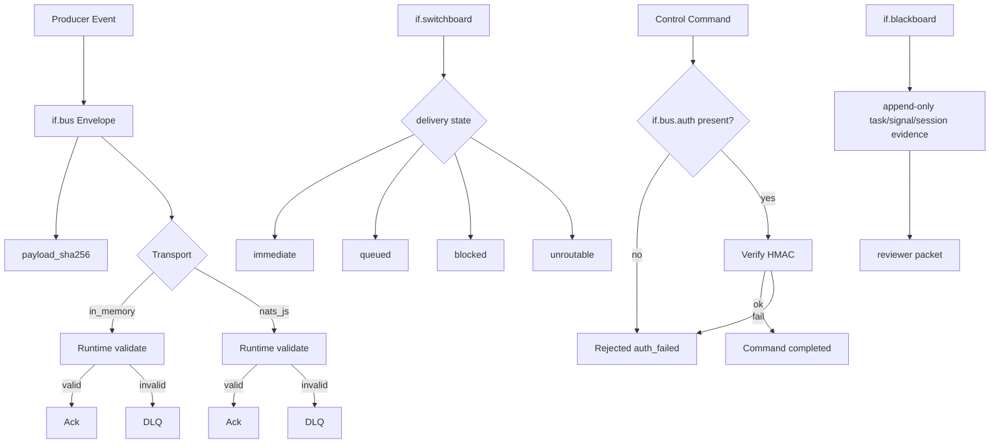

# if.bus Full Explainer v1.5 (Switchboard-Integrated, Claim-Boundary Strict)

Danny Stocker | ds@infrafabric.io | InfraFabric Research | 2026-03-03
Status: review
Last review date: 2026-03-03
Next checkpoint date: 2026-03-16
Checkpoint scope: align `if.bus` explainer with bible v4.23 hard gates; current state: stale-gate interpretation `[MET]`, negative-path expected outcomes `[MET]`, audience navigation register+decision rows `[MET]`, claim-boundary/non-claim preview discipline `[MET]`, source/deployed parity reporting `[Closure candidate: MET local replay + runtime-critical diff summary, independent replay pending]`, offline/edge non-claim guardrails `[MET]`, selector verify-key missing-path fail-closed evidence `[MET]`.
Checkpoint pass criteria: (1) stale-gate interpretation is explicit and applied, (2) negative-path expected outcomes are declared for high-risk controls, (3) audience navigation includes register mode + decision question per row, (4) claim-boundary and non-claim language remains preview-bounded, (5) source/deployed parity evidence bundle is attached.
Evidence `as_of_utc`: 2026-03-03T12:39:50Z
Accountable and responsible approver: Danny Stocker | ds@infrafabric.io
Backup reviewer/operator continuity owner: unassigned (accepted continuity risk in this cycle); assignment target: 2026-03-16 checkpoint.
LLM-assist disclosure: synthesized and validated with `/rook-020` Codex runtime and multi-agent sub-review support.
Style Guide: Whitepaper v4.23
Writing Standard Source: `docs/2266-if-whitepapers-bible-v4.23-2026-03-02T120500Z.md`
Version lineage: this `if.bus` v1.5 supersedes `docs/2307-if-bus-full-explainer-v1.4-2026-03-03T112242Z.md`, `docs/2303-if-bus-full-explainer-v1.3-2026-03-03T043325Z.md`, `docs/2301-if-bus-full-explainer-v1.2-2026-03-03T000207Z.md`, and `docs/604-if-bus-full-explainer-v1.1-2026-02-19T113500Z.md` as the current standalone `if.bus` full explainer.
Runtime evidence bundles:
- `tmp/if2305_bus_preemptive_20260303T110718Z/` (IF-2305 preemptive hardening closeout: `tmp/if2305_bus_preemptive_20260303T110718Z/if2305_bus_preemptive_closeout.latest.json`)
- `tmp/if2303_bus_patch_20260303T042914Z/` (IF-2303 control-auth + NATS auth baseline replay set)
- `tmp/if2305_bus_preemptive_20260303T110718Z/selector_canary_missing_verify_keys_negative_20260303T123950Z.json` (strict selector negative-path: missing verify keys fails closed)

## Who | Why | What | Where | When | How
This paper defines what we can and cannot claim about `if.bus` right now, using replayable evidence first and explicit non-claims when evidence is partial.

| Dimension | Current answer |
|---|---|
| Who | Executives setting release language, operators running runtime controls, engineers patching policy paths, external reviewers auditing trust boundaries. |
| Why | Prior `if.bus` content predates switchboard hardening and unified claim-discipline updates, creating avoidable ambiguity. |
| What | A refreshed standalone `if.bus` explainer with integration boundaries to `if.switchboard` and `if.blackboard`. |
| Where | Canonical public surfaces plus operator-local runtime artifacts and source/deployed diffs listed below. |
| When | Immediate reviewer use; operational checkpoint 2026-03-16. |
| How | Registry-first language, dual evidence tiers, explicit stale-state handling, and fail-closed promotion rules. |

Public no-login canonical surfaces:
https://infrafabric.io/if/bus/
https://infrafabric.io/llm/if.registry.json.txt
https://infrafabric.io/llm/products/if-bus/index.md.txt
https://infrafabric.io/llm/products/if-bus/runtime-sandbox/index.md.txt
https://infrafabric.io/llm/products/if-bus/bus-runtime-spec/index.md.txt

*If this opening contract is vague, every downstream trust statement inherits drift.*

## Problem statement
`if.bus` is active internally and publicly listed as preview, but readers still conflate three different planes: source capability, deployed enforcement, and publication claim strength.

The two recurring failure modes are now concrete:
- assuming selector-scoped signature enforcement means universal signature enforcement,
- assuming runtime source code parity means deployed CT250 parity.

The third failure mode is cross-module spillover: readers importing stronger switchboard or trace language into `if.bus` where evidence is narrower.
The fourth failure mode is edge/offline assumption drift: readers inferring that local `if.bus` liveness means full disconnected autonomous operation is approved.

*If we do not separate these planes explicitly, review language will overstate controls that are only partially enforced.*

## Goal
This document enables a skeptical reviewer to classify each major `if.bus` statement as `proven`, `bounded`, or `non-claim` in one pass.

Operationally, the goal is to keep `if.bus` useful in production-adjacent workflows while preserving preview posture and preventing silent claim inflation.

Not-for line: this explainer is not a certification packet and must not be used as sole evidence for compliance, legal sign-off, or GA procurement approval.

*If the document cannot survive adversarial reading, it is a narrative artifact, not an operational one.*

## Execution-time model
The runtime clock and publication clock are independent and must remain decoupled in wording.

Runtime clock:
- seconds to minutes for NATS JetStream queue acknowledgment, consumer heartbeat, control command execution, and DLQ behavior.
- fail-closed selector preflight behavior when required runtime env, verify keys, or topic/subject invariants are missing.

Publication clock:
- hourly windows for gate evidence,
- daily refresh for public narrative alignment,
- checkpoint-driven claim promotions.

Interpretation rule:
- publication language follows the weakest fresh gate and freshest reproducible artifacts, not the strongest isolated metric.

*If timing domains are blended, stale evidence will masquerade as current truth.*

## Claim Boundary
`if.bus` is `preview` and this status is binding for external language.

What is proven now:
- schema-valid envelope transport behavior in replayed runtime probes,
- `payload_sha256` integrity fingerprint fields in valid envelopes,
- strict signature gate behavior on configured secure selectors,
- control-command auth enforcement in deployed command path (`unsigned -> auth_failed`, `signed -> completed`).

What is bounded now:
- broader topic-family signature enforcement outside strict selectors,
- complete deployed parity with newest source runtime code,
- independent no-login reproduction of all operator-local runtime checks,
- disconnected/edge operation claims unless a signed degraded-mode policy and dependency gates are explicitly `MET`.

What is non-claim now:
- GA or certified posture,
- universal cryptographic signature coverage across all topics,
- exactly-once delivery or multi-region HA guarantees,
- SIP replacement claims,
- autonomous offline operation independent of `if.switchboard`, `if.blackboard`, and `if.trace` dependency health.

*If a claim can be read as universal without universal evidence, it must be downgraded.*

## Canonical Publication Boundary and Staleness Contract
Canonical and draft surfaces are separate evidence classes and must not be mixed in one sentence.

Canonical public surfaces:
https://infrafabric.io/if/bus/
https://infrafabric.io/llm/products/if-bus/index.md.txt
https://infrafabric.io/llm/products/if-bus/runtime-sandbox/index.md.txt
https://infrafabric.io/llm/products/if-bus/bus-runtime-spec/index.md.txt

Draft/internal surfaces (operator-assisted):
- `docs/604-if-bus-full-explainer-v1.1-2026-02-19T113500Z.md`
- `tmp/if2305_bus_preemptive_20260303T110718Z/*`
- `tmp/if2303_bus_patch_20260303T042914Z/*`
- `tmp/if_bus_runtime_smoke/*`
- `tmp/if_bus_runtime_smoke_live/*`
- `tmp/if1977/*`
- `tmp/if1978/*` (legacy selector-canary baseline lane)
- `if_bus_runtime/*`
- `if-runtime/if_bus_runtime/*`

Operator-local path note: repository-relative paths in this section are local CT250/runtime references and are Tier B by definition.

Staleness classes:
- Tier A current: no-login artifacts within freshness threshold (`<=24h` gate-status artifacts, `<=7d` documentation/checksum artifacts),
- Tier A-stale: public artifacts older than threshold,
- Tier B: operator-assisted evidence requiring host/runtime access,
- Tier C: narrative/testimony only.

Fail-closed rule:
- any stale gate artifact is treated as `NOT_MET` for claim-promotion decisions until refreshed.

*If canonical and draft lanes are blurred, procurement decisions will be made on stale or private evidence.*

## Document Navigation by Audience
This map is mandatory because `if.bus` claims differ by audience risk and evidence access.

Document default register mode: `domain-native`.
Switch trigger: when a section enters controls, gates, or commands, wording remains literal domain language.

| Audience | Register mode | Primary sections | Decision question |
|---|---|---|---|
| Executives / Business Leaders | `abstract-first` | Executive Decision Surface, Claim Boundary, Release Language Guardrails | What can we safely say now without over-claiming? |
| Power Users / Operators | `domain-native` | Operational Runbook View, Implementation View, Appendix A | What must run now to keep runtime safety fail-closed? |
| Engineers / Implementers | `domain-native` | Implementation View, Runtime Contract View, Matrix sections | Which controls are enforced now vs source-only? |
| LLM Runtime Developers | `domain-native` | Runtime Contract View, Switchboard Integration Constraints | Which fields/states are safe to integrate now? |
| External Reviewers / Auditors | `mixed` | Canonical Boundary, Reviewer Quick Matrix, Evidence Hierarchy, External Reviewer Packet | What is independently reproducible vs operator-assisted? |
| Product / Commercial | `mixed` | Release Language Guardrails, Executive Decision Surface, 30/60/90 plan | Which statements are allowed now in market-facing communication? |

Operator-facing sections: Operational Runbook View, Implementation View, Runtime Contract View, Appendix A.
Reviewer-facing sections: Claim Boundary, Canonical Boundary, Reviewer Quick Matrix, Evidence Hierarchy, External Reviewer Packet.

*If audience routing is missing, strong technical detail still produces weak governance decisions.*

## System Diagram
`if.bus` transports event envelopes and control commands under selector-scoped policy, with switchboard handling SIP routing and blackboard preserving governance evidence.



```text
ASCII fallback:
producer -> envelope(payload_sha256) -> transport -> runtime validate -> ack or DLQ
control -> if.bus.auth verify -> completed or auth_failed
switchboard -> immediate|queued|blocked|unroutable
blackboard -> append-only evidence -> reviewer packet
```

Boundary note: `if.bus` ownership in this diagram is the envelope transport + control auth lane only; `if.switchboard` delivery-state boxes and `if.blackboard` evidence boxes are adjacent-module context, not `if.bus`-owned controls.

*If diagrams hide deny paths, reviewers assume success paths are the whole system.*

## Executive Decision Surface
The decision for this cycle is conservative preview language with enforcement-scoped claims only.

| Decision question | Current answer | Evidence class | Risk if ignored |
|---|---|---|---|
| Is `if.bus` publicly surfaced as preview? | Yes | Tier A current | market-facing posture drift |
| Is runtime active internally? | Yes (operator-verified) | Tier B | false negative on capability |
| Is `payload_sha256` required by public envelope schema? | Yes | Tier A current | schema/runtime confusion |
| Is `payload_sha256` observed in replayed runtime envelopes? | Yes | Tier B | operator-only replay can be mistaken as no-login proof |
| Is signature enforcement universal across topics? | No | Tier B + policy artifacts | over-claim of cryptographic posture |
| Is control auth enforced on deployed command path? | Yes | Tier B | unauthorized mutation risk |
| Can we claim GA/certification now? | No | Tier A + non-claim policy | procurement/legal exposure |

Decision line:
- approve scoped preview claims,
- defer universal signature claims,
- block GA/certification wording.

*If leadership language outruns operator evidence, trust debt compounds faster than feature velocity.*

## Reviewer Quick Matrix
This matrix is split by reproducibility tier so reviewers do not confuse no-login checks with operator-assisted checks.
Verified UTC:
- Tier A rows: 2026-03-03T11:07:31Z
- Tier B rows: 2026-03-03T11:07:31Z (IF-2305 preemptive hardening replay set; IF-2303 auth-path baseline controls retained)

Tier A (`independently reproducible`, no host access required):

| Feature claim | Primary evidence | Binary verification step | Explicit limit |
|---|---|---|---|
| `if.bus` preview surface reachable | `https://infrafabric.io/if/bus/` | HTTP 200 and preview wording visible | reachability is not runtime-enforcement proof |
| Registry posture is `if.bus` + `preview` | `https://infrafabric.io/llm/if.registry.json.txt` | `jq` shows `product_id=if.bus` and `status=preview` | registry status is not universal signature proof |
| Public runtime/spec packs exist | runtime-sandbox and bus-runtime-spec URLs | HTTP 200 on both | availability is not live CT250 proof |

Tier B (`operator-assisted`, host/runtime required):

| Feature claim | Primary evidence | Binary verification step | Explicit limit |
|---|---|---|---|
| Strict selector fail-closed guardrails are active | `tmp/if2305_bus_preemptive_20260303T110718Z/selector_canary_full_20260303T110718Z.json` | `verify_key_status=ok`, `verify_key_count>=1`, `subject_topic_mismatch_total=0`, and fail-closed policy fields are all `true` | selector-scoped only (`if.bus.secure.>`), not universal |
| Weakest-gate inheritance is computed and claim promotion is blocked on stale dependencies | `tmp/if2305_bus_preemptive_20260303T110718Z/weakest_gate_inheritance_20260303T110718Z.json` and `tmp/if2305_bus_preemptive_20260303T110718Z/if2305_bus_preemptive_closeout.latest.json` | `effective_claim_status=NOT_MET` while runtime checks can still pass | does not assert if.switchboard or if.trace are healthy; it enforces conservative claim posture |
| Runtime-critical source/deployed parity is checkpoint-gated and currently matched | `tmp/if2305_bus_preemptive_20260303T110718Z/source_deployed_diff_summary_20260303T110718Z.json` | `all_match == true` across runtime-critical pairs | checkpoint-scoped and must be rerun per checkpoint |
| Strict selector verify-key absence fails closed | `tmp/if2305_bus_preemptive_20260303T110718Z/selector_canary_missing_verify_keys_negative_20260303T123950Z.json` | `pass=true` with non-zero exit and `missing signature verify keys` in stderr | proves fail-closed for missing key material only; does not prove key-rotation freshness policy |
| Control auth command path works (baseline auth-path replay set) | `tmp/if2303_bus_patch_20260303T042914Z/control_auth_post_final_rotation_20260303T054956Z.json` | unsigned rejected and signed completed after final secret rotation | command-path scope only |
| NATS broker auth hardening is enforced (baseline auth-path replay set) | `tmp/if2303_bus_patch_20260303T042914Z/nats_auth_enforcement_recheck_20260303T060449Z.json` | unauthenticated connect blocked and authenticated connect succeeds (`pass=true`) | broker-connect gate only; not a universal payload-authorization claim |

*If reviewer checks are not binary, interpretations become opinion rather than evidence.*

## Operational Runbook View
Runbook behavior must treat source and deployed runtime as separate verification targets.

Minimum operator sequence:
1. verify registry/public posture still says preview,
2. verify runtime process health in CT250,
3. run strict-selector deny-path check,
4. run control auth unsigned/signed check,
5. run publication guardrails before any claim update.

Executable operator checks (canonical examples):
```bash
# 1) Public preview posture
curl -fsSL https://infrafabric.io/llm/if.registry.json.txt \
  | jq -c '.products[] | select(.product_id=="if.bus") | {product_id,status,path}'

# 2) CT250 runtime health
pct exec 250 -- systemctl is-active if-bus-runtime nats.service
pct exec 250 -- systemctl status if-bus-runtime --no-pager -n 40
jq '{generated_utc,overall_healthy,checks:[.checks[]|{name,ok}]}' \
  "tmp/if2305_bus_preemptive_20260303T110718Z/watchdog/artifacts/latest.json"

# 3) Source/deployed parity and selector fail-closed checks (must be reviewed at each checkpoint)
SMOKE_DIR=tmp/if2305_bus_preemptive_20260303T110718Z
BASELINE_DIR=tmp/if2303_bus_patch_20260303T042914Z
diff -q if_bus_runtime/runtime.py if-runtime/if_bus_runtime/runtime.py
diff -q if_bus_runtime/cli.py if-runtime/if_bus_runtime/cli.py
diff -q if_bus_runtime/transports/nats_js.py if-runtime/if_bus_runtime/transports/nats_js.py
jq -e '.all_match == true and ([.runtime_critical_pairs[] | .match] | all)' \
  "$SMOKE_DIR/source_deployed_diff_summary_20260303T110718Z.json" >/dev/null \
  && echo "SOURCE/DEPLOYED PARITY PASS" || echo "SOURCE/DEPLOYED PARITY FAIL"

# 4) Fail-closed selector posture + weakest-gate inheritance assertions
jq -e '.verify_key_status == "ok" and .verify_key_count >= 1 and .subject_topic_mismatch_total == 0 and .fail_closed_policy.require_token_env == true and .fail_closed_policy.require_verify_keys == true and .fail_closed_policy.require_topic_subject_match == true' \
  "$SMOKE_DIR/selector_canary_full_20260303T110718Z.json" >/dev/null \
  && echo "SELECTOR FAIL-CLOSED POLICY PASS" || echo "SELECTOR FAIL-CLOSED POLICY FAIL"

jq -e '.can_broaden_without_breaking_now == false and .decision == "no_safe_broadening_now"' \
  "$SMOKE_DIR/selector_preflight_if_bus_data_test_20260303T110718Z.stdout.json" >/dev/null \
  && echo "SELECTOR PREFLIGHT FAIL-CLOSED PASS" || echo "SELECTOR PREFLIGHT FAIL-CLOSED FAIL"

jq -e '.pass == true and .rc != 0 and (.stdout_stderr|ascii_downcase|contains("missing signature verify keys"))' \
  "$SMOKE_DIR/selector_canary_missing_verify_keys_negative_20260303T123950Z.json" >/dev/null \
  && echo "MISSING VERIFY-KEY FAIL-CLOSED PASS" || echo "MISSING VERIFY-KEY FAIL-CLOSED FAIL"

jq -e '.effective_claim_status == "NOT_MET" and .gates.if_bus_runtime_gate.effective_status == "MET" and .gates.switchboard_routing_fidelity.stale == true' \
  "$SMOKE_DIR/weakest_gate_inheritance_20260303T110718Z.json" >/dev/null \
  && echo "WEAKEST-GATE INHERITANCE PASS" || echo "WEAKEST-GATE INHERITANCE FAIL"

# 5) Baseline auth-path deny assertions (from IF-2303 baseline replay set)
jq -e '[(.acks[]|.status)] == ["rejected","completed"] and [(.acks[]|(.error.code//null))] == ["auth_failed",null]' \
  "$BASELINE_DIR/control_auth_post_final_rotation_20260303T054956Z.json" >/dev/null \
  && echo "CONTROL AUTH PASS" || echo "CONTROL AUTH FAIL"

jq -e '.unauth_connect_blocked == true and .auth_connect_succeeds == true and .pass == true' \
  "$BASELINE_DIR/nats_auth_enforcement_recheck_20260303T060449Z.json" >/dev/null \
  && echo "NATS AUTH GATE PASS" || echo "NATS AUTH GATE FAIL"

jq -e '.second_status == "rejected" and .second_error_code == "command_replay_detected" and .pass == true' \
  "$BASELINE_DIR/replay_guard_post_final_rotation_20260303T054956Z.json" >/dev/null \
  && echo "REPLAY GUARD PASS" || echo "REPLAY GUARD FAIL"

# 6) Freshness + public packet URL reachability gate (fail-closed)
NOW_EPOCH="$(date -u +%s)"
GATE_EPOCH="$(date -u -d "$(jq -r '.generated_utc' \"$SMOKE_DIR/weakest_gate_inheritance_20260303T110718Z.json\")" +%s)"
AGE_SEC="$((NOW_EPOCH - GATE_EPOCH))"
test "$AGE_SEC" -le 86400 \
  && echo "GATE FRESHNESS PASS age_sec=$AGE_SEC" \
  || echo "GATE FRESHNESS STALE age_sec=$AGE_SEC"

cat <<'EOF' > /tmp/if_bus_packet_urls_2308.txt
https://infrafabric.io/if/bus/
https://infrafabric.io/llm/if.registry.json.txt
https://infrafabric.io/llm/products/if-bus/index.md.txt
https://infrafabric.io/llm/products/if-bus/runtime-sandbox/index.md.txt
https://infrafabric.io/llm/products/if-bus/bus-runtime-spec/index.md.txt
https://infrafabric.io/llm/products/if-bus/runtime-sandbox/2026-01-19/index.md.txt
https://infrafabric.io/llm/products/if-bus/bus-runtime-spec/2026-01-19/index.md.txt
EOF
while IFS= read -r u; do code="$(curl -fsS -o /dev/null -w '%{http_code}' "$u" || true)"; echo "$code $u"; test "$code" = "200" || exit 11; done < /tmp/if_bus_packet_urls_2308.txt
```

Incident fail-closed triggers:
- missing deny-path evidence,
- stale gate artifacts beyond threshold,
- missing source/deployed diff summary or any runtime-critical mismatch,
- public packet URLs returning non-200.

Rollback execution order:
1. freeze claim language at conservative preview,
2. restore last-known-good runtime package,
3. restart runtime + watchdog timers,
4. rerun deny-path checks,
5. attach evidence before clearing incident state.

*If runbook steps skip denial behavior, green dashboards can still hide real control failures.*

## Implementation View
Implementation truth is anchored to concrete files, not narrative summaries.

Product identity:
- `product_id`: `if.bus`
- canonical path: `/if/bus`
- registry status: `preview`

Source runtime files:
- `if_bus_runtime/runtime.py`
- `if_bus_runtime/control_auth.py`
- `if_bus_runtime/cli.py`
- `schemas/if-bus/envelope.schema.json`

Deployed snapshot files:
- `if-runtime/if_bus_runtime/runtime.py`
- `if-runtime/if_bus_runtime/control_auth.py`

Key implementation observations:
- control auth uses namespaced extension key with legacy-read fallback,
- signature verification for strict selectors is cryptographic and fail-closed on required selectors,
- `payload_sha256` is required and checked in envelope paths,
- source/deployed parity is checkpoint-gated via automated runtime-critical diff summary and must be rechecked per checkpoint.

Source/deployed drift closure summary (IF-2303 runtime hardening):
- pre-sync drift existed across runtime-critical files (`runtime.py`, `cli.py`, transport adapter),
- deployment failed once under partial sync (`NatsJsConfig.__init__() got an unexpected keyword argument 'user'`), proving mixed-version risk was real and not theoretical,
- runtime-critical source/deployed parity is a closure candidate for this checkpoint (`tmp/if2303_bus_patch_20260303T042914Z/source_deployed_diff_summary_20260303T060824Z.json` reports `all_match=true`),
- post-hardening replay status: strict-selector signature gate pass, control-auth deny/success path pass, NATS unauth-connect deny path pass, and replay guard pass (`tmp/if2303_bus_patch_20260303T042914Z/postpatch_summary.json`, `tmp/if2303_bus_patch_20260303T042914Z/control_auth_post_final_rotation_20260303T054956Z.json`, `tmp/if2303_bus_patch_20260303T042914Z/nats_auth_enforcement_recheck_20260303T060449Z.json`, `tmp/if2303_bus_patch_20260303T042914Z/replay_guard_post_final_rotation_20260303T054956Z.json`).
- IF-2305 preemptive closeout confirms `runtime_checks_pass=true` while `claim_promotion_pass=false`, proving runtime health does not override stale dependency gate failures (`tmp/if2305_bus_preemptive_20260303T110718Z/if2305_bus_preemptive_closeout.latest.json`).

*If file-level evidence is missing, implementation claims are just paraphrased intent.*

## Signing/Auth Matrix (Coverage-Labeled)
Coverage labels are per-cell and must state whether evidence is tested, inferred, or not applicable.
Verified UTC: 2026-03-03T06:10:01Z (includes final control-auth rotation and NATS auth hardening replay checks).

| Surface | Mechanism | Deployed now | Source tests now | Coverage label | Evidence anchor |
|---|---|---|---|---|---|
| Envelope integrity | `payload_sha256` | Yes | Yes | tested | `schemas/if-bus/envelope.schema.json`, `tmp/if2303_bus_patch_20260303T042914Z/ok_postpatch_20260303T042914Z.json` |
| Envelope signature on strict selectors | `extensions.if.security.signature.v1` | Yes (selector-scoped) | Yes | tested | `tmp/if2303_bus_patch_20260303T042914Z/signature_gate_postpatch_20260303T042914Z.json` |
| Envelope signature outside strict selectors | same | Not universal | policy-dependent | inferred | selector policy artifacts in `tmp/if1978/*` |
| Control command auth | `extensions.if.bus.auth` HMAC | Yes (command path) | Yes | tested | `tmp/if2303_bus_patch_20260303T042914Z/control_auth_post_final_rotation_20260303T054956Z.json` |
| NATS broker client auth | runtime broker auth (`token`) | Yes (transport gate) | Yes | tested | `tmp/if2303_bus_patch_20260303T042914Z/nats_auth_enforcement_recheck_20260303T060449Z.json` |
| Security signal signing coverage | signature extension via `if_cli` path | partial (new rows) | yes path exists | tested (bounded sample) | `tmp/if1977/laneC_metrics/if_bus_security_signature_coverage.latest.json` |

Interpretation:
- `tested` means replay evidence exists,
- `tested (bounded sample)` means replay evidence exists for a representative subset and must carry an explicit scope note in release language,
- `inferred` means architectural expectation without full replay coverage,
- no `inferred` cell may be promoted to broad release language.

*If coverage labels are omitted, a partial matrix will be read as universal proof.*

## Runtime Contract View
Client contract language is conservative and centered on field-level guarantees.

Minimum required envelope fields:
- `schema_id`
- `schema_version`
- `event_id`
- `emitted_utc`
- `routing.topic`
- `payload`
- `payload_sha256`

Optional but policy-relevant extensions:
- `extensions.if.bus.auth`
- `extensions.if.security.signature.v1`

State labels used in this document:
- `deployed_enforced`
- `source_validated`
- `intent_only`

Current state mapping:
- envelope validation and DLQ: `deployed_enforced`,
- control auth command path: `deployed_enforced`,
- strict selector signature verification: `deployed_enforced` for selected topics only,
- broad topic signature enforcement: `intent_only` outside selected policy scope.

Machine-readable non-inference contract for downstream runtimes:
```json
{
  "contract_id": "if.bus.runtime.v1.5",
  "forbidden_inference": [
    "content_correctness_verified",
    "universal_signature_coverage",
    "compliance_certified",
    "source_deployed_parity_guaranteed",
    "switchboard_delivery_guaranteed_by_bus",
    "offline_autonomous_mode_approved",
    "transitive_dependency_health_guaranteed"
  ]
}
```

*If contract labels are looser than runtime behavior, integrators will code to guarantees that do not exist.*

## Switchboard and Blackboard Integration Constraints
`if.bus` must describe switchboard/blackboard integration without inheriting stronger claims from those modules.

Black/white constraints:
- `if.switchboard` owns SIP routing and delivery outcomes (`immediate`, `queued`, `blocked`, `unroutable`),
- Redis queues in switchboard are SIP-sidecar transport behavior and are not the same as universal `if.bus` guarantee,
- `if.bus` spine is NATS JetStream in this architecture, with broker-auth hardening validated in IF-2303 artifacts,
- `if.blackboard` provides append-only reviewer evidence lanes and does not imply runtime control enforcement,
- strict FSM lifecycle behaviors remain preview/advisory in broader switchboard posture and are not to be rephrased as hard guarantees in `if.bus`.

Caveats carried forward:
- selector canary checks prove safe broadening conditions over observed windows only,
- weakest-gate inheritance is currently one-hop through declared dependency gate artifacts; full transitive-chain artifacting is tracked in Open Findings before any stronger dependency-language promotion,
- reason-code or parameter casing issues in adjacent modules (switchboard `L3-RT-03`, `L3-RT-04`) must stay explicit and cannot be normalized away in prose.

*If module boundaries are softened, one product’s strongest proof gets misapplied to another product’s weakest path.*

## What is intentionally not claimed
This section exists to prevent accidental guarantee language during summary or commercialization passes.

Non-claims:
- no claim of exactly-once delivery semantics,
- no claim of universal signed-event fabric across all `if.bus` topics,
- no claim that deployed runtime is always equal to latest source,
- no claim of compliance, legal sufficiency, or certification,
- no claim that `if.bus` replaces existing SIP infrastructure,
- no claim of autonomous offline operation until signed degraded-mode policy + dependency-health gate evidence is attached.

Escalation rule:
- any sentence readable as guaranteed must be downgraded unless mapped to fresh Tier A evidence with stated scope.

*If non-claims are treated as optional footnotes, they will be overwritten by optimistic summaries.*

## Release Language Guardrails
Release language must be generated from evidence class + freshness state, not from roadmap intent.

Approved wording examples:
- "`if.bus` is preview with active internal runtime and public specification surfaces."
- "`payload_sha256` integrity fields are enforced in observed envelope paths."
- "Control-command HMAC auth is enforced on the deployed command path; scope remains command-path specific."
- "Signature enforcement is active for strict selectors and is not yet universal across all topics."
- "NATS broker auth hardening is active (`unauth -> Authorization Violation`, authenticated client connect succeeds)."

Blocked wording examples:
- "`if.bus` is GA."
- "All `if.bus` events are cryptographically signed."
- "Live runtime enforces auth everywhere."
- "`if.bus` replaces SIP infrastructure."

Publish gate before claim upgrades:
1. rerun deny-path checks,
2. verify freshness thresholds are met,
3. verify canonical URLs return 200,
4. run scaffold lint with audience + anchor/stress gates,
5. attach evidence to blackboard task closeout.

Hard promotion blocker:
- any open high-severity finding, unresolved lane contradiction, or stale dependency gate keeps claim promotion `NOT_MET`.

Enforcement ownership:
- enforcement owner: accountable approver (front matter),
- runtime evidence owner: CT250 operator on duty,
- continuity owner: pending assignment (tracked in Open Findings).

*If wording gates are weaker than runtime gates, compliance drift starts in documentation first.*

## 30/60/90 plan
The plan is execution-scoped and tied to explicit evidence gates.

30 days:
- maintain control auth, NATS unauth-connect deny path, replay-guard deny path, and strict-selector deny-path evidence on each release cycle,
- mirror operator-assisted summaries into public immutable artifacts where possible,
- close any stale-gate windows before promotion requests,
- publish offline/degraded-mode implementation packet with four prerequisites:
  - local inference adapter path (no mandatory remote model dependency),
  - signed degraded-mode policy (`fully_connected | switchboard_only | air_gap`),
  - daemon startup dependency health gate (`sip relay`, `redis`, `nats`, `inference`),
  - attestation/registration state persistence across restarts.

60 days:
- publish by-topic signature policy table (`required | optional | forbidden`),
- increase replay coverage for currently inferred matrix cells,
- keep automated source/deployed diff summaries as mandatory checkpoint gate artifacts,
- run and publish multi-session concurrency replay for shared env-mirror path (`last-writer-wins` closure candidate in Agent Rook).

90 days:
- evaluate safe selector broadening only when preflight gates pass,
- define explicit promotion criteria from preview to stronger posture,
- either implement or formally accept risk for remaining unresolved enforcement gaps.

Rollback rule:
- any reopened high-severity finding freezes claim promotion until patched and replay-verified.

Cross-module dependency rule:
- `if.bus` integrity-language strength cannot outpace `if.trace` integrity evidence tiers,
- `if.bus` delivery-language strength cannot outpace `if.switchboard` preview/gate posture.

*If planning is not gate-bound, timelines become cosmetic and risk stays operational.*

## External Reviewer Packet
This packet isolates what an external reviewer can verify without host access.
Verified UTC: 2026-03-03T12:39:50Z.

Public packet URLs:
https://infrafabric.io/if/bus/
https://infrafabric.io/llm/if.registry.json.txt
https://infrafabric.io/llm/products/if-bus/index.md.txt
https://infrafabric.io/llm/products/if-bus/runtime-sandbox/index.md.txt
https://infrafabric.io/llm/products/if-bus/bus-runtime-spec/index.md.txt
https://infrafabric.io/llm/products/if-bus/runtime-sandbox/2026-01-19/index.md.txt
https://infrafabric.io/llm/products/if-bus/bus-runtime-spec/2026-01-19/index.md.txt
https://infrafabric.io/llm/products/if-bus/runtime-sandbox/2026-01-19/artifacts/transcripts/control_auth_transcript.json
https://infrafabric.io/llm/products/if-bus/runtime-sandbox/2026-01-19/artifacts/transcripts/control_transcript.json
https://infrafabric.io/llm/products/if-bus/runtime-sandbox/2026-01-19/artifacts/transcripts/quota_transcript.json
https://infrafabric.io/llm/products/if-bus/bus-runtime-spec/2026-01-19/artifacts/schemas/if-bus/envelope.schema.json

Historical packet note:
- URLs under `/2026-01-19/` are stable baseline references and are treated as Tier A-stale unless reissued within freshness thresholds.

Reviewer packet integrity snapshot (`as_of_utc`: 2026-03-03T12:39:50Z):
- `control_auth_transcript.json`: `655598a37a392ecfd7e5855916b6c181320109005371767e26e25495b816084e`
- `control_transcript.json`: `1fc23b48f3bb4e713b6a704cfc8938145fd50f77d13b3270d087cb55755ac338`
- `quota_transcript.json`: `92e0b9f474388f5ad8f9542b4397b9252a08547c6577b19cb4019269ae7c10fe`
- `envelope.schema.json`: `79f29e4bcf1c6f0c4c7fbb9d33c38ec4491405a0eb974de11399a18adda98820`

External reviewer can conclude:
- `if.bus` public preview posture exists,
- registry and module surfaces are reachable,
- baseline transcripts and schema artifacts are downloadable.

External reviewer cannot conclude from no-login packet alone:
- live CT250 process state now,
- current strict-selector counters now,
- local security signal store coverage now.

*If packet limits are not explicit, reviewers will assume private runtime evidence is already public.*

## Evidence Hierarchy
Evidence tiers are strict and promotion is fail-closed.

| Tier | Definition | Examples | Reproducibility |
|---|---|---|---|
| Tier A current | no-login artifact inside freshness threshold | public module pages, registry mirror, published transcript/spec artifacts | independent |
| Tier A-stale | no-login artifact outside threshold | old gate status snapshots beyond 24h/7d rules | independent but stale |
| Tier B | operator-assisted replay evidence | `tmp/if2305_bus_preemptive_20260303T110718Z/*`, `tmp/if2303_bus_patch_20260303T042914Z/*`, CT250 checks, source/deployed diff summaries | host/runtime required |
| Tier C | narrative/testimony only | unsourced statements | non-reproducible |

Promotion rule:
- Tier B claims remain bounded until mirrored as Tier A current or explicitly accepted as operator-only final tier.

Demotion rule:
- freshness breach, missing artifacts, or reopened high-severity findings demote claim strength immediately.
- schema or transcript hash changes without a versioned migration note trigger immediate demotion.

*If demotion is undefined, promotions never self-correct after regressions.*

## Open Findings Register
Open findings are part of claim control, not an appendix afterthought.

| Finding | Status | Impact | Next action | Target close |
|---|---|---|---|---|
| Selector broadening beyond strict topics | Open | blocks universal signature claim | maintain fail-closed preflight and keep scope narrow | 2026-03-16 checkpoint |
| Offline/degraded-mode policy and dependency-health gate are not yet published as signed, replayable controls | Open | blocks bounded offline-autonomy language | publish signed degraded-mode policy, startup dependency gate artifact, and restart-persistence replay evidence | 2026-04-02 checkpoint |
| Weakest-gate inheritance currently lacks published transitive-chain artifact | Open | can understate downstream dependency risk under nested failures | publish transitive dependency gate artifact and make it a required promotion input | 2026-04-02 checkpoint |
| Legacy mirror path is global and last-writer-wins under concurrent sessions (Rook integration dependency) | Open (cross-module) | multi-session state race can invalidate assumptions under concurrency | publish concurrency replay test + adopt per-session env override as preferred read path (`IF_ROOK_ENV_FILE`) | 2026-04-02 checkpoint |
| Source/deployed drift reporting consistency | Closure candidate (local replay pass; independent replay pending) | can misstate enforcement state | keep automated diff summary mandatory each checkpoint; reopen to Open if summary is missing or any runtime-critical mismatch appears | 2026-03-16 checkpoint |
| Backup reviewer/operator continuity owner | Open governance risk | single-owner fragility | assign named backup owner in checkpoint review | 2026-03-16 checkpoint |

Closure criteria:
- status lifecycle: `Open -> Closure candidate (local replay pass) -> Closed (independent replay + checkpoint approval)`,
- code/control change plus replay evidence,
- independent review pass for promoted wording,
- updated packet links and timestamps,
- for source/deployed drift: automated diff artifact present and reviewed at checkpoint, with runtime-critical drift either resolved or explicitly claim-bounded.

*If findings can close on prose alone, the system optimizes for storytelling over safety.*

## Appendix A: Verification commands (canonical)
These commands are the single canonical verification block for this revision.

Tier A no-login checks:
```bash
curl -fsSL https://infrafabric.io/llm/if.registry.json.txt \
  | jq -c '.products[] | select(.product_id=="if.bus") | {product_id,status,path,runtime_state}'

curl -fsSL https://infrafabric.io/if/bus/ | sed -n '1,80p'

curl -fsSL https://infrafabric.io/llm/products/if-bus/runtime-sandbox/2026-01-19/artifacts/transcripts/control_auth_transcript.json \
  -o /tmp/if_bus_control_auth_transcript.json && sha256sum /tmp/if_bus_control_auth_transcript.json
```

Tier B operator-assisted checks:
```bash
SMOKE_DIR=tmp/if2305_bus_preemptive_20260303T110718Z
BASELINE_DIR=tmp/if2303_bus_patch_20260303T042914Z

jq '.acks[] | {command_id,status,error_code:(.error.code//null),error_message:(.error.message//null)}' \
  "$BASELINE_DIR/control_auth_post_final_rotation_20260303T054956Z.json"

jq '{test,unauth_connect_blocked,auth_connect_succeeds,unauth_error,auth_error,pass}' \
  "$BASELINE_DIR/nats_auth_enforcement_recheck_20260303T060449Z.json"

jq '{test,first_status,second_status,second_error_code,pass}' \
  "$BASELINE_DIR/replay_guard_post_final_rotation_20260303T054956Z.json"

jq '{strict_pattern,unsigned_went_to_dlq,signed_went_to_dlq,required:.metrics.data_signature_required_total,verified:.metrics.data_signature_verified_total,gate:.signature_gate}' \
  "$BASELINE_DIR/signature_gate_postpatch_20260303T042914Z.json"

jq '{generated_utc,all_match,pairs:[.runtime_critical_pairs[]|{source,deployed,match}]}' \
  "$SMOKE_DIR/source_deployed_diff_summary_20260303T110718Z.json"

jq '{mode,published_payload_sha256:(.published.payload_sha256!=null),dlq_count:((.dlq//[])|length)}' \
  "$BASELINE_DIR/ok_postpatch_20260303T042914Z.json"

jq '{mode,published_payload_sha256:(.published.payload_sha256!=null),dlq_count:((.dlq//[])|length)}' \
  "$BASELINE_DIR/invalid_postpatch_20260303T042914Z.json"

jq '{test,expectation,rc,pass,stderr_preview:(.stdout_stderr|split(\"\\n\")|.[0:2])}' \
  "$SMOKE_DIR/selector_canary_missing_verify_keys_negative_20260303T123950Z.json"

diff -u if-runtime/if_bus_runtime/control_auth.py if_bus_runtime/control_auth.py | sed -n '1,120p'
```

Machine-verifiable deny-path assertion:
```bash
SMOKE_DIR=tmp/if2305_bus_preemptive_20260303T110718Z
BASELINE_DIR=tmp/if2303_bus_patch_20260303T042914Z
jq -e '.unsigned_went_to_dlq == true and .signed_went_to_dlq == false' \
  "$BASELINE_DIR/signature_gate_postpatch_20260303T042914Z.json" >/dev/null \
  && jq -e '[(.acks[]|.status)] == ["rejected","completed"] and [(.acks[]|(.error.code//null))] == ["auth_failed",null]' \
  "$BASELINE_DIR/control_auth_post_final_rotation_20260303T054956Z.json" >/dev/null \
  && jq -e '.unauth_connect_blocked == true and .auth_connect_succeeds == true and .pass == true' \
  "$BASELINE_DIR/nats_auth_enforcement_recheck_20260303T060449Z.json" >/dev/null \
  && jq -e '.second_status == "rejected" and .second_error_code == "command_replay_detected" and .pass == true' \
  "$BASELINE_DIR/replay_guard_post_final_rotation_20260303T054956Z.json" >/dev/null \
  && jq -e '.pass == true and .rc != 0 and (.stdout_stderr|ascii_downcase|contains("missing signature verify keys"))' \
  "$SMOKE_DIR/selector_canary_missing_verify_keys_negative_20260303T123950Z.json" >/dev/null \
  && echo "DENY PATH PASS" || echo "DENY PATH FAIL"
```

Negative-path expected outcomes (required):
- unsigned strict-topic event on `if.bus.secure.>` routes to DLQ with `error_kind=signature_required`,
- unsigned control command returns `rejected` with `auth_failed`,
- signed control command returns `completed`,
- unauthenticated NATS client connect is blocked while authenticated connect succeeds,
- replayed signed control command is rejected with `command_replay_detected`,
- selector broadening preflight on unsafe candidate fails closed (`can_broaden_without_breaking_now=false`),
- selector canary fails closed when verify keys are missing (`missing signature verify keys`),
- if any deny-path expected outcome is missing or runtime-critical parity check fails, promotion language stays conservative preview.

*If canonical commands skip failure paths, we only test what we hope is true.*

## Appendix B: Source and artifact pointers
These pointers are included to keep the explainer auditable and maintainable.

Core source docs:
- `docs/604-if-bus-full-explainer-v1.1-2026-02-19T113500Z.md`
- `docs/714-if-switchboard-full-explainer-v1.4-2026-03-02T090000Z.md`
- `docs/716-if-switchboard-blackboard-unified-full-explainer-v1.2-2026-03-02T113000Z.md`
- `docs/2302-if-trace-full-explainer-v1.2-2026-03-03T004910Z.md`
- `docs/2266-if-whitepapers-bible-v4.23-2026-03-02T120500Z.md`

Runtime/source files:
- `if_bus_runtime/runtime.py`
- `if_bus_runtime/control_auth.py`
- `if_bus_runtime/cli.py`
- `schemas/if-bus/envelope.schema.json`
- `if-runtime/if_bus_runtime/runtime.py`
- `if-runtime/if_bus_runtime/control_auth.py`

Key local artifacts:
- `tmp/if2305_bus_preemptive_20260303T110718Z/if2305_bus_preemptive_closeout.latest.json`
- `tmp/if2305_bus_preemptive_20260303T110718Z/weakest_gate_inheritance_20260303T110718Z.json`
- `tmp/if2305_bus_preemptive_20260303T110718Z/selector_canary_full_20260303T110718Z.json`
- `tmp/if2305_bus_preemptive_20260303T110718Z/selector_preflight_if_bus_data_test_20260303T110718Z.stdout.json`
- `tmp/if2305_bus_preemptive_20260303T110718Z/selector_canary_missing_verify_keys_negative_20260303T123950Z.json`
- `tmp/if2305_bus_preemptive_20260303T110718Z/source_deployed_diff_summary_20260303T110718Z.json`
- `tmp/if2305_bus_preemptive_20260303T110718Z/watchdog/artifacts/latest.json`
- `tmp/if2303_bus_patch_20260303T042914Z/ok_postpatch_20260303T042914Z.json`
- `tmp/if2303_bus_patch_20260303T042914Z/invalid_postpatch_20260303T042914Z.json`
- `tmp/if2303_bus_patch_20260303T042914Z/signature_gate_postpatch_20260303T042914Z.json`
- `tmp/if2303_bus_patch_20260303T042914Z/control_auth_post_final_rotation_20260303T054956Z.json`
- `tmp/if2303_bus_patch_20260303T042914Z/nats_auth_enforcement_recheck_20260303T060449Z.json`
- `tmp/if2303_bus_patch_20260303T042914Z/replay_guard_post_final_rotation_20260303T054956Z.json`
- `tmp/if2303_bus_patch_20260303T042914Z/source_deployed_diff_summary_20260303T060824Z.json`
- `tmp/if2303_bus_patch_20260303T042914Z/if2303_runtime_hardening_closeout.latest.json`
- `tmp/if2303_bus_patch_20260303T042914Z/secret_rotation_hygiene_check_20260303T063932Z.json`
- `tmp/if1977/laneC_metrics/if_bus_security_signature_coverage.latest.json`
- `tmp/if1978/selector_canary_gate_full_2026-02-19T1657Z.json`

Switchboard coordination artifact (cross-module context only; does not contribute to `if.bus` enforcement claims):
- `tmp/if_chat_bridge_ask_dxe3ma9k.json` (targeted routing fidelity gate passed for `if.agent.executor`, task-locked ask `IF-2297`).

*If pointers are incomplete, future revisions will silently lose reproducibility.*

## Conclusion
`if.bus` v1.5 is now patched as a current standalone module explainer with explicit switchboard/blackboard integration boundaries and fail-closed claim discipline.

What improved in this revision:
- canonical-vs-draft boundary and freshness contract are explicit,
- audience routing now includes register modes and decision questions,
- signing/auth matrix now uses per-cell coverage labels,
- negative-path expected outcomes are codified in canonical commands,
- strict selector verify-key missing path now has explicit fail-closed negative evidence,
- switchboard integration constraints are explicit without inheriting stronger adjacent-module claims.

What remains intentionally constrained:
- preview status,
- selector-scoped signature enforcement only,
- operator-assisted Tier B runtime checks for some critical paths,
- no GA/certification language,
- offline-autonomy remains non-claim until signed degraded-mode policy + dependency-health + persistence controls are evidenced,
- open findings remain active and keep promotion gates conservative until closure evidence is attached.

*If this document ever reads more certain than the evidence, the document is wrong.*

## Related

- [[if.knowledge Full Explainer v1.1 (Consolidated 1000+ Dense Lines)]]
- [[if.switchboard Full Explainer v1.4 — SIP Extension Edition]]
- [[Santé-France — Critical Full Explainer (v2.0, dependency-gated rebuild)]]
- [[if-radar_skydrone Full Explainer v1.1 (Data, Mechanics, Freshness, and Boundaries)]]
- [[Research and Papers MOC]]
- [[InfraFabric Architecture]]
