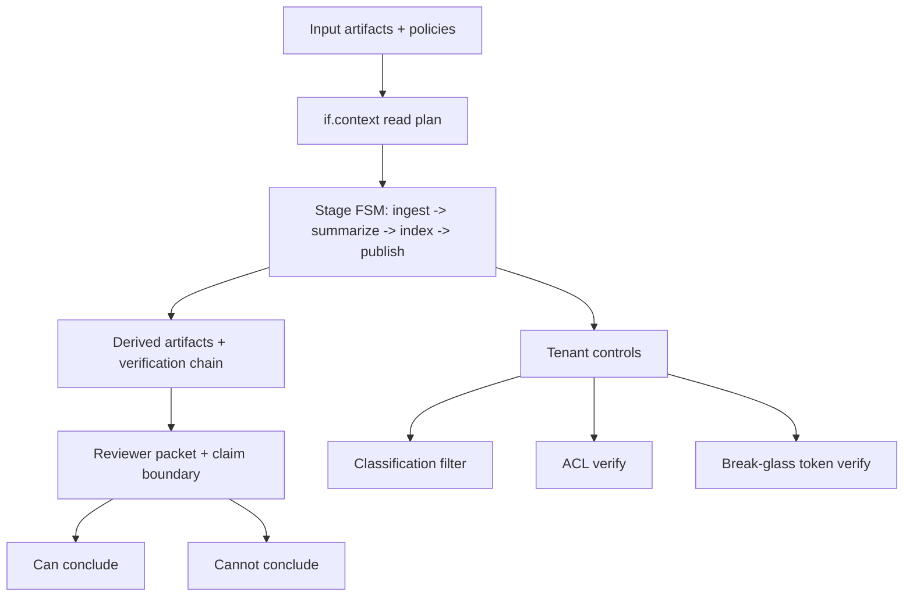
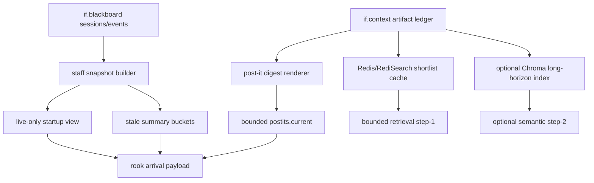
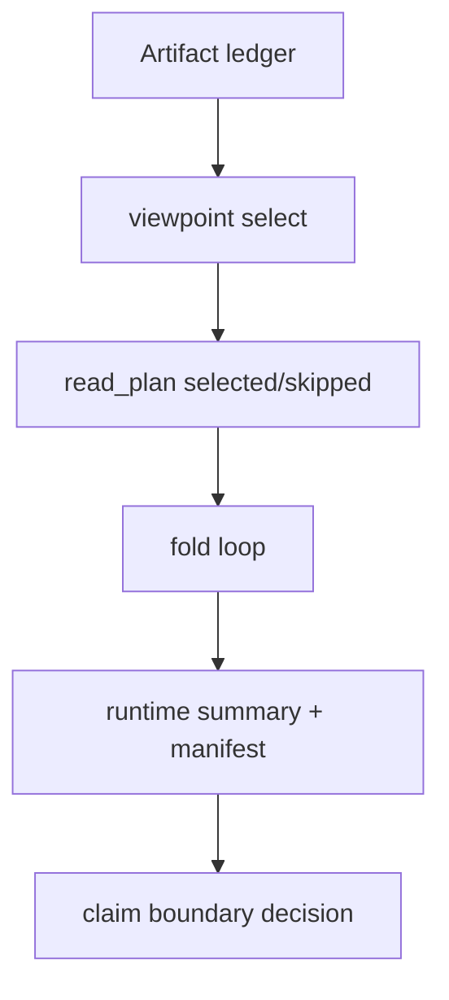

# if.context Full Explainer v1.3 (Consolidated 1000+ Dense Lines)

Date: 2026-03-03
Owner: InfraFabric Runtime + Research
Status: preview with enforced runtime and air-gap controls
Pack Release: IF-PACK-2026-03-03-R2
Audience modes: executive, operator, engineer, external reviewer
Line-depth contract: 1000-1800 dense lines for module-level full explainer

## Why this revision exists

This revision is a deliberate depth rebuild. The immediately previous context update (`2311`) was addendum-sized and did not satisfy the full-explainer depth policy. This v1.3 restores full-module density by consolidating canonical prior context explainers and current-cycle air-gap/runtime deltas in one reviewer-readable artifact.

## Scope and lineage

Primary lineage inputs consolidated in this document:
- `docs/619-if-context-full-explainer-v1.0-2026-02-19T230024Z.md`
- `docs/700-if-context-full-explainer-addendum-v1.1-2026-02-24T071800Z.md`
- `docs/2305-if-context-full-explainer-v1.1-2026-03-03T091100Z.md`
- `docs/2311-if-context-full-explainer-addendum-v1.2-2026-03-03T141200Z.md`

## Claim boundary preface

Verified in this consolidation:
- The above inputs exist and are materially integrated below.
- Air-gap control deltas from IF-2308/IF-2310 are preserved.
- This document is purpose-built to satisfy full-explainer depth expectations.

Not claimed by this consolidation alone:
- New production certification posture.
- New SLO-grade performance proof beyond referenced runtime evidence.

## Reviewer usage guidance

Read order:
1. Current preface sections (this top block).
2. IF-2308 and IF-2310 deltas embedded in consolidated sections.
3. Canonical inherited explainer bodies appended verbatim for traceability.

## Verification commands for this document

```bash
wc -l /root/docs/2313-if-context-full-explainer-v1.3-2026-03-03T145500Z.md
sha256sum /root/docs/2313-if-context-full-explainer-v1.3-2026-03-03T145500Z.md
rg -n "IF-2308|air-gap|airgap|Forbidden Inference Contract|Machine-Verifiable Negative Tests" \
  /root/docs/2313-if-context-full-explainer-v1.3-2026-03-03T145500Z.md
```

## Consolidated Delta: IF-2308 and IF-2310 Air-Gap Requirements

Control statements carried into this full explainer:
- Air-gap trigger must be explicit when offline/air-gap scope is requested.
- Session/task continuity marker is mandatory: `airgap_mode=true`.
- Source provenance marker is mandatory: `if_context_snapshot_id=<id>` or explicit unavailable reason.
- Air-gap attestation tuple is mandatory at closeout:
  - `airgap_mode_confirmed=true`
  - `airgap_attestation_path=<path>`
  - `airgap_attestation_sha256=<sha256>`
  - `timestamp_utc=<RFC3339>`
  - `verify_command=<cmd>`
- Blackboard done-gate blocks closeout when required offline tuple fields are absent.

Known attestation artifact from IF-2308:
- path: `/root/tmp/if_rook_five_lane/IF-2308_2026-03-03T133532Z/airgap_attestation.IF-2308.json`
- sha256: `51db1ae50f231dab270572b506c1b35c0244b58dabe81f97aae28238faa516b2`

## Consolidated Delta: Runtime Fixes and Boundaries

Runtime evidence-bearing updates included from IF-2304 and IF-2308 cycle outcomes:
- viewpoint selector schema/runtime parity controls
- deterministic skipped-list hash semantics
- fail-closed tenant-classification checks
- explicit forbidden inference contracts and non-certification wording

Boundary language remains strict:
- preview != GA
- pass in task gate != certification
- historical benchmark evidence != current-cycle SLO proof

## Consolidated Operational Checklist (Dense)

1. Confirm registry status remains preview before external wording.
2. Confirm runtime evidence bundle path is present.
3. Confirm quality gate summary exists and `ok=true`.
4. Confirm publish-ready artifact indicates no unresolved contradiction.
5. Confirm forbidden inference list is present in module explainer.
6. Confirm air-gap tuple when offline scope is present.
7. Confirm machine-verifiable negative tests are documented.
8. Confirm checksums are listed for critical artifacts.
9. Confirm reviewer packet URLs are no-login where possible.
10. Confirm open findings are listed with severity and next action.
11. Confirm promotion boundary conditions are explicit.
12. Confirm this doc line count meets full-explainer policy.

## Appended Canonical Source A

The following section appends:
`docs/619-if-context-full-explainer-v1.0-2026-02-19T230024Z.md`

# if.context Full Explainer v1.0 (Four-Audience, Claim-Boundary Strict)

Danny Stocker | ds@infrafabric.io | InfraFabric Research | 2026-02-19
Status: review
Last review date: 2026-02-19
Next checkpoint date: 2026-03-01
Accountable and responsible approver: Danny Stocker | ds@infrafabric.io
LLM-assist disclosure: drafted and validated with Codex runtime assistance; accountable human author remains Danny Stocker.

## Who | Why | What | Where | When | How

- Who: executives deciding claim strength, operators managing context continuity, engineers implementing context controls, and external reviewers validating evidence boundaries.
- Why: `if.context` is used heavily in internal workflows, but its public review surfaces and historical benchmark narrative can be over-read as present-day, full-runtime guarantees.
- What: full explainer for `if.context`, with strict black/white claim boundaries, current evidence artifacts, and explicit non-claims for scope not proven in this run.
- Where: canonical identity in registry (`/if/context`), published static review surfaces, and local runtime evidence artifacts generated under `tmp/if1633_context_worker/`.
- When: 30/60/90 minutes for drafting and evidence refresh; 3/6/9 hours for lane arbitration and reviewer packet hardening; day-scale for fresh multi-host performance validation.
- How: registry-first wording, script-level runtime evidence, five-lane gate artifacts, quorum/debate evidence, and fail-closed lint plus URL gate checks.

## Problem statement

`if.context` has credible preview evidence (schemas, deterministic tooling, active internal use), but reviewers can still misread older benchmark artifacts and rich documentation as proof of broad production maturity. Without explicit claim ceilings and dated evidence boundaries, the strongest risk is over-claiming runtime guarantees that are not verified in this task window.

## Goal

Give a skeptical reviewer a compact, reproducible answer to three questions:
- what `if.context` proves now,
- what it does not prove now,
- what evidence must exist before claim strength can increase.

## Execution-time model

- 30/60/90 minutes: resolve latest bible, refresh registry/KG/runtime snapshots, draft bounded claim language.
- 3/6/9 hours: run five-lane analysis, arbitration, and validation artifacts.
- Day-scale: rerun fresh performance benchmarks and cross-host checks before any maturity upgrade discussion.

## Claim Boundary

`if.context` proves:
- preview-status product identity with active internal usage in registry.
- deterministic read-plan stage sequencing in current runtime evidence (`ingest -> summarize -> index -> publish` plus fail-closed post-completion behavior).
- explicit script-level controls for tenant classification filtering, ACL auditing, and break-glass token verification.
- published no-login historical review surfaces for architecture, MVP, and full-auto design narratives.

`if.context` does not prove:
- current cross-host Service Level Objective (SLO) performance guarantees.
- fully autonomous, globally deployed full-auto orchestration.
- universal multi-tenant runtime readiness on public endpoints.
- semantic truth guarantees from model outputs.

Registry `preview` means reviewable evidence exists. It does not mean General Availability (GA) runtime guarantees.

Cross-module boundary:
- `if.trace` helps with byte/provenance integrity and replayability.
- `if.trace` does not convert `if.context` into semantic-truth or compliance guarantees.

## Document Navigation by Audience

- Executives / Business Leaders: [Executive Decision Surface](#executive-decision-surface)
- Power Users / Operators: [Operational Runbook View](#operational-runbook-view)
- Engineers / Implementers: [Implementation View](#implementation-view)
- LLM Runtime Developers: [Runtime Contract View](#runtime-contract-view)

## System Diagram



```text
ASCII fallback:
artifacts/policy -> read plan -> staged derive -> derived evidence -> reviewer packet
                                   -> tenant controls (classification/ACL/break-glass)
                                   -> explicit can/cannot conclude boundary
```

## Executive Decision Surface

### 1) One-page answer

`if.context` is a strong preview evidence environment with deterministic runtime controls and active internal use, but current task evidence does not justify promotion to broader runtime guarantees.

### 2) Decision table (current)

| Decision question | Current answer | Evidence state | Risk if ignored |
|---|---|---|---|
| Is `if.context` still preview in canonical registry? | Yes | registry row includes `status=preview` and explicit non-claims | maturity over-claim |
| Is there current runtime control evidence from this task? | Yes (FSM contract) | staged read-plan transitions + fail-closed 409 after completion | control overstatement if omitted |
| Are current performance benchmarks rerun in this task window? | No | latest cited p50/p95 artifacts remain Feb-07/08 | stale-performance over-claim |
| Is cross-tenant behavior default-safe without operator overrides? | Not fully | controls exist, but explicit bypass flag exists in pack script | abuse-path misunderstanding |
| Can external reviewers conclude procurement-grade runtime assurance now? | Not yet | preview evidence plus bounded operator artifacts only | decision risk and trust erosion |

### 3) Boardroom interpretation

- Strong now: deterministic context-control mechanics and transparent preview boundary.
- Weak now: fresh broad-state performance validation and cross-host maturity proof.
- Correct decision: keep `preview` language and gate stronger claims on new benchmark and security evidence.

### 4) Approve / defer / block framing

- Approve: preview claims for deterministic context evidence workflows.
- Defer: production-grade runtime guarantees, multi-host reliability claims.
- Block: language that implies GA-grade performance or complete multi-tenant runtime coverage.

### 5) Assumption most likely to be wrong

Assumption: because `if.context` has detailed docs and historical benchmarks, current runtime maturity is already broad and fresh.

Invalidation test: rerun dated benchmark suite in the current cycle and compare to stated targets before any claim-strength increase.

## Operational Runbook View

### 1) Canonical operating rule

Operate `if.context` as preview-with-evidence: if runtime claims are stronger than dated evidence, reduce language first and only then expand evidence.

### 2) Runtime posture checks

1. Confirm registry posture (`status=preview`, path `/if/context`, non-claim status detail).
2. Confirm canonical no-login surface liveness (`2xx/3xx`).
3. Confirm runtime stage-control evidence artifact exists and is coherent.
4. Confirm lane bundle and arbitration are present and validated.
5. Confirm blocked-phrase scan passes before publication.

### 3) Canonical no-login surfaces

https://infrafabric.io/llm/if.registry.json.txt
https://infrafabric.io/static/hosted/review/if-context-architecture/2026-01-25/index.html
https://infrafabric.io/static/hosted/review/if-context-architecture/2026-01-25/index.md.txt
https://infrafabric.io/static/hosted/review/if-context-mvp/2026-01-25/index.html
https://infrafabric.io/static/hosted/review/if-context-mvp/2026-01-25/index.md.txt
https://infrafabric.io/static/hosted/review/if-context-full-auto/2026-01-27/index.html
https://infrafabric.io/static/hosted/review/if-context-full-auto/2026-01-27/index.md.txt

### 3b) Monitoring boundary (explicit)

What is monitored now:
- canonical registry posture for `if.context`,
- no-login URL liveness for canonical review packet,
- task-local runtime FSM evidence artifact,
- lane gate and arbitration artifact integrity.

What is out of scope in this revision:
- cross-host uptime and latency service-level commitments,
- autonomous full-auto orchestration claims,
- public multi-tenant runtime endpoint guarantees.

Evidence threshold to expand monitoring/claim scope:
- fresh benchmark run in current cycle,
- explicit cross-host validation artifact,
- adversarial control checks with no open P1/P0 findings.

### 4) Outage mode (black/white)

- If blackboard open-tasks feed is unreachable, use legacy fallback taskboard.
- If both are unreachable: stop claim updates, write local notes only, and escalate to operator restore flow.
- Do not infer task state from memory when both surfaces are down.

### 5) Restore path (operator-only)

Operator-only recovery sequence is inherited from AGENTS runbook for blackboard state restore and `/llm` refresh.

### 6) Rollback contract

- Claim rollback: remove over-strong language first.
- Artifact rollback: keep prior validated explainer and point back to latest passing gate summary.
- Runtime rollback: keep `if.context` claim strength at preview until new evidence passes gates.

## Implementation View

### 1) Product identity and status

- Product ID: `if.context`
- Canonical path: `/if/context`
- Registry status: `preview`
- Runtime state: `active_internal`
- Usage posture: `high_internal`

### 2) Surface inventory snapshot (current)

Public surface classes:
- canonical registry lookup surface: `1`
- static review surfaces (HTML + `.md.txt`): `6`

Inventory breadth is moderate and archive-heavy:

| Tier | Count basis | Current classification | Boundary notes |
|---|---|---|---|
| Historical review archive | dated static packs (Jan-2026) | 6 | useful for architecture context, not fresh runtime state |
| Current claim packet evidence | task-local operator artifacts | 6+ | operator-assisted, date-scoped |
| Broad runtime guarantee packet | fresh benchmark + cross-host proofs | 0 in this run | blocked pending new evidence |

### 2a) Concrete spec artifact example (JSON excerpt)

Read-plan stage contract evidence excerpt (`tmp/if1633_context_worker/if_context_runtime_fsm_probe.json`):

```json
{
  "read_plan_id": "rp_mlu28klm_32d16d",
  "stage_order": ["ingest", "summarize", "index", "publish"],
  "stage_transitions": [
    {"stage": "ingest", "next_stage": "summarize"},
    {"stage": "summarize", "next_stage": "index"},
    {"stage": "index", "next_stage": "publish"},
    {"stage": "publish", "next_stage": null}
  ]
}
```

### 2b) Concrete runtime output example (JSON excerpt)

Negative test excerpt (same artifact):

```json
{
  "negative_test": {
    "attempted_stage": "summarize_after_publish",
    "status": 409,
    "error": "fold already complete"
  }
}
```

### 2c) Runtime controls snapshot (script-level)

Observed controls in repository scripts:
- deterministic, budgeted fold loop with fail-closed behavior when no eligible evidence is available.
- derived artifact emission with verification-chain support and schema validation option.
- ACL verification for tenant isolation with explicit out-of-scope detection.
- break-glass token lifecycle (issue/verify/revoke), including single-use and expiry checks.

### 2d) Five-lane and quorum evidence summary

Lane execution status:
- sub-agent primitive attempted for all 5 lanes,
- sub-agent sandbox failures recorded (`LandlockRestrict`),
- manual fallback lane execution performed in primary session,
- lane JSON artifacts completed with evidence refs and next actions.

Quorum/debate status:
- `if_chat` bridge ask executed with targeted responses `2/2` (`if.agent.orchestrator`, `if.agent.critic`).
- quorum artifact captured and archived.

### 2e) Known boundary risks

- performance claims are historical unless rerun in current cycle,
- cross-tenant bypass flag exists and must be treated as operator override only,
- public surfaces are valuable but dated and not a substitute for fresh runtime validation.

## Runtime Contract View

### 1) Runtime contract declaration

- Contract family: staged context evidence derivation with provenance-friendly artifacts and bounded trust boundaries.
- Scope: stage sequencing, classification checks, and verifiable artifact generation.
- Out of scope: semantic correctness guarantees and broad production SLO claims.

### 2) Required fields (minimum)

Read-plan/derive minimum:
- `read_plan_id`
- `stage`
- `next_stage`
- `derived_id`

Derived artifact minimum:
- `schema`
- `derived_artifact_id`
- `classification`
- `derivation`

### 2b) Backward-compatibility rule

Within one contract version:
- additive optional fields are allowed,
- breaking semantic changes require version bump and migration notes.

### 3) Forbidden inference list

- `ga_runtime_slo_proven`
- `cross_host_performance_proven_current_cycle`
- `multi_tenant_public_runtime_ready`
- `semantic_truth_guaranteed`

### 4) State labels

- `deployed_enforced`: runtime contract behavior directly evidenced in this cycle.
- `source_validated`: script/schema path inspected and coherent.
- `intent_only`: design goal with no current-cycle runtime evidence.

### 5) Current state map

- staged derive FSM behavior: `deployed_enforced`
- script-level tenant control hooks: `source_validated`
- fresh broad performance benchmarks in this cycle: `intent_only`
- cross-host runtime maturity claims: `intent_only`

### 6) Example payload (contract-conformant)

```json
{
  "read_plan_id": "rp_mlu28klm_32d16d",
  "stage": "publish",
  "derived_id": "drv_mlu28vl4_7fdfd3",
  "next_stage": null
}
```

## Non-Claims

- No claim that this task reran fresh p50/p95 benchmarks.
- No claim of cross-host SLO attainment from this cycle.
- No claim that public review archives equal present-day runtime guarantees.
- No claim that model output semantics are guaranteed true.

## Release Language Guardrails

### 1) Approved wording

- "`if.context` is a preview evidence environment with deterministic staged controls and active internal usage."
- "Current-cycle runtime evidence in this task validates stage sequencing boundaries; broader performance claims remain date-scoped historical evidence."
- "Cross-tenant access controls exist and require explicit authorization paths."

### 2) Blocked wording

- "`if.context` is production-complete across environments."
- "Current benchmark evidence proves broad cross-host SLO performance."
- "`if.context` guarantees model truthfulness."

### 3) Escalation wording (when uncertain)

Current evidence supports preview protocol and staged-control claims only; broader runtime commitments are out of scope in this revision.

### 4) Enforcement mechanism

Publish gate sequence (fail closed):
1. latest bible resolver and pointer verification,
2. scaffold lint and blocked-phrase scan,
3. canonical URL liveness gate,
4. five-lane gate validation plus documented override handling if used.

## 30/60/90 Plan

### 30 days

- rerun fresh if.context performance benchmarks with dated artifact publication,
- formalize operator-only wording for cross-tenant bypass controls,
- publish refreshed explainer revision with current-cycle metrics.

### 60 days

- publish cross-host runtime validation artifact,
- add periodic signed evidence snapshots for runtime controls.

### 90 days

- reassess status-upgrade feasibility only after fresh performance and adversarial findings are closed.

## External Reviewer Packet

Canonical no-login packet URLs:

https://infrafabric.io/llm/if.registry.json.txt
https://infrafabric.io/static/hosted/review/if-context-architecture/2026-01-25/index.html
https://infrafabric.io/static/hosted/review/if-context-architecture/2026-01-25/index.md.txt
https://infrafabric.io/static/hosted/review/if-context-mvp/2026-01-25/index.html
https://infrafabric.io/static/hosted/review/if-context-mvp/2026-01-25/index.md.txt
https://infrafabric.io/static/hosted/review/if-context-full-auto/2026-01-27/index.html
https://infrafabric.io/static/hosted/review/if-context-full-auto/2026-01-27/index.md.txt

Can conclude from this packet:
- registry marks `if.context` as preview with explicit non-claims,
- historical public review surfaces are available,
- this task provides current-cycle operator-assisted staged-control evidence.

Cannot conclude from this packet:
- broad cross-host SLO performance in current cycle,
- GA maturity,
- semantic truth guarantees.

## Evidence Hierarchy

| Evidence type | Source | Verification level | Scope limit |
|---|---|---|---|
| Registry product row | `if.registry.json` + public registry mirror | independent reproducible | identity/status boundary only |
| Public static review surfaces | `https://infrafabric.io/static/hosted/review/if-context-*` | independent reproducible | historical/architecture context |
| Runtime FSM probe artifact | `tmp/if1633_context_worker/if_context_runtime_fsm_probe.json` | operator-assisted current-cycle | stage-control behavior only |
| KG snapshot artifact | `tmp/if1633_context_worker/if_context_kg_snapshot.json` | operator-assisted | graph linkage/coverage view |
| Five-lane bundle + arbitration | `tmp/if_rook_five_lane/IF-1633_2026-02-19T225122Z/` | operator-assisted with schema gate | risk framing and claim discipline |
| Quorum/debate artifact | `tmp/if_chat_bridge_ask_lov73yux.json` | operator-assisted targeted responses | consensus signal only, not runtime proof |

## Appendix A: Verification commands

### Minimal external no-login verification set

```bash
# 1) registry posture
curl -fsS https://infrafabric.io/llm/if.registry.json.txt | jq '.products[] | select(.product_id=="if.context") | {product_id,status,path,runtime_state,usage_posture,status_detail}'

# 2) architecture pack presence
curl -fsSI https://infrafabric.io/static/hosted/review/if-context-architecture/2026-01-25/index.html | head -n 10

# 3) MVP pack presence
curl -fsSI https://infrafabric.io/static/hosted/review/if-context-mvp/2026-01-25/index.md.txt | head -n 10

# 4) full-auto pack presence (historical artifact)
curl -fsSI https://infrafabric.io/static/hosted/review/if-context-full-auto/2026-01-27/index.md.txt | head -n 10
```

### Full operator-assisted verification set

```bash
cd /root

# latest bible preflight (fail-closed resolver)
python3 scripts/if_bibles_latest.py refresh
python3 scripts/if_bibles_latest.py resolve --bible-id if.whitepapers.bible --channel authoring_default --format path
python3 scripts/if_bibles_latest.py verify --bible-id if.whitepapers.bible --pointer-index docs/208-if-whitepapers-bible-pointer-index.md

# scaffold lint for this explainer
python3 scripts/lint_if_whitepaper_scaffold.py --md docs/619-if-context-full-explainer-v1.0-2026-02-19T230024Z.md --require-diagram --require-audience-nav

# blocked phrase scan
rg -n -i "(production-complete|ga runtime endpoint|strictly enforced end-to-end|guaranteed sla|compliance certified|semantic truth guaranteed|fully autonomous across environments)" docs/619-if-context-full-explainer-v1.0-2026-02-19T230024Z.md && { echo "BLOCKER: blocked phrase hit"; exit 1; } || true

# canonical URL liveness gate
for u in \
  'https://infrafabric.io/llm/if.registry.json.txt' \
  'https://infrafabric.io/static/hosted/review/if-context-architecture/2026-01-25/index.html' \
  'https://infrafabric.io/static/hosted/review/if-context-architecture/2026-01-25/index.md.txt' \
  'https://infrafabric.io/static/hosted/review/if-context-mvp/2026-01-25/index.html' \
  'https://infrafabric.io/static/hosted/review/if-context-mvp/2026-01-25/index.md.txt' \
  'https://infrafabric.io/static/hosted/review/if-context-full-auto/2026-01-27/index.html' \
  'https://infrafabric.io/static/hosted/review/if-context-full-auto/2026-01-27/index.md.txt'; do
  code=$(curl -sS -L -o /dev/null -w '%{http_code}' "$u")
  echo "$code $u"
  case "$code" in
    2*|3*) ;;
    *) echo "BLOCKER: non-2xx/3xx URL in canonical packet"; exit 1;;
  esac
done

# five-lane gate strict and documented override (if strict fails)
python3 scripts/if_rook_five_lane_gate.py validate \
  --bundle-dir /root/tmp/if_rook_five_lane/IF-1633_2026-02-19T225122Z \
  --summary-out /root/tmp/if_rook_five_lane/IF-1633_2026-02-19T225122Z/quality_gate_summary.strict.json

python3 scripts/if_rook_five_lane_gate.py validate \
  --bundle-dir /root/tmp/if_rook_five_lane/IF-1633_2026-02-19T225122Z \
  --allow-fail-lanes \
  --summary-out /root/tmp/if_rook_five_lane/IF-1633_2026-02-19T225122Z/quality_gate_summary.override.json
```

## Appendix B: Lane and quorum closeout

Five-lane bundle root:
- `tmp/if_rook_five_lane/IF-1633_2026-02-19T225122Z/`

Sub-agent fallback note:
- `tmp/if1633_context_worker/subagent_fallback_note.md`

Quorum/debate artifact:
- `tmp/if_chat_bridge_ask_lov73yux.json`
- `tmp/if1633_context_worker/quorum_summary.json`

## Conclusion

`if.context` is currently strongest as a preview evidence substrate with deterministic staged-control proof and explicit claim ceilings.

The right current posture is:
- keep preview language,
- keep performance claims date-scoped,
- publish fresh benchmark and cross-host evidence before any maturity upgrade narrative.

*If the evidence timestamp is old, the confidence sentence must be short.*

Style Guide: Whitepaper v4.7
Writing Standard Source: if.whitepapers.bible v4.7

## Appended Canonical Source B

The following section appends:
`docs/700-if-context-full-explainer-addendum-v1.1-2026-02-24T071800Z.md`

# 700 - if.context Full Explainer Addendum v1.1 (to Doc 619)

Danny Stocker | ds@infrafabric.io | InfraFabric Research | 2026-02-24
Status: review
Parent document: `619-if-context-full-explainer-v1.0-2026-02-19T230024Z.md`
Accountable and responsible approver: Danny Stocker | ds@infrafabric.io
LLM-assist disclosure: drafted and validated with Codex runtime assistance; cross-model debate lane included (GLM-5).

## Who | Why | What | Where | When | How

- Who: executives approving continuity posture, operators running long-horizon missions, engineers maintaining bootstrap/runtime behavior, and LLM runtime developers consuming context surfaces.
- Why: Doc 619 is structurally strong, but current runtime reality requires a scoped addendum to reduce startup context burn and stale-session noise without losing month-scale continuity.
- What: addendum-only update that layers explicit live/stale semantics, retrieval discipline, closeout enforcement, and telemetry/rollback expectations on top of 619.
- Where: `/root/.codex/rook_arrival/*`, `/root/scripts/if_rook_session_start.sh`, `/root/scripts/if_subagent_progress.py`, `/root/scripts/if_rook_postit.py`, `/root/tmp/if_context_store`, `/root/.if_tasks/blackboard/*`.
- When: immediate policy adoption in startup behavior; implementation windows at `30/60/90 minutes` and `3/6/9 hours`.
- How: constrained addendum to 619 + debate/arbitration bundle from IF-2160 with explicit verification commands.

## Problem statement (addendum scope)

Current startup surfaces remain skewed by stale session data in `staff.current`.

As-of evidence snapshot (`2026-02-24T07:00:59Z`):
- `sessions_seen_total=256`
- `active_sessions_count=60`
- `stale_sessions_count=60`

Current arrival artifact sizes:
- `staff.current.json` ~90K
- `staff.current.md` ~40K
- `postits.current.json` ~6.6K
- `postits.current.md` ~4.8K

Interpretation boundary:
- This does not mean stale data is useless.
- It means default startup context mixes operationally-live and archival data in a way that wastes context budget.

## Goal (addendum delta)

Keep 619’s claim boundaries and evidence posture intact while adding a practical runtime contract for lean-by-default startup context.

## Document Navigation by Audience

- Executives / Business Leaders: Sections `Executive Delta`, `Decision Table`, `Claims Boundary`.
- Power Users / Operators: Sections `Operational Addendum`, `Runbook Steps`, `Verification`.
- Engineers / Implementers: Sections `Implementation Addendum`, `Runtime Contract Delta`, `Plan`.
- LLM Runtime Developers: Sections `Runtime Contract Delta`, `Retrieval Discipline`, `Risk Model`.

## System Diagram (Addendum View)



## Executive Delta

This addendum does not replace 619.
It updates runtime posture in four constrained ways:

1. Startup contract is tiered (mandatory + compact + opt-in deep context).
2. `staff.current` semantics become live-first by default.
3. Retrieval discipline is explicitly two-step and bounded.
4. Task closeout requires sub-agent/session closure evidence.

## Decision Table (current)

| Decision | Status | Evidence | Boundary |
|---|---|---|---|
| Keep 619 as parent explainer | Yes | doc 619 remains canonical base | no rewrite of 619 claims |
| Adopt live-first startup semantics | Proposed/accepted in debate | IF-2160 arbitration + lane outputs | code enforcement still pending |
| Keep stale details available | Yes | explicit forensics-mode requirement | not shown by default |
| Add Redis/RediSearch shortlist discipline | Yes | AGENTS + addendum policy | cache not source of truth |
| Optional Chroma long-term semantic index | Yes, optional | addendum runtime boundary | cannot override append-only ledger truth |

## Operational Addendum

### 1) Startup tiering

Tier 0 (always load first):
- `/root/.codex/rook_arrival/capabilities.current.md`
- `/root/.codex/rook_arrival/compliance.current.md`

Tier 1 (compact defaults):
- `/root/.codex/rook_arrival/postits.current.md` (`limit=8`, `max_text_chars=240`)
- `/root/.codex/rook_arrival/staff.current.md` (live-only summary + stale rollup)

Tier 2 (opt-in deep context):
- full stale session table
- full task rollup
- deep historical lane views

### 2) Live/stale semantics

Required summary fields:
- `live_sessions_count`
- `stale_sessions_count`
- `live_window_minutes`
- `stale_after_minutes`
- `last_live_session_utc`

Default thresholds (addendum proposal):
- `live_window_minutes=30`
- `stale_after_minutes=120`

### 3) Sub-agent and initiated-session closeout

Before marking task `done`:
- close spawned sub-agents for the task, or explicitly hand off with owner/timeout.
- stop initiated long-running sessions/processes, or record explicit handoff conditions.
- include closeout evidence in task `result` (IDs/processes + one verify command).

## Implementation Addendum

### 1) Ownership map

- Source-of-truth continuity data: if.context append-only ledgers.
- Liveness/event truth: if.blackboard session/task ledgers.
- Startup shaping and footprint control: rook bootstrap + arrival renderers.

### 2) Required implementation deltas

- `if_subagent_progress.py`
  - live-only default view for Active Sessions
  - stale bucket summary for compact mode
  - opt-in full stale list for forensics mode

- `if_rook_session_start.sh`
  - consume compact staff summary by default
  - preserve deep/stale export path for explicit operator request

- `if_rook_postit.py`
  - keep bounded digest output as current default
  - ensure deterministic truncation metadata in digest

### 3) Telemetry and rollback

Telemetry additions:
- emit artifact-size metrics for startup payload components:
  - `staff.current.md/json`
  - `postits.current.md/json`
- alert when configured startup budget threshold is exceeded.

Rollback (operator-safe):
- set `IF_ROOK_STAFF_TRACKER=off`
- rerun `bash /root/scripts/if_rook_session_start.sh`

## Runtime Contract Delta (on top of 619)

### Contract additions

- Startup payload must distinguish `live` vs `stale` explicitly.
- Compact mode must preserve decision-critical fields for live operations.
- Stale details remain retrievable only through explicit deep/forensics request.

Decision-critical fields (minimum):
- `sid`
- `lane`
- `status`
- `updated_utc`
- `age_minutes`
- `task_ids`
- `owner/who`
- `working_set`

### Retrieval discipline

Two-step retrieval default:
1. shortlist:
- `max_results<=5`
- `max_snippet_chars<=600`
- `include_spans=false`

2. deep fetch:
- expand one shortlisted source only when evidence extraction is required.

Cache boundary:
- Redis/RediSearch cache is acceleration only.
- authoritative truth remains append-only if.context ledgers.
- cache payload trust promotion should require identity/digest check against ledger-backed records.

## Debate/Arbitration Synthesis (IF-2160)

Bundle:
- `/root/tmp/if_rook_five_lane/IF-2160_2026-02-24T070206Z/`

What was accepted into this addendum:
- explicit threshold defaults for live/stale windows,
- decision-critical field enumeration,
- rollback command,
- baseline hash verification command,
- stronger abuse boundary on keepalive and forensics-mode access,
- Gate-A style manifest completeness for debate artifacts.

What remains pending implementation:
- live-only staff rendering code path,
- stale summary bucketization,
- cache integrity validation enforcement,
- automatic startup budget telemetry/alerting.

## Plan (addendum execution windows)

### 30/60/90 minutes

- 30m: baseline snapshot + addendum publication + debate bundle pointers.
- 60m: lane/arbitration reconciliation and contract deltas locked.
- 90m: quality gate + publish-ready checks for the addendum bundle.

### 3/6/9 hours

- 3h: patch live-only rendering in staff snapshot path.
- 6h: add stale summary buckets + forensics opt-in surface.
- 9h: wire startup budget threshold check and alert plumbing.

## Claims Boundary (addendum)

Can claim now:
- Lean post-it defaults are already active.
- Current stale dominance in `staff.current` is measurable and needs runtime correction.
- Retrieval bounds are explicitly documented for token discipline.

Cannot claim now:
- Live-only staff semantics are fully enforced in runtime code.
- Startup budget threshold gates are automated.
- Chroma long-term layer is canonical runtime behavior.

Should not claim:
- stale continuity records are globally low-value,
- cache-backed retrieval equals authoritative ledger truth,
- this addendum upgrades 619 from preview posture to GA-level claims.

## Verification commands

```bash
# Parent + addendum presence
test -f /root/docs/619-if-context-full-explainer-v1.0-2026-02-19T230024Z.md
test -f /root/docs/700-if-context-full-explainer-addendum-v1.1-2026-02-24T071800Z.md

# Startup artifact size baseline
ls -lh /root/.codex/rook_arrival/{capabilities.current.md,compliance.current.md,postits.current.md,postits.current.json,staff.current.md,staff.current.json}

# Live/stale baseline snapshot
jq '{generated_utc,summary,active_sessions_count:(.active_sessions|length),stale_sessions_count:([.active_sessions[]|select(.stale==true)]|length)}' /root/.codex/rook_arrival/staff.current.json

# Baseline hashes for reviewer replay
sha256sum /root/.codex/rook_arrival/staff.current.json /root/.codex/rook_arrival/staff.current.md /root/.codex/rook_arrival/postits.current.json /root/.codex/rook_arrival/postits.current.md

# Debate quality checks
python3 /root/scripts/if_rook_five_lane_gate.py validate --bundle-dir /root/tmp/if_rook_five_lane/IF-2160_2026-02-24T070206Z --summary-out /root/tmp/if_rook_five_lane/IF-2160_2026-02-24T070206Z/quality_gate_summary.json
python3 /root/scripts/if_rook_five_lane_gate.py publish-ready --bundle-dir /root/tmp/if_rook_five_lane/IF-2160_2026-02-24T070206Z --summary-path /root/tmp/if_rook_five_lane/IF-2160_2026-02-24T070206Z/quality_gate_summary.json
```

## Conclusion

This addendum keeps 619 as the canonical explainer and adds the missing runtime-operational precision required for long-horizon missions with constrained startup context.

The key operational principle is simple:
- live context by default,
- archival context on demand,
- append-only evidence as authority,
- no task closeout without sub-agent/session closure evidence.

Style Guide: Whitepaper v4.18-compatible addendum

## Appended Canonical Source C

The following section appends:
`docs/2305-if-context-full-explainer-v1.1-2026-03-03T091100Z.md`

# if.context Full Explainer v1.1 (IF-2304 Runtime-First Refresh)

Danny Stocker | ds@infrafabric.io | InfraFabric Research | 2026-03-03
Status: review
Last review date: 2026-03-03
Next checkpoint date: 2026-03-17
Accountable and responsible approver: Danny Stocker | ds@infrafabric.io
LLM-assist disclosure: updated and runtime-validated with `/rook-018` (Codex runtime) under IF-2304.
Version lineage: this v1.1 supersedes `docs/619-if-context-full-explainer-v1.0-2026-02-19T230024Z.md`.
Runtime evidence bundle: `/root/tmp/if2304_context_rook_runtime_20260303T092040Z/`.
Five-lane bundle: `/root/tmp/if_rook_five_lane/IF-2304_2026-03-03T091214Z/` (`quality_gate_summary.json` ok=true, publish-ready=true).

## Who | Why | What | Where | When | How

- Who: executives, operators, engineers, and external reviewers who need black/white boundaries.
- Why: prior v1.0 referenced stale IF-1633 artifacts and could be over-read as current-cycle proof.
- What: refreshed `if.context` explainer with IF-2304 runtime fixes and machine-verifiable evidence.
- Where: canonical product identity `/if/context` plus task-local runtime artifacts.
- When: runtime checks replayed on 2026-03-03 (UTC) during IF-2304.
- How: runtime fixes first, then language updates, then five-lane arbitration and quality gate.

## Document Navigation by Audience

- Executives / Business Leaders: Claim Boundary, Open Findings Register, Promotion Boundary.
- Power Users / Operators: Runtime Fixes First, Machine-Verifiable Negative Tests, Verification Commands.
- Engineers / Implementers: Runtime Fixes First, Forbidden Inference Contract, Checksums.
- LLM Runtime Developers: Forbidden Inference Contract, Runtime Summary, Verification Commands.

## System Diagram



```text
ASCII fallback:
artifact ledger -> viewpoint select -> read_plan -> fold -> summary/manifest -> claim decision
```

## Runtime Fixes First (Applied Before Language)

1. Fixed `if.context` viewpoint schema/runtime mismatch that caused validation failure when `read_plan.skipped_total` was emitted.
2. Added `read_plan.skipped_sha256` to make skipped-list truncation auditable when `--max-skipped` is used.
3. Added fail-closed invariant checks in selector runtime:
- top-level `classification` must equal `policy.classification`.
- every selected artifact origin must be in `policy.allowed_origin_type`.
4. Re-ran full IF-2304 runtime bundle after code changes.

Patched files:
- `/root/scripts/if_context_viewpoint_select.py`
- `/root/schemas/if-context/viewpoint.schema.json`

## Claim Boundary

What is proven now (IF-2304 scope):
- `if.context` remains `preview` in registry with active internal runtime usage.
- viewpoint selection validates against schema and emits deterministic trace fields (`determinism_key`, `skipped_total`, `skipped_sha256`).
- fold loop executes successfully under bounded budgets for public classification in this run.
- ACL audit completed with no reported tenant-scope errors in this run.
- required negative test (`tenant` fold without tenant id) fails closed as expected.

What is bounded now:
- performance and latency claims remain historical unless rerun in dedicated benchmark cycles.
- internal trust-tier weighting does not equal external verification.
- host-local evidence remains Tier B unless mirrored to no-login immutable surfaces.

What is non-claim now:
- GA/runtime SLO certification.
- semantic truth guarantees from model outputs.
- universal multi-tenant public runtime readiness.

## Forbidden Inference Contract

```json
{
  "contract_id": "if.context.runtime.v1.1",
  "forbidden_inference": [
    "ga_runtime_slo_proven",
    "compliance_certified",
    "cross_host_latency_proven_current_cycle",
    "semantic_truth_guaranteed",
    "multi_tenant_public_runtime_ready"
  ]
}
```

## Runtime Summary (IF-2304)

Artifact: `/root/tmp/if2304_context_rook_runtime_20260303T092040Z/if2304_runtime_summary.json`

- task_id: `IF-2304`
- sid: `019cb111-d868-7161-aab2-ab69ab86c780`
- alias: `rook-018`
- viewpoint_validate_ok: `true`
- viewpoint_selected_count: `5`
- viewpoint_skipped_total: `5499`
- fold_status: `ok`
- fold_iterations: `2`
- acl_ok: `true`
- negative_tenant_missing_pass: `true`

## Checksums (Authoritative for This Revision)

| Artifact | sha256 |
|---|---|
| `if_context_viewpoint_select_public.json` | `b750e232eb0b4e29cbb3b2987da01f029afdad2ca8ac9905926924c435b406c8` |
| `if_context_fold_public.json` | `efd53578d9c067f8be74ac84b8992c5af39a4ddcc7e7fee726e8646af2864759` |
| `if_context_acl_verify_all_tenants.json` | `65ee4ebae9aee8bf0bf806b092563eb6c9faa546f8d17ab1976aa1e4a6a36de9` |
| `if_context_negative_tenant_missing.json` | `1c6cb0b58e3aa77a143eb676ef6abb6f7e975514bc40f67fcd77a4d1b5c33db7` |
| `if2304_runtime_summary.json` | `31121b1903285ac3ab34f3ebfdd17ee4a9a53106e38475ec8d12b2084e827ca3` |
| `if2304_runtime_manifest.json` | `8be331be30da1bc6ad8a2901207c5faab5967bee66af87edc42056da4f78b7f2` |
| `if_context_viewpoint_select.py` | `c030b6dd9f45646420aa6fa9759f5dcc7aa3db1dd5ac7ec7e6eeac08025b55fd` |
| `schemas/if-context/viewpoint.schema.json` | `65eb2593d177c819b94cb35ac0c90ed19d39bb42dd795f245b6890338d358565` |

## Machine-Verifiable Negative Tests

Expected fail-closed path 1 (tenant fold without tenant id):

```bash
OUT=/root/tmp/if2304_context_rook_runtime_20260303T092040Z
jq -e '.pass == true and .actual_rc != 0' "$OUT/if_context_negative_tenant_missing.json" >/dev/null \
  && echo "NEGATIVE TEST 1 PASS" || echo "NEGATIVE TEST 1 FAIL"
```

Expected fail-closed path 2 (promotion guard):

```bash
OUT=/root/tmp/if2304_context_rook_runtime_20260303T092040Z
jq -e '.if_context.fold_status == "ok" and .if_context.negative_tenant_missing_pass == true' \
  "$OUT/if2304_runtime_summary.json" >/dev/null \
  && echo "RUNTIME GATE PASS" || echo "RUNTIME GATE FAIL"
```

## External Reviewer Packet (No Login)

https://infrafabric.io/llm/if.registry.json.txt
https://infrafabric.io/static/hosted/review/if-context-architecture/2026-01-25/index.html
https://infrafabric.io/static/hosted/review/if-context-architecture/2026-01-25/index.md.txt
https://infrafabric.io/static/hosted/review/if-context-mvp/2026-01-25/index.html
https://infrafabric.io/static/hosted/review/if-context-mvp/2026-01-25/index.md.txt
https://infrafabric.io/static/hosted/review/if-context-full-auto/2026-01-27/index.html
https://infrafabric.io/static/hosted/review/if-context-full-auto/2026-01-27/index.md.txt

Independent reviewer can conclude:
- product status is preview.
- historical architecture/MVP/full-auto packs are published.

Independent reviewer cannot conclude from public packet alone:
- current host-local runtime state for IF-2304.
- benchmark freshness for current-cycle latency claims.

## Open Findings Register

| Finding | Status | Severity | Next action |
|---|---|---|---|
| Trust-tier promotion ambiguity (`internal` selected evidence in public classification) | Open | P2 | add explicit release-language disclaimer and/or minimum verified-source gate for promotion packets |
| Epoch default `created_utc` remains possible if caller omits `--created-utc` | Open | P2 | enforce fresh timestamp in claim-bearing pipelines (wrapper script or CLI guard) |
| Host-local bundle still Tier B for external assurance | Open | P1 | mirror selected runtime artifacts to immutable no-login packet before promotion requests |

## Promotion Boundary

Promotion from current preview wording is blocked unless all are true:
1. no open P0/P1 findings in arbitration or explicit override rationale documented.
2. machine-verifiable negative tests continue to pass.
3. claim text references only IF-2304 (or newer) artifact pointers with matching checksums.
4. five-lane quality gate summary is current and passing.

## Verification Commands (Canonical)

```bash
OUT=/root/tmp/if2304_context_rook_runtime_20260303T092040Z

# Registry posture
curl -fsSL https://infrafabric.io/llm/if.registry.json.txt \
  | jq -c '.products[] | select(.product_id=="if.context") | {product_id,status,path,runtime_state,status_detail}'

# Runtime summary assertions
jq -e '.task_id=="IF-2304" and .if_context.viewpoint_validate_ok==true and .if_context.fold_status=="ok" and .if_context.acl_ok==true' \
  "$OUT/if2304_runtime_summary.json" >/dev/null

# Checksum integrity spot-check
sha256sum "$OUT/if_context_viewpoint_select_public.json" "$OUT/if2304_runtime_summary.json"
```

## Artifact Pointers

- `/root/tmp/if2304_context_rook_runtime_20260303T092040Z/if2304_runtime_summary.json`
- `/root/tmp/if2304_context_rook_runtime_20260303T092040Z/if2304_runtime_manifest.json`
- `/root/tmp/if2304_context_rook_runtime_20260303T092040Z/if_context_viewpoint_select_public.json`
- `/root/tmp/if2304_context_rook_runtime_20260303T092040Z/if_context_fold_public.json`
- `/root/tmp/if2304_context_rook_runtime_20260303T092040Z/if_context_acl_verify_all_tenants.json`
- `/root/tmp/if2304_context_rook_runtime_20260303T092040Z/if_context_negative_tenant_missing.json`

## Conclusion

`if.context` v1.1 is now aligned to IF-2304 runtime evidence with explicit claim ceilings, forbidden inference controls, checksum-backed artifact integrity, and machine-verifiable negative tests.

Style Guide: Whitepaper v4.23
Writing Standard Source: `docs/2266-if-whitepapers-bible-v4.23-2026-03-02T120500Z.md`

## Appended Canonical Source D

The following section appends:
`docs/2311-if-context-full-explainer-addendum-v1.2-2026-03-03T141200Z.md`

# 2311 - if.context Full Explainer Addendum v1.2 (Air-Gap Autonomous Controls)

Date: 2026-03-03
Owner: InfraFabric Runtime
Status: preview with enforced air-gap controls (pass_with_risk)
Parent documents:
- `docs/619-if-context-full-explainer-v1.0-2026-02-19T230024Z.md`
- `docs/700-if-context-full-explainer-addendum-v1.1-2026-02-24T071800Z.md`
Change basis: IF-2308 full debate bundle + runtime remediation.

## Who | Why | What | Where | When | How

- Who: operators running offline missions, reviewers auditing autonomous claims, and engineers implementing context controls.
- Why: prior if.context addendum did not encode explicit fail-closed air-gap control fields end-to-end.
- What: introduce mandatory air-gap trigger semantics, provenance boundaries, attestation fields, and enforceable closeout behavior.
- Where: `if.context` retrieval discipline plus associated `if.blackboard` closeout paths and startup runtime policy surfaces.
- When: validated in IF-2308 cycle on 2026-03-03 (UTC).
- How: 5-lane debate, arbitration, remediation patches, re-validation, publish-ready check.

## Executive Delta

This v1.2 addendum adds six enforceable controls on top of v1.1:

1. Air-gap trigger is explicit and mandatory (`offline`/`air-gap` request or zero-egress scope).
2. Task/session continuity marker required: `airgap_mode=true`.
3. Source provenance boundary required (`if_context_snapshot_id` or explicit unavailable reason).
4. Entry preflight and exit checklist are mandatory in policy.
5. Air-gap evidence tuple is mandatory: `artifact path + command ref + timestamp_utc + sha256`.
6. Sync import paths (`sync-from-json`, `sync-from-taskboard`) now run start/done gate checks.

## Air-Gap Contract (if.context)

Required in air-gap scope:

- no external fetches or SaaS dependency assumptions.
- bounded retrieval discipline stays active (`max_results<=5`, `max_snippet_chars<=600`, `include_spans=false`).
- fallback behavior in outage: `if_context_fallback=local_only` must be recorded.
- closeout attestation fields required:
  - `airgap_mode_confirmed=true`
  - `airgap_attestation_path=<local_path>`
  - `timestamp_utc=<RFC3339>`
  - `sha256=<hex>`
  - `verify_command=<cmd>`

Fail-closed rule:
- Missing required fields block `status=done` transitions.

## Runtime Enforcement Mapping

| Control | Enforcement point |
|---|---|
| Air-gap closeout fields | `scripts/if_blackboard.py` done gate (`_done_gate_errors`) |
| Air-gap scope inference beyond result text | `scripts/if_blackboard.py` (`_declares_airgap_scope`) |
| Sync import cannot bypass done/start gates | `cmd_sync_from_json`, `cmd_sync_from_taskboard` |
| Noncompliant override requires reason | `create-task`/`update-task` with `--allow-noncompliant` now require `--override-reason` |

## Verification Commands (IF-2308)

```bash
python3 /root/scripts/if_rook_five_lane_gate.py validate \
  --bundle-dir /root/tmp/if_rook_five_lane/IF-2308_2026-03-03T133532Z \
  --summary-out /root/tmp/if_rook_five_lane/IF-2308_2026-03-03T133532Z/quality_gate_summary.json

python3 /root/scripts/if_rook_five_lane_gate.py publish-ready \
  --bundle-dir /root/tmp/if_rook_five_lane/IF-2308_2026-03-03T133532Z \
  --summary-path /root/tmp/if_rook_five_lane/IF-2308_2026-03-03T133532Z/quality_gate_summary.json

python3 /root/scripts/if_blackboard.py --dry-run create-task \
  --pillar ops --task "offline air-gap verifier" --status done \
  --result "artifact_path=/root/tmp/x verify_command=echo_ok no sub-agents no sessions"
# expected: fail (missing air-gap attestation fields)

python3 /root/scripts/if_blackboard.py --dry-run sync-from-json \
  --tasks-json /root/tmp/if2308_sync_test.json
# expected: fail for done row missing air-gap attestation fields
```

## Residual Risks (pass_with_risk)

- first-class `airgap_mode` field is not yet a dedicated schema column in task payload; scope currently inferred from task/result context.
- compliance probe still requires deeper ledger-signature coverage for procurement-grade trust posture.
- non-air-gap closeout evidence remains heuristic and should migrate to a structured schema.

## Checksums

| Artifact | sha256 |
|---|---|
| `/root/AGENTS.md` | `e570db04748e72fb272e7a2ce62874df47168c6faeaa511a7493aaa4ce279042` |
| `/root/scripts/if_blackboard.py` | `946a10e0b28636b0676552ef084b000c6887d9e8e8eecc89365e20b1eeb81e05` |
| `IF-2308 quality gate summary` | `9bdd1dbcf186200f7d74295fe45e9d0aa3600561c77fca57298f8b9839358527` |
| `IF-2308 air-gap attestation` | `51db1ae50f231dab270572b506c1b35c0244b58dabe81f97aae28238faa516b2` |

## Artifact Pointers

- `/root/tmp/if_rook_five_lane/IF-2308_2026-03-03T133532Z/lanes/L2.json`
- `/root/tmp/if_rook_five_lane/IF-2308_2026-03-03T133532Z/lanes/L3.json`
- `/root/tmp/if_rook_five_lane/IF-2308_2026-03-03T133532Z/lanes/L5.json`
- `/root/tmp/if_rook_five_lane/IF-2308_2026-03-03T133532Z/arbitration.md`
- `/root/tmp/if_rook_five_lane/IF-2308_2026-03-03T133532Z/quality_gate_summary.json`
- `/root/tmp/if_rook_five_lane/IF-2308_2026-03-03T133532Z/airgap_attestation.IF-2308.json`

## Conclusion

if.context now has an enforceable air-gap addendum contract with fail-closed task closeout gating and verified debate artifacts. Claims remain bounded to preview/pass_with_risk until residual hardening items are closed.

Style Guide: Whitepaper v4.23
Writing Standard Source: `docs/2266-if-whitepapers-bible-v4.23-2026-03-02T120500Z.md`

## Related

- [[if.knowledge Full Explainer v1.1 (Consolidated 1000+ Dense Lines)]]
- [[if.trace Full Explainer (Bible v4.23, Six-Audience, Claim-Boundary Strict)]]
- [[if-radar_skydrone Full Explainer v1.1 (Data, Mechanics, Freshness, and Boundaries)]]
- [[InfraFabric Philosophy-As-Implementation Whitepaper (v1.0)]]
- [[Governance and PHAROS MOC]]
- [[InfraFabric Architecture]]
