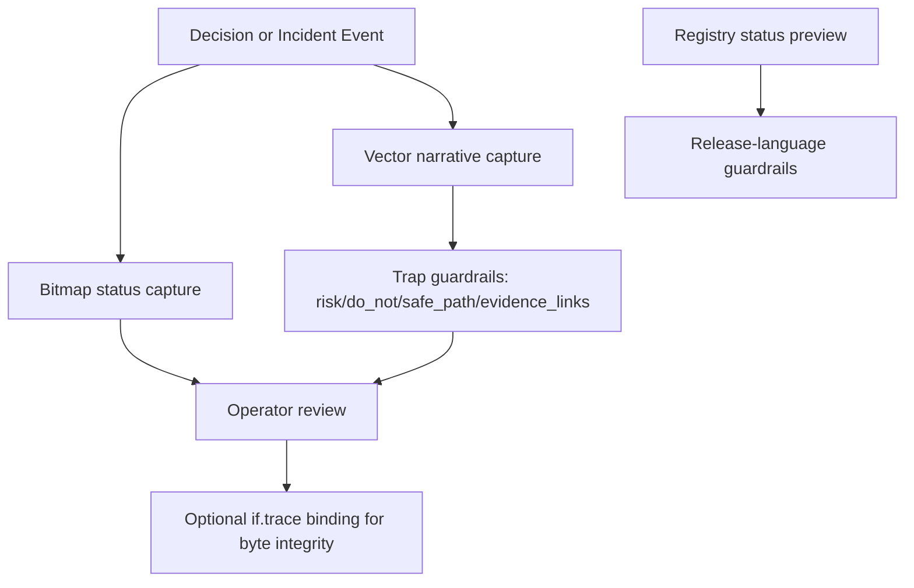
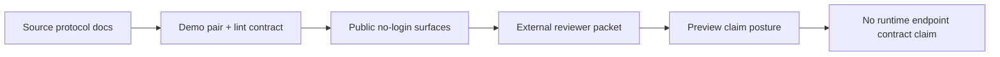

# if.story Full Explainer v1.1 (Four-Audience, Claim-Boundary Strict)

Danny Stocker | ds@infrafabric.io | InfraFabric Research | 2026-02-19
Status: review
Last review date: 2026-02-19
Next checkpoint date: 2026-03-01
Accountable and responsible approver: Danny Stocker | ds@infrafabric.io
LLM-assist disclosure: drafted and validated with Codex runtime assistance; accountable human author remains Danny Stocker.

## Who | Why | What | Where | When | How

- Who: executives approving outward language, operators preserving claim discipline, engineers shaping protocol/lint contracts, and LLM runtime developers consuming narrative artifacts.
- Why: prevent claim collapse between a strong preview protocol surface and runtime guarantees that are not currently claimed.
- What: full explainer for `if.story`, a narrative protocol that captures decision trajectory ("vector") alongside point-in-time status ("bitmap"), including contract mechanics, lint boundaries, and external reviewer verifiability.
- Where: `/if/story/`, registry mirror surfaces, `if.story` demo artifacts, protocol notes, and lint-rules page.
- When: immediate use for release wording, reviewer packets, and protocol hardening decisions.
- How: registry-first wording, black/white claim boundaries, concrete artifact examples, and fail-closed URL/lint gates.

## Problem statement

`if.story` is InfraFabric's narrative logging protocol module (vector versus bitmap). The recurring failure mode is conflating:
- published protocol/demonstration artifacts,
- lint policy intent,
- deployed runtime endpoint commitments.

Operational definition:
- bitmap = point-in-time state capture (`what/when`) used for status visibility.
- vector = narrative trajectory capture (`why/so-what/risk`) used for decision continuity.

If these are blended, preview protocol quality is misrepresented as General Availability (GA) runtime guarantees.

Concrete collapse example:
- a reviewer sees a rich `narrative_log.v1` demo pair and infers a deployed `if.story` runtime service with live performance/SLA commitments. That commitment is not currently claimed.

## Goal

Enable a skeptical reviewer to answer, in black/white terms:
- what `if.story` proves today,
- what is protocol/demo evidence versus runtime commitment,
- what remains intentionally preview-only.

## Execution-time model

- 30/60/90 minutes: refresh registry row, verify canonical surfaces, re-validate demo/lint artifact integrity.
- 3/6/9 hours: reconcile source protocol docs with public surfaces and release wording.
- Day-scale: external reviewer pass and governance decision on any claim upgrades.

## Claim Boundary

`if.story` proves:
- preview-status public surfaces exist and are reachable,
- concrete `narrative_log.v1` demonstration artifacts are published,
- public lint rules define publish-blocking expectations for `trap`, evidence links, URL hygiene, and product-id validity.

`if.story` does not prove:
- deployed runtime endpoint/service operation on this host,
- factual correctness, intent, or safety of narrative content,
- GA availability/SLO commitments,
- legal/compliance certification.

Why `intent` is explicitly non-claimed:
- narrative logs can be misread as policy/commitment statements; `if.story` proves artifact structure and guardrails, not institutional intent.

Registry status `preview` means public protocol/demo evidence exists. It does not imply deployed runtime guarantees.

Cross-reference:
- `if.trace` is `shipped` for byte-integrity receipt surfaces; this does not upgrade `if.story` status.
- `if.bus` and `if.api` remain independently status-scoped; no cross-module status inheritance is allowed.

## Document Navigation by Audience

- Executives / Business Leaders: [Executive Decision Surface](#executive-decision-surface)
- Power Users / Operators: [Operational Runbook View](#operational-runbook-view)
- Engineers / Implementers: [Implementation View](#implementation-view)
- LLM Runtime Developers: [Runtime Contract View](#runtime-contract-view)

## System Diagram



```text
ASCII fallback:
event -> bitmap status + vector narrative -> trap guardrails (risk/do_not/safe_path/evidence_links) -> review
                                         -> optional if.trace byte-integrity binding
registry preview -> release language guardrails
```

Design note:
- trap applies to the vector branch because free-text narrative can imply commitments.
- bitmap records stay schema-bounded and registry-validated, so they do not require a trap analog in this revision.

### Source vs Public Surface Split (critical)



```text
ASCII fallback:
source protocol docs -> published demo/lint artifacts -> reviewer verification -> preview posture only
```

## Executive Decision Surface

### 1) One-page answer

`if.story` is a high-integrity preview protocol surface: concrete artifacts are public and verifiable, while runtime service guarantees are intentionally unclaimed.

### 2) Decision table (current)

| Decision question | Current answer | Evidence state | Risk if ignored |
|---|---|---|---|
| Is `if.story` publicly reachable as a product surface? | Yes | `/if/story/` returns `200` | appears stale or non-operational |
| Is `if.story` registry status `preview`? | Yes | local + public registry mirrors agree | accidental GA over-claim |
| Are concrete `narrative_log.v1` artifacts public? | Yes | `.md` + `.json` demo files return `200` | protocol remains conceptual-only |
| Are lint guardrails publicly documented? | Yes | `/if/story/lint-rules/` and `.md` return `200` | quality checks appear ad-hoc |
| Is a deployed `if.story` runtime endpoint contract claimed? | No | explicit non-claims in page copy and this explainer | operational/legal overstatement |
| Does `if.trace` binding imply `if.story` runtime maturity? | No | independent status boundary | cross-module status inflation |

### 3) Boardroom interpretation

- Strong today: concrete protocol artifacts, public lint guardrails, and no-login reviewer verifiability.
- Narrow by design: runtime endpoint commitments remain unclaimed.
- Gate for stronger claims: explicit endpoint commitments + sustained runtime evidence.

### 4) Approve / defer / block framing

- Approve: preview language for protocol mechanics, demo artifacts, and lint-rule publication.
- Defer: any runtime reliability/SLA wording (target checkpoint: 2026-03-15).
- Block: statements equating demo richness with deployed runtime guarantees.

### 5) Assumption most likely to be wrong

Assumption: because narrative artifacts are detailed and public, runtime guarantees are implied.

Invalidation test: if outward language equates protocol artifacts with deployed runtime guarantees, block publication until corrected.

## Operational Runbook View

### 1) Canonical operating rule

Operate `if.story` as preview protocol evidence first: when language strength exceeds evidence strength, downgrade language immediately.

### 2) Runtime posture checks

1. Confirm registry alignment: `product_id=if.story`, `status=preview`, `path=/if/story`.
2. Confirm all canonical URLs in this explainer resolve `2xx/3xx`.
3. Confirm the demo JSON still contains `trap` keys (`risk`, `do_not`, `safe_path`, `evidence_links`).
4. Confirm demo `product_ids` are registry-valid.
5. Confirm release wording does not imply runtime endpoint commitments.
6. If any canonical URL returns `4xx/5xx`, block publication until fixed.

### 3) Canonical no-login surfaces

https://infrafabric.io/if/story/
https://infrafabric.io/if/story/lint-rules/
https://infrafabric.io/if/story/lint-rules.md
https://infrafabric.io/llm/if.registry.json.txt
https://infrafabric.io/llm/products/if-story/
https://infrafabric.io/llm/products/if-story/demo/index.html
https://infrafabric.io/llm/products/if-story/demo/narrative_log.v1.md
https://infrafabric.io/llm/products/if-story/demo/narrative_log.v1.json
https://infrafabric.io/llm/products/if-story/vector-and-narrative-logging/2026-01-10/index.html
https://infrafabric.io/llm/products/if-story/vector-and-narrative-logging/2026-01-10/index.md
https://infrafabric.io/if/trace/

### 3b) Monitoring boundary (explicit)

- `if.story` currently has no claimed deployed runtime endpoint on this host.
- Monitoring scope in this revision is publication integrity: URL liveness, registry drift, and wording drift.
- If runtime endpoint commitments are introduced, add runtime process/latency/error evidence before any status-language upgrade.

### 4) Incident posture

Fail closed when:
- any canonical URL returns `4xx/5xx`,
- registry status/path drifts from expected values,
- demo artifact contract checks fail (`trap`/`evidence_links`/product-id validity),
- outward language implies runtime guarantees not evidenced.

### 5) Rollback principle

Rollback claim language before implementation changes. If evidence and wording diverge, remove stronger claims first.

## Implementation View

### 1) Product identity and status

- Product ID: `if.story`
- Brand label: `if.story`
- Canonical path: `/if/story`
- Registry status: `preview`
- Status detail: protocol artifacts are live (story pack + vector logging); no deployed runtime on this host.

### 2) Artifact inventory snapshot (current)

Public protocol/demo assets:
- demo index: `1`
- demo payload pair: `2` (`narrative_log.v1.md`, `narrative_log.v1.json`)
- protocol note pages: `2` (HTML + Markdown)
- lint rules pages: `2` (HTML + Markdown)

Source-context docs (host repo):
- `docs/381-if-story-if-emotion-repository-product-consolidated-sanitized-pack-v1-2026-02-10.md`
- `docs/382-if-story-if-emotion-repository-product-fulltext-consolidated-sanitized-pack-v1-2026-02-10.md`
- `docs/external/module-briefs/2026-02-18/if-story.md`

### 2a) Vector vs bitmap examples (concrete)

Bitmap example (point-in-time status record):
```json
{
  "event_id": "ifstory-status-2026-02-19-001",
  "captured_utc": "2026-02-19T19:20:00Z",
  "product_id": "if.story",
  "status": "preview",
  "surface": "/if/story"
}
```

Vector example (decision trajectory record):
- uses `narrative_log.v1` to capture risk framing, non-claims, and safe-path guidance over time.
- carries mandatory `trap` guardrails because narrative prose is high-risk for implied commitments.

Why bitmap has no trap analog:
- bitmap artifacts are constrained to fixed, typed status fields (`event_id`, `captured_utc`, `product_id`, `status`, `surface`).
- enforcement for bitmap is schema/registry validation rather than narrative guardrails.

### 2b) Concrete `narrative_log.v1` example (Markdown excerpt)

```markdown
## 1) Signal
What happened: we published a concrete `narrative_log.v1` example.
Stakes: without an example, "vector vs bitmap" stays conceptual.
Outcome: a non-secret demo pair exists and is linked from `/llm/products/if-story/`.

### C) The trap
Trap: turning narrative into over-claim destroys trust.
Safe path: keep black/white claims and bind important outputs to `if.trace` receipts.
```

### 2c) Concrete `narrative_log.v1` JSON example

```json
{
  "context_id": "ifstory-demo-2026-01-11-001",
  "created_utc": "2026-01-11T05:32:36Z",
  "author": "InfraFabric (demo)",
  "product_ids": ["if.story", "if.trace"],
  "evidence_links": [
    "https://infrafabric.io/llm/products/if-story/demo/narrative_log.v1.md",
    "https://infrafabric.io/llm/products/if-story/demo/narrative_log.v1.json"
  ],
  "trap": {
    "risk": "Over-claim and leakage",
    "do_not": ["Do not claim runtime guarantees"],
    "safe_path": ["Keep claims scoped to verifiable artifacts"],
    "evidence_links": ["https://infrafabric.io/if/story/"]
  }
}
```

### 2d) Lint-contract evidence highlights (current probe)

| Check | Current result | Evidence note |
|---|---|---|
| `signal/punch/full` sections present | PASS | demo markdown includes all three sections |
| trap section present in markdown | PASS | trap heading and content present |
| trap object present in JSON | PASS | `risk/do_not/safe_path/evidence_links` all present |
| `evidence_links` present | PASS | demo JSON includes multiple public URLs |
| one-URL-per-line markdown hygiene | PASS | no multi-URL lines detected |
| product IDs registry-valid | PASS | `if.story`, `if.trace` both valid |
| simple secret-pattern scan | PASS | no secret-pattern hits |

### 2e) Trap design rationale (required behavior)

- `trap` is required (not optional) because narrative text is persuasive and can create implied commitments if unconstrained.
- publication without `trap` fails contract checks and blocks release.
- `trap` limitations: boilerplate text can satisfy shape without strong safeguards.
- mitigation: blocked-phrase scan + evidence-link checks + reviewer wording pass.

Lint enforcement status (current):
- scaffold lint (`lint_if_whitepaper_scaffold.py`): `verified` for document structure.
- artifact contract probe (Appendix A script): `verified` for `trap`/URL/product-id checks.
- CI-integrated `if.story` contract lint on every docs change: `proposed` (target checkpoint: 2026-03-15).

### 3) Known boundary risks

- Demo richness can still be misread as runtime maturity.
- Legacy naming (`IF.TTT` references in older docs) can blur current canonical naming unless explicitly scoped.
- Redirect behavior (`.html` wrappers -> `.txt`) can confuse reviewers unless HTML/raw alternatives are both provided.

## Runtime Contract View

### 1) Runtime contract declaration

- Contract ID: `if.story.narrative_log.v1`
- Scope (black/white): this contract governs narrative artifact shape only.
- Out of scope (black/white): runtime service deployment, SLOs, and endpoint availability guarantees.

### 2) Required fields

- `context_id`
- `created_utc`
- `author`
- `product_ids[]`
- `evidence_links[]`
- `trap.risk`
- `trap.do_not[]`
- `trap.safe_path[]`
- `trap.evidence_links[]`

### 2b) Backward-compatibility rule

Within a contract version:
- required fields and their semantic meaning are frozen,
- optional fields may be added,
- any breaking change requires a new version identifier plus migration notes.

Version bump criteria (minimum):
- introduce `v2` when any required field is removed/renamed, semantic meaning changes, or `trap` sub-keys are made incompatible.
- remain on `v1` for additive optional fields that preserve existing required-field semantics.

### 3) Forbidden inference list

- `deployed_runtime_exists`
- `factual_correctness_proven`
- `safety_proven`
- `ga_runtime_endpoint`
- `compliance_certified`

### 4) State labels

- `deployed_enforced`: publication surface and artifact availability checks.
- `source_validated`: protocol mechanics evidenced in source/public demo artifacts.
- `intent_only`: runtime endpoint commitments and performance guarantees.

### 5) Current state map

- narrative artifact shape contract: `source_validated`
- public artifact reachability: `deployed_enforced`
- lint-rule publication surface: `deployed_enforced`
- runtime endpoint contract commitment: `intent_only`

### 6) Example payload (contract-conformant)

```json
{
  "context_id": "ifstory-demo-2026-01-11-001",
  "created_utc": "2026-01-11T05:32:36Z",
  "author": "InfraFabric (demo)",
  "product_ids": ["if.story", "if.trace"],
  "evidence_links": [
    "https://infrafabric.io/llm/products/if-story/demo/narrative_log.v1.md"
  ],
  "trap": {
    "risk": "Over-claim risk",
    "do_not": ["Do not imply runtime guarantees"],
    "safe_path": ["Keep release wording preview-scoped"],
    "evidence_links": ["https://infrafabric.io/if/story/"]
  }
}
```

## Non-Claims

- No claim that `if.story` runs as a deployed runtime service on this host.
- No claim that narrative artifacts prove factual correctness, intent, or safety.
- No claim that narrative text equals organizational intent or policy commitment.
- No claim that protocol publication implies legal/compliance certification.
- No claim that cross-module references automatically upgrade status.

## Release Language Guardrails

### 1) Approved wording

- "`if.story` is a preview narrative logging protocol with public no-login demo artifacts and published lint guardrails."
- "`if.story` artifacts can be bound to `if.trace` for byte-integrity verification when needed."

### 2) Blocked wording

- "`if.story` is a deployed production runtime service."
- "`if.story` proves factual correctness/safety/compliance."
- "`if.story` is GA because related modules are shipped."
- "`if.story` guarantees runtime SLA/performance."
- "`if.story` proves organizational intent/policy."

### 3) Escalation wording (when uncertain)

Use explicit uncertainty: "Current evidence supports preview protocol claims only; runtime commitments are out of scope in this revision."

### 4) Enforcement mechanism

- Release wording owner: Danny Stocker
- Runtime evidence owner: Danny Stocker
- Continuity owner (backup reviewer/operator): explicitly required; if unavailable, publish with this risk called out.

Continuity tension note:
- preview-only language updates may proceed with explicit continuity-risk disclosure when backup is unavailable.
- this is a temporary fail-open concession for continuity; status-upgrade or runtime-commitment language remains fail-closed.

Publish gate sequence (fail closed):
1. Registry status/path check.
2. Canonical URL liveness check.
3. Artifact contract checks (`trap`/`evidence_links`/product-id validity).
4. Outward wording scan against blocked phrases.

Concrete blocked-phrase scan (minimum):
```bash
rg -n -i "(deployed production runtime service|ga runtime endpoint|proves factual correctness|proves safety|compliance certified|guaranteed sla|runtime guarantee|proves organizational intent)" <draft.md>
```

Fail-closed rule:
- If any gate fails, block publication and patch evidence/language first.

## 30/60/90 Plan

### 30 days

- Keep protocol/demo/lint surfaces in lockstep with registry wording.
- Automate recurring demo-contract probes (trap keys, product-id validity, URL hygiene).
- Publish periodic liveness + contract snapshots for reviewer continuity.

30-day risk analysis:
- Risk: redirect/path drift breaks reviewer confidence.
  - Mitigation: dual-link pattern (HTML + raw) and fail-closed URL gate.
- Risk: narrative copy over-claims runtime maturity.
  - Mitigation: release-language guardrails + blocked phrase checks.
- Risk: demo schema drift introduces silent contract breakage.
  - Mitigation: versioned contract checks and backward-compatibility rule.

### 60 days

- Publish an explicit conformance report for `narrative_log.v1` sample set (pass/fail by rule).
- Define criteria for a first limited runtime commitment (if any), including required observability.

### 90 days

- Reassess status only if runtime commitments and sustained runtime evidence exist.
- Possible valid outcome: no status change (remain `preview`).

## External Reviewer Packet

Canonical no-login packet URLs:

https://infrafabric.io/if/story/
https://infrafabric.io/if/story/lint-rules/
https://infrafabric.io/if/story/lint-rules.md
https://infrafabric.io/llm/if.registry.json.txt
https://infrafabric.io/llm/products/if-story/
https://infrafabric.io/llm/products/if-story/demo/index.html
https://infrafabric.io/llm/products/if-story/demo/narrative_log.v1.md
https://infrafabric.io/llm/products/if-story/demo/narrative_log.v1.json
https://infrafabric.io/llm/products/if-story/vector-and-narrative-logging/2026-01-10/index.md
https://infrafabric.io/if/trace/

Cross-module inclusion rationale:
- `if.trace` URL is included because `if.story` may bind critical artifacts to `if.trace` receipts for byte integrity.

Can conclude from this packet:
- `if.story` exists publicly as a preview module.
- demo artifacts and lint-rule surfaces are reachable and inspectable.
- non-claims are explicit and runtime commitments are intentionally constrained.

Cannot conclude from this packet:
- existence of a deployed `if.story` runtime endpoint service.
- runtime performance/SLA guarantees.
- factual correctness/safety/compliance of narrative content.

## Evidence Hierarchy

| Evidence tier | Current artifact examples | Reviewer reproducibility | Promotion path |
|---|---|---|---|
| Independent (public no-login) | registry mirror, `if.story` page, demo `.md/.json`, protocol note, lint rules | high (curl/browser, no credentials) | already public |
| Operator-assisted (host/local) | source doc inventory, local contract probe outputs, internal lint runs | medium (host access required) | publish immutable summary JSON at `/llm/products/if-story/evidence/weekly-YYYY-MM-DD.json` + companion `.sha256` |

Promotion target date for operator-assisted evidence: `2026-03-15`.

Until promotion completes, operator-assisted findings should be treated as operator testimony.

Minimum promoted summary shape:
```json
{
  "generated_utc": "2026-03-15T00:00:00Z",
  "doc_sha256": "<sha256>",
  "checks": {"url_gate": "pass", "trap_contract": "pass"},
  "source_urls": ["https://infrafabric.io/if/story/"]
}
```

## Appendix A: Verification commands

### Minimal external no-login verification set

```bash
# 1) registry posture
curl -fsS https://infrafabric.io/llm/if.registry.json.txt | jq '.products[] | select(.product_id=="if.story") | {product_id,status,path,public_surfaces,uses_receipts_from}'

# 2) canonical page
curl -fsSI https://infrafabric.io/if/story/ | head -n 10

# 3) demo pair
curl -fsSI https://infrafabric.io/llm/products/if-story/demo/narrative_log.v1.md | head -n 10
curl -fsSI https://infrafabric.io/llm/products/if-story/demo/narrative_log.v1.json | head -n 10

# 4) lint rules surface
curl -fsSI https://infrafabric.io/if/story/lint-rules/ | head -n 10

# 5) contract key presence spot-check
curl -fsS https://infrafabric.io/llm/products/if-story/demo/narrative_log.v1.json | jq '.trap | {risk,do_not,safe_path,evidence_links}'
```

### Full operator-assisted verification set

```bash
cd /root

# latest bible verify
python3 scripts/if_bibles_latest.py refresh
python3 scripts/if_bibles_latest.py resolve --bible-id if.whitepapers.bible --channel authoring_default --format path
python3 scripts/if_bibles_latest.py verify --bible-id if.whitepapers.bible --pointer-index docs/208-if-whitepapers-bible-pointer-index.md

# scaffold lint for this explainer
python3 scripts/lint_if_whitepaper_scaffold.py --md docs/608-if-story-full-explainer-v1.0-*.md

# blocked phrase scan (fail on any hit)
rg -n -i "(deployed production runtime service|ga runtime endpoint|proves factual correctness|proves safety|compliance certified|guaranteed sla|runtime guarantee|proves organizational intent)" docs/608-if-story-full-explainer-v1.0-*.md && { echo "BLOCKER: blocked phrase hit"; exit 1; } || true

# canonical URL liveness gate for this packet
for u in \
  'https://infrafabric.io/if/story/' \
  'https://infrafabric.io/if/story/lint-rules/' \
  'https://infrafabric.io/if/story/lint-rules.md' \
  'https://infrafabric.io/llm/if.registry.json.txt' \
  'https://infrafabric.io/llm/products/if-story/' \
  'https://infrafabric.io/llm/products/if-story/demo/index.html' \
  'https://infrafabric.io/llm/products/if-story/demo/narrative_log.v1.md' \
  'https://infrafabric.io/llm/products/if-story/demo/narrative_log.v1.json' \
  'https://infrafabric.io/llm/products/if-story/vector-and-narrative-logging/2026-01-10/index.html' \
  'https://infrafabric.io/llm/products/if-story/vector-and-narrative-logging/2026-01-10/index.md' \
  'https://infrafabric.io/if/trace/'; do
  code=$(curl -sS -L -o /dev/null -w '%{http_code}' "$u")
  echo "$code $u"
  case "$code" in
    2*|3*) ;;
    *) echo "BLOCKER: non-2xx/3xx URL in canonical packet"; exit 1;;
  esac
done

# demo contract check snapshot (operator-assisted)
python3 - <<'PY'
import json, re, pathlib, urllib.request
md = urllib.request.urlopen('https://infrafabric.io/llm/products/if-story/demo/narrative_log.v1.md', timeout=20).read().decode('utf-8','ignore')
obj = json.loads(urllib.request.urlopen('https://infrafabric.io/llm/products/if-story/demo/narrative_log.v1.json', timeout=20).read().decode('utf-8','ignore'))
reg = json.loads(urllib.request.urlopen('https://infrafabric.io/llm/if.registry.json.txt', timeout=20).read().decode('utf-8','ignore'))
ids = {p.get('product_id') for p in reg.get('products', [])}
out = {
  'has_signal': '## 1) Signal' in md,
  'has_punch': '## 2) Punch' in md,
  'has_full': '## 3) Full narrative' in md,
  'has_trap_section': 'The trap' in md,
  'json_has_trap': isinstance(obj.get('trap'), dict),
  'trap_keys': sorted([k for k in ['risk','do_not','safe_path','evidence_links'] if isinstance(obj.get('trap'),dict) and k in obj.get('trap',{})]),
  'json_has_evidence_links': isinstance(obj.get('evidence_links'), list) and len(obj.get('evidence_links', []))>0,
  'unknown_product_ids': [p for p in obj.get('product_ids', []) if p not in ids],
  'markdown_multi_url_lines': [i for i,l in enumerate(md.splitlines(),1) if l.count('https://')>1],
}
path = pathlib.Path('/root/tmp/if1981_if_story_demo_contract_snapshot.json')
path.write_text(json.dumps(out, indent=2), encoding='utf-8')
print(path)
print(json.dumps(out, indent=2))
PY
```

## Appendix B: Non-claims reminder block

- Preview protocol publication does not equal deployed runtime.
- Narrative richness does not prove factual correctness/safety/compliance.
- Cross-module references do not upgrade `if.story` status automatically.

## Conclusion

`if.story` is in a defensible preview position when described precisely:
- protocol mechanics are concrete and public,
- demo and lint-rule artifacts are no-login reachable,
- claim boundaries are explicit,
- runtime commitments remain intentionally out of scope.

Key action now: maintain artifact/runtime-language separation while publishing recurring conformance snapshots.

Key risk now: stakeholders infer runtime guarantees from narrative quality and overstate capability.

The correct posture is strict preview language backed by concrete protocol evidence.

*If we let eloquence outrun evidence, trust will fail exactly where operations need it most.*

Style Guide: Whitepaper v4.3
Writing Standard Source: if.whitepapers.bible v4.3

## Related

- [[if.trace Full Explainer (Bible v4.23, Six-Audience, Claim-Boundary Strict)]]
- [[Governance and PHAROS MOC]]
- [[Trismégiste Master Synthesis — 2026-05-13 Source Set]]
