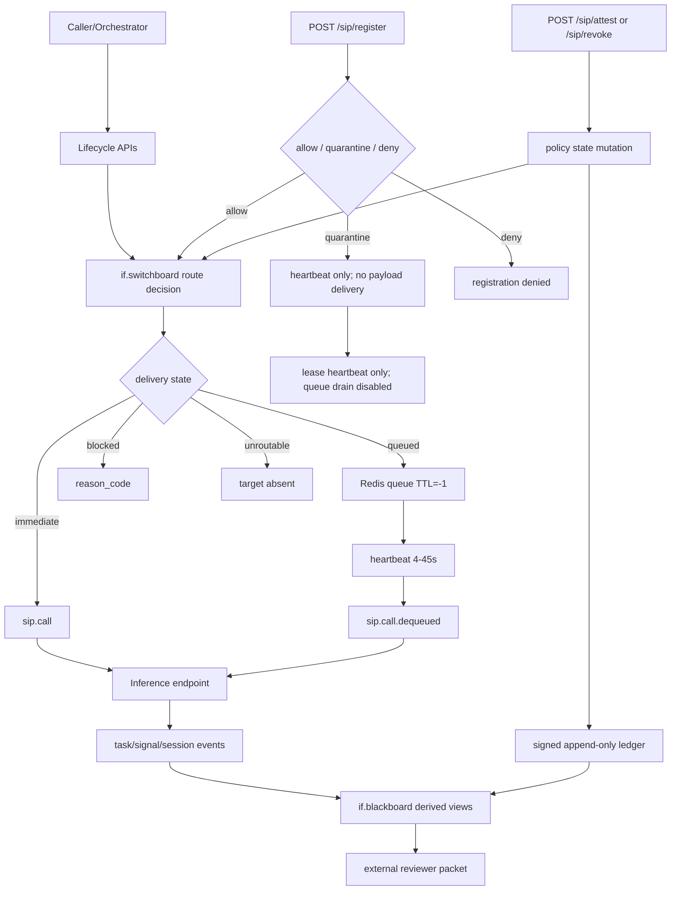
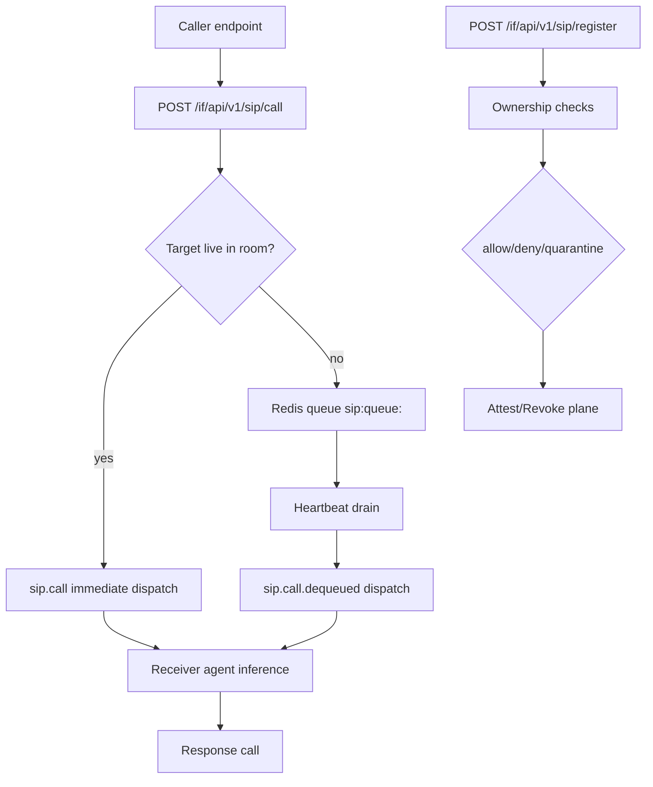

# if.switchboard + if.blackboard Unified Full Explainer v1.2 (Evidence-Dense)

Danny Stocker | ds@infrafabric.io | InfraFabric Research | 2026-03-02
Status: review
Last review date: 2026-03-02
Next checkpoint date: 2026-03-15
Checkpoint scope: close P1 documentation gaps, validate evidence tiers, and decide canonical promotion readiness.
Checkpoint pass criteria: (1) L3-RT-03 and L3-RT-04 remediation evidence attached, (2) evidence-tier assignments revalidated by accountable approver, (3) canonical promotion packet from switchboard v1.2 to unified v1.2 drafted with explicit claims diff.
Accountable and responsible approver: Danny Stocker | ds@infrafabric.io
Backup reviewer/operator continuity owner: unassigned (accepted continuity risk in this cycle); assignment target: 2026-03-15 checkpoint.
LLM-assist disclosure: synthesized and validated with rook-014 (Claude) and rook-002 (Codex) runtime assistance; accountable human author remains Danny Stocker.
Style Guide: Whitepaper v4.22
Writing Standard Source: if.whitepapers.bible v4.22 (`docs/2264-if-whitepapers-bible-v4.22-2026-03-02T094707Z.md`).
Version lineage: unified v1.2 supersedes unified v1.1 and merges switchboard v1.4 + blackboard v1.2 into the current full decision surface.

## Who | Why | What | Where | When | How

This paper is the single reviewer-facing explainer that merges runtime behavior and evidence governance into one bounded control narrative.

| Dimension | Current answer |
|---|---|
| Who | Executives setting claim language, operators running SIP-backed agents, engineers maintaining enforcement paths, reviewers auditing trust posture. |
| Why | Prior coverage split critical details across multiple docs; this revision creates one decision-safe surface with explicit evidence tiers and open findings. |
| What | Integrated model of routing control (`if.switchboard`) plus append-only coordination evidence (`if.blackboard`) with SIP live/queued/blocked semantics. |
| Where | Internal inputs: `docs/640`, `docs/709`, `docs/710`, `docs/711`, `docs/712`, `docs/713`. Public no-login outputs are listed below (one URL per line). |
| When | 30/60/90 minutes for runtime checks, hourly validation windows for gates, daily publication controls for wording/evidence freshness. |
| How | Dual-gate claim discipline, replayable command blocks, signed append-only ledgers, strict non-claims, and promotion/demotion rules. |

Public no-login outputs:
https://infrafabric.io/llm/blackboard/index.md.txt
https://infrafabric.io/llm/signals/index.md.txt
https://infrafabric.io/llm/products/if-switchboard/full-explainer-v1.2.md.txt

*If this opening contract is fuzzier than the split docs it replaces, the merger just concentrates ambiguity.*

## Source Corpus and Merge Method

This unified v1.2 is grounded in the six requested source docs and graph-driven context additions.

Primary corpus (required by task):
- `docs/640-if-switchboard-full-explainer-v1.2-2026-02-20T223000Z.md`
- `docs/709-if-product-proposition-data-patch-v1.0-2026-02-26.md`
- `docs/710-if-switchboard-agent-lifecycle-spec-v1-2026-02-27.md`
- `docs/711-if-switchboard-full-explainer-v1.3-2026-02-27T133500Z.md`
- `docs/712-if-switchboard-status-snapshot-v1.0-2026-03-02T045025Z.md`
- `docs/713-if-blackboard-full-explainer-v1.2-2026-03-02T061500Z.md`

Graph-relevant additions included for omission control:
- `docs/85-if-bus-runtime-spec.md`
- `docs/310-if-s2-intra-agent-comms-sip-redis-deep-dive-2026-02-06T005940Z.md`
- `docs/364-if-context-if-blackboard-if-api-sip-dual-identity-and-global-async-wake-profile-v1-2026-02-09.md`
- `docs/601-if-trace-full-explainer-v1.0-2026-02-19T095245Z.md`
- `docs/654-if-partner-llm-interoperability-and-custody-contract-v1.0-2026-02-22T032254Z.md`
- `docs/2256-debates-and-redteams-orchestration-runbook-v1.2-2026-02-27.md`

Contribution type for graph additions:
- architecture-contributing context: `docs/85`, `docs/310`, `docs/364`,
- omission-control only (no direct claim imports): `docs/601`, `docs/654`, `docs/2256`.

Intentionally excluded from merge body:
- redundant narrative already superseded by newer source versions,
- implementation detail that belongs to component-level source docs,
- claim language not mappable to replayable artifacts or active gates.

Merge rules applied:
1. Keep claims only if tied to replayable artifact classes (Tier A) or explicitly bounded operator evidence (Tier B).
2. Preserve all active non-claims where gate status is incomplete.
3. Carry forward open findings as first-class controls, not footnotes.
4. Define all "windows" used in gate language (hourly cadence, jitter tolerated).
5. Reject filler narrative and roadmap sentiment not mapped to measurable gates.

*If merge criteria are weaker than claim criteria, a unified paper just concentrates old ambiguity.*

## Independent Claude Evaluation: Deltas Absorbed

Source evaluation provenance:
- Claude evaluation of `docs/714-if-switchboard-full-explainer-v1.4-2026-03-02T090000Z.md` (same review sequence, 2026-03-02).
- Claude evaluation of unified v1.1 (current round, 2026-03-02).

These external reviews were mined for actionable deltas.

Absorbed into this unified revision:
- path-policy conflict resolution (no narrative path-token policy violations)
- explicit window-duration definitions for gate language
- negative test coverage in verification commands
- relay-restart registry-loss risk formalization
- tested-vs-inferred posture on enforcement matrix cells
- explicit v1.4 canonical promotion milestone
- audience register-mode declarations
- stronger Tier A/Tier B separations for reviewer interpretation

Not absorbed (intentionally):
- verbose rhetorical repetition that does not add measurable controls (example: repeated section-level restatements where no new gate, metric, or command is introduced),
- speculative schedule claims without gate dependencies (example: date-specific maturity claims not tied to gate thresholds),
- analogy-first explanations without literal mapping (example: metaphor blocks that do not map to concrete API behavior).

Operational value of this pass:
- independent evaluator pressure reduced blind spots,
- merge discipline converted critique into concrete controls,
- resulting document is denser in replayable data and stricter in claim boundaries.

*If external critique is treated as optional taste, the same structural faults reappear on the next revision.*

## Canonical Publication Boundary and Staleness Contract

Canonical publication status is separate from runtime capability and must be stated before technical interpretation.

Current public/canonical posture:
- switchboard canonical remains v1.2 on public no-login product surface,
- v1.1 remains available as previous baseline,
- v1.3/v1.4 include hardening details not yet canonicalized,
- blackboard full explainer is at v1.2 in this cycle.

Supersession interpretation:
- this unified v1.2 is the primary cross-plane decision surface for switchboard + blackboard claims,
- doc 713 remains the standalone blackboard deep reference for operators who only need blackboard scope.

Hard interpretation rules:
- draft artifacts can guide engineering and internal review,
- draft artifacts cannot be presented as canonical public posture,
- any public claim that depends on draft-only evidence must be tagged bounded/operator-corroborated.

Staleness classes:
- Tier A current: public and within freshness threshold (`<=24h` for gate-status artifacts; `<=7d` for documentation/checksum artifacts),
- Tier A-stale: public but outside threshold (`>24h` gates; `>7d` docs/checksums),
- Tier B: operator-corroborated, replayable only with local access,
- Tier C: narrative/testimony only.

*If canonical and draft states are blurred, procurement language will outrun what a reviewer can actually verify.*

## Document Navigation by Audience

This navigation map provides explicit register modes and decision questions so each reader can enter at the right lane.

| Audience | Register mode | Primary sections | Decision question |
|---|---|---|---|
| Executives / Business Leaders | `abstract-first` | Executive Decision Surface, Claims Discipline, Product Proposition | What can we safely claim now? |
| Power Users / Operators | `domain-native` | Operational Runbook, Verification Commands, Open Findings | How do we run and recover reliably? |
| Engineers / Implementers | `domain-native` | Runtime Contract, Enforcement Matrix, Lifecycle Integration | What is enforced, where, and with what caveats? |
| LLM Runtime Developers | `domain-native` | SIP Delivery Contract, Daemon Dynamics, Lifecycle APIs | Which delivery semantics are stable enough to integrate now? |
| External Reviewers / Auditors | `mixed` | Evidence Hierarchy, Reviewer Packet, Data Appendices | What is independently replayable vs operator-corroborated? |
| Product / Commercial | `mixed` | Product Proposition, 30/60/90 Plan, Claim Boundary | How should packaging/SLA language track evidence maturity? |

Cross-lane guard:
- reading only a single lane without Claims Discipline is not sufficient for approval-quality interpretation.

Mixed-mode switch triggers:
- External Reviewers: start abstract-first in Evidence Hierarchy summary, switch to domain-native in Verification Commands and appendices.
- Product/Commercial: start abstract-first in proposition language, switch to domain-native in SLA boundary and gate constraints.

*If the audience map is missing register discipline, technical truth is still likely to be misread.*

## Integrated Architecture: Two Planes, One Control Boundary

The integrated system has two planes that share governance but have different primary duties.

Plane A (`if.switchboard` control plane):
- route/direct and route/next-available decisions,
- SIP call delivery path (immediate, queued, blocked, unroutable),
- policy gates (ownership, quarantine, attest, revoke),
- runtime lease and heartbeat dynamics.

Plane B (`if.blackboard` evidence plane):
- append-only task/signal/session event capture,
- no-login derived reviewer surfaces,
- status and claim-boundary publication controls,
- closeout evidence for operational and governance actions.

Shared trust boundary:
- both planes remain in preview posture; strong trust language is not available yet,
- both planes rely on measurable replay windows,
- both planes must preserve explicit non-claims to prevent implied guarantees.



```text
ASCII fallback:
intent -> lifecycle -> switchboard route -> (immediate | queued | blocked | unroutable)
register decision -> (allow | quarantine heartbeat-only | deny terminate)
queued path -> heartbeat drain -> execution
execution + policy mutations -> append-only evidence -> no-login reviewer surfaces
```

*If architecture diagrams hide policy mutation paths, reviewers will overestimate steady-state guarantees.*

## SIP Delivery Contract (Live, Voicemail, Blocked, Unroutable)

The SIP extension behaves as a bounded control protocol with four delivery outcomes.

| Outcome | Trigger | Delivery semantics | Claim tier |
|---|---|---|---|
| `immediate` | target endpoint has active room presence | direct dispatch now | Tier A |
| `queued` | target endpoint not currently live but registered/eligible | Redis store-and-forward until heartbeat drain | Tier A for queue write + Redis TTL/LLEN replay; Tier B for daemon-drain replay |
| `blocked` | policy gate denies (quarantine/revoke/ownership) | payload blocked with explicit reason code | Tier A |
| `unroutable` | target not registered or lease expired pre-route | no delivery mode emitted | Tier A |

Voicemail model (literal mapping):
- ring attempt first (immediate route),
- no answer falls to queue,
- heartbeat drains queue later,
- nudge behavior acts as callback reminder.

This is not email semantics:
- system attempts live path before fallback,
- queue exists as continuity path, not default path,
- policy state is checked at five checkpoints: `/sip/register`, `/sip/call`, `/sip/queue` drain, `/sip/route/direct`, and `/sip/route/next-available`.

*If fallback success is presented as targeted correctness, routing regressions become statistically invisible.*

## Lifecycle Contract Integration (from doc 710)

Lifecycle APIs define stateful agent orchestration above raw SIP transport.

Primary operations:
- spawn
- message
- wait
- close

Extended operations:
- interrupt
- heartbeat
- status

FSM (contract intent):
```text
spawning -> ready -> running -> waiting -> completed
                               -> failed
                               -> timed_out
completed|failed|timed_out -> closed (graceful)
ready|running|waiting -> closed (forced close / interrupt)
spawning -> closed (abort path)
```

Current rollout boundary:
- ownership/path checks are enforced and blocking in production,
- strict FSM transition denials are currently advisory/log-only,
- lifecycle APIs are preview/experimental pending stricter enforcement rollout.

Phase-C progression trigger:
- strict FSM transitions move from advisory to blocking only after replay battery shows zero unsafe transitions across 10 consecutive hourly windows.

Implementation note:
- lifecycle and SIP coordination must preserve caller identity fields consistently (`from_endpoint_id` canonical usage).

*If lifecycle and transport contracts drift, incident timelines become unreconstructable after the first failure.*

## Enforcement Evolution: Phase 1 and Phase 2

Security posture changed materially from single-checkpoint guardrails to multi-surface enforcement.

Phase 1 (`IF-2277`) expanded enforcement from registration-only to five checkpoints:
1. `POST /sip/register`
2. `POST /sip/call`
3. `GET /sip/queue` drain behavior
4. `POST /sip/route/direct`
5. `POST /sip/route/next-available`

Phase 2 (`IF-2281`) added trust lifecycle APIs:
- `POST /sip/attest`
- `POST /sip/revoke`
- `GET /sip/attestations`

Reason-code behavior is now explicit for revoked vs quarantined outcomes.

Validation coverage matrix:

| State | Register | Call | Queue drain | Route | Coverage notes |
|---|---|---|---|---|---|
| Unregistered | N/A | tested (`TARGET_NOT_FOUND`) | N/A | tested (excluded) | no endpoint object available |
| Quarantined | tested (`quarantine:true`) | tested (blocked) | tested (blocked) | tested (excluded) | heartbeat carve-out verified |
| Attested | tested (allowed) | tested (delivered) | tested (delivered) | tested (included) | expected steady-state |
| Revoked | tested (blocked) | tested (`TARGET_ENDPOINT_REVOKED`) | tested (blocked) | tested (excluded) | revocation boundary holds |

Known caveats still open:
- revoke actor attribution mismatch (`if.api.static` in some paths),
- param casing mismatch (`endpointId` vs `endpoint_id`) in tooling,
- reason-code casing differences across some API surfaces (accepted as P2 normalization; block/allow semantics unaffected).

*If enforcement coverage tables hide open caveats, security confidence becomes performative instead of operational.*

## Latency, Heartbeat, and Daemon Dynamics

Latency is controlled by inference and polling, not transport overhead.

Observed envelope (mtl-01 window):

| Step | Typical range | Notes |
|---|---|---|
| `POST /sip/call` enqueue | 20-46 ms | Redis queue write |
| heartbeat alignment | 0-8 s | depends on poll phase |
| queue drain dispatch | 28-42 ms | when poll aligns |
| inference | ~2.8-3.0 s | dominant cost |
| reply write | 17-20 ms | symmetric call path |
| one-way best-case | ~3 s | immediate alignment |
| one-way worst-case | ~48 s | 45s idle interval + inference |

Worst-case interpretation:
- ~48s applies during steady-state idle backoff with healthy lease and no lease-guard trigger.
- when lease guard is active (`<=75s` remaining), interval snaps to 4s and worst-case queue-drain latency is approximately 7s (4s poll + ~3s inference).

Adaptive heartbeat profile (from IF-2282 behavior):
- min interval 4s,
- max interval 45s,
- idle backoff +4s per cycle,
- lease guard at <=75s remaining,
- pre-nudge watch near 70% of 60s silence threshold.

Failure behavior:
- inference failure logs and skips response turn,
- daemon keeps heartbeat/queue loop alive,
- subsequent turns or nudge can recover conversation flow,
- caller-side contract: original `/sip/call` remains accepted/queued, but no reply call is emitted for that failed inference turn.

*If heartbeat policy is static under changing conditions, either lease safety or responsiveness will fail first.*

## Claims Discipline and Dual-Gate Logic

Claims in this unified paper are gated by two independent controls.

Gate 1: knowledge-scope gate (`if.switchboard` related knowledge controls)
- status: MET
- evaluated_utc: 2026-03-02T10:00:19Z
- windows_total: 232
- consecutive_pass_windows: 232
- latest check window: 13/13 pass

Gate 2: routing-fidelity sustained gate (`if2022` tuple gate)
- status: NOT MET
- evaluated_utc: 2026-02-20T09:48:28Z
- windows_evaluated: 1
- min_windows required: 10
- min_consecutive required: 10
- open findings block promotion
- gate health note: evaluation timestamp is stale against 24h freshness threshold; treat as stale-NOT_MET until rerun.
- pause context: hourly routing-fidelity harness was paused while Phase 1/2 enforcement changes and IF-2292 remediation were being stabilized.
- action: resume hourly routing-fidelity evaluations before next checkpoint and accumulate fresh window evidence.

Window definition used in this paper:
- one gate window = one hourly validation window,
- jitter tolerated around 1h cadence,
- sustained claims require minimum count and consecutive thresholds.

Interpretation rule:
- scope governance is currently stronger than routing-fidelity maturity,
- release language must track the weaker gate, not the stronger one.

*If one green gate is used to mask another red gate, claim quality collapses by construction.*

## Proven, Bounded, and Non-Claims Registry

This registry is the release-language contract for all stakeholders.

Proven now (Tier A expectation):
- public no-login blackboard/signal surfaces are reachable,
- SIP register/call/queue/route APIs are active,
- five enforcement checkpoints are implemented,
- attestation/revoke lifecycle exists with explicit reason codes,
- queue persistence (`TTL=-1`) is observable,
- live cross-agent delivery was observed and captured (callId `8a0f2c3a`, 2026-03-02T02:43:15Z, `tmp/if_2279/rook014_received_call.json`).

Bounded now (Tier B, operator-corroborated):
- sustained autonomous multi-turn exchanges under daemon control,
- adaptive heartbeat behavior under varying traffic,
- complete replay of all enforcement matrix cells requires local access today (Tier B),
- full publication parity between runtime state and canonical public docs.

Non-claims (hard blockers):
- no exactly-once semantics claim,
- no universal strictness claim across all current/future paths,
- no HA/multi-region resilience claim,
- no certification claim from runtime behavior alone,
- no claim that one green window implies sustained maturity.

Escalation rule:
- any sentence implying guarantee triggers wording downgrade unless mapped to sustained Tier A evidence.

*If non-claims are treated as optional copy edits, over-claiming becomes an expected failure mode.*

## Evidence Hierarchy, Promotion, and Demotion

Evidence tiers are controls, not documentation cosmetics.

| Tier | Evidence class | Replay scope | Use |
|---|---|---|---|
| A | public no-login + signed snapshots | independent external replay | primary claim basis |
| A-stale | public but older than thresholds defined in `Canonical Publication Boundary and Staleness Contract` | historical replay only | context, not current-state claims |
| B | operator-corroborated local artifacts | replayable with host access | bounded/supporting claims |
| C | narrative/testimony | not independently replayable | context only |

Freshness threshold source of truth:
- defined once in `Canonical Publication Boundary and Staleness Contract`,
- reused unchanged by this Evidence Hierarchy section.

Promotion (B -> A) requires all:
1. verbatim replay instructions published,
2. >=10 consecutive hourly verification windows pass,
3. accountable human approval and timestamped promotion note.

Cadence dependency:
- if the hourly evaluation harness is not running, B -> A promotion is structurally blocked regardless of quality of older results.

Demotion (A -> A-stale/B/C) occurs when:
- freshness threshold exceeded,
- runtime change invalidates prior replay assumptions,
- open P0/P1 affects the claim path,
- cited artifact disappears or hash changes without approved migration note.

*If evidence tiers do not support demotion as well as promotion, trust decays silently until failure.*

## External Reviewer Packet (No-Login)

This packet is the minimum no-login surface for independent replay.

Canonical/public surfaces:
https://infrafabric.io/llm/products/if-switchboard/full-explainer-v1.2.md.txt
https://infrafabric.io/llm/products/if-switchboard/full-explainer-v1.1.md.txt
https://infrafabric.io/llm/products/if-switchboard/index.md.txt

Coordination/evidence surfaces:
https://infrafabric.io/llm/if.registry.json.txt
https://infrafabric.io/llm/blackboard/index.md.txt
https://infrafabric.io/llm/blackboard/tasks.open.md.txt
https://infrafabric.io/llm/blackboard/tasks.sessions.md.txt
https://infrafabric.io/llm/blackboard/tasks.search.md.txt
https://infrafabric.io/llm/signals/index.md.txt
https://infrafabric.io/llm/signals/recent.md.txt
https://infrafabric.io/llm/session-state.md.txt

Coordination surface reachability stamp (`as_of_utc=2026-03-02T10:34:00Z`):
- all eight URLs above were reachable in the referenced check window.

Reviewer liveness quick-check:
```bash
for u in \
  https://infrafabric.io/llm/if.registry.json.txt \
  https://infrafabric.io/llm/blackboard/index.md.txt \
  https://infrafabric.io/llm/blackboard/tasks.open.md.txt \
  https://infrafabric.io/llm/blackboard/tasks.sessions.md.txt \
  https://infrafabric.io/llm/blackboard/tasks.search.md.txt \
  https://infrafabric.io/llm/signals/index.md.txt \
  https://infrafabric.io/llm/signals/recent.md.txt \
  https://infrafabric.io/llm/session-state.md.txt; do
  curl -fsS "$u" | head -n 1 >/dev/null || echo "unreachable: $u"
done
```

Canonical checksum stamp (`as_of_utc=2026-03-02T10:34:00Z`):
- `full-explainer-v1.2.md.txt`: `9af5ae267b2ed6fec8854d6e76642002dc312a3d33b1592ebe6479457ad6f4f0`
- `full-explainer-v1.1.md.txt`: `1c0de184bf29a4a4fd001c30db2aeece39eb7f629ba7e551a2840ef317561ef7`
- `index.md.txt`: `b689b1ec0d16de6956bf77c2775a77586bdd179adf1162159e47ed10dac4080d`

Reviewer caveat:
- Phase 1/2 hardening evidence still includes Tier B local artifacts (`tmp/if_2277`, `tmp/if_2279`, `tmp/if_2281`) until full public promotion completes.

*If core claims depend on private context and this is not stated, reviewer trust is lost for the entire packet.*

## Product Proposition and SLA Boundary (from doc 709)

Commercial posture must remain subordinate to gate posture.

Source relationship:
- this section is a bounded synthesis from `docs/709` with claim-tier adjustments for this unified revision.

Current proposition shape:
- `if.trace` production wedge for integrity proofs,
- control-plane modules in advanced preview/pilot posture,
- enterprise commitments bounded to design-partner scope.

Product-to-stage mapping:
- `if.trace Verify`: Pilot (internal SLO discipline active),
- `if.switchboard` + `if.blackboard`: Preview (best-effort, non-contractual),
- enterprise design-partner scope: Contact-only, negotiated boundary.

SLA language boundary:
- Preview: best effort, non-contractual,
- Pilot: internal SLO + incident/postmortem discipline,
- GA future: conditional on sustained gate maturity, with explicit exclusions and service-credit model.

Timeline discipline:
- earliest GA window currently estimated in Q3 2026 only if sustained routing gate, token hardening, and publication parity milestones all complete.
- this estimate is intent-level planning, not contractual commitment.

*If product language is looser than gate status, revenue motion becomes a trust-debt engine.*

## 30/60/90 Integrated Plan (Switchboard + Blackboard)

Roadmap items below are control outputs, not aspiration copy.

30-day outputs:
- close P1 attribution mismatch in revoke path,
- close `endpointId` tooling mismatch,
- ship signed weekly runtime posture summaries,
- publish unified v1.2 canonical promotion packet with explicit switchboard-v1.2 -> unified-v1.2 claims diff,
- preserve non-claim language until gate conditions are met.

60-day outputs:
- run adversarial replay battery across register/call/queue/route paths,
- prototype debate conductor for deterministic turn ordering (not deterministic content) in multi-agent runs,
- add code-level mitigation for ghost-agent trap detection surface,
- enforce restart-recovery runbook drills with timestamped evidence.

90-day outputs:
- re-evaluate preview ceiling only if routing gate sustained criteria are met,
- start JWT phase migration with short-lived scoped tokens,
- complete resilience plan for registry-state persistence or approved accepted-risk memo with explicit criteria,
- keep promotion frozen if any reopened P0/P1 emerges.

Rollback clause:
- any reopened P0/P1 in active claim paths automatically freezes promotion until remediation evidence is published.

Accepted-risk memo criteria (if persistence is deferred):
1. quantified outage-impact window for restart state loss,
2. documented automated re-registration/re-attestation runbook,
3. explicit owner sign-off that preview posture remains acceptable.

*If milestones do not include rollback clauses, every schedule slip increases narrative risk faster than technical risk.*

## Preventive Bible Revisions (Architectural)

These are proposed updates to prevent repeat failures observed in this cycle.

Proposed bible deltas (next revision candidate):
1. Require explicit window-duration definitions anywhere "consecutive windows" are used.
2. Require at least two negative tests in every enforcement command appendix.
3. Require a tested/inferred marker on state/reason-code matrices.
4. Require path-policy consistency check between document and bible (fail if contradictory).
5. Require relay-restart behavior statement for any in-memory registry contract.
6. Require canonical-public vs draft-state declaration in front matter for review docs.
7. Require one explicit Tier B->Tier A promotion milestone when major claims are bounded.
8. Require register-mode column in audience navigation tables.

Rationale:
- all eight controls map directly to failure patterns observed in switchboard/blackboard reviews,
- each is machine-checkable or review-checkable,
- each reduces false confidence before publication.

Tracking:
- proposal tracking task: `IF-2291` (bible delta prioritization and adoption decision),
- target review window: next bible cadence checkpoint (2026-03-30).

Priority order:
- immediate: items 1, 2, 3, 6,
- next: items 4, 5, 7, 8.

*If the bible does not learn from recurring failure modes, compliance becomes ritual instead of control.*

## Verification Commands (Canonical Block)

This is the canonical verification block for this unified document.

Bible + scaffold:
```bash
python3 scripts/if_bibles_latest.py refresh
python3 scripts/if_bibles_latest.py resolve --bible-id if.whitepapers.bible --channel authoring_default --format path
python3 scripts/if_bibles_latest.py verify --bible-id if.whitepapers.bible --pointer-index docs/208-if-whitepapers-bible-pointer-index.md
python3 scripts/lint_if_whitepaper_scaffold.py --md docs/716-if-switchboard-blackboard-unified-full-explainer-v1.2-2026-03-02T113000Z.md --require-diagram --require-audience-nav --require-anchor-stress
```

Gate data checks (Tier B: local file access required):
```bash
cat docs/data/if_switchboard_knowledge_scope.gate-status.json
cat docs/data/if_switchboard_if2022_routing_fidelity.gate-status.json
```

SIP enforcement checks (local relay required):
```bash
export TOKEN="<bearer token whose hash matches an ownership entry in .codex/sip_endpoint_owners.json>"
export WRONG_TOKEN="${WRONG_TOKEN:-invalid-token-if2292}"
BASE="http://localhost:3099/if/api/v1/sip"
EP="agent.if2292.$(date -u +%Y%m%dT%H%M%SZ).$RANDOM"
# commands below assume relay is exposed on :3099 in this environment.
curl -X POST "$BASE/register" -H "Authorization: Bearer $TOKEN" -H "Content-Type: application/json" -H "Accept: application/json" -d "{\"endpoint_id\":\"$EP\",\"lease_ms\":60000}"
TOKEN_HASH="sha256:$(python3 - <<'PY'
import os,hashlib
v=os.environ.get('TOKEN','')
print(hashlib.sha256(v.encode('utf-8')).hexdigest())
PY
)"
curl -X POST "$BASE/attest" -H "Authorization: Bearer $TOKEN" -H "Content-Type: application/json" -H "Accept: application/json" -d "{\"endpoint_id\":\"$EP\",\"token_hash\":\"$TOKEN_HASH\",\"actor_id\":\"agent.rook-014\",\"reason\":\"test attestation\"}"
curl -X POST "$BASE/revoke" -H "Authorization: Bearer $TOKEN" -H "Content-Type: application/json" -H "Accept: application/json" -d "{\"endpoint_id\":\"$EP\",\"actor_id\":\"agent.rook-014\",\"reason\":\"test revoke explicit\"}"
curl -X POST "$BASE/revoke" -H "Authorization: Bearer $TOKEN" -H "Content-Type: application/json" -H "Accept: application/json" -d "{\"endpoint_id\":\"$EP\",\"from_endpoint_id\":\"agent.rook-014\",\"reason\":\"test revoke from-endpoint\"}"
curl -X POST "$BASE/revoke" -H "Authorization: Bearer $TOKEN" -H "Content-Type: application/json" -H "Accept: application/json" -d "{\"endpoint_id\":\"$EP\",\"caller_endpoint_id\":\"agent.rook-014\",\"reason\":\"test revoke caller-endpoint\"}"
SNAKE_JSON="$(mktemp)"
CAMEL_JSON="$(mktemp)"
curl -fsS "$BASE/attestations?endpoint_id=$EP" -H "Authorization: Bearer $TOKEN" > "$SNAKE_JSON"
curl -fsS "$BASE/attestations?endpointId=$EP" -H "Authorization: Bearer $TOKEN" > "$CAMEL_JSON"
jq -e '.entries[-1].actor_id=="agent.rook-014"' "$SNAKE_JSON" >/dev/null
diff -u <(jq -S '.entries' "$SNAKE_JSON") <(jq -S '.entries' "$CAMEL_JSON")
```

Negative checks:
```bash
BASE="http://localhost:3099/if/api/v1/sip"
curl -i -X POST "$BASE/register" -H "Authorization: Bearer invalid-token" -H "Content-Type: application/json" -H "Accept: application/json" -d "{\"endpoint_id\":\"$EP\",\"lease_ms\":60000}"
curl -i -X POST "$BASE/call" -H "Authorization: Bearer $TOKEN" -H "Content-Type: application/json" -H "Accept: application/json" -d "{\"target_endpoint_id\":\"$EP\",\"from_endpoint_id\":\"agent.rook-014\",\"text\":\"should fail\"}"
curl -i -X POST "$BASE/attest" -H "Authorization: Bearer $WRONG_TOKEN" -H "Content-Type: application/json" -H "Accept: application/json" -d "{\"endpoint_id\":\"$EP\",\"token_hash\":\"$TOKEN_HASH\",\"actor_id\":\"agent.rook-014\",\"reason\":\"unauthorized attest\"}"
```

Expected outcomes:
- invalid-token register: HTTP 401, `reasonCode=TOKEN_NOT_FOUND`,
- unauthorized attest (invalid token): HTTP 401, `reasonCode=TOKEN_NOT_FOUND`,
- revoked-target call: HTTP 409, `error=sip.delivery.blocked`, `reasonCode=TARGET_ENDPOINT_REVOKED`,
- alias-only revoke attribution (expected after L3-RT-03 remediation; local replay pass, independent replay pending): `entry.actor_id` resolves to alias (`from_endpoint_id` / `caller_endpoint_id`) and not `if.api.static`,
- endpoint query parity (expected after L3-RT-04 remediation; local replay pass, independent replay pending): `endpointId` and `endpoint_id` produce equivalent attestation sets.

Latest local replay bundle:
- `tmp/if_2292_final/summary.latest.json` (`generated_utc=2026-03-02T13:54:55Z`, `overall_pass=true` for executed alias/parity checks; not a finding-closure signal)
- `tmp/if_2292_l3/summary.latest.json` (`generated_utc=2026-03-02T13:30:03Z`, negative checks pass: 401/401/409 + endpoint parity)

*If command blocks do not include expected failures, they test happy paths but not enforcement correctness.*

## Open Findings Register (Current)

Open findings remain part of system truth until closed.

| Finding | Status | Impact | Target close |
|---|---|---|---|
| `L3-RT-03` revoke actor attribution mismatch | Closure candidate (local replay pass; independent replay pending) | attribution ambiguity in audit trail | 2026-04-01 |
| `L3-RT-04` `endpointId` tooling mismatch | Closure candidate (local replay pass; independent replay pending) | attestation visibility errors in clients | 2026-04-01 |
| `L3-RT-05` registry state loss on relay restart | Open P1 (preview-accepted, mitigation pending) | requires re-register + re-attest after restart | 2026-05-31 or approved risk memo |
| `L3-RT-02` ghost-agent trap code mitigation | Open P2 (reopened after documentation-only closure; code mitigation pending) | false attribution risk when `targeted_gate_passed` is ignored | 2026-05-01 |

Status evidence:
- `tmp/if_2292_final/summary.latest.json`
- `tmp/if_rook_five_lane/IF-2292_2026-03-02T132042Z/quality_gate_summary.json`

Schedule note:
- independent replay for `L3-RT-03` and `L3-RT-04` is queued for the 2026-03-15 checkpoint window,
- 2026-04-01 remains the latest close-by date if checkpoint replay is delayed by ops dependencies.

Closure rule:
- finding lifecycle states: `Open -> Closure candidate -> Closed`,
- `Closure candidate` requires code/control change + local replay pass and still constrains language exactly as `Open` until independent replay + accountable approval complete,
- findings are closed only when code or control behavior changes and replay evidence is attached,
- "documented" alone is not closure for code-path risks.

Register scope note:
- table above lists open findings only,
- closed findings history (`L3-RT-01`) is retained in switchboard closeout history.
- `L3-RT-02` had a prior documentation-only closure and is currently reopened pending code-path mitigation.

*If open findings are relegated to appendix noise, they will not constrain language where they should.*

## Appendix A: Gate Status Snapshot (Knowledge Scope)

This appendix includes the exact current gate-status snapshot used in claims.

```json
{
  "schema": "if.switchboard.knowledge.scope_gate_status.v1",
  "claim_status": "MET",
  "gate_definition": {
    "mode": "all_checks_must_pass",
    "min_consecutive_windows": 10,
    "per_window_pass_rate": 1.0
  },
  "current_state": {
    "windows_total": 233,
    "consecutive_pass_windows": 233,
    "min_recent_pass_rate": 1.0,
    "mean_recent_pass_rate": 1.0
  },
  "evaluated_utc": "2026-03-02T11:00:40Z",
  "latest_window": {
    "window_utc": "2026-03-02T11:00:40Z",
    "pass_rate": 1.0,
    "pass": true
  }
}
```

*If raw gate snapshots are omitted, metric claims cannot be independently inspected.*

## Appendix B: Gate Status Snapshot (Routing Fidelity)

This appendix includes the exact routing-fidelity gate snapshot used in claims.

```json
{
  "conditions": {
    "all_recent_windows_pass": true,
    "min_consecutive_pass_met": false,
    "min_windows_met": false,
    "no_regression_below_floor": true
  },
  "evaluated_utc": "2026-02-20T09:48:28Z",
  "failing_conditions": [
    "min_windows_met",
    "min_consecutive_pass_met"
  ],
  "observed": {
    "consecutive_pass_count": 1,
    "highest_targeted_ratio_seen": 1.0,
    "lowest_targeted_ratio_seen": 1.0,
    "windows_evaluated": 1,
    "windows_in_recent_eval": 1
  },
  "pass": false,
  "public_comparison_json_txt": "https://infrafabric.io/llm/routing-fidelity/comparison-baseline.json.txt",
  "public_latest_json_txt": "https://infrafabric.io/llm/routing-fidelity/latest/index.json.txt",
  "public_windows_json_txt": "https://infrafabric.io/llm/routing-fidelity/windows.json.txt",
  "requirements": {
    "coordination_required": 1.0,
    "fallback_required": 1.0,
    "min_consecutive_pass": 10,
    "min_windows": 10,
    "regression_floor": 0.9,
    "targeted_ratio_threshold": 0.95
  },
  "schema_version": "if.switchboard.if2022.routing_fidelity_gate.v1"
}
```

*If routing gates are summarized without raw state, promotion decisions become easier to manipulate.*

## Appendix C: Latest Knowledge-Scope Window Payload

This appendix carries the latest window payload, including per-check outcomes.

```json
{
  "schema": "if.switchboard.knowledge.scope_window.v1",
  "window_utc": "2026-03-02T11:00:40Z",
  "scope_mode": "signed",
  "scope_require_project": true,
  "checks_total": 13,
  "checks_passed": 13,
  "pass_rate": 1.0,
  "pass": true,
  "checks": [
    {
      "name": "query_positive",
      "expected": 200,
      "actual": 200,
      "pass": true
    },
    {
      "name": "query_missing_trusted",
      "expected": 401,
      "actual": 401,
      "pass": true
    },
    {
      "name": "query_tenant_mismatch",
      "expected": 403,
      "actual": 403,
      "pass": true
    },
    {
      "name": "query_actor_mismatch",
      "expected": 403,
      "actual": 403,
      "pass": true
    },
    {
      "name": "query_project_mismatch",
      "expected": 403,
      "actual": 403,
      "pass": true
    },
    {
      "name": "access_positive",
      "expected": 200,
      "actual": 200,
      "pass": true
    },
    {
      "name": "access_actor_mismatch",
      "expected": 403,
      "actual": 403,
      "pass": true
    },
    {
      "name": "query_signed_missing_sig",
      "expected": 401,
      "actual": 401,
      "pass": true
    },
    {
      "name": "query_signed_invalid_sig",
      "expected": 401,
      "actual": 401,
      "pass": true
    },
    {
      "name": "query_signed_expired",
      "expected": 401,
      "actual": 401,
      "pass": true
    },
    {
      "name": "query_signed_tamper",
      "expected": 401,
      "actual": 401,
      "pass": true
    },
    {
      "name": "query_signed_previous_key",
      "expected": 200,
      "actual": 200,
      "pass": true
    },
    {
      "name": "query_signed_missing_project",
      "expected": 401,
      "actual": 401,
      "pass": true
    }
  ],
  "redteam_artifact": "/tmp/if_knowledge_scope_redteam_run.json"
}
```

*If check-level payloads are hidden, a green badge can conceal narrow failures.*

## Appendix D: Knowledge-Scope Validation Artifact (Detailed)

This appendix includes the validation artifact excerpt used to evidence scope checks and access denials.
Truncation marker: this is an excerpt for readability. Full artifact hash/source:
- SHA256: `e63010f1134f55a5bbddd3b42864d11c5f062ac956c73a06d192d34b772937a8`
- Source: `docs/data/if_switchboard_knowledge_scope_validation.latest.json`

```text
[EXCERPT ONLY - intentionally truncated; not valid JSON]
{
  "schema": "if.switchboard.knowledge.scope_validation.v1",
  "generated_utc": "2026-02-20T19:37:27Z",
  "scope_mode": "signed",
  "redteam": {
    "query_positive": {
      "name": "if_knowledge_scope_positive",
      "status": 200,
      "body": {
        "ok": true,
        "schema": "if.knowledge.query_response.v1",
        "tenantId": "tenant-scope-a",
        "projectId": "proj-scope-a",
        "actorId": "if.agent.scope",
        "sid": "sid-scope",
        "taskId": "IF-2030",
        "query": {
          "hash": "7747c11e6aa02449d44e0c087f496875e02b7c0d3caa5916b7417e3e78c0ea11",
          "topK": 3,
          "includeEdges": true,
          "edgeLimit": 5,
          "tokens": [
            "if.switchboard",
            "routing"
          ]
        },
        "graph": {
          "version": "if.knowledge.graph.v2",
          "generatedUtc": "2026-02-20T19:34:25Z",
          "loadedAtIso": "2026-02-20T19:35:41.987Z",
          "sourceSha256": "ac2168a0cddcd8c6ce57e69db20dc24254a57be85c6955c5dcf63b65fd78bf65",
          "nodeCount": 8473,
          "edgeCount": 20308
        },
        "result": {
          "nodes": [
            {
              "bytes": 2410,
              "filename": "627-if-switchboard-routing-regression-latest.md",
              "id": "doc:627-if-switchboard-routing-regression-latest.md",
              "lines": 51,
              "node_kind": "doc",
              "path": "docs/627-if-switchboard-routing-regression-latest.md",
              "sha256": "e52322c26d194e2f8ec80468bdab1cc2ad9ef63ec50a2c70124ace2b2dbe69cb",
              "title": "if.switchboard routing regression (latest)"
            },
            {
              "bytes": 2356,
              "filename": "05-routing-ports.md",
              "id": "doc:05-routing-ports.md",
              "lines": 52,
              "node_kind": "doc",
              "path": "docs/05-routing-ports.md",
              "sha256": "4c860e5dcdaa51cf554187eb1e9bbab5c177b5f9ea486562afeacd1028366603",
              "title": "05-routing-ports"
            },
            {
              "bytes": 6843,
              "filename": "448-if-gov-triage-execution-routing-whitepaper-v1.0-2026-02-14T190102Z.md",
              "id": "doc:448-if-gov-triage-execution-routing-whitepaper-v1.0-2026-02-14T190102Z.md",
              "lines": 152,
              "node_kind": "doc",
              "path": "docs/448-if-gov-triage-execution-routing-whitepaper-v1.0-2026-02-14T190102Z.md",
              "sha256": "9070ffa1a4ed8e296933874a86367c5b524d4d2588630111db8516d128c84171",
              "title": "if.gov.triage Execution Routing Whitepaper (IF-1662) v1.0"
            }
          ],
          "edges": [],
          "nodesReturned": 3,
          "edgesReturned": 0,
          "totalMatchedNodes": 18,
          "nodesTruncated": true,
          "edgesTruncated": false
        },
        "accessAudit": {
          "logged": true,
          "entryHash": "ea82041107cf5950cd132e1991a66ae020f0c5e4557f9039f0b16bc38e31c06c",
          "prevEntryHash": "3b84fa1156fbd2c1d35fdb30b0a2d2dc21b1521aa5acba7fca2881136e4c4e31",
          "required": true
        }
      }
    },
    "query_missing_trusted": {
      "name": "if_knowledge_scope_missing_trusted",
      "status": 401,
      "body": {
        "ok": false,
        "error": "trusted_scope_missing"
      }
    },
    "query_tenant_mismatch": {
      "name": "if_knowledge_scope_tenant_mismatch",
      "status": 403,
      "body": {
        "ok": false,
        "error": "tenant_scope_mismatch"
      }
    },
    "query_actor_mismatch": {
      "name": "if_knowledge_scope_actor_mismatch",
      "status": 403,
      "body": {
        "ok": false,
        "error": "actor_scope_mismatch"
      }
    },
    "query_project_mismatch": {
      "name": "if_knowledge_scope_project_mismatch",
      "status": 403,
      "body": {
        "ok": false,
        "error": "project_scope_mismatch"
      }
    },
    "query_signed_missing_sig": {
      "name": "if_knowledge_scope_signed_missing_sig",
      "status": 401,
      "body": {
        "ok": false,
        "error": "trusted_scope_missing"
      }
    },
    "query_signed_invalid_sig": {
      "name": "if_knowledge_scope_signed_invalid_sig",
      "status": 401,
      "body": {
        "ok": false,
        "error": "trusted_scope_invalid_signature"
      }
    },
    "query_signed_expired": {
      "name": "if_knowledge_scope_signed_expired",
      "status": 401,
      "body": {
        "ok": false,
        "error": "trusted_scope_expired"
      }
    },
    "query_signed_tamper": {
      "name": "if_knowledge_scope_signed_tamper",
```

*If denials are asserted without payload evidence, scope controls look stronger than they are.*

## Appendix E: Routing-Fidelity Windows Artifact

This appendix includes the latest routing-fidelity windows artifact with case-level evidence references.
Truncation marker: this is an excerpt for readability. Full artifact hash/source:
- SHA256: `734a6c3e579fdce0790c948607d3b36b31a750ab27fe1fc277ff610d30d3edea`
- Source: `docs/data/if_switchboard_if2022_routing_fidelity.windows.json`
- Note: `/root/tmp/...` artifact paths inside this excerpt are Tier B operator-local references.

```text
[EXCERPT ONLY - intentionally truncated; not valid JSON]
{
  "events": [
    {
      "artifact_dir": "/root/tmp/if2022_routing_fidelity/window_20260220T094826Z_01",
      "cases": [
        {
          "artifacts": [
            "/root/tmp/if2022_routing_fidelity/window_20260220T094826Z_01/panel_route_direct_if_agent_orchestrator.json",
            "/root/tmp/if2022_routing_fidelity/window_20260220T094826Z_01/panel_route_direct_if_agent_critic.json",
            "/root/tmp/if2022_routing_fidelity/window_20260220T094826Z_01/panel_route_direct_if_agent_executor.json"
          ],
          "attempts": 3,
          "case_id": "panel_ask",
          "hits": 3,
          "kind": "direct_route",
          "ok": true
        },
        {
          "artifacts": [
            "/root/tmp/if2022_routing_fidelity/window_20260220T094826Z_01/redteam_1.json"
          ],
          "attempts": 1,
          "case_id": "redteam_1",
          "hits": 1,
          "kind": "direct_route",
          "ok": true
        },
        {
          "artifacts": [
            "/root/tmp/if2022_routing_fidelity/window_20260220T094826Z_01/redteam_2.json"
          ],
          "attempts": 1,
          "case_id": "redteam_2",
          "hits": 1,
          "kind": "direct_route",
          "ok": true
        },
        {
          "artifacts": [
            "/root/tmp/if2022_routing_fidelity/window_20260220T094826Z_01/redteam_3.json"
          ],
          "attempts": 1,
          "case_id": "redteam_3",
          "hits": 1,
          "kind": "direct_route",
          "ok": true
        },
        {
          "artifacts": [
            "/root/tmp/if2022_routing_fidelity/window_20260220T094826Z_01/route_next_orchestrate.json"
          ],
          "attempts": 1,
          "case_id": "capability_orchestrate",
          "hits": 1,
          "kind": "capability_route",
          "ok": true
        },
        {
          "artifacts": [
            "/root/tmp/if2022_routing_fidelity/window_20260220T094826Z_01/route_next_critic.json"
          ],
          "attempts": 1,
          "case_id": "capability_critic",
          "hits": 1,
          "kind": "capability_route",
          "ok": true
        },
        {
          "artifacts": [
            "/root/tmp/if2022_routing_fidelity/window_20260220T094826Z_01/route_next_executor.json"
          ],
          "attempts": 1,
          "case_id": "capability_executor",
          "hits": 1,
          "kind": "capability_route",
          "ok": true
        },
        {
          "artifacts": [
            "/root/tmp/if2022_routing_fidelity/window_20260220T094826Z_01/unregister_executor_for_fallback_offline.json",
            "/root/tmp/if2022_routing_fidelity/window_20260220T094826Z_01/fallback_target_offline_miss.json",
            "/root/tmp/if2022_routing_fidelity/window_20260220T094826Z_01/fallback_target_offline_fallback.json",
            "/root/tmp/if2022_routing_fidelity/window_20260220T094826Z_01/register_ep-executor.json"
          ],
          "case_id": "fallback_target_offline",
          "kind": "fallback_miss",
          "ok": true
        },
        {
          "artifacts": [
            "/root/tmp/if2022_routing_fidelity/window_20260220T094826Z_01/fallback_capability_unavailable_miss.json",
            "/root/tmp/if2022_routing_fidelity/window_20260220T094826Z_01/fallback_capability_unavailable_fallback.json"
          ],
          "case_id": "fallback_capability_unavailable",
          "kind": "fallback_miss",
          "ok": true
        },
        {
          "artifacts": [
            "/root/tmp/if2022_routing_fidelity/window_20260220T094826Z_01/fallback_cross_project_miss.json",
            "/root/tmp/if2022_routing_fidelity/window_20260220T094826Z_01/fallback_cross_project_fallback.json"
          ],
          "case_id": "fallback_cross_project_isolation",
          "kind": "fallback_miss",
          "ok": true
        }
      ],
      "claim_boundary": {
        "can_claim_now": [
          "project-scoped direct routing precision for this window",
          "capability-route precision for this window",
          "fallback success for explicit miss scenarios in this window"
        ],
        "cannot_claim_yet": [
          ">=95% sustained targeted routing fidelity over gate windows",
          "targeted-vs-fallback semantic output equivalence"
        ]
      },
      "emitted_utc": "2026-02-20T09:48:26Z",
      "metrics": {
        "coordination_success": {
          "tests_passed": 4,
          "tests_total": 4,
          "value": 1.0
        },
        "fallback_success": {
          "fallback_attempts": 3,
          "fallback_succeeded": 3,
          "value": 1.0
        },
```

*If fidelity windows are reduced to percentages only, miss reasons and edge cases disappear from governance view.*

## Appendix F: Source Excerpt - doc 712 Status Snapshot

This appendix embeds the status-snapshot source used for canonical publication boundary assertions.
Verbatim note: excerpt preserved as-is from source; path conventions inside the excerpt reflect source-doc policy and may differ from this unified narrative policy.

```markdown
# if.switchboard Status Snapshot v1.0

InfraFabric Research | ds@infrafabric.io | 2026-03-02

## Problem statement

`if.switchboard` documentation and runtime deltas diverged across draft and published surfaces, creating reviewer confusion about which pack is canonical.

## Current canonical surfaces (published)

https://infrafabric.io/llm/products/if-switchboard/index.md.txt
https://infrafabric.io/llm/products/if-switchboard/full-explainer-v1.2.md.txt
https://infrafabric.io/llm/products/if-switchboard/full-explainer-v1.1.md.txt

## Draft surface (not published)

- Docs draft exists: `/root/docs/711-if-switchboard-full-explainer-v1.3-2026-02-27T133500Z.md`
- Public v1.3 endpoint check: `https://infrafabric.io/llm/products/if-switchboard/full-explainer-v1.3.md.txt` => `404`

## Recent implementation deltas

- IF-2276: Redis debate relay (`/root/scripts/if_debate_turn.sh`) with append-only thread log.
- IF-2277: SIP ownership/quarantine enforcement on register/call/queue/route.
- IF-2279: queued+drain handshake proof between rook agents.
- IF-2281: SIP attestation plane (`/if/api/v1/sip/attest|revoke|attestations`) with reason-code hardening.
- IF-2282: adaptive heartbeat controller in progress.
- IF-2283: switchboard refresh and Claude handoff pack in progress.

## Evidence pointers

- `/root/.if_tasks/blackboard/tasks.events.jsonl`
- `/root/tmp/if_2277/`
- `/root/tmp/if_2279/`
- `/root/tmp/if_2281/matrix_20260302T034116Z_postpatch/`
- `/root/tmp/codex-bridge-chat/server.js`
- `/root/docs/data/if_switchboard_knowledge_scope.latest.json`
- `/root/docs/data/if_switchboard_knowledge_scope.gate-status.json`

## Claim boundary

What this snapshot proves:
- published canonical pack remains `v1.2` with `v1.1` prior live;
- switchboard runtime hardening deltas exist in code and task ledger.

What it does not prove:
- automatic publication of docs draft `v1.3`;
- completion of IF-2282 adaptive heartbeat work.
```

*If canonical publication boundaries are not source-linked, stale documentation risk is guaranteed to recur.*

## Appendix G: Source Excerpt - doc 710 Lifecycle Spec

This appendix embeds the lifecycle source excerpt used for integration-contract claims.
Verbatim note: excerpt preserved as-is from source; path conventions inside the excerpt reflect source-doc policy and may differ from this unified narrative policy.

```markdown
# if.switchboard: Agent lifecycle contract (spec v1)

Date: 2026-02-27
Owner: InfraFabric Runtime
Status: Draft (implementation-ready)
Applies to: `if.switchboard` behind `if.api`

---

## 0) Decision

Yes, this capability should be native in `if.switchboard`.

Minimum lifecycle contract:
- `spawn`
- `message`
- `wait`
- `close`

Optional but strongly recommended:
- `interrupt`
- `heartbeat`
- `status`

Goal: one canonical lifecycle API for local and remote agent runtimes, with append-only evidence and fail-closed governance.

---

## 1) Scope and non-goals

Scope:
- Manage agent instances and ownership from a control plane API.
- Support both local sub-agent runtimes and remote chat/bridge-backed agents.
- Emit durable lifecycle events for audit/replay.
- Enforce task/sid/scope guardrails before mutating agent state.

Non-goals:
- Defining model-specific reasoning internals.
- Replacing existing task orchestration (`if.blackboard`) semantics.
- Exposing public unauthenticated mutation endpoints.

---

## 2) Identity model

Required identity tuple per agent instance:
- `agent_instance_id` (ephemeral, unique per spawn)
- `agent_id` (stable logical identity, optional but recommended)
- `sid` (operator session id that owns the instance)
- `task_id` (required for mutation in production mode)
- `tenant_id`
- `project_id`

Rules:
- `agent_instance_id` is immutable.
- `sid` ownership is enforced on mutation calls unless explicit override policy allows delegated control.
- `task_id` is mandatory for `spawn`, `message`, `interrupt`, `close` in strict mode.
- Any mismatch between declared actor and signed auth context fails closed.

---

## 3) Lifecycle state machine

Canonical states:
- `spawning`
- `ready`
- `running`
- `waiting`
- `completed`
- `failed`
- `closed`
- `timed_out`

Valid transitions:
1. `spawning -> ready`
2. `ready -> running`
3. `running -> waiting`
4. `waiting -> running` (new input)
5. `running -> completed | failed | timed_out`
6. `completed | failed | timed_out -> closed`
7. `ready | running | waiting -> closed` (forced close / interrupt path)

Invalid transitions:
- any transition from `closed` to non-closed state.
- direct `spawning -> completed` without terminal event evidence.

All invalid transitions return error and emit `agent.lifecycle.transition_denied`.

---

## 4) API surface (v1)

Base path:
- `/if/api/v1/sip/agents`

### 4.1 Spawn
`POST /if/api/v1/sip/agents/spawn`

Request fields:
- `task_id` (required)
- `sid` (required)
- `agent_type` (`default|worker|awaiter|explorer|custom`)
- `agent_id` (optional stable id)
- `initial_input` (text or structured content)
- `ttl_seconds` (optional, default policy)
- `metadata` (optional)

Response:
- `agent_instance_id`
- `state` (`spawning|ready`)
- `owner`
- `lease_expires_utc`

### 4.2 Message
`POST /if/api/v1/sip/agents/message`

Request fields:
- `agent_instance_id` (required)
- `task_id` (required)
- `sid` (required)
- `message` (required)
- `interrupt` (bool, default `false`)
- `metadata` (optional)

Response:
- `accepted` (bool)
- `state_before`
- `state_after`
- `queued` (bool)

### 4.3 Wait
`POST /if/api/v1/sip/agents/wait`

Request fields:
- `agent_instance_ids` (1..N)
- `task_id` (required)
- `sid` (required)
- `timeout_ms` (required, bounded by policy)

Response:
- `timed_out` (bool)
- `ready_agents` (list with terminal payload when available)
- `pending_agents` (list)

### 4.4 Close
`POST /if/api/v1/sip/agents/close`

Request fields:
- `agent_instance_id` (required)
- `task_id` (required)
```

*If lifecycle claims are decoupled from source contract text, implementation drift becomes inevitable.*

## Appendix H: Source Excerpt - doc 709 Product Proposition Data Patch

This appendix embeds the proposition source excerpt used for packaging/SLA boundary language.
Verbatim note: excerpt preserved as-is from source; path conventions inside the excerpt reflect source-doc policy and may differ from this unified narrative policy.

```markdown
# InfraFabric — Patch proposition produit (données factuelles)

Date: 2026-02-26
Task: IF-2242
Auteur runtime: /rook-002 (Codex runtime)

## 1) Ce qu’il fallait résoudre

Points ouverts identifiés:
- packaging commercial lisible,
- posture pricing crédible,
- engagement SLA explicite,
- cadence de preuves externes.

## 2) Données collectées (sources primaires)

Run de collecte:
- /root/tmp/if_health_competitor_research/proposition_data_20260226T224609Z

Extraits structurés:
- /root/tmp/if_health_competitor_research/proposition_data_20260226T224609Z/notes/signals_structured.md

### 2.1 Patterns pricing / packaging observés

Faits observés:
- **LangSmith** affiche un modèle mixte: free + seat pricing + enterprise custom (`1 seat free`, `Plus: 39 USD/seat/mo`, `Enterprise: Contact sales`).
- **Sentry** affiche free + team payant + enterprise custom (`Team base 26 USD/mo`, extension pay-as-you-go, enterprise contact sales).
- **Vanta / Secureframe / Giskard**: forte présence de pages pricing et trust/compliance, mais orientation fréquente vers **demo/contact sales** sur le segment enterprise régulé.
- **Drata**: endpoint pricing non récupérable ici (403), ce qui renforce le pattern “vente enterprise guidée”.

Interprétation (bornée):
- Le marché “trust/compliance AI” combine souvent:
  1) une porte d’entrée self-serve,
  2) un palier équipe,
  3) une offre enterprise négociée.

### 2.2 Patterns SLA observés

Faits observés:
- **Atlassian Cloud**: engagement public `99.9%` (Premium) et `99.95%` (Enterprise), avec mécanisme de service credits.
- **AWS EC2 SLA**: engagements explicites (ex. `99.99%` régional sous conditions), crédits et conditions détaillés.
- **Google Cloud SLA directory**: services avec engagements élevés (jusqu’à `99.999%` selon service).
- **Microsoft SLA**: publication des éditions SLA actuelles + archives.

Interprétation (bornée):
- Les acteurs matures publient des SLA **conditionnels** + **service credits** + **champ précis** (service/plan).
- Une startup preview doit éviter tout claim global “high availability” sans périmètre contractuel.

### 2.3 Patterns de preuve / conformité observés

Faits observés:
- **OpenAI Trust Portal**: SOC 2 Type 2 + ISO listés; mention d’une période de rapport SOC2 (`2025-01-01` à `2025-06-30`).
- **Giskard**: met en avant Trust Center + conformité (SOC2 Type II, GDPR, HIPAA).
- **Notion security**: conformité et contrôles admin documentés; signal de discipline trust-center.

Interprétation (bornée):
- Les acheteurs enterprise veulent une cadence explicite de preuves (période du rapport, date de publication, scope).

## 3) Patch proposition produit recommandé (maintenant)

### 3.1 Packaging

**Offre A — if.trace Verify (public, no-login)**
- Vérification d’intégrité d’artefacts (hash + reçu public).
- Positionnement: preuve d’immutabilité, pas validation de vérité.
- Disponibilité actuelle: **live**.

**Offre B — InfraFabric Control Plane Preview (pilot)**
- if.bus + if.switchboard + if.blackboard + if.gov en mode pilot borné.
- Positionnement: orchestration gouvernée + dette d’évidence visible.
- Disponibilité actuelle: **advanced preview**.

**Offre C — Enterprise (design partner)**
- Déploiement dédié / options self-host / RBAC/SSO roadmap par scope.
- Commercialisation: **contact** + cadrage architecture + plan de preuves.

### 3.2 Pricing posture

- Publier un entry point simple (pilot forfaitaire borné),
- garder l’enterprise en **custom quote**,
- ne pas publier de barème “compliance-grade” tant que les gates de soutien ne sont pas stabilisés.

### 3.3 SLA posture (langage recommandé)

- Preview: “best effort, non contractual SLA”.
- Pilot contractuel: SLO interne + incidents horodatés + postmortem signé.
- GA (plus tard): introduire SLA planifié (ex. cible 99.9 puis 99.95), service credits, exclusions explicites.

### 3.4 Cadence de preuve externe

```

*If proposition language is not tethered to source evidence, commercial statements become governance liabilities.*

## Appendix I: Source Excerpt - doc 713 Blackboard Full Explainer

This appendix embeds the blackboard source excerpt used for evidence-plane governance claims.
Verbatim note: excerpt preserved as-is from source; path conventions inside the excerpt reflect source-doc policy and may differ from this unified narrative policy.

```markdown
# if.blackboard Full Explainer v1.2 (Four-Audience, Claim-Boundary Strict)

Danny Stocker | ds@infrafabric.io | InfraFabric Research | 2026-03-02
Status: review
Last review date: 2026-03-02
Next checkpoint date: 2026-03-15
Accountable and responsible approver: Danny Stocker | ds@infrafabric.io
LLM-assist disclosure: drafted and validated with Codex runtime assistance; accountable human author remains Danny Stocker.
Style Guide: Whitepaper v4.21
Writing Standard Source: if.whitepapers.bible v4.21

## Who | Why | What | Where | When | How

This explainer exists to keep decision language, runtime evidence, and external review scope aligned in one place.

| Dimension | Current answer |
|---|---|
| Who | Executives deciding release language, operators running coordination, engineers owning enforcement paths, and LLM runtime developers integrating `if.blackboard` contracts. |
| Why | The system is actively used and externally visible; without strict boundary language, reviewers can over-infer assurance from visibility alone. |
| What | `if.blackboard` as the coordination plane (`tasks`, `signals`, `session-state`) plus live SIP-backed agent messaging patterns now used by operating teams. |
| Where | Public derived surfaces under `/llm/blackboard/**` and `/llm/signals/**`, with runtime APIs under `/if/api/v1/sip/**`. |
| When | Immediate use for reviewer packets, procurement sanity checks, and release gating while Phase 1/2 SIP controls settle. |
| How | Registry-first wording, black/white claim boundaries, append-only evidence, and repeatable command-level checks. |

*If scope is fuzzy at the top, every downstream trust statement becomes non-auditable.*

## Problem statement

The core risk is inference inflation: public reachability and active traffic are being mistaken for universal enforcement.

What changed since the previous revision is meaningful:
- coordination moved from timing-sensitive room handshakes to SIP store-and-forward patterns,
- queue-backed delivery now survives listener gaps,
- ownership and quarantine controls were added,
- endpoint attestation and revoke workflows were added.

What did not change yet:
- this is still a `preview` posture,
- strict assurance claims remain bounded by runtime evidence windows,
- not every desirable reliability property is proven.

Observed friction pattern this revision addresses:
1. Live room chat looked healthy but often hit built-in room agents instead of the intended peer session.
2. SIP registration solved identity routing but calls still required polling discipline.
3. Queue-backed fallback solved missed live windows, but policy enforcement had to be expanded beyond `register` to be real.

*When reachability is confused with assurance, trust debt compounds silently.*

## Goal

The goal is to let a skeptical reviewer separate what is proven now from what is still remediation-dependent.

Decision outputs this paper must support:
- Can we describe `if.blackboard` as operational and transparent today? Yes.
- Can we describe it as universally strict, certified, or GA-grade? No.
- Can we show a concrete hardening path with measurable checks? Yes.

Secondary goal:
- make the SIP coordination additions legible to non-operators without blurring claim boundaries.

*If a reviewer cannot classify the claim in one read, the boundary is still too weak.*

## Execution-time model

This timeline defines the minimum cadence required to keep language synchronized with runtime evidence.

- 30/60/90 minutes: refresh registry posture, endpoint health, queue depth, and signature-mode indicators.
- 3/6/9 hours: reconcile operational behavior with published wording after code changes.
- Day-scale: publish checkpoint summary and gate release phrasing against the latest evidence.

Runtime pacing now has two clocks:
- coordination clock (SIP queue + heartbeat intervals),
- publication clock (evidence refresh + wording gate).

If those clocks drift, public language can become stale even while runtime evolves.

*If cadence slips, yesterday’s proof becomes today’s over-claim.*

## Claim Boundary

This section states exactly what `if.blackboard` proves now and what it does not prove now.

Proves now:
- Public no-login derived surfaces are reachable and actively populated.
- Append-only task snapshots for IF-2276, IF-2277, IF-2279, and IF-2281 are present with signatures.
- SIP coordination supports direct delivery when a target is live and queued delivery when a target is not live.
- Queue-backed delivery can be drained by heartbeat and does not require both agents to be simultaneously online.
- Endpoint ownership enforcement, quarantine checks, and attestation/revoke workflows exist in current operating flow.

Does not prove now:
- Exactly-once delivery guarantees across all coordination lanes.
- HA/partition-tolerance assurances for all queue paths.
- Formal certification or compliance outcomes from this runtime alone.
- Automatic immunity to future bypasses without ongoing red-team and regression checks.

Black/white wording rule:
- `preview` means observable and testable,
- `preview` does not mean certification-ready.

*If proven and unproven states blur, stronger claims are invalid by default.*

## Document Navigation by Audience

This section maps each audience to the part of the paper that answers its specific decision question.

- Executives / Business Leaders: [Executive Decision Surface](#executive-decision-surface)
- Power Users / Operators: [Operational Runbook View](#operational-runbook-view)
- Engineers / Implementers: [Implementation View](#implementation-view)
- LLM Runtime Developers: [Runtime Contract View](#runtime-contract-view)

Operator-facing sections:
- Operational Runbook View
- Appendix A: Verification commands

Reviewer/auditor sections:
- Claim Boundary
- External Reviewer Packet
- Evidence Hierarchy

*Wrong audience routing creates certainty the system never earned.*

## System Diagram

This diagram captures the runtime path from call initiation to verified decision context, including live and voicemail-style fallback.



*If evidence-plane controls are summarized without source context, review confidence becomes narrative confidence.*

## Conclusion

This unified v1.2 is intentionally dense: it combines runtime contract detail, evidence-tier governance, open findings, and raw gate artifacts in one bounded decision surface.

What is stronger in this revision:
- independent Claude critique was converted into concrete control deltas,
- switchboard and blackboard claims now share one explicit evidence contract,
- open P1 findings are embedded as first-class constraints,
- verification guidance includes negative-path checks,
- raw gate and source artifacts are embedded for replay depth.

What remains intentionally constrained:
- preview posture remains in force,
- routing sustained gate remains NOT_MET,
- major hardening claims still include Tier B dependencies,
- canonical v1.4 publication is a planned milestone, not current state.

Operator/reviewer action:
- treat this document as the current full explainer for decision work,
- keep promotion language frozen until gate and finding criteria are met,
- use appended raw artifacts to challenge, not just consume, summary claims.

*If this conclusion is ever more confident than the embedded evidence and open findings, the document must be downgraded before publication.*

## Related

- [[if.switchboard Full Explainer v1.4 — SIP Extension Edition]]
- [[Santé-France — Critical Full Explainer (v2.0, dependency-gated rebuild)]]
- [[Governance and PHAROS MOC]]
- [[InfraFabric Architecture]]
