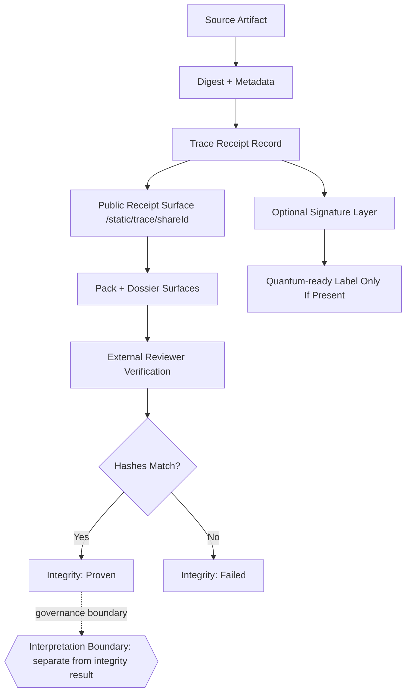

# if.trace Full Explainer (Bible v4.23, Six-Audience, Claim-Boundary Strict)

Danny Stocker | ds@infrafabric.io | InfraFabric Research | 2026-03-02
Status: review
Last review date: 2026-03-03
Next checkpoint date: 2026-03-09
Checkpoint pass criteria:
- all canonical reviewer URLs in this document return HTTP `200`,
- sample output hash verification returns `INTEGRITY PASS`,
- reviewer packet checksum snapshot and `as_of_utc` are refreshed within 24 hours.
Accountable and responsible approver: Danny Stocker | ds@infrafabric.io
LLM-assist disclosure: drafted and validated with Codex runtime assistance; accountable human author remains Danny Stocker.
Pack release: IF-PACK-2026-03-03-R3
Version lineage: v1.1 existed as an internal working draft (not published as a canonical explainer); this v1.2 document is the current canonical revision, supersedes published `docs/601-if-trace-full-explainer-v1.0-2026-02-19T095245Z.md`, and incorporates runtime evidence refresh + reviewer packet checksum discipline.

## Who | Why | What | Where | When | How

- Who: executives making release/governance decisions, operators running publication/recovery, engineers implementing and validating trace flows, and LLM runtime developers building on stable contracts.
- Why: preserve trust by preventing over-claims while still making verification easy for external reviewers with no login.
- What: a full explainer for `if.trace` that defines exactly what is proven, what is not proven, how to verify, and how to fail closed.
- Where: `if.trace` public surface and linked no-login artifacts under `https://infrafabric.io/static/*`, plus registry and reviewer entrypoints.
- When: immediate use for review and release decisions; execution windows are 30/60/90 minutes and 3/6/9 hours for LLM/operator loops, with day-scale external reviewer testing.
- How: registry-bound naming, receipt-linked artifacts, hash verification, optional signature verification, explicit non-claims, and fail-closed operational gates.

## Problem statement

InfraFabric has a real, shipped public `if.trace` surface, but reviewers regularly mix three different statements into one: (1) byte-integrity verification, (2) content correctness, and (3) compliance readiness. When those are not separated in black/white terms, confidence collapses even when the cryptographic and receipt mechanics are functioning.

## Goal

Enable a skeptical third party to answer one binary question in under five minutes: "Do the bytes I downloaded match the published receipt?" while preventing accidental upgrades of that answer into correctness, legal, or safety claims.

## Non-Expert Proof Box (One-Hop)

- Receipt URL: `https://infrafabric.io/static/trace/6qRgcR01kw_qNo63Dbs_ob9n`
- Artifact URL: `https://infrafabric.io/static/dossier/6qRgcR01kw_qNo63Dbs_ob9n/download`
- Expected digest (from receipt): `a3c5fe7dfce73ae0365b20819aaa2a0ea99c2a3e9526591c56471f0bdbdf9026`
- Browser-first check: open the receipt URL and confirm the displayed `outputSha256` value equals the expected digest above.
- Command check:
```bash
curl -fsS -o /tmp/iftrace_check.md https://infrafabric.io/static/dossier/6qRgcR01kw_qNo63Dbs_ob9n/download
ACTUAL=$(sha256sum /tmp/iftrace_check.md | awk '{print $1}')
test "$ACTUAL" = "a3c5fe7dfce73ae0365b20819aaa2a0ea99c2a3e9526591c56471f0bdbdf9026" && echo "INTEGRITY PASS" || echo "INTEGRITY FAIL"
```
- Limit: digest match proves byte integrity only, not correctness/compliance.

## Execution-time model

- 30/60/90 minutes: gather evidence, run reachability probes, refresh claim tables, and patch wording drift.
- 3/6/9 hours: refresh review packs, run end-to-end trace checks, resolve inconsistencies across registry, public surfaces, and documentation, and publish updated explainer.
- Day-scale: external reviewer pass, hostile-readability check, and governance approval for any outward claim changes.

## Claim Boundary

`if.trace` proves byte integrity. Receipt linkage metadata can be verified when fields are present and verifiable; this is not a blanket historical lineage guarantee.

Coverage condition: integrity verification is available only for receipts containing the required hash fields; historical unsigned/missing-signature subsets are reported in the Evidence Snapshot and remain outside signature-strength claims.

`if.trace` does not prove:
- factual correctness of the source or output,
- policy/legal/regulatory compliance,
- business suitability or decision quality.

Registry status `shipped` means the public surface exists and is externally reachable. It does not imply General Availability (GA) commercial posture, customer commitments, or compliance certification.

## Reviewer Quick Matrix (Feature -> Evidence -> Limit)

| Feature claim | Primary no-login evidence | Binary verification step | Explicit limit |
|---|---|---|---|
| Public if.trace surface is reachable | `https://infrafabric.io/if/trace/` | `curl -fsSI https://infrafabric.io/if/trace/` returns `HTTP 200` | Reachability does not prove correctness/compliance |
| Receipt endpoint is externally fetchable | `https://infrafabric.io/static/trace/6qRgcR01kw_qNo63Dbs_ob9n` | `curl -o /dev/null -s -w '%{http_code}\\n' <url>` returns `200` | Fetchability does not prove truth of content |
| Pack endpoint is externally fetchable | `https://infrafabric.io/static/pack/6qRgcR01kw_qNo63Dbs_ob9n` | `curl -o /dev/null -s -w '%{http_code}\\n' <url>` returns `200` | Fetchability does not prove truth of content |
| Dossier endpoint is externally fetchable | `https://infrafabric.io/static/dossier/6qRgcR01kw_qNo63Dbs_ob9n` | `curl -o /dev/null -s -w '%{http_code}\\n' <url>` returns `200` | Fetchability does not prove truth of content |
| Byte-integrity can be checked deterministically | Receipt hash fields + downloaded artifact bytes | Compare local SHA-256 against declared receipt digest; mismatch is fail | Integrity is not legal/policy certification |
| Signature metadata presence can be shown when present | Signature metadata in receipt | Verify signature fields only when present/verifiable | Signature absence/ambiguity does not upgrade claim strength |

Reference command with pipe (kept outside table for strict Markdown renderers):
```bash
curl -fsSI https://infrafabric.io/if/trace/ | head -n 10
```

Worked example (one-hop review):
- Feature: byte-integrity check for dossier download.
- Evidence URL: `https://infrafabric.io/static/dossier/6qRgcR01kw_qNo63Dbs_ob9n/download`.
- Pass signal: local SHA-256 equals declared receipt digest (`a3c5fe7dfce73ae0365b20819aaa2a0ea99c2a3e9526591c56471f0bdbdf9026`).
- Limit: even with a matching digest, no correctness/compliance claim is implied.

Matrix scope note: this quick matrix uses one representative shareId for speed. Coverage breadth and historical distribution are shown in the Evidence Snapshot section.

## Document Navigation by Audience

- Executives / Business Leaders (`abstract-first`): [Executive Decision Surface](#executive-decision-surface)
- Power Users / Operators (`domain-native`): [Operational Runbook View](#operational-runbook-view)
- Engineers / Implementers (`domain-native`): [Implementation View](#implementation-view)
- LLM Runtime Developers (`domain-native`): [Runtime Contract View](#runtime-contract-view)
- External Reviewers (`mixed`; switch to literal domain language at [External Reviewer Packet](#external-reviewer-packet-one-url-per-line)): [Evidence Snapshot](#evidence-snapshot-current--historical-explicitly-labeled)
- Product / Commercial (`mixed`; switch to literal domain language at [Release Language Guardrails](#release-language-guardrails)): [Executive Decision Surface](#executive-decision-surface)

## System Diagram



```text
ASCII fallback:
source -> digest+metadata -> trace receipt -> public receipt URL
         -> pack/dossier URLs -> external verification -> PASS/FAIL (integrity only)
```

## Executive Decision Surface

### 1) One-page answer

`if.trace` is the platform integrity substrate for public no-login verification. Its core value is strict claim discipline: it gives a proof surface for bytes, not a truth machine for narrative claims.

### 2) Decision table (now)

| Decision question | Current answer | Evidence state | Risk if ignored |
|---|---|---|---|
| Is `if.trace` publicly reachable as a shipped product surface? | Yes | Verified on `2026-03-02` via HTTP 200 to `/if/trace/` and registry entries | Reviewers assume vaporware or stale documentation |
| Can external reviewers verify no-login receipt artifacts? | Yes | Verified 200 for `/static/trace`, `/static/pack`, verifier assets, and bundle index | External due diligence fails on first touch |
| Does `if.trace` prove content correctness/compliance? | No | Explicit non-claim in this document and registry-aligned wording | Over-claim exposure and trust collapse |
| Is sustained-load certification evidenced here? | NOT EVIDENCED | Explicitly excluded from this revision | Premature production-readiness claims |
| Is legal/compliance sign-off evidenced here? | NOT EVIDENCED | Explicitly excluded from this revision | Misleading governance posture |

### 3) Boardroom interpretation

- What is strong today: deterministic, no-login, URL-addressable proof surface with practical verifier tooling.
- What is intentionally narrow: integrity guarantees only.
- What blocks broad release claims: missing sustained-load and compliance certification evidence in this explainer.

### 4) Approve / defer / block framing

- Approve: use `if.trace` wording for integrity and reviewer portability.
- Defer: any statement implying regulatory readiness, legal sufficiency, or universal correctness guarantees.
- Block: any outward copy that treats "receipt exists" as equivalent to "content is true/safe/compliant."

### 5) Assumption most likely to be wrong

Assumption: reviewers will correctly separate integrity from correctness if the distinction appears once.

Invalidation test: if reviewer feedback still confuses these concepts, require repeated non-claim placement (top + mid + footer) in public-facing content.

*If this distinction appears only once, someone will miss it and confidently over-claim it in a high-stakes room.*

## Operational Runbook View

### 1) Canonical operating rule

Operate `if.trace` as a fail-closed integrity system: if receipt verification is ambiguous, publication posture must downgrade, not hand-wave.

### 2) Daily operator checks

1. Confirm registry alignment: `product_id=if.trace`, `status=shipped`, path `/if/trace`.
2. Confirm public reachability for canonical surfaces.
3. Confirm sample receipt renders explicit PASS/FAIL hash checks.
4. Confirm non-claims remain visible in reviewer-facing materials.
5. If any mismatch exists, freeze promotion language and open a correction task.
6. If any canonical URL in this paper returns `4xx`/`5xx`, block publication until the endpoint/content is fixed.

### 3) Canonical no-login surfaces

https://infrafabric.io/if/trace/
https://infrafabric.io/static/trace/6qRgcR01kw_qNo63Dbs_ob9n
https://infrafabric.io/static/pack/6qRgcR01kw_qNo63Dbs_ob9n
https://infrafabric.io/static/pack/6qRgcR01kw_qNo63Dbs_ob9n.md
https://infrafabric.io/static/dossier/6qRgcR01kw_qNo63Dbs_ob9n
https://infrafabric.io/static/dossier/6qRgcR01kw_qNo63Dbs_ob9n/download
https://infrafabric.io/static/source/6153a5998fe103e69f6d5b6042fbe780476ff869a625fcf497fd1948b2944b7c.pdf
https://infrafabric.io/static/hosted/iftrace.py
https://infrafabric.io/static/hosted/iftrace.html
https://infrafabric.io/static/hosted/iftrace-offline.html
https://infrafabric.io/static/hosted/review/trace-bundles/b6547c03/index.html
https://infrafabric.io/static/hosted/review/trace-bundles/b6547c03/index.md

Pattern references (non-clickable path shapes):
- `/static/trace/{shareId}`
- `/static/pack/{shareId}`
- `/static/pack/{shareId}.md`
- `/static/dossier/{shareId}`
- `/static/dossier/{shareId}/download`
- `/static/source/{sha256}.pdf`
- `/static/hosted/review/trace-bundles/{tracePrefix}/index.html`
- `/static/hosted/review/trace-bundles/{tracePrefix}/index.md`

### 4) Incident posture

Fail closed when any of these occurs:
- receipt URL reachable but key verification fields missing,
- output hash mismatch,
- source hash mismatch when source hash is declared,
- registry path/status drift from canonical values,
- public surface not reachable for no-login reviewers.

### 5) Incident response sequence

1. Classify failure as integrity, availability, or wording-governance.
2. Preserve current artifacts and capture checksums before patching.
3. Patch only the minimal surface required to restore deterministic verification.
4. Re-run operator probe set.
5. Update release language only after probes pass.

Command-level rollback skeleton (internal operator runbook; not part of no-login reviewer evidence packet):

Runtime environment note: commands assume Proxmox VE with CT210 (edge/static) and CT212 (trace data). Adapt `pct exec` calls for non-Proxmox environments.

Set these variables from your internal environment before execution:
- `CT210_TRACE_BUNDLES_PATH`
- `CT212_TRACE_DATA_PATH`
- `CT212_SERVICE_NAME`

```bash
# 0) Snapshot current published state before rollback
TS=$(date -u +%Y%m%dT%H%M%SZ)
set -euo pipefail
CT210_TRACE_BUNDLES_PATH="${CT210_TRACE_BUNDLES_PATH:-/srv/hosted-static/public/review/trace-bundles}"
CT212_TRACE_DATA_PATH="${CT212_TRACE_DATA_PATH:-/opt/re-voice/site/red-team-shadow-dossiers/data}"
CT212_SERVICE_NAME="${CT212_SERVICE_NAME:-red-team-site}"
pct exec 210 -- bash -lc "mkdir -p /root/tmp/iftrace_recovery && cp -a \"$CT210_TRACE_BUNDLES_PATH\" /root/tmp/iftrace_recovery/trace-bundles_${TS}"
pct exec 212 -- bash -lc "mkdir -p /root/tmp/iftrace_recovery && cp -a \"$CT212_TRACE_DATA_PATH\" /root/tmp/iftrace_recovery/data_${TS}"

# 1) Validate immutable host artifact, then stage into each CT
SRC_ROOT="/root/tmp/iftrace_release_artifact_v1"
SRC_CT210="$SRC_ROOT/ct210/trace-bundles"
SRC_CT212="$SRC_ROOT/ct212/data"
SRC_MANIFEST="$SRC_ROOT/manifest.json"
SRC_MANIFEST_SHA256="e26f70e2229f69b6f1316c438bb0dfb2344cb14a921ddd65b835c1e60b08ef78"
# Update SRC_MANIFEST_SHA256 to the current release manifest before execution.
test -d "$SRC_CT210" && test -d "$SRC_CT212" && test -f "$SRC_MANIFEST"
echo "$SRC_MANIFEST_SHA256  $SRC_MANIFEST" | sha256sum -c -
python3 - <<'PY' "$SRC_ROOT"
import hashlib, json, pathlib, sys
root = pathlib.Path(sys.argv[1])
manifest = json.loads((root / "manifest.json").read_text(encoding="utf-8"))
for rel in ("ct210/trace-bundles", "ct212/data"):
    expected = manifest["items"][rel]["tree_sha256"]
    p = root / rel
    h = hashlib.sha256()
    for fp in sorted(p.rglob("*")):
        if fp.is_file():
            b = fp.read_bytes()
            h.update(str(fp.relative_to(root)).encode())
            h.update(b"\0")
            h.update(hashlib.sha256(b).hexdigest().encode())
            h.update(b"\n")
    actual = h.hexdigest()
    if actual != expected:
        raise SystemExit(f"tree hash mismatch for {rel}: {actual} != {expected}")
print("tree hash checks: pass")
PY
tar -C "$SRC_ROOT/ct210" -cf - trace-bundles | pct exec 210 -- tar -C /root/tmp -xf -
tar -C "$SRC_ROOT/ct212" -cf - data | pct exec 212 -- tar -C /root/tmp -xf -
pct exec 210 -- test -d /root/tmp/trace-bundles
pct exec 212 -- test -d /root/tmp/data
pct exec 210 -- bash -lc "test -d \"$CT210_TRACE_BUNDLES_PATH\""
pct exec 210 -- rsync -a --dry-run --delete /root/tmp/trace-bundles/ "$CT210_TRACE_BUNDLES_PATH"/
pct exec 210 -- rsync -a --delete /root/tmp/trace-bundles/ "$CT210_TRACE_BUNDLES_PATH"/

# 2) Restore CT212 red-team trace data and restart CT212 service
pct exec 212 -- bash -lc "test -d \"$CT212_TRACE_DATA_PATH\" && systemctl is-enabled \"$CT212_SERVICE_NAME\" >/dev/null"
pct exec 212 -- rsync -a --dry-run --delete /root/tmp/data/ "$CT212_TRACE_DATA_PATH"/
pct exec 212 -- rsync -a --delete /root/tmp/data/ "$CT212_TRACE_DATA_PATH"/
pct exec 212 -- systemctl restart "$CT212_SERVICE_NAME"

# 3) Reload CT210 edge and verify core if.trace endpoints
pct exec 210 -- systemctl reload caddy
for u in \
  "https://infrafabric.io/if/trace/" \
  "https://infrafabric.io/static/trace/6qRgcR01kw_qNo63Dbs_ob9n" \
  "https://infrafabric.io/static/pack/6qRgcR01kw_qNo63Dbs_ob9n" \
  "https://infrafabric.io/static/dossier/6qRgcR01kw_qNo63Dbs_ob9n"; do
  CODE=$(curl -o /dev/null -s -w '%{http_code}' "$u")
  test "$CODE" = "200"
done

# 4) Mandatory post-rollback hash assertion (fail closed)
curl -fsS -o /tmp/iftrace_postrollback.md https://infrafabric.io/static/dossier/6qRgcR01kw_qNo63Dbs_ob9n/download
ACTUAL=$(sha256sum /tmp/iftrace_postrollback.md | awk '{print $1}')
EXPECTED="a3c5fe7dfce73ae0365b20819aaa2a0ea99c2a3e9526591c56471f0bdbdf9026"
test "$ACTUAL" = "$EXPECTED"
pct exec 210 -- systemctl is-active caddy
pct exec 212 -- systemctl is-active "$CT212_SERVICE_NAME"
pct exec 212 -- test -s "$CT212_TRACE_DATA_PATH"/public_ids.json

# 5) Emit rollback verification artifact (immutable closeout evidence)
VERIFY_JSON="/root/tmp/iftrace_rollback_verify_${TS}.json"
python3 - <<'PY' "$VERIFY_JSON" "$SRC_MANIFEST_SHA256" "$ACTUAL"
import datetime as dt, json, sys
out=sys.argv[1]
manifest_sha=sys.argv[2]
actual_sha=sys.argv[3]
payload={
  "generated_utc": dt.datetime.now(dt.timezone.utc).replace(microsecond=0).isoformat().replace("+00:00","Z"),
  "manifest_sha256": manifest_sha,
  "postrollback_output_sha256": actual_sha,
  "status": "pass_if_previous_steps_passed"
}
open(out,"w",encoding="utf-8").write(json.dumps(payload, indent=2)+"\n")
PY
sha256sum "$VERIFY_JSON"
```

### 6) Rollback principle

Rollback claims before rollback code. If wording outruns evidence, strip wording immediately even while technical remediation is in progress.

*Operational trust breaks faster from overstatement than from a transparent temporary outage.*

## Implementation View

### 1) Product identity and naming contract

- Product ID: `if.trace`
- Brand label: `if.trace`
- Canonical product path: `/if/trace`
- Public URL shape: `/static/trace/{shareId}` and related no-login aliases
- Legacy internal service label: `IF.TTT`

The internal legacy label does not change outward product identity.

### 2) Core artifacts and identifiers

- `shareId`: canonical public handle for receipt-linked assets.
- `trace_id`: chain-of-custody UUID in receipt metadata.
- `source_sha256`: digest for source artifact when present.
- `output_sha256`: digest for published output artifact.
- `public_id`: human-friendly resolver alias where implemented; not an auth token.

### 3) Minimal receipt envelope (illustrative schema)

```json
{
  "product_id": "if.trace",
  "trace_id": "b6547c03-6b48-486e-8451-6399c3377297",
  "share_id": "6qRgcR01kw_qNo63Dbs_ob9n",
  "generated_utc": "2025-12-27T02:47:24.341Z",
  "source_sha256": "6153a5998fe103e69f6d5b6042fbe780476ff869a625fcf497fd1948b2944b7c",
  "output_sha256": "a3c5fe7dfce73ae0365b20819aaa2a0ea99c2a3e9526591c56471f0bdbdf9026",
  "integrity_checks": {
    "source_hash_match": true,
    "output_hash_match": true
  },
  "signature": {
    "status": "present",
    "algorithm": "ed25519",
    "pq_status": "READY"
  },
  "non_claims": [
    "integrity_only",
    "not_truth_validation",
    "not_compliance_certification"
  ]
}
```

Optional unsigned variant:

```json
{
  "signature": {
    "status": "absent",
    "algorithm": null,
    "pq_status": "NA"
  }
}
```

### 4) Verification workflow (engineer path)

1. Resolve receipt URL from shareId.
2. Extract expected hash fields from receipt.
3. Fetch output artifact and compute local SHA-256.
4. Compare local digest to declared `output_sha256`.
5. If source artifact is available, verify `source_sha256` similarly.
6. For high-trust claims, verify signature metadata when signature fields are present; if absent, keep hash-only boundary wording.
7. Signature verification path: use `https://infrafabric.io/static/hosted/iftrace.py` (or offline verifier HTML) with a published public key reference. Manual cryptographic verification steps are tracked as a 60-day profile hardening item and are not claimed as complete in this revision.
8. Emit binary verdict: `integrity_verified`, `integrity_not_verified`, `integrity_unknown`, or `integrity_stale`.

### 5) Command snippets (black/white)

```bash
# Reachability sanity
curl -fsSI https://infrafabric.io/if/trace/ | head -n 10

# Sample receipt
curl -fsSI https://infrafabric.io/static/trace/6qRgcR01kw_qNo63Dbs_ob9n | head -n 10

# Verifier assets
curl -fsSI https://infrafabric.io/static/hosted/iftrace.py | head -n 10
curl -fsSI https://infrafabric.io/static/hosted/iftrace.html | head -n 10
curl -fsSI https://infrafabric.io/static/hosted/iftrace-offline.html | head -n 10
```

```bash
# Output hash check pattern
curl -fsS -o dossier.md https://infrafabric.io/static/dossier/6qRgcR01kw_qNo63Dbs_ob9n/download
sha256sum dossier.md
# Compare with output_sha256 from receipt page
```

### 6) Failure modes and concrete responses

| Failure mode | Detection signal | Response | Claim impact |
|---|---|---|---|
| URL reachable but receipt fields incomplete | Missing hash/signature fields | Treat as verification failure; repair receipt generation | downgrade to not-verified |
| Hash mismatch | Local SHA-256 differs from receipt | Block promotion; regenerate artifact and receipt | block integrity claim |
| Signature metadata ambiguity | Signature label present but unverifiable | Mark signature status as unknown; keep hash-only claim | remove signature-strength language |
| Registry drift | `if.registry` path/status mismatch | Correct registry/doc alignment before release copy updates | freeze outward wording |
| Bundle index absent | 404/no index for trace prefix | Show explicit "no offline bundles published" | no bundle availability claim |

### 7) Security and governance boundaries

`if.trace` is a cryptographic integrity layer, not a policy engine. Governance decisions must remain in governance systems and evidence packs that reference trace receipts as supporting artifacts.

*When a control is strong, pressure to over-interpret it increases; guardrails must be strongest exactly there.*

## Runtime Contract View

### 1) Contract goals for LLM runtimes

- Deterministic fetch targets.
- Explicit success/failure semantics.
- No implicit upgrade from integrity to correctness.
- Machine-parseable claim states.

### 2) Runtime field contract

```json
{
  "contract_id": "if.trace.runtime.v1",
  "required": [
    "product_id",
    "receipt_url",
    "share_id",
    "generated_utc",
    "evaluated_utc",
    "max_age_sec",
    "output_sha256",
    "integrity_verdict",
    "verdict_reason"
  ],
  "optional": [
    "source_sha256",
    "expires_utc",
    "signature_algorithm",
    "pq_status",
    "bundle_index_url"
  ],
  "forbidden_inference": [
    "correctness_verified",
    "compliance_verified",
    "policy_approved"
  ],
  "required_checks": [
    "receipt_url host must be infrafabric.io",
    "receipt_url path must match /static/trace/{shareId}",
    "share_id must match receipt_url path segment",
    "product_id must equal if.trace",
    "generated_utc must be <= evaluated_utc",
    "evaluated_utc - generated_utc must be <= max_age_sec"
  ]
}
```

### 2.1) `max_age_sec` semantics (explicit)

- `max_age_sec` is consumer-visible and must be explicit in every runtime verification output.
- Default for document/reviewer artifacts: `604800` seconds (7 days).
- Default for gate-status freshness checks: `86400` seconds (24 hours).
- If `evaluated_utc - generated_utc > max_age_sec`, runtime verdict must be `integrity_stale` and any "current" wording is blocked.
- If `generated_utc` is missing or unparsable, verdict must be `integrity_unknown` (fail closed for claim upgrades).

Populated runtime contract example from this revision cycle:

```json
{
  "contract_id": "if.trace.runtime.v1",
  "product_id": "if.trace",
  "receipt_url": "https://infrafabric.io/static/trace/6qRgcR01kw_qNo63Dbs_ob9n",
  "share_id": "6qRgcR01kw_qNo63Dbs_ob9n",
  "generated_utc": "2025-12-27T02:47:24.341Z",
  "evaluated_utc": "2026-03-03T02:03:48.573704Z",
  "max_age_sec": 604800,
  "output_sha256": "a3c5fe7dfce73ae0365b20819aaa2a0ea99c2a3e9526591c56471f0bdbdf9026",
  "integrity_verdict": "integrity_stale",
  "verdict_reason": "age_seconds=5699784 exceeds max_age_sec_doc_artifacts=604800"
}
```

### 3) Runtime decision states

- `integrity_verified`: hashes match; boundaries remain explicit.
- `integrity_not_verified`: mismatch or missing required fields.
- `integrity_unknown`: network failure or insufficient data.
- `integrity_stale`: receipt age exceeds the explicit `max_age_sec` threshold for the current claim context.

Only `integrity_verified` may be surfaced as positive; all other states are non-pass.

### 4) Runtime no-pointer offline packet shape

For no-pointer contexts, include a single file containing:
- receipt excerpt (hash fields + ids),
- local verification commands,
- expected outputs,
- explicit non-claims.

### 5) Prompt-safe wording policy

Allowed:
- "Verified that bytes match published hash."
- "Integrity pass/fail based on hash comparison."

Not allowed:
- "This proves the report is true."
- "This certifies compliance."
- "This confirms policy correctness."

### 6) Runtime regression checks

- Check A: all required fields present.
- Check B: at least one independent hash comparison run.
- Check C: non-claim lines present in final output.
- Check D: status wording aligned with registry state (`shipped | preview | roadmap`).

*If the runtime output reads like legal certainty, the contract has already failed.*

## Evidence Snapshot (Current + Historical, Explicitly Labeled)

### 1) Registry evidence

Local registry entry (`if.registry.json`) and public mirror (`/llm/if.registry.json.txt`) both show:
- `product_id: if.trace`
- `status: shipped`
- `path: /if/trace`
- `public_surfaces` includes `/if/trace/` and canonical static verification surface shapes
Probe reference:
```bash
curl -fsSL https://infrafabric.io/llm/if.registry.json.txt | jq -c '.products[] | select(.product_id=="if.trace") | {product_id,status,path,public_surfaces_count:(.public_surfaces|length)}'
```

### 2) Reachability probes

Observed HTTP status codes:
- `200` `https://infrafabric.io/if/trace/`
- `200` `https://infrafabric.io/static/trace/6qRgcR01kw_qNo63Dbs_ob9n`
- `200` `https://infrafabric.io/static/pack/6qRgcR01kw_qNo63Dbs_ob9n`
- `200` `https://infrafabric.io/static/pack/6qRgcR01kw_qNo63Dbs_ob9n.md`
- `200` `https://infrafabric.io/static/dossier/6qRgcR01kw_qNo63Dbs_ob9n`
- `200` `https://infrafabric.io/static/dossier/6qRgcR01kw_qNo63Dbs_ob9n/download`
- `200` `https://infrafabric.io/static/source/6153a5998fe103e69f6d5b6042fbe780476ff869a625fcf497fd1948b2944b7c.pdf`
- `200` `https://infrafabric.io/static/hosted/iftrace.py`
- `200` `https://infrafabric.io/static/hosted/iftrace.html`
- `200` `https://infrafabric.io/static/hosted/iftrace-offline.html`
- `200` `https://infrafabric.io/static/hosted/review/trace-bundles/b6547c03/index.html`
- `200` `https://infrafabric.io/static/hosted/review/trace-bundles/b6547c03/index.md`
`verified_utc`: `2026-03-03T02:03:48Z`

### 3) Sample receipt evidence (rendered page)

The sampled receipt page displays:
- explicit integrity badge (`INTACT`, hashes match),
- output and source hash pass lines,
- explicit black/white non-claim callout,
- optional quantum-ready line (`READY (ML-DSA-87)`),
- downloadable and HTML fallback links.
`verified_utc`: `2026-03-03T02:03:48Z`
Sample age boundary: this sample receipt is intentionally older than the 7-day document freshness threshold and currently evaluates to `integrity_stale` under runtime contract defaults (`max_age_sec=604800`).

### 4) Evidence quality notes

- This snapshot demonstrates availability and content shape for sampled surfaces.
- It does not constitute sustained-load testing.
- It does not constitute full cryptographic signature chain audit across all receipts.

### 5) Signed artifact stats snapshot (verified current)

Scope note: these counts are for the red-team receipt publication store (`jobs`/`shares`) and do not represent all blackboard task events.

Snapshot generated at `2026-03-03T02:03:48Z` from live `jobs` and `shares` stores (`pct exec 212`) plus registry-side Redis cross-check.
`last_verified_utc`: `2026-03-03T02:03:48Z`.

| Metric | Value | Notes |
|---|---:|---|
| Jobs total | 180 | All job JSON records scanned |
| Jobs done | 177 | `status=done` |
| Jobs with hash fields | 179 | both `sourceSha256` and `outputSha256` present |
| Jobs with signed trace receipt | 149 | has `tttTraceReceipt.id` (or `_ttt_trace_receipt.id`) |
| Jobs quantum-ready | 149 | signed jobs with `quantum_ready=true` |
| Shares total | 178 | public share JSON records |
| Shares linked to existing job | 178 | no dangling share links in snapshot |
| Shares with signed receipt | 147 | share -> job has signed trace receipt |
| Shares with quantum-ready receipt | 147 | share -> job has `quantum_ready=true` |

Redis cross-check (registry side):
- `ttt:index:id:if://trace/*` count: `149`

Interpretation boundary:
- These numbers show signed-receipt coverage in current stores.
- They do not by themselves prove all signatures have been independently re-verified end-to-end in this document cycle.
- Coverage gap explanation: `31/180` jobs and `31/178` shares are unsigned historical rows. Latest unsigned job timestamp observed: `2026-02-03T04:46:42Z`. Post-cutover sample check after that timestamp in current store: `5/5` jobs signed.
- Evidence artifact pointers:
  - `/root/tmp/if_trace_runtime_2301/summary.latest.json`
  - `/root/tmp/if_trace_runtime_2301/reviewer_packet_probe.latest.json`
  - `/root/tmp/if_trace_runtime_2301/runtime_contract_eval.latest.json`

### 6) Blackboard signing reality snapshot (optional context, verified current)

Snapshot updated at `2026-03-03T02:03:48Z` from local blackboard and signals stores.
`last_verified_utc`: `2026-03-03T02:03:48Z`.

| Surface | Total events | Hash fingerprint coverage | Signature coverage | Current interpretation |
|---|---:|---:|---:|---|
| Blackboard task ledger (`tasks.events.jsonl`) | 5,435 | 5,435/5,435 have valid `row_sha256` | 876/5,435 include `if.security.signature.v1` | Mixed historical + newer rows; signature extension present on a growing subset |
| Blackboard session ledger (`sessions.events.jsonl`) | 3,902 | n/a | 876/3,902 include `if.security.signature.v1` | Mixed historical + newer rows |
| Blackboard path-lock ledger (`path_locks.events.jsonl`) | 10 | n/a | 0/10 include `if.security.signature.v1` | No post-cutover lock events yet in this snapshot |
| Blackboard signal ledger (`signals.events.jsonl`) | 9,243 | n/a | 9,038/9,243 include `if.security.signature.v1` extension | Signature-backed signals are mostly enforced, with some legacy/unsigned rows |

Boundary note:
- This table is observational context only; normative `if.blackboard` claims belong in the dedicated `if.blackboard` explainer.
- `if.trace` verification does not require these blackboard rows to pass.
- Cutover context: first task-ledger signature extension observed at `2026-02-19T10:14:54Z`; lower overall task signature ratio reflects historical pre-cutover rows still in denominator.

## What is intentionally not claimed in this explainer

- No claim of broad production SLO/SLA certification.
- No claim of regulatory/legal certification.
- No claim that every historical receipt has complete signature metadata.
- No claim that all downstream modules are equally mature.

These non-claims are intentionally repeated across sections; repetition is a control, not redundancy, because reviewers frequently over-infer from a single integrity pass statement.

## Integration map (where if.trace fits)

### 1) Cross-module role

`if.trace` is the integrity anchor used by other modules when they publish externally reviewable artifacts.

Typical dependency pattern:
- producer module generates output,
- producer emits or references receipt fields,
- reviewer verifies via `if.trace` URLs and hash checks,
- governance layer uses those receipts as evidence, not as substitute for judgment.

### 2) Example dependency links (conceptual)

- `if.content`: published content and review packs can bind outputs to trace receipts.
- `if.typeset`: output packaging can attach trace references for deterministic verification.
- `if.gov`: decision bundles can cite `if.trace` links as integrity evidence.
- `if.api` / `if.bus`: event and response artifacts can include trace IDs for lineage where applicable.
- `if.switchboard`: enforcement-matrix replay evidence can bind call-path artifacts to trace receipts.
- `if.blackboard`: append-only task/signal ledger narratives can reference trace IDs for cross-surface integrity checks.

Dependency direction note: these are outbound consumers of `if.trace`. `if.trace` integrity verification does not depend on `if.switchboard` or `if.blackboard` runtime state to produce a byte-integrity verdict.

### 3) Independence rule

A module referencing `if.trace` does not inherit `if.trace` status. Each module keeps its own status evidence boundary.

*Integrity plumbing shared across modules is useful; status inflation across modules is not.*

## Release Language Guardrails

### 1) Approved outward sentence patterns

- "`if.trace` provides no-login receipt-based byte integrity verification."
- "It proves the bytes match the published hash when verification passes."
- "It does not prove correctness, compliance, or policy fitness."

### 2) Blocked sentence patterns

- "`if.trace` certifies truth."
- "`if.trace` proves compliance readiness."
- "`if.trace` guarantees decisions are correct."

### 3) Registry-status wording guardrail

- `shipped`: public no-login surface exists and is deployed; at least one real artifact is reviewable end-to-end.
- `preview`: public demo artifacts exist and are reviewable, but the module/service is not yet treated as a live production surface.
- `roadmap`: concept/spec exists, but there is no public demo evidence meeting the reviewability bar.

### 4) Enforcement mechanism (owner + process)

- Owner: accountable approver named in the header.
- Runtime evidence owner: operator maintaining receipt/pack surface checks.
- Continuity owner: no named assignee as of this revision; assignment is required by checkpoint `2026-03-09`, and until assigned this remains an open P1 process gap for claim-upgrade governance.
- Publish gate before claim upgrades:
  1. rerun canonical no-login URL liveness probes,
  2. rerun at least one sample hash-verification flow,
  3. run whitepaper scaffold lint,
  4. record pass/fail and artifacts in blackboard task closeout.
- If any gate fails, wording remains conservative and claim upgrades are blocked.
- Any canonical URL used in this document returning `4xx`/`5xx` blocks publication until fixed.

## 30/60/90 plan for this module documentation

### 30 days

- Keep this explainer synchronized with registry and public surface checks.
- Add automatic probe export artifact for this document revision cycle (`python3 scripts/if_trace_runtime_evidence.py`).
- Ensure every new outward mention of `if.trace` includes one-line non-claim.

### 60 days

- Add signature-verification evidence profile for representative receipts.
- Add explicit sample matrix across multiple receipt generations.
- Add formal drift checks between registry and page-level copy.

### 90 days

- Add sustained-load evidence section (if available) with binary thresholds.
- Add external reviewer findings summary with accepted/rejected recommendations.
- Publish a revisioned v1.3 explainer with delta table.

Rollback and dependency controls:
- If any canonical URL in this explainer returns non-`200`, or any sample hash check fails, freeze claim upgrades until remediation evidence is published.
- Modules consuming `if.trace` integrity claims (`if.switchboard`, `if.blackboard`, and dependent vertical packs) cannot strengthen integrity wording faster than this explainer's evidence tier.

## External Reviewer Packet (one URL per line)

https://infrafabric.io/if/trace/
https://infrafabric.io/static/trace/6qRgcR01kw_qNo63Dbs_ob9n
https://infrafabric.io/static/pack/6qRgcR01kw_qNo63Dbs_ob9n
https://infrafabric.io/static/pack/6qRgcR01kw_qNo63Dbs_ob9n.md
https://infrafabric.io/static/dossier/6qRgcR01kw_qNo63Dbs_ob9n
https://infrafabric.io/static/dossier/6qRgcR01kw_qNo63Dbs_ob9n/download
https://infrafabric.io/static/source/6153a5998fe103e69f6d5b6042fbe780476ff869a625fcf497fd1948b2944b7c.pdf
https://infrafabric.io/static/hosted/iftrace.py
https://infrafabric.io/static/hosted/iftrace.html
https://infrafabric.io/static/hosted/iftrace-offline.html
https://infrafabric.io/static/hosted/review/trace-bundles/b6547c03/index.html
https://infrafabric.io/static/hosted/review/trace-bundles/b6547c03/index.md

Reviewer packet integrity snapshot:
- `as_of_utc`: `2026-03-03T02:03:48.573704Z`
- hash artifact: `/root/tmp/if_trace_runtime_2301/reviewer_packet_hashes.latest.tsv`

| URL | SHA-256 |
|---|---|
| `https://infrafabric.io/static/trace/6qRgcR01kw_qNo63Dbs_ob9n` | `7b1071c6b75646530f83fe94fdd2dd875c27b60c90d855a1eee1c38faa903ffa` |
| `https://infrafabric.io/static/dossier/6qRgcR01kw_qNo63Dbs_ob9n/download` | `a3c5fe7dfce73ae0365b20819aaa2a0ea99c2a3e9526591c56471f0bdbdf9026` |
| `https://infrafabric.io/static/source/6153a5998fe103e69f6d5b6042fbe780476ff869a625fcf497fd1948b2944b7c.pdf` | `6153a5998fe103e69f6d5b6042fbe780476ff869a625fcf497fd1948b2944b7c` |
| `https://infrafabric.io/static/pack/6qRgcR01kw_qNo63Dbs_ob9n.md` | `8a34d732247c2159c526c620b31b9ec7774c46caeaa485585c3e5e1a9af6a42f` |

Reviewer interpretation guide:

| URL class | Purpose | Expected pass signal | Fail interpretation |
|---|---|---|---|
| `/if/trace/` | Canonical product landing surface | HTTP `200` and reviewer-facing boundary wording visible | Surface/publishing regression |
| `/static/trace/{shareId}` | Receipt view with declared hash fields | HTTP `200` and digest/signature fields present | Receipt incompleteness or render failure |
| `/static/pack/{shareId}` + `.md` | Pack artifact for offline review | HTTP `200`; artifact bytes stable across repeated fetch | Packaging drift or missing asset |
| `/static/dossier/{shareId}` + `/download` | Dossier page and downloadable artifact | HTTP `200`; downloaded artifact hash can be compared to receipt digest | Integrity workflow not executable |
| `/static/hosted/iftrace*` | Verifier tooling entrypoints | HTTP `200`; assets load without auth | Tooling distribution outage |
| `/static/hosted/review/trace-bundles/{tracePrefix}/index.*` | Trace-bundle index references | HTTP `200`; index resolves linked artifacts | Offline bundle chain incomplete |

What reviewers can conclude now:
- `if.trace` is publicly reachable and registry-aligned as `shipped`.
- Receipt-linked artifacts are fetchable without login.
- Byte-integrity checks are reproducible from public URLs.

What reviewers cannot conclude now:
- broad compliance/legal certification,
- sustained-load certification,
- content correctness guarantees.

## Evidence Hierarchy (required boundary)

Freshness thresholds:
- Gate-status artifacts are `current` for <= `86400` seconds (24h), then `stale`.
- Document/reviewer artifacts are `current` for <= `604800` seconds (7d), then `stale`.

| Evidence tier | Current artifact examples | Reviewer reproducibility | Promotion path | Demotion conditions |
|---|---|---|---|---|
| Independent (current) | `if.trace` surface, receipt/pack/dossier URLs, hosted verifier assets, trace-bundle index with `as_of_utc` + checksums | no-login third-party fetchable | already independent | exceeds freshness threshold, hash drift without migration note, or URL non-200 |
| Independent (stale) | previously valid no-login artifacts beyond freshness threshold | no-login fetchable but not current-state safe | refresh probes/checksums and republish `as_of_utc` | refreshed and re-verified within threshold |
| Operator-assisted (current) | CT212/CT240 store scans, blackboard local ledger snapshots with generated timestamps | requires host/runtime privileges | target mirror checkpoint: 2026-03-15 via published immutable summary artifacts | cannot be re-verified within 48h of claim-upgrade request |
| Narrative-only | prose statements lacking replay artifacts | interpretation only | attach replayable evidence and timestamps | any contradiction with current artifact evidence |

## Appendix A: Verification commands used for this revision

### Minimal external verification set (no-login, 3-5 commands)

```bash
# 1) Registry alignment for if.trace
curl -fsSL https://infrafabric.io/llm/if.registry.json.txt \
  | jq -c '.products[] | select(.product_id=="if.trace") | {product_id,status,path}'

# 2) Core surface reachability
curl -fsSI https://infrafabric.io/if/trace/ | head -n 10

# 3) Receipt-driven hash extraction + dossier hash check (no hard-coded digest)
RECEIPT_URL='https://infrafabric.io/static/trace/6qRgcR01kw_qNo63Dbs_ob9n'
DOSSIER_URL='https://infrafabric.io/static/dossier/6qRgcR01kw_qNo63Dbs_ob9n/download'
curl -fsS "$RECEIPT_URL" -o /tmp/if_trace_receipt.html
curl -fsS "$DOSSIER_URL" -o /tmp/if_trace_dossier.md
python3 - <<'PY'
import hashlib,re,datetime
receipt=open('/tmp/if_trace_receipt.html','r',encoding='utf-8',errors='ignore').read()
expected_m=re.search(r'Output sha256:\s*<code>([0-9a-f]{64})</code>', receipt, re.I)
generated_m=re.search(r'Generated \(UTC\):\s*<code>([^<]+)</code>', receipt, re.I)
if not expected_m:
    raise SystemExit('INTEGRITY FAIL: output sha not found in receipt')
expected=expected_m.group(1).lower()
actual=hashlib.sha256(open('/tmp/if_trace_dossier.md','rb').read()).hexdigest()
if actual == expected:
    print('INTEGRITY PASS')
else:
    raise SystemExit(f'INTEGRITY FAIL: actual={actual} expected={expected}')
if generated_m:
    g=generated_m.group(1).strip()
    gd=datetime.datetime.fromisoformat(g.replace('Z','+00:00'))
    age_s=(datetime.datetime.now(datetime.timezone.utc)-gd).total_seconds()
    print('FRESHNESS CURRENT' if age_s <= 604800 else 'FRESHNESS STALE')
PY

# 4) Bundle index reachability
curl -fsSI https://infrafabric.io/static/hosted/review/trace-bundles/b6547c03/index.html | head -n 10
```

### Full operator verification set (internal/host)

```bash
# Setup (explicit values used in this revision)
OUT_DIR="/root/tmp/if_trace_runtime_2301"
SHARE_ID="6qRgcR01kw_qNo63Dbs_ob9n"
SOURCE_SHA="6153a5998fe103e69f6d5b6042fbe780476ff869a625fcf497fd1948b2944b7c"
TRACE_PREFIX="b6547c03"

# Canonical runtime evidence generator (produces checksums + freshness + coverage)
python3 scripts/if_trace_runtime_evidence.py \
  --out-dir "$OUT_DIR" \
  --share-id "$SHARE_ID" \
  --source-sha "$SOURCE_SHA" \
  --trace-prefix "$TRACE_PREFIX"

# Inspect core outputs
cat "$OUT_DIR/summary.latest.json"
cat "$OUT_DIR/runtime_contract_eval.latest.json"
head -n 20 "$OUT_DIR/reviewer_packet_hashes.latest.tsv"

# Optional: portable checksum replay (relative paths)
cd "$OUT_DIR" && sha256sum -c checksums.relative.sha256
```

## Appendix B: Glossary

- Byte integrity: equality between computed digest and declared digest for a specific artifact.
- Receipt surface: public no-login endpoint exposing verifiable metadata.
- Claim boundary: explicit line separating what the system proves from what it does not prove.
- Quantum-ready: optional PQ receipt metadata is present; not equivalent to blanket quantum-security claim.
- Fail closed: missing/ambiguous evidence is treated as non-pass.

## Appendix C: Black/white closeout

`if.trace` is strong at its intended job: proving byte integrity on no-login public surfaces.

`if.trace` is not a replacement for correctness review, governance sign-off, or compliance certification.

Both lines must stay true at the same time.

*When a system finally works, the next failure mode is usually what people start claiming about it.*

Style Guide: Whitepaper v4.23
Writing Standard Source: if.whitepapers.bible v4.23

## Related

- [[if.context Full Explainer v1.3 (Consolidated 1000+ Dense Lines)]]
- [[if.story Full Explainer v1.1 (Four-Audience, Claim-Boundary Strict)]]
- [[if.api Full Explainer (Four-Audience, Claim-Boundary Strict)]]
- [[Research and Papers MOC]]
- [[PHAROS Runbook SOP]]
