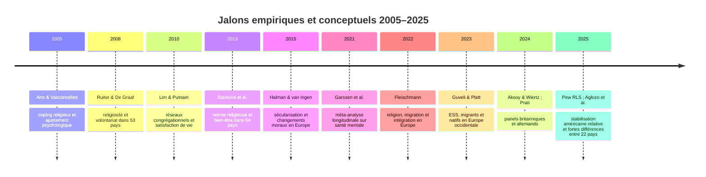
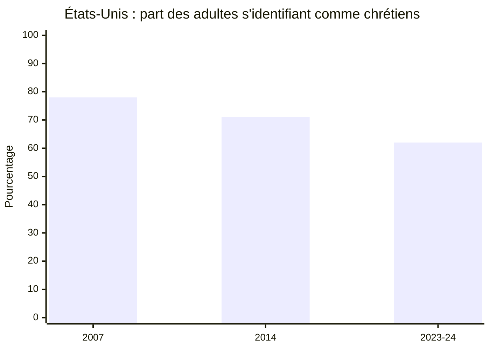
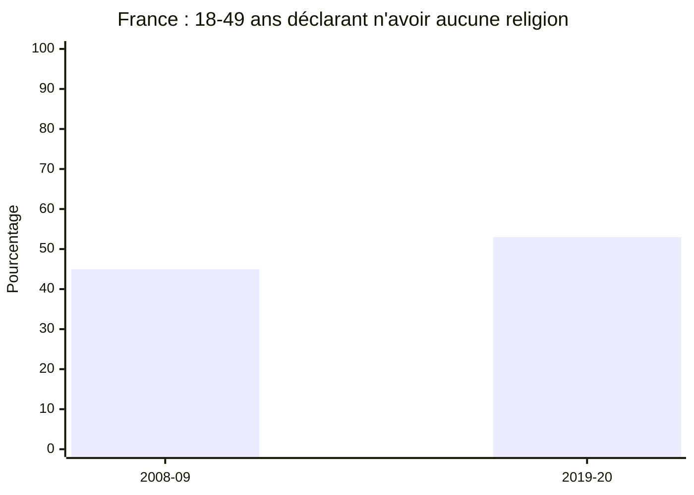

# Appui empirique interdisciplinaire pour une prémisse religieuse non spécifiée

## Résumé exécutif

La prémisse à étayer n’est pas explicitée. J’assume donc qu’il s’agit d’une proposition générale du type : **la religion produit des effets sociaux, culturels et psychologiques observables et mesurables**. Cette hypothèse large est bien soutenue par la littérature, mais avec une précision essentielle : **les effets de la religion ne sont ni uniformément positifs ni uniformément négatifs**. Ils dépendent fortement de la dimension étudiée — appartenance, croyance, pratique collective, coping religieux, position majoritaire ou minoritaire, contexte national, mode de sécularisation, et cadre institutionnel. Le document joint disponible dans la conversation ne précisait pas non plus la prémisse religieuse à tester. fileciteturn0file0

Du point de vue sociologique, la conclusion la plus robuste est que **la pratique religieuse collective** — surtout l’assistance régulière aux offices — est associée à des niveaux plus élevés de **volontariat, confiance généralisée, réseaux sociaux denses et coopération perçue**, même dans des modèles de panel plus exigeants. Mais ces effets sont **modestes** et **hétérogènes selon les traditions religieuses et les contextes nationaux**. Les pays très religieux produisent souvent plus de participation globale, tout en réduisant l’écart entre individus religieux et non religieux parce que les normes de coopération y sont plus diffusées. citeturn18view0turn19view0turn35search0turn35search1

Du point de vue culturel, la littérature montre que la religion n’agit pas seulement comme institution ou croyance doctrinale : elle fonctionne aussi comme **répertoire de sens, d’identité, de mémoire, de frontières symboliques et de pratiques ordinaires**. Les recherches sur la « lived religion » insistent sur le fait que le religieux se manifeste dans la famille, le travail, la maladie, l’espace public, les médias et le numérique. En France, les données INED/TeO2 montrent clairement que **affiliation**, **importance subjective** et **identité religieuse** ne se recouvrent pas mécaniquement, ce qui complique toute prémisse trop simpliste sur « les religieux ». citeturn36search0turn36search1turn23view1turn38view0

Du point de vue psychologique, les meilleures synthèses indiquent un effet global **petit mais réel** de la religion/spiritualité sur la santé mentale et le bien‑être, avec une ampleur proche de **r = .08** dans les méta-analyses longitudinales. En revanche, lorsqu’on passe à des modèles longitudinaux rigoureux, l’idée d’un grand effet causal direct de la religion sur la santé mentale devient moins convaincante. Ce qui ressort le plus nettement est la distinction entre **coping religieux positif** et **coping religieux négatif** : le premier est associé à un meilleur ajustement, le second à davantage de détresse. citeturn6view0turn7view1turn14view0turn15view0

Les enquêtes officielles récentes confirment enfin que les effets de la religion doivent être lus dans un contexte de **recomposition** et non d’effacement simple. Aux États‑Unis, la part chrétienne est passée de **78% en 2007 à 62% en 2023‑24**, avec une stabilisation récente autour du début des années 2020. En France, **53% des 18‑49 ans** déclarent n’avoir **aucune religion** en 2019‑2020, contre **45%** en 2008‑2009. À l’échelle européenne, la baisse de la pratique religieuse est principalement portée par le **remplacement générationnel**. À l’échelle de 22 pays, la croyance en Dieu, des dieux ou des forces spirituelles varie fortement, de **20% au Japon** à **100% en Égypte**, signe d’une très forte dépendance au contexte. citeturn21view0turn30view3turn23view0turn27view2turn27view0

## Cadrage et méthode

Le périmètre retenu suit votre consigne : **2005–2025**, population principalement **adulte**, portée **transnationale** quand les données le permettent. J’ai privilégié les **sources primaires et officielles** — Pew Research Center, World Values Survey, European Social Survey, INED/INSEE — et les **articles peer‑reviewed** ou méta‑analyses accessibles via des portails universitaires, éditeurs scientifiques ou versions ouvertes. Les données chiffrées ci-dessous sont reprises des publications primaires ou de leurs résumés ouverts ; lorsqu’un effet standardisé n’était pas accessible dans la source ouverte, je l’indique comme **non reporté**. citeturn21view0turn2search4turn1search1turn23view0turn29view0

L’hypothèse de travail est volontairement prudente : **si la prémisse non formulée porte sur “la religion a des effets importants sur la vie sociale, la culture et le psychisme”**, alors la littérature la soutient **à condition** d’éviter trois raccourcis. Premièrement, la variable pertinente n’est pas « religion » au singulier, mais un faisceau de dimensions distinctes : pratique, croyance, importance subjective, identité, socialisation, appartenance majoritaire/minoritaire. Deuxièmement, les effets sont **souvent indirects** : réseaux sociaux, normes, reconnaissance symbolique, coping, sens, ou stigmate. Troisièmement, les effets changent selon le contexte de sécularisation, de pluralisme, de migration et d’encadrement juridique. citeturn6view0turn16view0turn38view0turn29view0

Voici les jalons majeurs qui structurent l’état de la recherche sur la période considérée.

Ce cadrage produit une conclusion analytique simple : **la religion reste empiriquement très visible, mais ses effets ne sont plus lisibles comme ceux d’un “bloc religieux” homogène**. Ils sont désormais distribués entre institutions, pratiques collectives, identités minoritaires, médias, dynamiques migratoires et ressources psychologiques individuelles. citeturn21view0turn27view0turn27view2turn36search1turn38view0

## Sociologie de la religion

La sociologie de la religion convergente sur un point fort : **ce sont surtout les formes collectives et organisées d’implication religieuse** qui ont des effets sociaux repérables. Dans l’étude classique de Ruiter et De Graaf sur **53 pays**, les pratiquants réguliers font davantage de bénévolat, et un contexte national plus dévot a lui aussi un effet positif additionnel. Mais l’écart entre religieux et séculiers y est plus faible : autrement dit, dans les sociétés plus religieuses, la norme de participation est plus largement diffusée. Cette même étude montre un **effet de débordement** : le bénévolat religieux augmente aussi le bénévolat dans les organisations séculières. citeturn19view0

Les travaux longitudinaux britanniques les plus récents renforcent ce diagnostic. À partir de deux grands panels nationaux — **BHPS, N ≈ 26 000** et **UKHLS, N ≈ 80 000** — Aksoy et Wiertz trouvent qu’une fréquence plus élevée d’assistance aux offices a un **effet positif moyen** sur la **confiance généralisée**, le **volontariat** et la **coopérativité perçue**. Toutefois, ces effets varient selon les traditions : ils sont surtout positifs chez les **anglicans** et **autres protestants**, plus faibles chez les **catholiques** et souvent nuls ou négatifs sur certains indicateurs chez des groupes minoritaires comme les **musulmans**. Les auteurs soulignent aussi que les effets demeurent **modestes**. citeturn18view0

Sur le versant du bien‑être, Lim et Putnam montrent, avec le panel américain **Faith Matters** de 2006–2007, que l’effet positif souvent observé entre religiosité et satisfaction de vie passe surtout par **la participation aux services religieux** et par **les réseaux amicaux construits dans les congrégations**. Ils trouvent peu d’éléments en faveur d’un effet autonome des dimensions strictement privées ou purement subjectives de la religiosité, indépendamment de la fréquentation et de la sociabilité congrégationnelle. Cela plaide pour une lecture sociologique de la religion comme **infrastructure de liens sociaux** plus que comme simple conviction intérieure. citeturn35search0turn35search1turn35search2

La dimension contextuelle ressort également des analyses transnationales sur le bien‑être. Stavrova, Fetchenhauer et Schloesser montrent que les individus religieux sont en moyenne **plus heureux et plus satisfaits de leur vie**, mais **surtout là où la religiosité est socialement normative** et où les non‑religieux sont perçus plus négativement. Leur interprétation passe par la **reconnaissance sociale** : dans les contextes où la religiosité est valorisée, les religieux déclarent être traités avec davantage de respect, ce qui explique en partie leur avantage subjectif. La religion apparaît alors comme un marqueur de **conformité sociale** autant que de croyance. citeturn16view0

Enfin, la sociologie comparée de la sécularisation nuance toute thèse de disparition linéaire. Dans l’étude de Molteni et ses collègues sur le jeu de données harmonisé **CARPE**, qui agrège **près de 2 millions d’observations** sur plus de **40 ans** dans **39 pays européens**, le recul de la pratique religieuse s’explique d’abord par le **remplacement générationnel** : de nouvelles cohortes moins religieuses remplacent les anciennes cohortes plus religieuses. Il s’agit donc d’un changement de composition de population beaucoup plus que d’un simple basculement conjoncturel affectant tout le monde au même moment. citeturn27view2

### Tableau comparatif des études sociologiques

| Auteurs | Année | Terrain / échantillon | Méthode | Résultat principal | Ampleur quantitative |
|---|---:|---|---|---|---|
| Ruiter & De Graaf | 2008 | 53 pays | Modèles multiniveaux | Les pratiquants réguliers font plus de bénévolat; le contexte national religieux a un effet positif, mais réduit l’écart religieux/séculiers; débordement vers le bénévolat séculier | Effet standardisé non reporté dans le résumé ouvert citeturn19view0 |
| Lim & Putnam | 2010 | États‑Unis, panel Faith Matters 2006–2007 | Panel représentatif | Satisfaction de vie plus élevée surtout via assistance aux offices et amitiés congrégationnelles | Effet standardisé non reporté dans la source ouverte citeturn35search0turn35search1 |
| Stavrova, Fetchenhauer & Schloesser | 2013 | 64 pays | Régression multiniveau + médiation modérée | L’avantage de bien‑être des religieux est plus fort là où la religiosité est normative et socialement valorisée | Effet standardisé non reporté dans le résumé ouvert citeturn16view0 |
| Aksoy & Wiertz | 2024 | Royaume‑Uni, BHPS N≈26 000; UKHLS N≈80 000 | Panels croisés avec effets fixes individuels | L’assistance religieuse accroît en moyenne confiance, volontariat et coopérativité perçue; effets surtout protestants; modestes et hétérogènes | Effets décrits comme « modestes »; coefficients détaillés non repris dans la source ouverte citeturn18view0 |
| Molteni et al. | 2022/2023 | Europe, 39 pays, ~2 millions d’observations, >40 ans | Harmonisation et analyse démographique | Le déclin religieux européen tient surtout au remplacement générationnel | Effet non standardisé; dynamique décrite comme une courbe en S citeturn27view2 |

## Études culturelles et cultural studies

Les études culturelles déplacent le regard : elles montrent que la religion ne doit pas être pensée uniquement comme doctrine, mais comme **pratique ordinaire, grammaire symbolique, médiation et frontière culturelle**. Nancy Ammerman, dans *Sacred Stories, Spiritual Tribes*, observe que le religieux se dit dans les routines du quotidien — de la table familiale au lieu de travail, de la maladie à la consommation — et pas seulement dans les institutions. Son cadre plus synthétique de 2021, *Studying Lived Religion*, propose même une théorie sociologique de ces pratiques, en insistant sur le fait que la religion vécue déborde constamment les espaces explicitement religieux. Cette littérature soutient fortement une prémisse selon laquelle la religion continue d’informer des **modes de vie**, des **récits de soi** et des **formes de sens** même dans des contextes sécularisés. citeturn36search0turn36search1

Les travaux sur **religion et médias numériques** prolongent ce constat. La synthèse de Campbell et Tsuria sur la « digital religion » montre que les pratiques religieuses sont reconfigurées par les médias numériques dans les **cinq grandes traditions religieuses**. La religion y devient performée, circulante, médiatisée et partiellement déterritorialisée. La version plus introductive du programme, *Digital Religion: The Basics*, insiste sur le fait que les plateformes numériques transforment à la fois la **pratique**, la **culture religieuse** et les **relations d’autorité**. Cela appuie une prémisse culturelle où la religion ne disparaît pas : elle **change de support** et d’écologie médiatique. citeturn36search2turn36search6turn37search7

En France, la littérature récente et les données INED montrent nettement que le religieux est aussi une **question de pluralisation, transmission et reconnaissance publique**. Dans l’enquête TeO2 résumée par l’INED, **27%** des personnes se disant catholiques déclarent que la religion a **assez ou beaucoup d’importance** dans leur vie, contre **76%** de celles se disant musulmanes. Quand on demande aux personnes de choisir jusqu’à quatre dimensions pour décrire leur identité, la religion est mentionnée par **8% des catholiques**, **30% des musulmans** et **52% des juifs**. Le même matériau montre des transmissions intergénérationnelles très contrastées : **67%** de transmission chez les catholiques, **91%** chez les musulmans, et **93%** des personnes élevées dans une famille athée ou agnostique restent sans religion. Une prémisse culturelle sérieuse doit donc distinguer **affiliation**, **importance vécue** et **identité assumée**. citeturn23view1turn23view0

La religion est aussi un fait culturel **lié aux migrations** et au pluralisme européen. La revue de Fleischmann sur vingt ans de recherche montre que les **musulmans** en Europe se distinguent par des niveaux de religiosité comparativement **plus élevés** et **plus stables**, mais que le lien entre religiosité et intégration est **inconstant** : positif, négatif ou nul selon les indicateurs et les domaines. De leur côté, Guveli et Platt, à partir de l’**ESS rounds 1–9** dans **15 pays d’Europe occidentale** sur **16 ans**, trouvent que les migrants sont en moyenne **plus religieux** que les non‑migrants, que les natifs connaissent une **baisse globale** de religiosité, tandis que certaines populations migrantes et de deuxième génération peuvent connaître une **hausse**, entraînant parfois une divergence au lieu d’une convergence séculière. citeturn38view0turn39search0turn39search6

Enfin, la littérature française sur la laïcité insiste sur le fait que les effets culturels de la religion sont aussi produits par les **formes de régulation publique**. Les travaux de Philippe Portier sur les transformations de la laïcité française de **1990 à 2020** montrent que le religieux contemporain doit être lu avec ses médiations juridiques et politiques, pas seulement avec des indicateurs de croyance. Cela est crucial pour toute prémisse portant sur les « effets sociaux de la religion » en contexte français, où ces effets passent aussi par le droit, l’école, le travail, le voile, la famille et les débats de reconnaissance. citeturn36search3turn36search7

### Tableau comparatif des études culturelles

| Auteurs | Année | Terrain / matériau | Méthode | Résultat principal | Donnée clé |
|---|---:|---|---|---|---|
| Ammerman | 2013 | États‑Unis, récits ordinaires | Qualitatif / récits | Le religieux apparaît dans les routines quotidiennes, hors des seules institutions | Qualitatif, pas d’effet standardisé citeturn36search0 |
| Ammerman | 2021 | Cadre transposable, religion vécue | Théorisation ancrée dans la recherche qualitative | Définition élargie de la religion vécue et cadre en sept dimensions | Qualitatif / conceptuel citeturn36search1 |
| Drouhot, Simon & Tiberj / INED‑INSEE | 2023 | France, TeO2 2019‑2020 | Enquête nationale | Affiliation, importance et identité religieuse divergent fortement | 27% des catholiques vs 76% des musulmans disent la religion importante; 67% vs 91% de transmission catholique/musulmane citeturn23view1turn23view0 |
| Fleischmann | 2022 | Europe, revue de 20 ans d’enquêtes | Revue systématique narrative | Religiosité musulmane plus élevée et stable; lien à l’intégration empirquement mixte | Résultats positifs, négatifs et nuls selon les domaines citeturn38view0 |
| Guveli & Platt | 2023 | ESS rounds 1–9, 15 pays d’Europe occ., 16 ans | Analyse comparative temporelle | Les migrants restent en moyenne plus religieux; certaines populations divergent des natifs sur la période | Petite baisse globale chez les natifs; stabilité/hausse dans plusieurs groupes migrants citeturn39search0turn39search6 |
| Portier | 2023 | France, laïcité 1990–2020 | Histoire / sociologie politique | Les effets du religieux sont médiés par les régimes de laïcité et de régulation publique | Qualitatif / institutionnel citeturn36search3turn36search7 |

## Psychologie de la religion

La psychologie de la religion offre les résultats quantitatifs les plus directement utilisables si la prémisse porte sur l’**effet du religieux sur le bien‑être, la détresse ou l’adaptation au stress**. La synthèse la plus robuste ici est celle de Garssen, Visser et Pool : **48 études longitudinales**, **59 échantillons indépendants**, méta-analyse à effets aléatoires. Le résultat global est **r = .08** avec un intervalle de confiance à 95% de **.06 à .10**. L’effet est donc **statistiquement significatif mais petit**. Parmi huit prédicteurs distingués, seuls la **participation à des activités religieuses publiques** (**r = .08**) et l’**importance de la religion** (**r = .09**) sont significativement liées à la santé mentale. Les auteurs concluent explicitement qu’il existe un effet positif, **mais de faible ampleur**. citeturn6view0turn7view1

Le tableau devient plus net lorsque l’on distingue les formes de coping religieux. La méta‑analyse d’Ano et Vasconcelles, fondée sur **49 études**, **105 tailles d’effet** et **13 512 participants**, montre qu’un **coping religieux positif** est lié de façon modérée à un **ajustement psychologique positif** (**r = .33**, IC 95% **.30–.35**) et modestement à une réduction de l’ajustement négatif (**r = -.12**, IC 95% **-.14 à -.10**). À l’inverse, un **coping religieux négatif** est associé à davantage d’ajustement négatif (**r = .22**, IC 95% **.19–.24**), alors qu’il n’est pas significativement relié aux indicateurs positifs (**r = .02**). Si la prémisse concerne l’utilité psychologique de la religion, cette distinction est décisive : **ce n’est pas “la religion” en bloc qui aide ou nuit, mais la manière dont elle est mobilisée face au stress**. citeturn14view0

Des analyses longitudinales plus récentes invitent néanmoins à la prudence causale. Dans le panel allemand **GESIS** suivi sur **9 ans** (**N = 8 146**), Prati n’observe **presque aucune preuve d’effets décalés** de la religion sur la santé mentale, et seulement des covariances stables entre composantes « trait » du religieux et du bien‑être. Sa conclusion est sans ambiguïté : l’effet bénéfique de la religion sur la santé mentale a probablement été **surestimé** par une partie de la littérature antérieure, surtout lorsqu’elle s’appuyait sur des schémas transversaux. Autrement dit, la religion est plus crédible comme **ressource associée à certains profils et contextes** que comme cause forte et générale. citeturn15view0

L’étude longitudinale britannique d’Aksoy et ses collègues, menée sur **50 922** répondants de l’**UK Household Longitudinal Study**, va dans le même sens de nuance. Elle observe que la **fréquentation plus régulière des services religieux** est associée à un meilleur bien‑être mental, surtout parmi les personnes ayant une affiliation religieuse, même après ajustements importants. En revanche, une **plus grande importance subjective de la religion** est associée à un bien‑être plus faible sur le **GHQ**; par ailleurs, certaines minorités religieuses, notamment les **musulmans pakistanais et bangladais** et d’autres minorités ethnoreligieuses, présentent un niveau de bien‑être plus faible que les non‑affiliés ou les chrétiens. La psychologie de la religion rejoint donc ici la sociologie : **le soutien social de la pratique collective n’a pas le même profil que l’importance subjective ou que l’expérience minoritaire sous contrainte**. citeturn33view0

### Tableau comparatif des études psychologiques

| Auteurs | Année | Échantillon | Méthode | Résultat principal | Taille d’effet |
|---|---:|---|---|---|---|
| Ano & Vasconcelles | 2005 | 49 études, 13 512 participants, 105 effets | Méta-analyse | Le coping religieux positif améliore l’ajustement; le coping négatif augmente la détresse | PRC → ajustement positif **r=.33**; PRC → ajustement négatif **r=-.12**; NRC → ajustement négatif **r=.22**; NRC → ajustement positif **r=.02 ns** citeturn14view0 |
| Garssen, Visser & Pool | 2021 | 48 études longitudinales, 59 échantillons | Méta-analyse longitudinale | Effet global positif mais petit de la religion/spiritualité sur la santé mentale | **r=.08**; activités publiques **r=.08**; importance de la religion **r=.09** citeturn6view0turn7view1 |
| Aksoy et al. | 2021 | UKHLS, 2009–2013, **N=50 922** | Longitudinal, ajustements + effets fixes ménage | Assistance religieuse associée à un meilleur bien‑être; importance religieuse parfois associée à un moins bon GHQ | Coefficients détaillés non repris dans la source ouverte citeturn33view0 |
| Prati | 2024 | GESIS Panel Allemagne, **N=8 146** | Random intercept cross-lagged panel model | Quasi absence d’effet retardé de la religion sur la santé mentale | Pas d’effet lagged substantiel reporté dans l’abstract citeturn15view0 |

## Tendances d’enquêtes, hypothèses et limites

Les grandes enquêtes confirment d’abord que la religion reste **sociologiquement massive** mais extrêmement **inégale** selon les pays. Aux États‑Unis, le **Religious Landscape Study** de Pew montre que les chrétiens représentaient **78%** des adultes en **2007**, **71%** en **2014** et **62%** en **2023‑24**. Les **sans affiliation religieuse** atteignent **29%** en 2023‑24. En même temps, **83%** des adultes américains disent croire en Dieu ou en un esprit universel, **44%** prient au moins une fois par jour et **33%** assistent aux services religieux au moins mensuellement. Le paysage religieux décline donc du point de vue des appartenances, mais reste élevé du point de vue des croyances spirituelles. citeturn21view0turn30view3

Les données françaises disponibles via l’INED montrent une autre configuration : chez les **18–49 ans**, la part déclarant **n’avoir aucune religion** passe de **45%** en **2008‑2009** à **53%** en **2019‑2020**. En parallèle, **29%** de la population se dit catholique et **10%** musulmane dans les données résumées par l’INED. Le cas français illustre donc une sécularisation avancée couplée à une pluralisation du paysage religieux. citeturn23view0

L’écart par âge observé par Pew permet aussi de visualiser la dynamique générationnelle : parmi les **18–24 ans** américains, **46%** s’identifient comme chrétiens, contre **80%** parmi les **74 ans et plus**; **25%** des plus jeunes assistent aux offices au moins mensuellement contre **49%** des plus âgés; et **43%** des plus jeunes sont non affiliés contre **13%** des plus âgés. Ces différences sont cohérentes avec l’idée, confirmée par CARPE, que la recomposition religieuse passe largement par les cohortes. citeturn22view0turn27view2

À l’échelle globale, le **World Values Survey** insiste sur l’ampleur des écarts culturels entre sociétés. Dans sa présentation synthétique, le WVS situe les sociétés d’Europe protestante du Nord du côté des valeurs les plus **sécularisées** et **expressives**, tandis que les sociétés islamiques du Moyen‑Orient se situent du côté des valeurs plus **traditionnelles** et **axées sur la survie**. Le même site rappelle que, dans les données antérieures, **98%** du public en Indonésie jugeaient la religion très importante dans leur vie, contre **3%** en Chine. Une étude plus récente de **2025**, sur **202 898 individus dans 22 pays**, confirme l’ampleur de ces contrastes contemporains : la croyance en Dieu, des dieux ou des forces spirituelles varie de **20% au Japon** à **100% en Égypte**, avec **10 pays sur 22** au‑dessus de **90%**. citeturn28view0turn27view0

L’**European Social Survey** reste, pour sa part, une infrastructure centrale pour ces comparaisons européennes. Les données de la **round 11 (2023/24)** sont désormais disponibles pour **31 pays**, et un article méthodologique récent montre que la mesure de l’**involvement religieux** dans l’ESS, bien que non strictement invariante, est **comparativement exploitable** grâce à des procédures d’alignement. L’étude porte sur **neuf rounds 2002–2018** et **437 990 répondants** après traitement, ce qui en fait une base solide pour les comparaisons européennes prudentes. citeturn1search1turn29view0

### Hypothèses explicites retenues

J’ai travaillé sous quatre hypothèses interprétatives. D’abord, la prémisse non spécifiée concerne une affirmation **générale** sur les effets de la religion, non une thèse confessionnelle ou apologétique. Ensuite, le terme « religion » doit être déplié en dimensions distinctes : **appartenance, pratique, importance, identité, coping, statut majoritaire/minoritaire**. J’ai aussi supposé que le public visé est surtout **adulte**, tout en signalant quand certaines infrastructures incluent des **15+**. Enfin, j’ai supposé que vous cherchez non pas une défense militante, mais un **état de l’art analytique**, donc y compris les résultats **nuls** ou **contradictoires**. citeturn29view0turn15view0turn38view0

### Limites et questions ouvertes

Cette revue soutient fortement une prémisse générale disant que la religion a des effets sociaux, culturels et psychologiques mesurables. Elle ne suffit pas, en revanche, à valider une prémisse **plus précise** sans l’énoncé exact. Si, par exemple, la prémisse visée était « la religion rend les gens plus heureux », la réponse rigoureuse serait : **parfois, un peu, surtout via la pratique collective et dans certains contextes normatifs, mais pas de manière forte ni universelle**. Si la prémisse était « la religion favorise l’intégration », la réponse empirique serait : **cela dépend du type d’intégration, du groupe religieux, du contexte migratoire et du régime de reconnaissance**. Si elle était « la sécularisation fait disparaître le religieux », la littérature dirait plutôt : **les appartenances institutionnelles reculent, mais les croyances, identités, médiatisations et usages du religieux persistent et se recomposent**. citeturn6view0turn16view0turn38view0turn21view0

La principale limite pratique de ce rapport est donc conceptuelle : **sans prémisse explicite, on ne peut pas optimiser la sélection des preuves**. Les résultats ici réunis sont les plus utiles pour soutenir une thèse large sur les **effets contextuels, différenciés et persistants** de la religion. Pour une thèse plus ciblée — famille, genre, politique, tolérance, santé, écologie, immigration, économie morale, etc. — il faudrait resserrer le corpus autour de cette variable dépendante précise. Cela dit, même à ce niveau général, le verdict de la littérature est déjà net : **la religion reste un facteur social et psychologique réel, mais ses effets passent moins par une essence religieuse unique que par des mécanismes de réseau, de norme, de sens, de médiation culturelle et de position sociale**. citeturn18view0turn23view1turn36search1turn15view0

## Related

- [[Research and Papers MOC]]
- [[Se positionner comme chercheuses au prisme des luttes intersectionnelles — Le Gallo & Millette 2019 (Genre, sexualité & société)]]
