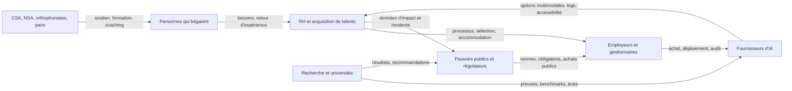
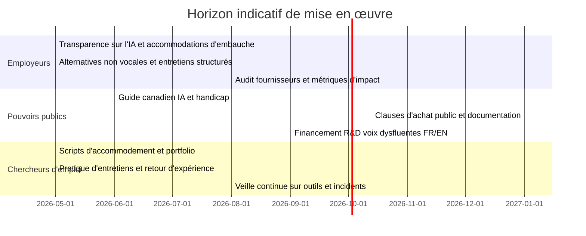

# IA générative, emploi et accessibilité au travail pour les personnes qui bégaient

## Résumé exécutif

L’actualisation 2025 de l’OIT ne conclut pas à un scénario de remplacement massif et rapide de l’emploi par l’IA générative. Elle conclut à un **risque d’exposition** important, mais surtout à une **transformation du contenu du travail**. La mesure la plus citée est la suivante : **un emploi sur quatre dans le monde** se situe dans une profession ayant un certain degré d’exposition à la GenAI; **3,3 %** de l’emploi mondial tombe dans la catégorie d’exposition la plus élevée, avec des écarts marqués selon le sexe et le niveau de revenu des pays. Les professions administratives demeurent les plus exposées, tandis que plusieurs professions très numérisées des logiciels, des médias et de la finance ont vu leur exposition augmenter entre 2023 et 2025. L’OIT insiste toutefois sur le fait qu’il s’agit d’un **plafond théorique d’exposition**, non d’une prévision de pertes d’emplois réalisées. citeturn9view0turn9view1turn10view0turn11view0turn17view0turn18view0

Pour les personnes qui bégaient, l’enjeu n’est pas seulement “combien d’emplois seront exposés”, mais **par quels canaux l’IA redessine l’accès au travail**. Les risques les plus concrets se concentrent dans les outils de recrutement et de communication : tri automatisé, entretiens vidéo, évaluations qui captent des indices de parole, assistants vocaux, standards téléphoniques automatisés et transcription automatique. Les études récentes montrent que les systèmes de reconnaissance vocale traitent moins bien la parole dysfluente; une étude CHI 2023 associée à Jeffrey Bigham a documenté des coupures prématurées, des incompréhensions et des transcriptions qui ne reflètent pas l’intention, tandis qu’une étude ACL/NAACL 2024 a trouvé un biais de précision statistiquement significatif contre la parole dysfluente dans six systèmes d’ASR. citeturn28view0turn30view0

La même dynamique ouvre aussi des **opportunités d’accessibilité**. Quand l’organisation offre des voies textuelles, asynchrones et multimodales, l’IA peut réduire une partie du coût social de la communication orale : préparation d’entretiens, reformulation écrite, sous-titrage, transcription, notes de réunion, participation par clavardage, réponses enregistrées, et contenus accessibles sous plusieurs formats. Les ressources de la Canadian Stuttering Association, de la National Stuttering Association, de la Commission canadienne des droits de la personne, de Normes d’accessibilité Canada et de Carnegie Mellon convergent sur un même principe : **l’accessibilité doit être pensée dès la conception**, avec supervision humaine, procédures claires d’accommodement, et évaluation des compétences réelles plutôt que de la fluidité comme substitut de compétence. citeturn21view1turn21view2turn21view3turn21view4turn24view0turn24view1turn24view2turn35view5turn35view6turn35view7turn35view3turn35view4turn42view0turn42view4

Le constat analytique central de ce rapport est donc le suivant : **la GenAI ne crée pas automatiquement une meilleure accessibilité**. Sans gouvernance, elle risque d’ajouter une couche d’exclusion dans les moments les plus sensibles du parcours d’emploi. Avec des règles d’achat, des accommodations explicites, des alternatives non vocales, des audits de systèmes et une participation directe des personnes qui bégaient, elle peut au contraire diminuer plusieurs obstacles pratiques. Cette conclusion est une **inférence forte** croisant les résultats de l’OIT sur la transformation des tâches, les ressources d’accommodement au travail, et les travaux récents sur le biais des technologies vocales. citeturn10view0turn17view0turn21view1turn21view2turn21view4turn24view0turn24view1turn28view0turn30view0

## Périmètre, hypothèses et méthode

Les six liens “fournis par l’utilisateur” n’étaient pas visibles dans le fil transmis. Le rapport ci-dessous priorise donc les **sources primaires et institutionnelles identifiables** en français et en anglais : OIT, ONU Genève, gouvernement du Canada, Commission canadienne des droits de la personne, Normes d’accessibilité Canada, Carnegie Mellon, CSA, NSA, NIDCD, Department of Labor et documents officiels américains sur l’IA et le handicap.

Le périmètre substantiel combine trois échelles qui ne se recouvrent pas parfaitement. D’abord, l’**échelle mondiale et occupationnelle** de l’OIT, qui ne produit pas un chiffrage spécifique pour le Canada ni pour les personnes qui bégaient. Ensuite, l’**échelle d’accessibilité et de droits** surtout canadienne, centrée ici sur le cadre fédéral et les normes nationales d’accessibilité. Enfin, l’**échelle technologique** des systèmes de parole, du recrutement et des interfaces GenAI, où les meilleures indications 2023–2025 proviennent souvent de travaux américains et universitaires. Quand un équivalent canadien très précis manquait sur l’IA de recrutement et le handicap, j’ai utilisé des comparateurs officiels américains clairement signalés comme tels. citeturn10view0turn35view5turn35view6turn35view7turn35view3turn35view4

Deux hypothèses doivent être explicites. Premièrement, l’impact sur les personnes qui bégaient est **largement inféré**, car l’OIT n’a pas produit d’estimation GenAI “par handicap de communication”. Deuxièmement, les risques décrits ici concernent surtout les emplois où la communication médiée par l’IA — recrutement, téléphone, visioconférence, transcription, outils vocaux, travail de contenu ou coordination administrative — devient un point de passage fréquent. Là où la communication orale en temps réel est moins centrale, l’effet de l’IA peut être davantage positif qu’excluant si des voies textuelles et asynchrones sont disponibles. citeturn10view0turn17view0turn28view0turn30view0turn35view7

Un dernier point méthodologique importe : l’OIT parle de **“potential exposure”**. Le terme ne signifie ni calendrier certain, ni destruction d’emplois déjà observée. Il désigne le pourcentage théorique d’emploi qui **pourrait** être affecté si la technologie était pleinement déployée, sous des hypothèses de faisabilité technique. C’est un point capital pour interpréter correctement le rapport. citeturn11view0turn18view0

## Ce que dit l’OIT en 2025

L’actualisation 2025 de l’OIT raffine l’indice mondial de 2023 à partir d’une base de tâches beaucoup plus fine. La méthodologie combine près de **29 753 tâches** issues de la classification polonaise à six chiffres, une enquête auprès de **1 640 personnes en emploi** réparties par grands groupes ISCO-08, une validation experte de type Delphi, puis une projection des scores vers la classification internationale ISCO-08 et les microdonnées harmonisées de l’OIT pour plus de 140 pays. Cette architecture méthodologique améliore la granularité par rapport à 2023, tout en conservant la prudence d’une mesure d’exposition plutôt que d’effet direct sur l’emploi. citeturn9view1turn10view0turn11view0turn14view0

Les résultats clés sont désormais bien établis. **25 %** de l’emploi mondial se trouve dans une profession ayant un certain degré d’exposition à la GenAI. **3,3 %** de l’emploi mondial est dans la catégorie d’exposition la plus élevée. L’exposition augmente avec le revenu des pays, passant à **34 %** dans les pays à revenu élevé, et elle est plus élevée pour les femmes, notamment parce que celles-ci sont davantage concentrées dans les professions administratives et de bureau; dans les pays à revenu élevé, la part d’emplois féminins dans la catégorie la plus élevée atteint **9,6 %**, contre **3,5 %** pour les hommes. citeturn9view1turn9view2turn10view0turn11view0turn17view0

L’actualisation 2025 est plus nuancée que le débat public habituel. Les scores moyens d’automatisation sont **légèrement plus faibles qu’en 2023** — 0,29 contre 0,30 — mais la dispersion des scores est beaucoup plus basse, signe d’une classification plus stable. En parallèle, certaines professions très numérisées ont vu leur exposition augmenter parce que les capacités de la GenAI se sont élargies au **texte, à l’image, à l’audio, à la vidéo** et à des séquences d’actions plus “agentiques”. D’où un double message : les emplois administratifs restent au premier rang de l’exposition, mais l’augmentation de capacité de la technologie concerne aussi des professions des logiciels, des médias, des données et de la finance. citeturn9view0turn17view0

Sur l’horizon temporel, l’OIT n’annonce **aucune date universelle** de substitution. Le seul horizon explicite est celui de l’enquête de perception auprès des travailleurs, qui demandait si la GenAI pourrait remplacer l’emploi courant **dans les cinq prochaines années**; les réponses restent, pour la plupart des professions, concentrées à de faibles niveaux de risque perçu, avec une inquiétude plus marquée chez les employés administratifs. Cela confirme que le rapport ne dit pas “la destruction arrive d’ici cinq ans”, mais plutôt “la pression de transformation est visible à moyen terme”. citeturn18view3

Les incertitudes sont claires et doivent être reprises telles quelles. Les estimations 2025 représentent un **plafond théorique** si la GenAI était pleinement mise en œuvre. Elles peuvent être freinées par l’infrastructure, les coûts, les compétences numériques, les difficultés opérationnelles, ainsi que par l’acceptabilité institutionnelle et sociale de déléguer certaines décisions à l’IA. L’OIT rappelle aussi que presque toutes les professions conservent des tâches exigeant une contribution humaine; la forme des politiques publiques et du dialogue social déterminera donc la qualité de la transition, plus que la seule faisabilité technique. citeturn10view0turn18view0turn18view4

Le tableau suivant reprend des **proxys sectoriels** à partir des professions ISCO les plus exposées. Il faut être précis : l’OIT publie surtout un index **par profession**, pas une ventilation mondiale exhaustive “par secteur économique” dans un tableau harmonisé unique. Le tableau ci-dessous sert donc à regrouper, de manière analytique, les principaux segments les plus concernés.  

| Segment dominant | Niveau d’exposition OIT | Exemples de professions citées par l’OIT | Lecture opérationnelle |
|---|---|---|---|
| Administratif et soutien de bureau | Très élevé | saisie de données, traitement de texte, comptabilité, paie, bureau général, personnel | Premier foyer de transformation; forte exposition des tâches routinisées, documentaires et transactionnelles |
| Finance et assurance | Élevé à significatif | employés finance/assurance, courtiers, analystes financiers, crédit/prêts, comptables, conseillers en investissement | Exposition élevée des tâches d’analyse standardisée, de documentation et de synthèse |
| Logiciel, web, données | Élevé à significatif | développeurs web et multimédia, programmeurs d’applications, développeurs logiciels, admins bases de données, administrateurs systèmes, techniciens web | Les tâches sont exposées, mais la reconfiguration du travail et la création de nouvelles tâches restent probables |
| Médias, langues, contenu | Significatif | traducteurs/interprètes, auteurs, journalistes, designers graphiques et multimédia | Forte pression de co-production homme-machine plutôt que substitution uniforme |
| Front office et centres de contact | Élevé à significatif | vendeurs en centre de contact, employés d’information, standardistes, réception | Zone critique pour les personnes qui bégaient en raison de l’imbrication entre exposition GenAI et interfaces vocales |

Le tableau synthétise l’appendice professionnel de l’OIT 2025, son interprétation par gradients d’exposition, ainsi que le résumé onusien en français sur les secteurs et fonctions les plus affectés. citeturn39view0turn39view1turn39view2turn39view3turn40view0turn40view3turn40view4turn9view2

## Conséquences pour les personnes qui bégaient

Le risque principal pour les travailleurs qui bégaient n’est pas une “vulnérabilité abstraite” au sens de l’OIT, mais une **double exposition**. Première couche : certaines professions où se concentrent déjà les personnes qui travaillent dans le contenu, l’administration, le service ou la coordination sont plus exposées à la GenAI. Deuxième couche : les points d’accès à ces emplois — candidature, présélection, entretien, appels, réunions, outils vocaux — sont eux-mêmes de plus en plus médiés par des systèmes qui interprètent la parole ou imposent des cadences conversationnelles. C’est cette combinaison qui rend la question du bégaiement particulièrement saillante. citeturn10view0turn17view0turn39view0turn40view3

En recrutement, le signal d’alerte est net. Les autorités américaines rappellent que les employeurs utilisent déjà des technologies pour cibler des annonces, évaluer les qualifications, tenir des entretiens vidéo en ligne, faire passer des tests informatisés et scorer des CV. Elles rappellent aussi qu’un test ou une technologie ne doit pas mesurer des **capacités de parole** non pertinentes pour le poste, et que les employeurs doivent fournir des accommodations raisonnables, expliquer la technologie utilisée, et rendre la demande d’accommodement possible sans pénaliser le candidat. Même si ce cadre est américain, il décrit exactement les points de friction susceptibles d’affecter les personnes qui bégaient quand la fluidité orale est prise, explicitement ou implicitement, comme proxy de compétence générale. citeturn42view0turn42view3turn42view4turn35view3turn35view4

Les risques liés aux technologies vocales sont désormais empiriquement documentés. L’étude CHI 2023 associée à un auteur affilié à Carnegie Mellon a montré, à partir d’une enquête auprès de **61 personnes qui bégaient** et d’un corpus de **91 participants** enregistrant des commandes vocales et de la dictée, que les utilisateurs veulent utiliser la reconnaissance vocale mais sont souvent **coupés trop tôt**, mal compris ou transcrits d’une façon qui ne reflète pas leur intention. Les auteurs montrent aussi qu’avec des améliorations techniques ciblées, le système coupe les énoncés **79,1 % moins souvent** et fait passer le taux d’erreur de mots de **25,4 % à 9,9 %**. Le point critique n’est donc pas que la technologie est “forcément inaccessible”, mais qu’elle l’est souvent **par conception et données insuffisantes**, alors qu’une correction technique est possible. citeturn28view0

L’étude ACL/NAACL 2024 renforce ce constat. En évaluant **six systèmes de reconnaissance automatique de la parole**, elle conclut à un biais de précision **cohérent et statistiquement significatif** contre la parole dysfluente, avec des erreurs syntaxiques et sémantiques importantes. Pour le monde du travail, cela a des effets très concrets : standard téléphonique automatisé, sous-titrage automatique, prise de notes, assistants vocaux, évaluations orales automatisées et entretiens à distance peuvent tous introduire une erreur systématique contre la parole bégayée. citeturn30view0

Il existe pourtant un versant d’opportunité substantiel. Carnegie Mellon formule une idée essentielle : l’IA peut devenir un **partenaire de l’accessibilité** si la conception reste centrée sur l’humain. Son bureau d’accessibilité numérique explique que l’IA peut traduire, résumer, décrire, sous-titrer, réorganiser l’information et générer des formats alternatifs; avec supervision humaine, elle peut aussi aider à la remédiation de contenu. Pour les personnes qui bégaient, cela signifie que la GenAI peut réduire la pression du “temps réel oral” au profit d’une participation plus équitable : préparation écrite, questions à l’avance, synthèses de réunion, réponses différées, participation par chat, et supports de communication alternatifs. citeturn24view0turn24view1turn24view2

Une autre opportunité, plus spécifique, vient des modes de communication qui **bypassent** l’ASR vocal. L’étude CHI 2023 rappelle que des voies textuelles comme “Type to Siri” ou “Type with Alexa” évitent la couche de reconnaissance vocale et peuvent donc être plus fiables pour certains usages. Dans le même esprit, les ressources de la NSA recommandent les courriels, le clavardage, les réponses enregistrées, le sous-titrage en temps réel et les applications de prise de notes comme accommodations possibles. Autrement dit, la bonne question n’est pas “faut-il supprimer les outils IA ?”, mais “le système offre-t-il une voie **équivalente non vocale** quand la voix devient un obstacle ?” citeturn28view0turn20view6turn21view4

## Ressources, pratiques et outils utiles

La Canadian Stuttering Association fournit, sur 2024–2025, un ensemble particulièrement utile de repères pratiques. Pour les employeurs, elle insiste sur le fait que la sévérité du bégaiement observée en entretien **ne prédit pas** la communication future au travail; elle recommande de confirmer les accommodations au début de l’entretien, de se concentrer sur le contenu plutôt que sur la manière de parler, d’éviter les stéréotypes, et d’utiliser des entretiens structurés avec des critères standardisés, voire des échantillons de travail ou des tests objectifs plutôt qu’une impression générale liée à la fluidité. Pour les candidats, elle rappelle qu’il est légitime de demander une clarification, de demander à revenir plus tard sur une question, et que la divulgation du bégaiement reste un choix personnel comportant des bénéfices et des risques. Enfin, elle souligne que les accommodations sont **individualisées**, contextuelles et construites de bonne foi entre les parties. citeturn20view0turn21view0turn21view1turn21view2turn22view0turn20view3

La National Stuttering Association se situe sur un registre très complémentaire. Son matériel employeur insiste sur l’erreur de juger une personne uniquement sur sa fluidité, propose des séminaires internes pour RH et fonctions diversité, et met l’accent sur les accommodations simples et les alliés au travail. Ses ressources 2024–2025 listent des accommodations de communication qui collent étroitement aux usages réels de la GenAI : méthodes de communication flexibles, temps supplémentaire pour les tâches orales, participation en réunion par chat ou écrit, enregistrement et partage de notes, sensibilisation des collègues, sous-titrage en temps réel, speech-to-text et outils de notes numériques. La NSA offre aussi des **entretiens d’entraînement** spécifiquement pour les personnes qui bégaient, ce qui constitue aujourd’hui l’une des interventions les plus concrètes à court terme. citeturn21view3turn21view4turn20view6turn20view7turn43view1

Les cadres canadiens d’accessibilité donnent la structure de gouvernance qui manque parfois aux guides communautaires. La Commission canadienne des droits de la personne rappelle que les employeurs doivent ajuster règles, politiques ou pratiques pour permettre une pleine participation, et que le processus d’accommodement ne doit pas devenir lui-même un obstacle. Son guide pour les milieux de travail sous réglementation fédérale recommande un processus en quatre temps — conversation initiale, évaluation des besoins, accommodation, revue — et précise que, pour les candidats, les offres d’emploi devraient déjà expliquer **comment demander des accommodations** durant le processus de candidature. Normes d’accessibilité Canada ajoute une logique de conception : l’accessibilité de l’emploi doit être intégrée à **chaque étape du cycle de vie de l’emploi**, et la norme nationale sur l’emploi accessible a été révisée en 2025. citeturn35view5turn35view6turn36view0turn36view1turn36view2turn36view3turn35view7turn8search12

Carnegie Mellon ajoute enfin deux apports importants. D’un côté, l’université a une **politique d’accessibilité numérique** qui oblige l’accessibilité des technologies électroniques et informationnelles, et ses pages 2025 sur l’IA rappellent que l’IA ne doit pas remplacer l’expertise humaine, mais accélérer les formats accessibles et la remédiation avec supervision. De l’autre, des travaux liés à Jeffrey Bigham et au Speech Accessibility Project montrent qu’une recherche fondée sur des corpus communautaires peut faire reculer les taux d’erreur pour la parole de personnes ayant des troubles de la parole; le premier jeu de données n’est pas centré sur le bégaiement, mais la logique de conception est hautement pertinente : **si les données et l’évaluation incluent les voix concernées, la performance peut s’améliorer fortement**. Enfin, CMU a aussi montré en 2024 qu’un outil d’agents LLM pouvait permettre des **entraînements itératifs et privés aux entretiens**, avec feedback structuré — une piste utile pour la préparation, même si l’outil n’a pas été conçu spécifiquement pour les personnes qui bégaient. citeturn24view0turn24view1turn24view2turn24view3turn24view5turn43view0

Le tableau suivant relie accommodations recommandées et usages plausibles de l’IA. Plusieurs lignes combinent **faits vérifiés** et **inférence prudente**; l’inférence consiste à traduire des accommodations reconnues en catégories d’outils numériques qui les rendent plus faciles à mettre en œuvre.  

| Situation | Accommodation recommandée | Catégorie d’outil IA ou numérique utile | Prudence |
|---|---|---|---|
| Entretien d’embauche | questions structurées, possibilité de revenir sur une question, alternatives écrites ou vidéo asynchrone | simulateur d’entretien LLM, partage préalable des questions, réponse écrite ou enregistrée | ne pas utiliser le score vocal ou la fluidité comme proxy global de compétence |
| Réunions | temps supplémentaire, non-interruption, participation par chat/écrit, notes partagées | sous-titrage, transcription, résumé de réunion, copilote de notes | valider la transcription; l’ASR peut rater la parole dysfluente |
| Appels et relation client | voies non vocales, scripts, temps de préparation, option de bascule | réponses textuelles, chat, FAQ assistée, aide à la reformulation | ne pas rendre la voix obligatoire si le poste ne l’exige pas comme exigence essentielle |
| Travail individuel | espace calme, réduction de pression temporelle, préparation écrite | brouillons d’e-mails, reformulation, synthèse documentaire, préparation de scripts | supervision humaine sur le contenu final |
| Candidature et autoadvocacy | procédure claire de demande d’accommodement, divulgation stratégique si souhaitée | modèles de courriels, checklists, portfolio écrit, pratique virtuelle | la divulgation reste un choix personnel et contextuel |

Sources principales du tableau : CSA, NSA, CHRC, CMU, étude CHI 2023 sur la parole dysfluente et ressource CMU sur la pratique d’entretiens avec agents IA. citeturn21view0turn21view1turn21view2turn21view4turn20view6turn43view1turn35view6turn24view0turn24view1turn28view0turn43view0

## Recommandations priorisées

Le nœud de gouvernance peut être représenté simplement ainsi. La relation la plus importante est triangulaire : **personnes qui bégaient ↔ employeurs/RH ↔ fournisseurs d’IA**, avec médiation par règles publiques, recherche et organisations de soutien.

Pour les employeurs, la priorité de court terme est d’**enlever les points d’échec évitables**. Cela veut dire : annoncer explicitement les accommodations possibles au stade de l’offre d’emploi; informer les candidats lorsqu’une technologie d’IA est utilisée; prévoir une voie alternative non vocale; ne pas utiliser de score de fluidité, d’expressivité vocale ou de rythme d’élocution sauf nécessité professionnelle strictement démontrée; et instaurer un recours humain sur toute décision défavorable prise avec appui algorithmique. Ces mesures sont cohérentes avec la CCDP, Normes d’accessibilité Canada, le Department of Labor et les indications officielles sur l’IA et le handicap. citeturn35view5turn35view6turn35view7turn35view3turn35view4turn42view4

À moyen terme, les employeurs devraient **réviser leurs achats et leurs métriques**. Les appels d’offres devraient exiger des fournisseurs qu’ils documentent la performance sur des voix dysfluentes et autorisent des audits indépendants. Les entretiens devraient devenir plus structurés, avec des critères de scoring liés aux compétences et, quand c’est possible, complétés par des échantillons de travail. Les outils de réunion devraient offrir par défaut transcription, notes et participation par chat. Les managers et recruteurs devraient être formés aux biais sur le bégaiement et à la conduite d’entretiens non interruptifs. citeturn21view1turn21view3turn35view3turn35view4turn24view1turn35view6

À long terme, l’objectif devrait être **l’accessibilité par défaut**. Cela suppose une gouvernance de l’IA qui internalise l’accessibilité comme exigence de qualité du travail : coproduction avec des travailleurs concernés, audits récurrents, publication de métriques d’incidents, révision des descriptions de poste pour éviter de naturaliser la fluidité comme critère vague de “communication”, et trajectoires de reskilling pour les fonctions exposées par l’OIT. Ici, le message de l’OIT sur le dialogue social est central : la manière d’implémenter la GenAI détermine si la transformation améliore ou détériore la qualité de l’emploi. citeturn10view0turn17view0turn18view4turn24view2

Pour les pouvoirs publics, trois chantiers sont prioritaires. D’abord, publier rapidement un **guide canadien opérationnel** sur l’IA de recrutement, le handicap et les accommodations de communication, en s’appuyant sur la logique de la CCDP et de la Loi canadienne sur l’accessibilité. Ensuite, intégrer des exigences d’accessibilité et d’audit dans les achats publics et, à terme, dans les standards applicables aux fournisseurs qui vendent des outils d’embauche et de gestion de la performance. Enfin, financer des jeux de données bilingues et multiformes sur la parole dysfluente — y compris en français — afin que la parole bégayée ne reste pas marginale dans les benchmarks et la R&D. citeturn35view5turn35view6turn35view7turn24view5turn28view0turn30view0

Pour les chercheurs d’emploi qui bégaient, les meilleures actions à court terme sont très concrètes : décider stratégiquement de la divulgation selon le contexte; demander les accommodations assez tôt pour pouvoir tester la procédure; préparer une version écrite de ses exemples STAR; constituer un mini-portfolio ou des échantillons de travail; pratiquer les réponses dans un environnement bienveillant, avec pairs, coachs ou outils interactifs; et documenter tout incident impliquant un outil automatisé. La CSA et la NSA montrent qu’il est souvent plus efficace de déplacer l’évaluation vers des **preuves de compétence** que de laisser l’entretien en direct devenir le critère dominant. citeturn21view0turn22view0turn43view1turn21view1

Le tableau suivant priorise les actions par acteur et horizon.

| Acteur | Court terme | Moyen terme | Long terme |
|---|---|---|---|
| Employeurs | afficher les accommodations, alternatives non vocales, transparence sur l’IA, recours humain | audits fournisseurs, entretiens structurés, formation anti-biais, outils de réunion multimodaux | accessibilité by design, métriques publiées, dialogue social sur la transformation |
| Pouvoirs publics | guide canadien IA-recrutement-handicap, alignement accessibilité/emploi | exigences d’achat public, obligations de documentation des systèmes | cadre durable d’audit, financement R&D voix dysfluentes FR/EN |
| Chercheurs d’emploi qui bégaient | scripts d’accommodement, pratique d’entretien, portfolio écrit | stratégie de divulgation contextualisée, veille sur outils et incidents | participation aux évaluations d’outils, retour d’expérience collectif |
| Fournisseurs d’IA | option texte/chat, désactivation du scoring vocal implicite | benchmarks sur parole dysfluente, tests multilingues, logs explicables | co-conception avec communautés concernées, certification accessibilité |

Le tableau reprend les obligations et bonnes pratiques issues des cadres canadiens d’accessibilité, des ressources CSA/NSA, et des orientations américaines récentes sur l’IA inclusive au travail. citeturn35view5turn35view6turn35view7turn35view3turn35view4turn21view1turn21view4turn43view1

Voici une traduction en calendrier d’implémentation indicatif à partir du printemps 2026.

## Lacunes de preuve et agenda de recherche

La première lacune est directe : il n’existe pas encore, à ma connaissance dans les sources 2023–2025 examinées, de **mesure longitudinale** du lien entre GenAI, qualité de l’emploi et résultats professionnels spécifiquement pour les personnes qui bégaient. L’OIT mesure l’exposition des professions; les études sur le bégaiement mesurent surtout l’expérience d’usage, le biais ASR et les accommodations. Le chaînon entre ces deux niveaux reste à construire. citeturn10view0turn17view0turn28view0turn30view0

La deuxième lacune est linguistique et géographique. Une grande partie de l’évidence technique récente sur la parole dysfluente est anglophone. Or, un agenda canadien sérieux devrait inclure du **français**, des situations bilingues, des accents variés, des contextes de travail réels et des parcours d’embauche. L’absence de données robustes sur des voix dysfluentes francophones risque sinon de reproduire, dans la couche technologique, les inégalités déjà connues dans d’autres domaines de la parole et du langage. Cette recommandation est une **inférence politique** fondée sur l’état actuel des sources et sur la logique même des projets d’accessibilité de la parole. citeturn24view5turn28view0turn30view0turn35view7

La troisième lacune est organisationnelle. Il manque des recherches sur les **pratiques effectives des employeurs** face aux outils d’IA quand un candidat ou un salarié bégaie : quels signaux sont captés, quelles accommodations sont proposées, quelles données sont conservées, quelles erreurs surviennent et comment elles sont corrigées. Le Department of Labor et les autorités américaines donnent des principes de gouvernance, mais la base empirique sur les implementations concrètes demeure insuffisante. citeturn35view3turn35view4turn42view4

Enfin, la recherche sur le bégaiement elle-même rappelle qu’il faut éviter une vision réductrice centrée uniquement sur la fluidité. L’atelier NIDCD 2023 a explicitement plaidé pour une approche plus holistique, attentive à la qualité de vie, aux impacts adverses et aux expériences vécues, plutôt qu’à la seule suppression des disfluences de surface. Transposé au travail, cela signifie que l’agenda de recherche ne devrait pas seulement demander “l’IA comprend-elle mieux la voix ?”, mais aussi “améliore-t-elle l’égalité d’accès, l’autonomie, la participation et la qualité du travail ?”. citeturn37view0

En l’état, la conclusion la plus solide est donc prudente mais ferme : **la GenAI augmente la pression de transformation sur les professions de bureau, de contenu, de finance, de contact et de logiciel; pour les personnes qui bégaient, cette transformation peut être corrigée vers l’inclusion ou déviée vers une discrimination plus opaque selon la qualité de la gouvernance, des accommodations et des données d’entraînement**. C’est précisément pour cela que la question doit être traitée comme un problème conjoint d’**emploi, d’accessibilité et de conception des systèmes**, et non comme un simple débat sur “l’automatisation”. citeturn10view0turn17view0turn21view1turn35view6turn24view0turn28view0turn30view0

## Related

- [[Research and Papers MOC]]
- [[Se positionner comme chercheuses au prisme des luttes intersectionnelles — Le Gallo & Millette 2019 (Genre, sexualité & société)]]
