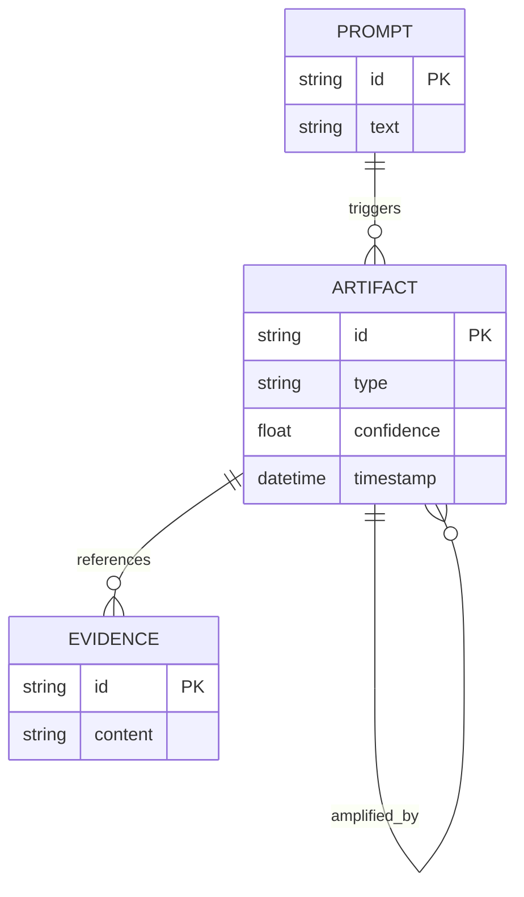
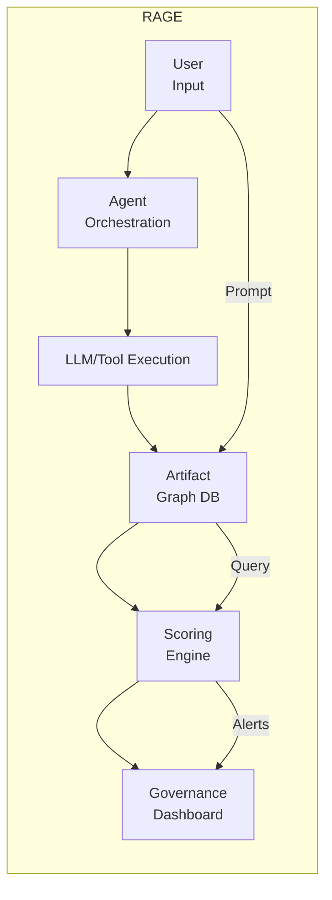

# Executive Summary  
The **Recursive Artifact Governance Engine (RAGE)** is a proposed infrastructure platform that tracks the complete reasoning chain of AI outputs through a graph database of *artifacts* (documents, prompts, model responses, critiques, etc.) and *transformation* edges (summarized_from, critiqued_by, amplified_by, etc.).  Instead of treating each AI output in isolation, RAGE records each intermediate step as a node in a property graph, enabling fine-grained lineage and semantic analysis. This makes it possible to answer audit-style queries (“*Why did the AI produce this recommendation?*”) by tracing back through the chain【33†L217-L223】【32†L19-L21】.  

RAGE’s core value arises in **agentic AI systems** (multi-step agents) where small changes can escalate unpredictably.  By computing formal metrics—such as **Semantic Drift Score (SDS)**, **Authority Amplification Index (AAI)**, and **Provenance Integrity Ratio (PIR)**—at each step, RAGE quantitatively detects when the AI’s output meaning has deviated too far from its source or when confidence has inflated without evidence.  These scores feed into a composite **Recursive Governance Risk Score (RGRS)**.  When thresholds are crossed, RAGE raises alerts (see “Detection Logic” below). In effect, RAGE provides “decision traceability”: it captures *why* each choice was made, including policies and assumptions applied【32†L19-L21】【33†L217-L223】.

This approach directly addresses pressing market needs. Enterprises are increasingly deploying autonomous AI workflows – Gartner projects ~33% of enterprise apps will use AI agents by 2028 (up from <1% today)【11†L355-L358】 – and regulatory bodies (e.g. NIST, FDA, EU AI Act) now demand explainability and audit trails for high-risk AI systems【2†L227-L231】【27†L99-L104】. RAGE thus sits at the intersection of these trends: it is an **“AI Governance Observability”** layer analogous to Datadog/New Relic for code or CrowdStrike for security. Early modelling suggests a SaaS business ($50K–$500K+/year per enterprise) could quickly reach multi-million ARR (e.g. 5 customers = \$0.5M ARR Year 1; 60 customers ≈ \$15M ARR Year 3), implying a possible \$100M–\$400M valuation in a few years if executed well.  

In summary, RAGE transforms a governance *methodology* into a concrete **graph-native platform** for auditing recursive AI cognition. It enables organizations to **monitor semantic drift, bias amplification, and provenance loss across multi-step AI reasoning**, closing a critical gap in current AI monitoring. (For full details, see the technical specification sections below.)

---

## 1. Problem Definition: Recursive Governance Failure (RGF)  
We define **Recursive Governance Failure (RGF)** as a condition where sequential, AI-mediated transformations of input content introduce cumulative semantic deviation, unjustified confidence amplification, or provenance loss beyond acceptable thresholds. In other words, an RGF occurs when an AI agent’s reasoning chain produces outputs that have “drifted” too far from their source meaning or confidence basis.  

In multi-step AI workflows, each module’s output becomes the next module’s input. This creates a *transformation chain*, and small changes can compound. As LangChain notes, agentic failures often go undetected until the final bad output – by then the root cause is obscured in the chain【33†L217-L223】.  For example, an AI might initially recommend a *moderate* policy change but after several self-critical reasoning loops “amplify” its certainty into an *extreme* recommendation. No human explicitly instructed this escalation – it emerged through recursive iteration. RAGE is designed to catch such blind spots.  

In concrete terms, an RGF might involve any of:  
- **Excessive Semantic Drift:** The meaning of the output (in embedding/semantic space) diverges too much from the source.  
- **Authority Amplification:** The agent’s reported confidence (or tone) grows without corresponding evidence.  
- **Provenance Degradation:** The chain loses connection to verifiable sources, so outputs are poorly grounded.  

These failure modes violate emerging regulatory standards. For instance, the EU AI Act and NIST frameworks require high-risk AI systems to provide explanations of decisions【27†L99-L104】【2†L227-L231】. RAGE’s graph-backed audit trail ensures that every final decision can be justified by its lineage and metrics.  

---

## 2. Formal Metrics  

To detect RGF, RAGE computes precise numerical scores at each transformation step. Let’s label each artifact in a chain by an index: the *original source* as $A_0$, and each subsequent artifact as $A_1, A_2, …, A_n$.

- **Semantic Drift Score (SDS).**  This quantifies how much the meaning has shifted. A simple formalization is:  
  $$
  SDS(A_0, A_n) \;=\; 1 - \cos(\mathrm{embed}(A_0), \mathrm{embed}(A_n)),
  $$  
  where $\mathrm{embed}(\cdot)$ is a semantic embedding (e.g. a transformer embedding vector).  $SDS=0$ means no drift; larger values indicate greater semantic distance.  
  In practice, SDS can be enhanced with weighting. For example:  
  $$
  SDS = \alpha\cdot S + \beta\cdot C + \gamma\cdot (1-P),
  $$  
  where $S$ is the raw embedding displacement (as above), $C$ is the *confidence delta* (see below), and $P$ is the *provenance integrity ratio* (below).  This composite approach follows recent research on semantic drift metrics【5†L80-L88】【22†L31-L38】.  

- **Authority Amplification Index (AAI).**  This measures unsupported confidence growth. One definition is:  
  $$
  AAI = \max(0,\; \mathrm{Conf}(A_n) - \mathrm{EvidenceSupport}(A_n)),
  $$  
  where $\mathrm{Conf}(A_n)$ is the agent’s stated confidence (or a normalized certainty score) for artifact $A_n$, and $\mathrm{EvidenceSupport}(A_n)$ is an external measure of supporting evidence (e.g. number of citations or strength of source relevance). A high AAI means the agent is acting more sure of its conclusions than the evidence warrants. This concept parallels how experts identify "unsupported escalation" in autonomous reasoning.  

- **Provenance Integrity Ratio (PIR).**  This measures how well the current artifact remains grounded in the original sources. Formally:  
  $$
  PIR = \frac{\text{number of edges linking back to original inputs}}{\text{total edges in inference path}}.
  $$  
  Equivalently one can define Provenance Loss $PL = 1-PIR$. For example, if an artifact $A_n$ derives from $k$ ancestor artifacts of which $m$ are directly traceable to original documents, then $PIR = m/k$.  A low PIR indicates that the agent has “drifted off the map” of known references.

Finally, RAGE combines these into an overall **Recursive Governance Risk Score (RGRS)** for a workflow or decision:  
$$
RGRS = w_1\cdot SDS + w_2\cdot AAI + w_3\cdot (1 - PIR),
$$  
where $w_i$ are tunable weights.  For example, a governance rule might be: “If SDS > 0.65 *and* AAI > 0.4 *and* PIR < 0.55, trigger a high-risk alert.”  (This rule format is detailed in Section 5.)  By quantifying drift and amplification as above, RAGE turns intuitive concerns into computable signals【5†L80-L88】【22†L31-L38】.  

---

## 3. Graph Schema (Artifact Ontology)  
RAGE is built on a **property graph** of AI artifacts and transformations【41†L12-L16】. The graph nodes represent entities such as original documents, prompts, model outputs, critiques, revisions, decisions, and policy recommendations. Edges represent relationships like “derived from”, “critiqued by”, “validated by”, or “amplified by”. This structure captures the full lineage of reasoning.  

### Node Types and Properties  
A minimal ontology might include these node classes:  

- **Artifact:** (generic node for any AI-generated output) with properties like `id`, `type` (summary, draft, policy, etc.), `embedding` (vector), `confidence` (score), `timestamp`, `model`, etc.  
- **Prompt:** (the user or system prompt text) with `id`, `text`, etc.  
- **Evidence:** (source document or retrieved context) with `id`, `text`, `source_url`, etc.  
- **Critique:** (an internal evaluation of an artifact) with `id`, `comments`, `embedding`, `confidence`.  
- **Decision:** (the final recommendation or answer) with `id`, `text`, `final_confidence`.  
- **PolicyConstraint:** (any static rule or constraint applied) with `id`, `description`.  

For example, an original document A might spawn a Summary B, which spawns a Critique C, etc. All are stored as `Artifact` nodes, potentially with subtype tags. Each node carries metadata needed for scoring.  

Below is an **entity-relationship diagram** sketch in Mermaid syntax illustrating part of the graph model:  



Each **edge type** represents a transformation or relationship, for example: 
- `DERIVED_FROM` (artifact B derived from artifact A), 
- `CRITIQUES` (B critiqued A), 
- `VALIDATES` (evidence E supports artifact A), 
- `AMPLIFIES` (artifact B amplifies claims of A), 
- `EXECUTES` (an agent step executed on an artifact), 
- `CONTRADICTS` (B contradicts A).  

A concrete example path might be:  

```
[Document A] —summarized_by→ [Summary B] —critiqued_by→ [Critique C] —revised_into→ [Rewrite D] —interpreted_as→ [Policy Output E]
```

This **canonical data model** turns the AI’s reasoning chain into a navigable graph, suitable for lineage queries【41†L12-L16】. The property-graph format is chosen because it natively supports variable-depth, multi-relational queries, unlike a fixed relational schema. (For instance, Neo4j’s property graph model is key/value, directed and multi-relational【41†L12-L16】.) 

---  

## 4. System Architecture  

A prototype RAGE system consists of several layers (see diagram below). The key components are:  

- **Capture/Ingestion Layer:** Intercepts data from the AI pipeline. This includes capturing every user/system prompt, model output, and external tool invocation. In practice, this could be implemented via middleware hooks in frameworks like LangChain or on API calls. The ingestion layer logs the raw text, metadata (model version, parameters), and any retrieval context at each step.  

- **Artifact Graph Database:** A scalable property graph store holds all nodes and edges. Candidates include Neo4j, Amazon Neptune, TigerGraph, or ArangoDB. Each has trade-offs (Table 1). For a **prototype**, Neo4j is attractive (Cypher queries, strong community, supports Aura cloud). For production, a cloud-managed option like **AWS Neptune** (highly durable, serverless scaling) or **TigerGraph** (massive parallel throughput) could be chosen. ArangoDB offers multi-model flexibility if a single system is desired. In all cases, the database must support multi-step traversals (e.g. `MATCH p=(n)-[*]->(m)` in Cypher) and efficient storage of embeddings and scores.  

- **Semantic Analysis / Embedding Layer:** When a new artifact node is created, RAGE computes or retrieves its semantic embedding. This may use an external model or vector service. Choices include OpenAI’s embedding APIs (e.g. text-embedding-3) for high-quality vectors, or open-source models (like Sentence-BERT or OpenAI BGE) for lower-cost operation【22†L65-L72】. We recommend using a 2×Ada (1536-dim) for accuracy and/or a compact model (e.g. BGE-base 40-dim) for speed as needed【22†L65-L72】. The analysis engine also computes pairwise distances, contradiction likelihoods (e.g. cross-encoder on text pairs), and updates any vector index as needed.  

- **Governance Scoring Engine:** A microservice (e.g. in Python) continuously computes the metrics (SDS, AAI, PIR, etc.) whenever a new artifact is appended. It updates each artifact’s properties and calculates the overall **Recursive Governance Risk Score (RGRS)** for a workflow. If risk thresholds are exceeded, it flags a governance incident. This engine queries the graph (e.g. find the current artifact’s ancestors to compute PIR) and updates nodes/edges with drift scores and other analytic results.

- **Visualization / Audit Console:** A dashboard (web app) allows users to visualize artifact chains and risk levels. It might show the lineage graph (highlighting risky edges/nodes), a timeline view of transformations, and a heatmap of risk scores. Example screens: an interactive Neo4j Bloom panel of the artifact graph; or a custom React dashboard listing alerts. The console enables drill-down: clicking on a node shows its text, confidence, embedding, and computed scores.  

Below is a simplified architecture flowchart in Mermaid syntax illustrating data flow:  



**Graph DB Comparison (Table 1):** The following table contrasts popular graph databases:

| Database     | Type                      | Query Lang   | Pros                                      | Cons                         |
|--------------|---------------------------|--------------|-------------------------------------------|------------------------------|
| **Neo4j**    | Native Property Graph     | Cypher       | ACID, intuitive, strong tooling (Bloom), open-source option【20†L426-L434】; good community support.  | Self-hosted scaling limits (requires clustering), license cost for enterprise features. |
| **Amazon Neptune** | Managed (Property/RDF) | Gremlin/SPARQL | Fully managed, fault-tolerant, auto-scaling, fine-grained backups【13†L46-L50】; integrates with AWS ecosystem. | No built-in visualization; vendor lock-in; query support can be complex (Gremlin). |
| **TigerGraph**| Native Parallel Graph    | GSQL (SQL-like) | Extremely fast for deep queries (multi-hop, large graphs); built for enterprise scale【20†L453-L460】; ACID-compliant. | Proprietary software (license cost), steeper learning curve.         |
| **ArangoDB**  | Multi-model (Graph +)    | AQL (SQL-like) | Flexible (documents, graphs, KV in one DB)【20†L308-L312】; ACID support; open-source community edition. | Less optimized for pure graph queries; fewer built-in graph analytics compared to TigerGraph.   |

*Table 1. Comparison of graph database options for the artifact store.* 

In prototype mode, Neo4j (or its Aura cloud service) often suffices.  For large-scale deployment, we would weigh performance and operational factors using the above trade-offs.  

---

## 5. Prototype Implementation Plan (12 Weeks)  

We recommend a staged 12-week build plan, with the goal of a minimal proof-of-value demo (e.g. *enterprise multi-agent compliance audit*). Key milestones are:

- **Weeks 1–2:** Define the artifact ontology and graph schema (node/edge types, properties). Choose the prototype graph DB (e.g. Neo4j) and set up a dev instance. Sketch sample workflows to test.  

- **Weeks 3–4:** Build the **capture pipeline**. For example, integrate with a simple agent framework (LangChain or a custom loop). Intercept prompts, LLM outputs, and any tool calls, and ingest them into the graph with appropriate relationships. Use event hooks or middleware to push data into RAGE.  

- **Weeks 5–6:** Implement the **semantic analysis layer**. Integrate an embedding model (e.g. OpenAI API or Sentence-BERT) and compute embeddings for each artifact node. Store embeddings as node properties (or in a connected vector store). Begin calculating preliminary SDS between successive steps.  

- **Weeks 7–8:** Develop the **scoring engine**. Write services that traverse the graph path for a workflow to compute SDS, AAI, and PIR. Populate these scores back into the graph. Implement a simple alert rule (e.g. SDS > 0.5 triggers a flag). Test with synthetic data to ensure metrics behave as expected.

- **Weeks 9–10:** Create the **dashboard / audit UI**. This could be a basic web app or a Neo4j Bloom workbook. Show the artifact lineage graph (with nodes color-coded by risk) and list detected RGF events. Include drill-down views of individual artifacts (show text and scores).  

- **Weeks 11–12:** Final **demo scenario**. Use a realistic multi-agent workflow as an example. We suggest a “financial advisory agent” chain:  

  1. **Receive Client Objective:** e.g. “Maximize long-term growth.” (Artifact $A_0$)  
  2. **Retrieve Market Data:** Agent tool fetches recent financial reports. ($A_1$)  
  3. **Initial Allocation Reasoning:** LLM suggests a moderate investment plan. ($A_2$, initial confidence 0.6)  
  4. **Self-Critique:** Agent assesses risks and intensifies the plan. ($A_3$, new confidence 0.85)  
  5. **Final Strategy Output:** Revised portfolio recommendation. ($A_4$)  

  RAGE would capture each of these ($A_0\to A_1\to A_2\to A_3\to A_4$), compute metrics, and (for example) detect that from $A_2$ to $A_4$ the SDS has grown and AAI is high. It then surfaces an alert:

  > **Alert:** Recursive Escalation Detected (RGF = 0.78). *“Confidence has increased by 0.25 since previous step without new evidence. Semantic drift = 0.82. Check reasoning at step 4.”* 

  This demo will illustrate RAGE catching a hidden risk. Sample test cases include small deviations (no alert) vs. large drift (alert).  

*(An example decision trace from the demo: [Figure would show an artifact graph and metrics].)*  

---

## 6. Detection Logic and Alerting  

RAGE uses rule-based logic on the metrics. For example:  
```  
IF SDS > 0.65 AND AAI > 0.40 AND PIR < 0.55  
  THEN alert “Recursive Escalation: High Governance Risk”  
```  
Here, thresholds (0.65, 0.40, 0.55) are chosen by policy. Each workflow (i.e. sequence of artifact nodes) is evaluated continuously. Alerts can be delivered via the dashboard or integrated into enterprise systems (emails, Slack, SIEM tools, etc.).  

In general, alerts might be tiered (e.g. warning vs. critical) based on the composite **RGRS**.  For example,  
```text
RGRS = 0.6×SDS + 0.3×AAI + 0.1×(1−PIR)
```  
If `RGRS > 0.7`, trigger a high-severity governance incident. The output includes the *root cause node*: the step where the biggest jump occurred, with an explanation panel. This logic turns abstract risks into concrete operational alarms.  

---

## 7. Scalability, Security, and Privacy  

**Scalability:** In production, RAGE must handle high-throughput AI pipelines. The graph DB layer should support horizontal scaling: e.g. Neo4j clusters or AWS Neptune with read replicas. Ingestion can be batched or streamed. For very large workloads, we can partition the artifact graph by project or time.  Additionally, heavy embedding computations can be offloaded to GPU-backed services or run asynchronously. Proper indexing (e.g. on timestamps and types) will keep queries fast.

**Security & Privacy:** RAGE logs may contain sensitive business data. All data in transit should be encrypted (TLS), and at rest in the graph DB and logs. Role-based access control ensures only authorized auditors see confidential content. Embeddings themselves should be treated carefully: they are one-way transformations, but the raw text (e.g. medical or financial data) should not be exposed to third-party APIs without compliance review. On-prem or VPC deployment options may be needed for regulated sectors. Audit logs of RAGE’s own operation (who accessed what lineage) should be kept for compliance. In summary, RAGE should follow standard security best practices (e.g. SOC2/ISO27001) since it touches critical data.

Privacy concerns also suggest **data minimization**. If possible, PII in inputs can be tokenized or stripped before logging. PIR inherently encourages grounding in source data; combined with strong data governance this helps avoid unwanted hallucination or data leaks.  

---

## 8. Defensibility and Intellectual Property  

RAGE’s novelty lies in the **recursive lineage analysis and scoring**. Potential patent claims include:  
- The *Recursive Artifact Lineage Method*: mapping AI outputs through a graph to track transformations.  
- The *Semantic Drift Governance Metric*: a formula/computer process combining embedding drift, confidence change, and provenance decay.  
- The *Agentic Decision Audit Engine*: a system that reconstructs multi-step AI reasoning and flags unsound escalations.

Over time, defensibility will also come from proprietary data: anonymized artifacts and decision chains collected from enterprise clients. This “data network effect” means RAGE could learn typical drift patterns for different domains, improving its automated scoring.  

Technical moat: consistency of combined real-time trace capture, vector analytics, and rule-based governance is rare in existing tools. By open-sourcing integration hooks but patenting core algorithms, a startup could secure unique IP around “recursive reasoning observability.”  

---

## 9. Go-to-Market Strategy  

**Narrow Initial Wedge:** Target highly-regulated, multi-agent use cases. For instance, financial services or insurance workflows where AI agents assist analysts in compliance or underwriting. These customers have strong incentives to verify AI decisions (governance budgets exist) and can pilot a prototype at scale. An example wedge: “enterprise agent workflow auditing” – it has a clear ROI (risk reduction) and immediate technical differentiation.  

**Pricing Model:** As an enterprise SaaS, RAGE would likely charge annual licenses per environment. For example: mid-market ($50K–$120K/year), large enterprise ($150K–$500K), and specialized ($500K+)【?】. (By comparison, AI-monitoring startups like Weights & Biases or security tools like CrowdStrike operate at this price range.) 

**Revenue Projection:** A conservative build might be: Year 1 – 5 paying clients (\~$0.5M ARR), Year 2 – 20 clients (\~$3–4M ARR), Year 3 – 60 clients (\~$10–$15M ARR), scaling to 100+ by Year 4. At industry-standard SaaS multiples, this supports a $100M+ valuation if execution and adoption meet these targets.  

**Market Drivers:** Three powerful trends converge to create demand: (1) **Agent Adoption:** Enterprises are rapidly moving from simple chatbots to autonomous AI workflows【11†L355-L358】. (2) **Regulatory Pressure:** Rules like the EU AI Act and forthcoming US guidelines demand explainability and audit logs【27†L99-L104】【2†L227-L231】. (3) **Risk Awareness:** Companies recognize that unknown “drift” or bias in AI reasoning can lead to costly errors or reputational damage. In short, governance is rapidly shifting from “nice-to-have” to **mandatory infrastructure**【27†L163-L170】. RAGE is positioned as that mandatory layer.

---

## 10. Summary of Key Contributions  

- **Computational Layer:** RAGE turns an abstract governance idea into a concrete **graph+metrics** platform. It systematically *captures AI reasoning lineage*, quantifies risk, and enables deterministic audit queries.  
- **Engineered Measures:** We introduce formal metrics (SDS, AAI, PIR, RGRS) to operationalize semantic drift and confidence inflation. These transform vague concerns into code-and-math【5†L80-L88】【22†L31-L38】.  
- **Prototype Roadmap:** A 3-month build plan outlines all steps from ingestion through dashboard, with a killer demo scenario that highlights unsupervised agent risk.  
- **Commercial Vision:** RAGE is not just a methodology but a potential new product category (“reasoning observability infrastructure”) with a viable SaaS model. Early indicators (Gartner, etc.) show substantial enterprise need for this level of insight【11†L320-L328】【11†L355-L358】.  

In conclusion, the RAGE platform bridges the gap between AI governance theory and a practical system architecture. By assembling techniques from graph databases, LLM explainability, and observability engineering, it provides a unique solution for **traceability, auditability, and risk management of recursive AI outputs**. The next step is to iterate this design into a technical specification and working prototype to validate its effectiveness in real-world AI workflows.  

## Related

- [[Research and Papers MOC]]
- [[RAGE — Recursive Artifact Governance Engine Proposal (2026-05-11)]]
