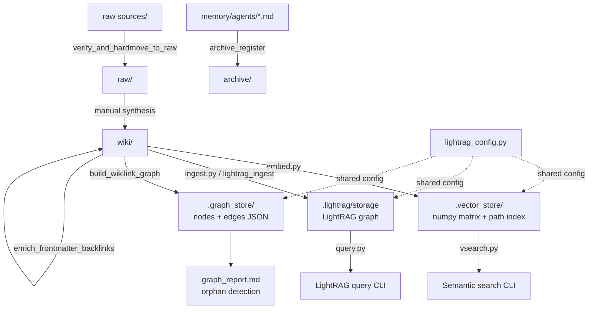

> For future Claude: This is the architecture overview for the EMERAULD vault automation layer (`scripts/`). It documents 19 Python scripts and 4 scheduled shell scripts that power knowledge ingestion, retrieval, and maintenance. Load this when asked "how does the vault work technically" or when modifying any script. The three parallel retrieval layers (vector, LightRAG, wikilink graph) are the critical design fact.

<!-- @generated:start -->

## Summary

The `scripts/` directory is a Python automation layer for the [[EMERAULD]] vault. It implements three parallel knowledge retrieval strategies, a fail-closed intake pipeline, a register maintenance system, and several one-off build and migration utilities. All scripts are standalone CLI tools with `__main__` guards; shared state routes through [[lightrag_config]] as the single config module.

## Stack

- **Language:** Python 3.11+ (19 scripts, 4 shell scripts)
- **Embeddings:** `sentence-transformers/all-MiniLM-L6-v2` (local, 384-dim, fully offline)
- **LLM:** `claude-haiku-4-5-20251001` via Anthropic API; OpenRouter fallback when `OPENROUTER_API_KEY` is set
- **Graph:** LightRAG (file-based: NetworkX + NanoVectorDB + JsonKV) + deterministic wikilink graph
- **Vault root resolution:** `EMERAULD_VAULT_ROOT` env var → git-relative fallback (in `lightrag_config.py`)
- **Venv:** `/home/martin/.venvs/emerauld/`
- **Git commit at scan:** `96e6487` — "chore(graph): optimize topology and enforce zero-orphan rule"

## Module map

## Modules

### Core modules

| Script | Role | Notes |
|--------|------|-------|
| `lightrag_config.py` | Shared config: vault root, embed model, LLM func, `make_rag()` | All other scripts import from here |
| `embed.py` | Builds local vector store (numpy matrix) from `wiki/`, `maps/`, `projects/` | `--changed` for incremental; `--check` for status |
| `vsearch.py` | Semantic search CLI over the vector store | Fastest retrieval path; no LLM call |
| `ingest.py` | Async batch ingest of wiki notes into LightRAG graph | Requires LightRAG venv; batches of 20 |
| `build_wikilink_graph.py` | Deterministic wikilink graph from `[[...]]` links | No LLM; outputs 6 JSON files + `graph_report.md` |
| `verify_and_hardmove_to_raw.py` | Fail-closed intake: verify, dedup by SHA-256, hard-move to `raw/` | **Note:** VAULT_ROOT is hardcoded to old WSL path — see [[Architecture - EMERAULD Scripts - Key Decisions]] |
| `archive_register.py` | Archives the 6 rolling registers when they exceed line thresholds | Thresholds: 600 (session-state), 300 (all others) |
| `enrich_frontmatter_backlinks.py` | Batch-enriches frontmatter `backlink_count` and `backlinks` fields | Run after structural changes |

### Support modules

| Script | Role |
|--------|------|
| `query.py` | LightRAG graph query CLI |
| `lightrag_ingest.py` | Alternative LightRAG ingest path |
| `library_d_ingest.py` | Ingests a physical library scan (`library_d_*` corpus) |
| `library_d_unreadable_ocr.py` | OCR recovery for unreadable library files |
| `build_paper25_docx.py` | Builds a formatted DOCX output for a specific paper |
| `build_master_reference_bridge.py` | Cross-reference bridge builder |
| `migrate_to_pharos_papers_db.py` | One-off migration to PHAROS papers database |
| `render_obsidian_agent_vault_setup_guide.py` | Renders vault setup guide as Markdown |
| `codex_start.py` | Codex agent startup helper |
| `drive_audit.py` | Google Drive / D-drive file audit |
| `flowerapp/flowerapp.py` | Standalone IRCM intake CLI (Agency score assessment) — not vault-related |
| `scheduled/` | 4 shell scripts: `morning.sh`, `nightly.sh`, `weekly.sh`, `health-check.sh` |

## Personas

*confidence: speculation — no README defines intended users*

1. **Martin (primary)** — runs all scripts directly via venv CLI for vault maintenance
2. **Trismégiste agent** — reads vault via vsearch.py queries during session synthesis
3. **Codex agent** — uses graph store outputs for architecture decisions
4. **Future-Claude** — loads these notes to answer "how does the vault work" without re-reading scripts

## Known issues

- `verify_and_hardmove_to_raw.py` has `VAULT_ROOT` hardcoded to the old WSL path (`/mnt/c/users/softinfo/documents/emerauld`). Every other script uses `lightrag_config.resolve_vault_root()`. This script will silently fail or operate on the wrong directory on the current host.
- The three retrieval layers (vector, LightRAG, wikilink) are not synchronized — each has its own rebuild trigger. A note added to `wiki/` does not appear in search until `embed.py --changed` is re-run.

## Related

- [[Architecture - EMERAULD Scripts - Knowledge Layers]]
- [[Architecture - EMERAULD Scripts - Intake Pipeline]]
- [[Architecture - EMERAULD Scripts - Maintenance]]
- [[Architecture - EMERAULD Scripts - Key Decisions]]
- [[EMERAULD Graph Architecture — Link Density and Vector Layer (2026-05-25)]]
- [[session-state]]

<!-- @generated:end -->

## Operational notes (maintained by hand, outside the generated block)

- **The scheduled lane has an auth dependency that is not in any script's logic.** The four shell scripts in `scripts/scheduled/` each shell out to the `claude` binary and authenticate against the host's ambient Claude Code OAuth session. Cron cannot refresh that session, so when it lapses, the model half of every scheduled agent fails at once and writes only a line to `Logs/scheduled/FAILURES.md`, which no agent reads. First observed 2026-07-11, when the 08:00 morning agent exited 1 and left no daily note. Full record, mechanism and candidate controls: [[EMERAULD Scheduled Agents — Auth Dependency and Failure Modes]].
