# EMERAULD Cluster Graph — Deferred Authority, Fluency, and Memory

## Summary

Bounded concept map of the EMERAULD notes cross-linked in the deferred-authority pass. It shows one bridge note plus the three main surfaces it ties together: authority/legitimacy, fluency/interruption, and AI memory/identity. The figure is a navigation aid, not a full vault graph.

## Reading Key

- Bridge node: the shared connector that collapses archive, proof regime, and memory into one cluster.
- Surface nodes: the three thematic families that the bridge connects.
- Hub nodes: the larger map notes that now point into the cluster.

## Graph

```mermaid
flowchart TB
  DA["Deferred Authority<br/>Archives, Proof Regimes, and AI Memory"]

  subgraph A["Authority / legitimacy"]
    direction LR
    ALPS["Authority, Legitimacy,<br/>and Post-Sovereignty"]
    AAL["Authority After Legitimacy<br/>Disenchantment and Queer Political Theory"]
    VD["Voodoo Doll<br/>Archival Governance and Colonial Naming"]
    SCP["Social Compass Paper<br/>Ritual Authority and Régime de Preuve"]
    GBD["Governance by Denial"]
  end

  subgraph F["Fluency / interruption"]
    direction LR
    FIT["Fluency and Interruption Theory"]
    FIA["Fluency, Interruption,<br/>and Institutional Accountability"]
    ALG["Algorithmic Agentic AI<br/>and Governance"]
    RECU["RECURSO Full Integration<br/>Fluency, Interruption, and Theoretical Synthesis"]
    TCP["The Compulsion to Complete<br/>AI as Gap-Closer"]
    ABD["Addiction by Design<br/>Schüll 2012"]
  end

  subgraph M["AI memory / identity"]
    direction LR
    RCN["Recursive Continuity<br/>Without Memory"]
    ASP["AI Self-Report<br/>Epistemic Status Recursion and Perturbation"]
    ASPH["Agent Session Phenomenology"]
    AIP["AI Identity and Phenomenology"]
    TRL["The Returning Light<br/>Monograph"]
    TWW["The Wheel and the Watcher"]
  end

  subgraph S["Synthesis hubs"]
    direction LR
    ETA["EMERAULD Thematic Analysis<br/>Claude-Codex Pass (2026-05-25)"]
    GPM["Governance and PHAROS MOC"]
    RPM["Research and Papers MOC"]
  end

  DA --> ALPS
  DA --> AAL
  DA --> VD
  DA --> SCP
  DA --> GBD
  DA --> FIT
  DA --> FIA
  DA --> ALG
  DA --> RECU
  DA --> TCP
  DA --> ABD
  DA --> RCN
  DA --> ASP
  DA --> ASPH
  DA --> AIP
  DA --> TRL
  DA --> TWW
  DA --> ETA
  DA --> GPM
  DA --> RPM

  ALPS --> GBD
  SCP --> AAL
  FIT --> FIA
  ALG --> FIT
  RECU --> FIT
  RCN --> ASP
  RCN --> TWW
  TRL --> RCN

  classDef bridge fill:#f5d76e,stroke:#8c6d1f,color:#111,stroke-width:2px;
  classDef authority fill:#dbe8f3,stroke:#5a7f9b,color:#111;
  classDef fluency fill:#d7ecf4,stroke:#3f7d91,color:#111;
  classDef memory fill:#e1f0dd,stroke:#5e8a5a,color:#111;
  classDef hub fill:#efe1d3,stroke:#9a6b44,color:#111;
  class DA bridge;
  class ALPS,AAL,VD,SCP,GBD authority;
  class FIT,FIA,ALG,RECU,TCP,ABD fluency;
  class RCN,ASP,ASPH,AIP,TRL,TWW memory;
  class ETA,GPM,RPM hub;
```

## Notes

- Solid arrows are the cluster’s direct navigational links, as wired in the last cross-link pass.
- The figure intentionally centers one bridge node instead of pretending the vault has a single monolithic ontology.
- `[[Deferred Authority — Archives, Proof Regimes, and AI Memory]]` is the shortest route into the cluster.

## Related

- [[Deferred Authority — Archives, Proof Regimes, and AI Memory]]
- [[EMERAULD Full Vault Map — Major Cluster Families and Bridge Surfaces]]
- [[EMERAULD Thematic Analysis — Claude-Codex Pass (2026-05-25)]]
- [[Authority, Legitimacy, and Post-Sovereignty]]
- [[Fluency and Interruption Theory]]
- [[Recursive Governance Theory]]
- [[AI Identity and Phenomenology]]
- [[Research and Papers MOC]]
- [[Governance and PHAROS MOC]]
