# EMERAULD Full Vault Map — Major Cluster Families and Bridge Surfaces

## Summary

Broad vault-level concept map of EMERAULD. It compresses the note graph into the major families surfaced by the vault-wide thematic analysis: governance/method, authority/legitimacy, fluency/interruption, AI memory/identity, queer/ritual/magic, commercial/PHAROS, creative/narrative, health/neuro, and infrastructure/coordination. The figure is a navigational compression, not a complete graph.

## Reading Key

- Bridge nodes: notes that do work across multiple families.
- Family nodes: the macro themes used to organize the vault.
- Anchor notes: representative notes in each family, not exhaustive inventories.

## Graph

```mermaid
flowchart TB
  V["EMERAULD Vault"]

  subgraph B["Cross-cutting bridges"]
    direction LR
    DA["Deferred Authority<br/>Archives, Proof Regimes, and AI Memory"]
    FIT["Fluency and Interruption Theory"]
    RGT["Recursive Governance Theory"]
    ALPS["Authority, Legitimacy,<br/>and Post-Sovereignty"]
    RCN["Recursive Continuity<br/>Without Memory"]
  end

  subgraph G["Governance / method"]
    direction TB
    G0["Governance / method"]
    GBD["Governance by Denial"]
    RDI["Recursive Deterministic AI Governance<br/>Method and Paper"]
    PHM["Governance and PHAROS MOC"]
    RPM["Research and Papers MOC"]
    ETA["EMERAULD Thematic Analysis<br/>Claude-Codex Pass (2026-05-25)"]
    GBD --> G0
    RDI --> G0
    PHM --> G0
    RPM --> G0
    ETA --> G0
  end

  subgraph A["Authority / legitimacy"]
    direction TB
    A0["Authority / legitimacy"]
    AAL["Authority After Legitimacy<br/>Disenchantment and Queer Political Theory"]
    SCP["Social Compass Paper<br/>Ritual Authority and Régime de Preuve"]
    VD["Voodoo Doll<br/>Archival Governance and Colonial Naming"]
    AGA["Agatha All Along<br/>Wicca, Digital Mediatization, and Proof Regimes"]
    LEG["Legitimacy Machines MOC"]
    AAL --> A0
    SCP --> A0
    VD --> A0
    AGA --> A0
    LEG --> A0
  end

  subgraph F["Fluency / interruption"]
    direction TB
    F0["Fluency / interruption"]
    FIA["Fluency, Interruption,<br/>and Institutional Accountability"]
    ALG["Algorithmic Agentic AI and Governance<br/>From Hegemonic Fluency to the Ethics of Interruption"]
    BFL["Beyond Fluency<br/>Stuttering, Autoethnography, and Unstable Epistemology"]
    STI["Stuttering through the Institution<br/>Academic Containment and Queer Knowing"]
    TCP["The Compulsion to Complete<br/>AI as Gap-Closer"]
    FIA --> F0
    ALG --> F0
    BFL --> F0
    STI --> F0
    TCP --> F0
  end

  subgraph M["AI memory / identity"]
    direction TB
    M0["AI memory / identity"]
    RCN2["Recursive Continuity Without Memory<br/>AI Identity Across Sessions"]
    ASP["AI Self-Report<br/>Epistemic Status Recursion and Perturbation"]
    ASPH["Agent Session Phenomenology"]
    AIP["AI Identity and Phenomenology"]
    TWW["The Wheel and the Watcher"]
    RCN2 --> M0
    ASP --> M0
    ASPH --> M0
    AIP --> M0
    TWW --> M0
  end

  subgraph Q["Queer / ritual / magic"]
    direction TB
    Q0["Queer / ritual / magic"]
    PQM["Pagan and Queer Ritual Studies MOC"]
    RMA["Ritual, Magic, and Institutional Authority"]
    MLG["Magic After Legitimacy<br/>Charmed and the Governance of Female Power"]
    SRI["Still Running<br/>Willow, Anya, and Queer Ritual Infrastructure"]
    SCY["The Scythe Already in Motion<br/>Buffy, Queer Ritual, and the Politics of Glitch"]
    PQM --> Q0
    RMA --> Q0
    MLG --> Q0
    SRI --> Q0
    SCY --> Q0
  end

  subgraph C["Commercial / PHAROS / deployment"]
    direction TB
    C0["Commercial / PHAROS / deployment"]
    PHS["PHAROS AI Ethics Submission<br/>Springer Draft"]
    TVA["Trust Advantage Analysis<br/>Sales and AI Governance"]
    APS["AI Governance Sprint<br/>One-Page Sellable Packet"]
    AS["AI Society Manuscript<br/>From AI Anxiety to Recursive Governance"]
    PHS --> C0
    TVA --> C0
    APS --> C0
    AS --> C0
  end

  subgraph N["Creative / narrative"]
    direction TB
    N0["Creative / narrative"]
    WM["Writing and Novels MOC"]
    WTW["The Weather Beneath the Walls<br/>Novel"]
    PUR["The Palace Under Root<br/>Allegory and the Keyport Novel"]
    RF["Refusing Fixity<br/>Aesthetic Governance and Fugitive Authorship"]
    TRL["The Returning Light<br/>Monograph"]
    WM --> N0
    WTW --> N0
    PUR --> N0
    RF --> N0
    TRL --> N0
  end

  subgraph H["Health / neuro"]
    direction TB
    H0["Health / neuro"]
    ARA["AI Recruiting Has an Accessibility Problem<br/>Lepage (2026)"]
    MIP["Mental illness, addiction, and AI psychosis"]
    HC["Harrowfield Clinic<br/>AI Governance Failure Case Study"]
    ABD["Addiction by Design<br/>Schüll 2012 (Machine Gambling and the Zone)"]
    ARA --> H0
    MIP --> H0
    HC --> H0
    ABD --> H0
  end

  subgraph I["Infrastructure / coordination"]
    direction TB
    I0["Infrastructure / coordination"]
    AIS["AI Infrastructure Stack"]
    EGA["EMERAULD Graph Architecture<br/>Link Density and Vector Layer (2026-05-25)"]
    HEP["HEPHAISTOS Agent Architecture"]
    AOR2["Agent Orchestration<br/>PHAROS Launch as Governed Multi-Agent Execution"]
    AIS --> I0
    EGA --> I0
    HEP --> I0
    AOR2 --> I0
  end

  V --> G0
  V --> A0
  V --> F0
  V --> M0
  V --> Q0
  V --> C0
  V --> N0
  V --> H0
  V --> I0

  DA -.-> G0
  DA -.-> A0
  DA -.-> F0
  DA -.-> M0
  FIT -.-> F0
  FIT -.-> H0
  RGT -.-> G0
  RGT -.-> I0
  ALPS -.-> A0
  ALPS -.-> Q0
  RCN -.-> M0
  RCN -.-> N0
  FIT -.-> C0
  RGT -.-> C0

  classDef bridge fill:#f5d76e,stroke:#8c6d1f,color:#111,stroke-width:2px;
  classDef family fill:#dbe8f3,stroke:#5a7f9b,color:#111,stroke-width:2px;
  classDef anchor fill:#ffffff,stroke:#aaaaaa,color:#111;
  class DA,FIT,RGT,ALPS,RCN bridge;
  class G0,A0,F0,M0,Q0,C0,N0,H0,I0 family;
  class GBD,RDI,PHM,RPM,ETA,AAL,SCP,VD,AGA,LEG,FIA,ALG,BFL,STI,TCP,RCN2,ASP,ASPH,AIP,TWW,PQM,RMA,MLG,SRI,SCY,PHS,TVA,APS,AS,WM,WTW,PUR,RF,TRL,ARA,MIP,HC,ABD,AIS,EGA,HEP,AOR2 anchor;
```

## Notes

- This is the vault zoomed out one level beyond `[[EMERAULD Cluster Graph — Deferred Authority, Fluency, and Memory]]`.
- The bridge nodes are the real connective tissue; the family nodes are just buckets for navigation.
- `[[Deferred Authority — Archives, Proof Regimes, and AI Memory]]` remains the shortest path into the authority/fluency/memory knot.

## Related

- [[Deferred Authority — Archives, Proof Regimes, and AI Memory]]
- [[EMERAULD Cluster Graph — Deferred Authority, Fluency, and Memory]]
- [[EMERAULD Thematic Analysis — Claude-Codex Pass (2026-05-25)]]
- [[EMERAULD Graph Architecture — Link Density and Vector Layer (2026-05-25)]]
- [[Research and Papers MOC]]
- [[Governance and PHAROS MOC]]
- [[Writing and Novels MOC]]
- [[Pagan and Queer Ritual Studies MOC]]
